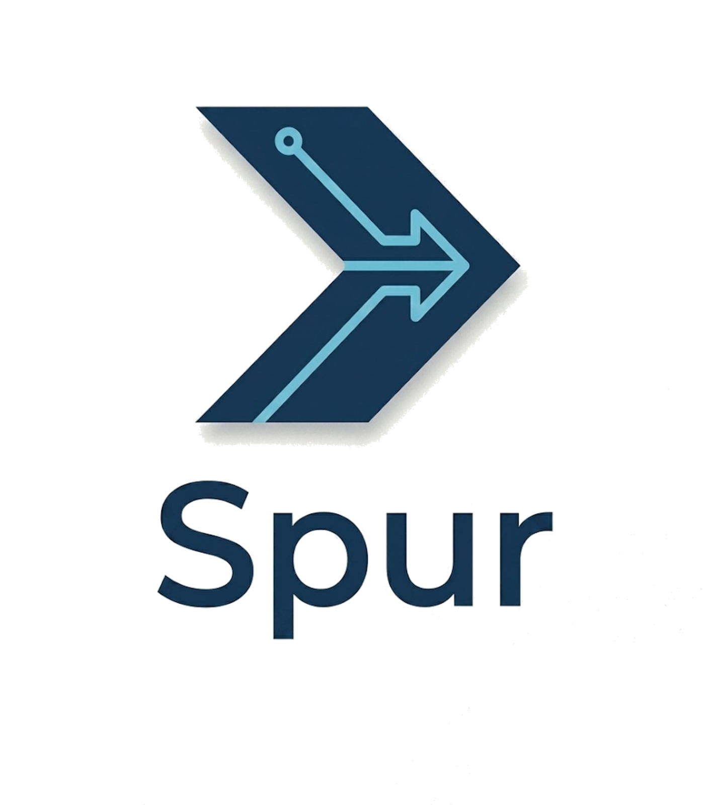

# Spur

<div align="center">
  
</div>

**Local-first harness engineering toolkit for mainstream coding agents.**

Spur is **not** a coding agent and **not** a BYOK LLM platform. It assumes you already have coding
agents installed and authenticated (Claude Code, Codex, Gemini CLI, Antigravity, pi, OpenCode,
OpenClaw), then wraps them with execution discipline: agent detection and health checks, constraint
checking, workflow orchestration, conversation-history import and analytics, and operational
visibility — all behind one CLI.

---

## What Spur Does

```text
idea → agent detection + health → constraint checking → workflow orchestration
  → agent execution → history import + analytics → inspection → repeat
```

- **Rule Engine** — YAML-driven constraint checking backed by [`@gobing-ai/ts-rule-engine`][rule].
  Evaluators (regex, AST via ast-grep, path, TSDoc, forbidden-import, secrets, coverage gate),
  composable presets (`recommended`, `recommended-post-check`), and auto-fixers. `--verbose` streams per-rule
  progress with execution time (e.g. `✓ passed - 0.12s`). Bundled presets ship with the engine,
  so `spur rule run` works on a clean install.
- **Workflow Engine** — FSM state-machine and transition-flow workflows backed by
  [`@gobing-ai/ts-dual-workflow-engine`][wf]. Define multi-step processes (implement → check → fix
  loops) as YAML with guards, gates, and bounded iteration.
- **Agent Runner** — Detect, invoke, and health-check installed coding agents through a unified
  interface backed by [`@gobing-ai/ts-ai-runner`][ai]. Spur never stores agent keys — agents
  authenticate with their own credentials.
- **History Analytics** — Import agent conversation JSONL and derive token/cost analytics via
  [`@gobing-ai/ts-llm-jsonl-importer`][hist]. Raw data stays in files; only validated, redacted ETL
  rows are persisted.
- **CLI** — Single `spur` binary for every operation.
- **Server / Web** — Hono on Bun (or Cloudflare Workers) exposing an oRPC OpenAPI handler, plus an
  Astro dashboard consuming the typed oRPC client.

---

## Install

Get the `spur` harness tool. Two paths, depending on whether you run Bun. Both expose a global
`spur` command and seed defaults into `~/.config/spur/` on first run.

**With Bun (`>= 1.3.0`) — recommended:**

```bash
bun install -g @gobing-ai/spur   # global `spur` command
# or run ad-hoc, no install:
bunx @gobing-ai/spur --help
```

**Without Bun — standalone binary (macOS / Linux):**

```bash
curl -fsSL https://raw.githubusercontent.com/gobing-ai/spur/main/scripts/install.sh | sh
```

Installs to `~/.local/bin` (override via `SPUR_INSTALL`), embeds the Bun runtime, and runs
`spur init` for you. Full options and Windows/WSL notes live in the
[CLI README](./apps/cli/README.md#install).

```bash
spur --help
spur init       # seed ~/.config/spur/ — idempotent
```

---

## Quick Start

> For **developing Spur itself** (running from source). To just *use* the tool, see
> [Install](#install) above.

```bash
# Prerequisites: Bun 1.3.14 (pinned in .prototools)
bun install

# Run the CLI from source (the .ts entry runs only under Bun)
bun run apps/cli/src/index.ts --help

# Scaffold a project: writes .spur/config.yaml, local rules + an example
# workflow, and seeds ~/.config/spur/rules from the bundled presets
bun run apps/cli/src/index.ts init --name my-project

# Evaluate constraint rules over the working tree
bun run apps/cli/src/index.ts rule run --preset recommended

# Run the full quality gate (lint + typecheck + tests)
bun run check
```

> During development the CLI runs as `bun run apps/cli/src/index.ts <command>`. A standalone `spur`
> binary is produced by `bun run build`.

---

## Monorepo Structure

Bun workspaces (no Turborepo). Generic engines live **outside** this repo as released
`@gobing-ai/ts-*` packages, consumed by semver; Spur is a domain consumer.

```
apps/
  cli/          Spur CLI — primary surface; arg dispatch + domain commands   (@gobing-ai/spur)
  server/       Hono on Bun.serve / Cloudflare Worker; oRPC OpenAPI handler  (@gobing-ai/spur-server)
  web/          Astro + Cloudflare adapter; typed oRPC OpenAPI client        (@gobing-ai/spur-web)
packages/
  app/          Application services (AgentService, RuleService, WorkflowService, …) (@gobing-ai/spur-app)
  contracts/    oRPC transport contracts only — health/DTOs, no domain types          (@gobing-ai/spur-contracts)
  config/       Zod config schema + env parsing                                       (@gobing-ai/spur-config)
  domain/       Spur-domain DAOs + schema (workspaces, runs, artifacts, …)            (@gobing-ai/spur-domain)
tooling/
  typescript/   Shared tsconfig presets (base/server/react)
drizzle/        0000_spur_cli_foundation.sql (active) + _legacy_reference/ (inert)
docs/           00_ADR.md (authoritative) + 01–05 product docs
```

**Boundaries:** `contracts` owns transport DTOs only — domain types belong in their owning
`@gobing-ai/ts-*` package. The server binds handlers via `implement(contract)` so contract↔handler
drift fails at compile time; OpenAPI is generated from the contract. Web consumes only contract types
via the oRPC client and never reaches into server internals.

---

## Domain Engines (external `@gobing-ai/ts-*`)

Consumed from the separate [`ts-libs`](https://github.com/gobing-ai/ts-libs) repository by semver,
centralized in the root Bun catalog.

| Package | Role |
|---------|------|
| [`@gobing-ai/ts-utils`][utils] | output, errors, api-response, cursor, date, access helpers |
| [`@gobing-ai/ts-infra`][infra] | logger, EventBus, telemetry, scheduler, job-queue interfaces |
| [`@gobing-ai/ts-runtime`][runtime] | runtime context, FileSystem, ProcessExecutor, config loader |
| [`@gobing-ai/ts-db`][db] | DbAdapter, BaseDao, migrations, QueueJobDao |
| [`@gobing-ai/ts-ai-runner`][ai] | `AgentDetector`, `DoctorRunner`, `AiRunner` (backs `spur agent`) |
| [`@gobing-ai/ts-rule-engine`][rule] | `RuleEngine`, evaluators, presets, formatters (backs `spur rule`) |
| [`@gobing-ai/ts-dual-workflow-engine`][wf] | FSM + transition-flow engine (backs `spur workflow`) |
| [`@gobing-ai/ts-llm-jsonl-importer`][hist] | `runJsonlImport`, SourceDefinition pipeline (backs `spur history`) |

---

## CLI Surface

Every command supports `--json` for machine consumption.

```
spur init       [--name <name>] [--force] [--minimal] [--json]
spur agent      run <prompt> [--agent <name>] [--continue] [--model <name>] [--mode <mode>] [--cwd <path>] [--json]
spur agent      list [--json]
spur agent      doctor [agent] [--json]
spur rule       run [--preset <name>] [--file <path>] [--rule <id>] [--fail-on <severity>] [--verbose] [--json]
spur rule       validate [--file <path>|--preset <name>|<path>] [--json]
spur rule       list [--preset <name>] [--json]
spur workflow   validate <workflow.yaml> [--json]
spur workflow   run <workflow.yaml> [--run-id <id>] [--json]
spur workflow   list [--json]
spur history    import --source <source> [--file <path>|--root <path>] [--mode <mode>] [--json]
spur history    analyze [--since <iso-date>] [--json]
spur history    report [--json]   # reserved; prints a TODO marker for now
spur status     [path] [--json]
spur migrate    [--json]          # temporary helper: apply CLI-owned schema migrations
```

`init`, `agent`, `history`, `rule`, `workflow` are the committed product surface; `status` and
`migrate` are supporting utilities. See [`docs/04_DESIGN.md`](docs/04_DESIGN.md) for flag-level
detail.

---

## Tech Stack

| Layer | Technology |
|-------|------------|
| Runtime / package manager / test runner | [Bun](https://bun.sh/) `1.3.14` (prefer `bun:*` over `node:*`) |
| Language | TypeScript (strict) |
| Lint + format | [Biome](https://biomejs.dev/) `2.4.16` (no ESLint, no Prettier) |
| Type seam | [oRPC](https://orpc.unnoq.com/) `1.14.x` (contract-first, OpenAPI generated) |
| HTTP | [Hono](https://hono.dev/) on `Bun.serve` / Cloudflare Workers |
| Web | [Astro](https://astro.build/) + Cloudflare adapter |
| DB | SQLite via `@gobing-ai/ts-db` |
| Validation | [Zod](https://zod.dev/) 4 |
| Tool versions | pinned in `.prototools` ([proto](https://moonrepo.dev/proto)) |
| Hooks | [Lefthook](https://github.com/evilmartians/lefthook) |
| Deploy | Cloudflare Workers (server), Cloudflare (web) |

---

## Commands

```bash
bun run dev          # bun run --filter '*' dev — all workspaces
bun run lint         # biome check + per-workspace tsc --noEmit  (the gate)
bun run format       # biome check --write                       (autofix)
bun run test         # bun test --coverage --coverage-dir=.coverage (all workspaces)
bun run test-cf      # Cloudflare Workers Vitest (server)
bun run check        # lint + test (local gate)
bun run build        # clean, then build cli/server/web into root dist/
bun run clean        # reset root dist/

# Dogfood gate — runs Spur's own rule engine via the source CLI
bun run spur-check   # lint + rule pre-check + test + rule post-check
```

### Verification gate (all must pass before "done")

1. `bun run lint` — Biome + per-workspace `tsc --noEmit`.
2. `bun run test` — no test skipped, `.skip`'d, or commented out to go green.
3. `bun run test-cf` — server Workers runtime.
4. `bun run build` — succeeds across all workspaces.
5. `git status` — only intentional changes.

Never bypass with `--no-verify`, `--force`, or new `biome-ignore` suppressions added solely to
silence the gate.

---

## Configuration

`spur init` writes a single `.spur/config.yaml` (ADR-027; the legacy `.spur/config.json`
project marker is retired). It carries a portable `bootstrap:` block (logging, telemetry,
database, scheduler — consumed by `@gobing-ai/ts-infra`) plus a Spur app section (`agent`,
`rules`, `workflows`, `tasks`) validated by `spurConfigSchema`. Resolution order: project
`.spur/config.yaml` → fallback `~/.config/spur/config.yaml`.

App-layer config (server/web) comes from `@gobing-ai/spur-config` (`buildConfigFromEnv`): `DATABASE_URL`,
`PORT`, `SPUR_TELEMETRY_ENABLED`, `SPUR_LOG_LEVEL`, etc. Spur never stores agent API keys — auth is
the agent's concern.

Rule roots resolve highest-priority-first: `SPUR_RULES_PATH` → local `.spur/rules` →
`~/.config/spur/rules` → presets bundled with `ts-rule-engine`. A `rule run` that resolves zero rules
exits non-zero (a gate that checks nothing is not a pass).

---

## Documentation

Read the doc that governs your change before editing code. On conflict, **lower number wins**
(`00_ADR` is binding and overrides all others).

| Document | Purpose | Authority |
|----------|---------|-----------|
| [`docs/00_ADR.md`](docs/00_ADR.md) | *Why* — binding architecture decisions | Authoritative (wins all conflicts) |
| [`docs/01_PRD.md`](docs/01_PRD.md) | *What* — product, scope, in/out of scope | Authoritative for scope |
| [`docs/02_ROADMAP.md`](docs/02_ROADMAP.md) | *When* — phases, current vs deferred work | Derived |
| [`docs/03_ARCHITECTURE.md`](docs/03_ARCHITECTURE.md) | *How* — module boundaries, data flow, invariants | Derived (ADR wins) |
| [`docs/04_DESIGN.md`](docs/04_DESIGN.md) | Concrete surface — every CLI command, config schema, data shapes | Derived |
| [`docs/05_FEATURES.md`](docs/05_FEATURES.md) | Feature decomposition + status (✅/🔶/⏳/💤) | Derived |

Agent-facing guidance for working in this repo lives in [`AGENTS.md`](AGENTS.md) (`CLAUDE.md` /
`GEMINI.md` symlink to it).

---

## Conventions

- **Bun + TypeScript + Biome** monorepo on Bun workspaces. Never introduce a new runtime, package
  manager, linter, formatter, or Turborepo.
- **Version SSOT — Bun catalog.** Every dependency shared across ≥2 workspaces (the `@gobing-ai/ts-*`
  family, `@orpc/*`, `typescript`, `@types/bun`, `zod`) is declared once in the root `package.json`
  `workspaces.catalog` and referenced as `"catalog:"`. Package-private deps stay as literals.
- **Code style** (enforced by `biome.json`): 4-space indent, `lineWidth` 120, single quotes,
  semicolons, trailing commas. `interface` for object shapes, `type` for unions. `any` is an error.
- **Workspace imports** use the `@gobing-ai/*` alias, never deep relative paths into a sibling package.
- **Tests** live in `tests/` next to the code (`<workspace>/tests/**/*.test.ts`), using `bun:test`.
  Coverage target: line ≥ 85% and function ≥ 90% in aggregate.
- **Conventional Commits** required. A change touching a command/config/schema must keep
  `docs/04_DESIGN.md` in sync in the same commit.
- `vendors/` and `drizzle/_legacy_reference/` are reference-only — never modify.

---

## License

Apache-2.0 © [Robin Min](mailto:minlongbing@gmail.com)

<!-- ts-* package links -->
[utils]: https://github.com/gobing-ai/ts-libs/tree/main/packages/utils
[infra]: https://github.com/gobing-ai/ts-libs/tree/main/packages/infra
[runtime]: https://github.com/gobing-ai/ts-libs/tree/main/packages/runtime
[db]: https://github.com/gobing-ai/ts-libs/tree/main/packages/db
[ai]: https://github.com/gobing-ai/ts-libs/tree/main/packages/ai-runner
[rule]: https://github.com/gobing-ai/ts-libs/tree/main/packages/rule-engine
[wf]: https://github.com/gobing-ai/ts-libs/tree/main/packages/dual-workflow-engine
[hist]: https://github.com/gobing-ai/ts-libs/tree/main/packages/llm-jsonl-importer
