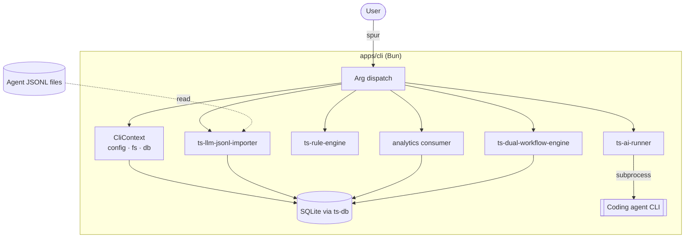

# 03 Architecture — Spur

**Version:** 1.0.0
**Status:** Canonical
**Derived from:** `docs/01_PRD.md`, `docs/00_ADR.md`
**Last Updated:** 2026-05-30
**Owner:** Robin Min

This document describes the **current** architecture of Spur. It specifies module boundaries
and invariants, not schemas or signatures (those live in code). When it conflicts with
`docs/00_ADR.md`, the ADR wins.

## 1. Topology

Bun-workspace monorepo (no Turborepo, ADR-002). Spur owns three apps and two thin local packages;
all reusable engines are external `@gobing-ai/ts-*` packages (ADR-006).

```
spur/
├── apps/
│   ├── cli/         Primary surface — arg dispatch, domain commands, local DAOs, migrations
│   ├── server/      Hono + oRPC OpenAPI handler; Bun + Cloudflare Worker entrypoints
│   └── web/         Astro + Cloudflare adapter; typed oRPC OpenAPI client
├── packages/
│   ├── contracts/   oRPC transport contracts ONLY (health/DTOs) — @gobing-ai/spur-contracts
│   └── config/      Zod config schema + env parsing — @gobing-ai/spur-config
├── tooling/typescript/   Shared tsconfig presets (base/server/react)
└── drizzle/         0000_spur_cli_foundation.sql (active) + _legacy_reference/ (inert)
```

### 1.1 External dependency boundary (ADR-004/006)

```
apps/* ──► packages/{contracts, config}
apps/* ──► @gobing-ai/ts-{utils, infra, runtime, db}          (semver)
apps/cli ─► @gobing-ai/ts-{ai-runner, rule-engine,            (link: → semver pending)
                           dual-workflow-engine, llm-jsonl-importer}
```

| Layer | Owns |
|-------|------|
| `ts-utils` | output, errors, api-response, cursor, date, access |
| `ts-infra` | logger, EventBus, telemetry, scheduler, job-queue interfaces |
| `ts-runtime` | runtime context, FileSystem, ProcessExecutor, config loader |
| `ts-db` | DbAdapter, BaseDao, migrations, QueueJobDao |
| `ts-ai-runner` | `AgentDetector`, `DoctorRunner`, `AiRunner` |
| `ts-rule-engine` | `RuleEngine`, evaluators, presets, formatters, rule types |
| `ts-dual-workflow-engine` | FSM + transition-flow drivers, persistence, schema SQL |
| `ts-llm-jsonl-importer` | `runJsonlImport`, `SourceDefinition`, schema SQL |

**Hard constraints (enforceable as rules):**

1. No `@spur/*` imports — that scope does not exist here.
2. `packages/contracts` holds transport DTOs only; domain types live in their owning ts-libs package.
3. `apps/web` imports contract **types** via oRPC client — never server internals.
4. CLI commands are transport wrappers over package APIs — no domain logic reimplemented inline.
5. Cross-workspace imports use `@gobing-ai/*` aliases, never deep relative paths.

## 2. Runtime Model

Phase 1 is single-process: the CLI owns the work and is the writer of record (ADR-010).



The server/web tier is a separate, read-oriented inspection surface (Phase 4). The server runs on
Bun (`Bun.serve`) or Cloudflare Workers (`worker.ts`) by sharing one Hono app built at module scope.

## 3. CLI Architecture (`apps/cli`)

```
src/
  index.ts          Entry + dispatch (command → handler)
  args.ts           Minimal flag/positional parser
  context.ts        CliContext: cwd, env, fs, output, lazy migrated DB adapter
  config.ts         CLI constants (config dir/file, db file, labels)
  output.ts         Human/JSON output sink
  commands/         init · status · migrate · rule · workflow · agent · history
  db/               Local DAOs (workspace, run, phase-run, transition-run, workflow-state, artifact)
                    + migrations (composes package schema SQL)
  analytics/        History cost analytics — domain consumer of imported ETL rows
  git-context.ts    Inline git status helper
```

- **Commands** parse flags, call a package API, format output, return an exit code. No business logic.
- **DAOs** extend a thin `SpurDao` over `ts-db` and use the adapter's prepared-statement API.
- **Context** lazily builds and migrates the SQLite adapter on first DB access.

## 4. Type Seam — oRPC (ADR-005)

```
packages/contracts (oc.route + Zod)
   ├─► apps/server/router.ts   implement(contract).handler(...)   ← compile-time bound
   ├─► apps/server/openapi.ts  OpenAPIGenerator(contract)         ← spec derived, not hand-written
   └─► apps/web/rpc-client.ts  OpenAPILink(contract)              ← typed client
```

Contract↔handler drift is a compile error. OpenAPI is generated, never hand-maintained. Domain types
never enter `packages/contracts`.

## 5. Constraint Rules (`ts-rule-engine`, `spur rule`)

A constraint rule declares an id, severity, target paths, an evaluator, options, and a message.
`RuleEngine.evaluate(rules, cwd)` returns findings; the CLI owns exit-code policy (`--fail-on`).
Presets compose via `loadPresetRules`; ad-hoc files via `loadRuleFile`. Formatters (text/json) are
host-registered. Rules are configuration — adding one edits YAML, not code.

## 6. Workflows (`ts-dual-workflow-engine`, `spur workflow`)

Two execution models behind one host (ADR-009):

- **State-machine** — states, transitions, guards; a single readable driver loop for linear/looping
  workflows.
- **Transition-flow** — DAG with conditional branching for multi-phase pipelines.

Definitions are YAML (Zod-validated, variable interpolation). Persistence is via a SQLite adapter
(`DbWorkflowPersistenceAdapter`) over ts-db; in-memory for tests. The CLI's `WorkflowService` wires
the host + persistence and exposes validate/run/list.

## 7. History Import & Analytics (`ts-llm-jsonl-importer`, `spur history`)

Pipeline (ADR-008), one generic control function over a `SourceDefinition` union:

```
discover files → resume from (source, source_file) checkpoint → read line-by-line
  → split (one-to-one | one-to-many | custom) → fieldMap (raw→canonical)
  → transforms → Zod validate (gate before persist) → redact → SHA-256 dedup
  → load to per-source ETL table → update checkpoint
```

Sources: pi, claude, codex, gemini, opencode, antigravity, openclaw. Adding a source = one
`SourceDefinition` variant; the pipeline never changes. **Analytics** (`apps/cli/src/analytics`) reads
the ETL tables, estimates tokens/cost per model, and aggregates by source/model/day — a domain
consumer, not part of the generic importer.

## 8. Data & Storage (ADR-007/008)

| Location | Purpose |
|----------|---------|
| `.spur/` | Project config (`config.json`), local rule/workflow definitions |
| SQLite DB (`DATABASE_URL` or `.spur/spur.db`) | CLI domain tables + history ETL/ledger/checkpoint + workflow tables |
| Agent JSONL files | Canonical raw history (never copied into the DB) |
| `logs/` | Process and observer logs |

Schema is composed from package-owned SQL and applied through the `__spur_cli_migrations` journal.
Tables: `workspaces`, `runs`, `phase_runs`, `transition_runs`, `workflow_states`, `artifacts`,
`history_import_ledger`, `history_import_checkpoint`, `history_etl_<source>`, plus the workflow
engine's tables.

## 9. Observability & Security

- Logging/telemetry ride `ts-infra` (logger + OpenTelemetry); telemetry is opt-in, default local-only.
- Spur never stores agent API keys — authentication is the agent's concern.
- History redaction strips secrets/PII before any persistence (redaction runs before dedup hashing).
- External content (agent output, JSONL, web) is untrusted input — validated at boundaries.

## 10. Risks & Mitigations

| Risk | Mitigation |
|------|------------|
| Repo can't build from clean clone (engines on `link:`) | Phase 1 gate: publish + pin semver (ADR-004 open item) |
| Contract/handler drift | `implement(contract)` makes it a compile error |
| Schema drift across engines | Each package owns its schema SQL; CLI composes (ADR-007) |
| Old migrations reactivated | Inert under `_legacy_reference/`; loader filters `_spur_cli_` marker |
| Engine MVP gaps mistaken for parity | Roadmap Phase 3 tracks the depth restore explicitly |
| History raw bloat / parse errors | Raw stays in files; only validated ETL persisted (ADR-008) |
