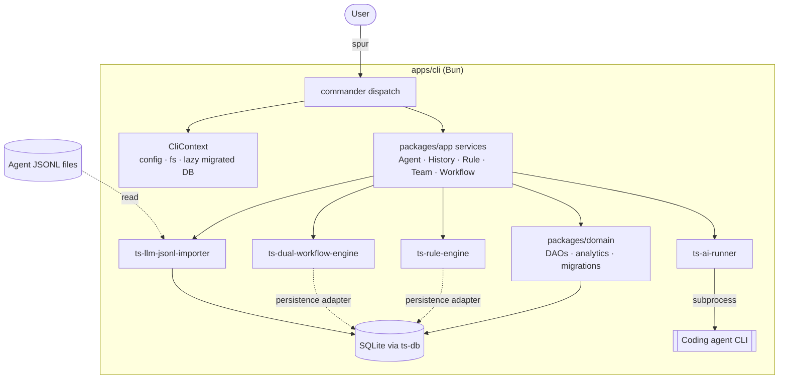

# 03 Architecture — Spur

This document describes the **current** architecture of Spur. It specifies module boundaries
and invariants, not schemas or signatures (those live in code).

## 1. Topology

Bun-workspace monorepo (no Turborepo, ADR-002). Spur owns three apps and four local packages
(ADR-001 as amended); all reusable engines are external `@gobing-ai/ts-*` packages (ADR-006).

spur/
├── apps/
│   ├── cli/         Primary surface — commander dispatch (ADR-014) + transport-wrapper commands
│   ├── server/      Hono + oRPC OpenAPI handler; Bun + Cloudflare Worker entrypoints
│   └── web/         Astro + Cloudflare adapter; typed oRPC OpenAPI client
├── packages/
│   ├── app/         Application services — Agent/History/Plugin/Rule/Team/Workflow (ADR-021)
│   ├── contracts/   oRPC transport contracts ONLY (health/DTOs) — @gobing-ai/spur-contracts
│   ├── config/      Config SSOT — merged schema + the single `.spur/config.yaml` loader; core/loader split (ADR-027)
│   ├── domain/      DAOs + schema + analytics + migrations; sole ts-db importer (ADR-011)
├── plugins/sp/      Agent-facing layer: Fat Skills + thin command/subagent wrappers (ADR-016/023)
├── config/          Spur-owned default config SSOT — rules/, workflows/, plugins/ (ADR-015)
├── tooling/typescript/   Shared tsconfig presets (base/server/react)
└── drizzle/         0000_spur_cli_foundation.sql + incremental _spur_cli_ migrations +_legacy_reference/ (inert)

### 1.1 External dependency boundary (ADR-004/006/021)

Per-app edges as they exist today (manifest-verified):

```
apps/cli ────► packages/{app, config, domain}
               + @gobing-ai/ts-{utils, infra, runtime, ai-runner,        (semver)
                                rule-engine, dual-workflow-engine, llm-jsonl-importer}
apps/server ─► packages/{config, contracts} + @gobing-ai/ts-{infra, runtime}
               (+ packages/app — never direct DB — per ADR-021.b)
apps/web ────► packages/contracts (types via oRPC client only)
packages/app ───► packages/domain + the engine packages
packages/domain ► @gobing-ai/ts-db (sole importer — §8.1)
```

| Layer | Owns |
| ------- | ------ |
| `ts-utils` | output, errors, api-response, cursor, date, access |
| `ts-infra` | logger, EventBus, telemetry, scheduler, job-queue interfaces |
| `ts-runtime` | runtime context, FileSystem, ProcessExecutor, config loader |
| `ts-db` | DbAdapter, BaseDao, migrations, QueueJobDao |
| `ts-ai-runner` | `AgentDetector`, `DoctorRunner`, `AiRunner` |
| `ts-rule-engine` | `RuleEngine`, evaluators, presets, formatters, rule types |
| `ts-dual-workflow-engine` | FSM + transition-flow drivers, persistence, schema SQL |
| `ts-llm-jsonl-importer` | `runJsonlImport`, `SourceDefinition`, schema SQL |

**Hard constraints (enforceable as rules):**

1. No `@spur/*` imports — that scope does not exist here.
2. `packages/contracts` holds transport DTOs only; domain types live in their owning ts-libs package.
3. `apps/web` imports contract **types** via oRPC client — never server internals.
4. CLI commands are transport wrappers over package APIs — no domain logic reimplemented inline.
5. Cross-workspace imports use `@gobing-ai/*` aliases, never deep relative paths.
6. `.spur/config.yaml` is loaded only through `@gobing-ai/spur-config` — no surface parses or
   schema-validates the config itself (§1.2, ADR-027).

### 1.2 Config-loading boundary (ADR-027)

`.spur/config.yaml` has one loader, in `@gobing-ai/spur-config`. The package splits into a
dependency-free **core** (`.`: merged `spurConfigSchema`, `DEFAULT_*` constants, config types) and a
node-only **`./loader`** (`loadSpurConfig`, `resolveConfigFile`, `resolvePlanningFolders`,
embedded-schema resolution). The split exists because importing `yaml`/`node:fs` into the Cloudflare
Workers bundle crashes miniflare — so the server imports only the core; CLI and `packages/app` (on
Bun) import the loader.

This replaced five parallel paths that had diverged before ADR-027: the CLI's structured-config
loader, the app's raw-`yaml` `resolvePlanningFolders`, a CLI `resolveConfigFile`, the server's inline
folder literals, and the server's legacy `docs/.tasks/config.jsonc` read. All consumers now derive
the typed result from the single facade; config-shape types (`TaskFoldersConfig`) have one owner.
Enforced by `config/rules/boundary/config-loading-ownership.yaml`.

## 2. Runtime Model

Phase 1 is single-process: the CLI owns the work and is the writer of record (ADR-010).



The CLI never calls an engine around the service layer (ADR-021); engines reach SQLite only
through persistence adapters constructed from `packages/domain`.

The server/web tier is a local-first planning and operations board. Its bootstrap splits by runtime
(ADR-019, amended by ADR-036):

- **Bun entry (`index.ts`)** → `runNodeApplication` (`@gobing-ai/ts-infra/application-node`):
  YAML config loading, file log sink, owned DB adapter, full module registry, and local static assets.
- **Worker entry (`worker.ts`)** → portable `runApplication` (`@gobing-ai/ts-infra/application`):
  lazy singleton plus `createWorkerApp`; health/OpenAPI routes and static-asset fallback only.

`src/server-config.ts` is shared and runtime-agnostic. `src/bootstrap.ts` is the Bun composition
root; `src/worker-app.ts` is the Worker-safe HTTP root. The Worker graph must not import
`node:*`, `bun:*`, local filesystem, SQLite, scheduler, queue, or process-control implementations.

## 3. CLI Architecture (`apps/cli`)

No file inventory here — that rots (99 §6.4 lesson); boundaries only:

- **Dispatch:** one commander `Command`; each noun registers via
  `registerXxxCommand(program, context)` (ADR-014). Commander owns parsing, subcommand dispatch,
  and `--help` rendering.
- **Commands** parse flags, call a `packages/app` service, format output, return an exit code —
  no business logic in the app (ADR-021).
- **CliContext** carries cwd/env/fs/output/`setExitCode` and lazily builds + migrates the SQLite
  adapter on first DB access.
- **DAOs, migrations, analytics** live in `packages/domain` (`dao/`, `migrations.ts` composing
  domain + engine schema SQL, `analytics/`). DAOs use the adapter's prepared-statement API.

## 4. Type Seam — oRPC (ADR-005)

```
packages/contracts (oc.route + Zod)
   ├─► apps/server/router.ts   implement(contract).handler(...)   ← compile-time bound
   ├─► apps/server/openapi.ts  OpenAPIGenerator(contract)         ← spec derived, not hand-written
   └─► apps/web/rpc-client.ts  OpenAPILink(contract)              ← typed client
```

Contract↔handler drift is a compile error. OpenAPI is generated, never hand-maintained. Domain types
never enter `packages/contracts`.

## 5. Constraint Rules (`ts-rule-engine`, `spur rule`)

A constraint rule declares an id, severity, target paths, an evaluator, options, and a message.
`RuleEngine.evaluate(rules, cwd)` returns findings; `RuleService` (packages/app) mediates; the
CLI owns exit-code policy. Presets compose via `loadPresetRules`; ad-hoc files via `loadRuleFile`;
formatters are host-registered. Runs persist through the engine's `RulePersistenceAdapter`
(Spur's `DbRulePersistenceAdapter` over ts-db), powering `spur rule trace`. Rules are
configuration — adding one edits YAML, not code. Flags and surface: `04 §1.1`.

## 6. Workflows (`ts-dual-workflow-engine`, `spur workflow`)

Two execution models behind one host (ADR-009):

- **State-machine** — states, transitions, guards; a single readable driver loop for linear/looping
  workflows. Terminal states partition into success/failure via an optional `failureStates` subset of
  `terminalStates` (ADR-044): the driver finalizes a failure terminal via `lifecycle.fail()`, so the
  run's status, persisted row, `workflow.run.failed` event, and CLI exit code all agree; absent
  `failureStates`, every terminal finalizes as `done` (backward compatible).
- **Transition-flow** — DAG with conditional branching for multi-phase pipelines.

Definitions are YAML (Zod-validated, variable interpolation). Persistence is via a SQLite adapter
(`DbWorkflowPersistenceAdapter`) over ts-db; in-memory for tests. `WorkflowService` (packages/app)
wires the host + persistence and exposes validate/run/list; persisted runs power
`spur workflow trace`. After load, `validate` / `run` (incl. `--dry-run`) / `continue` register
YAML-declared `extensions.actions` / `extensions.guards` onto that host (0533/D4) — relative to
the workflow file, fail-closed, no absolute or `..` paths. The planning layer's task/feature
lifecycles run as workflow definitions on this engine (§12.2) — its first long-lived,
externally-triggered consumer (ADR-022).

### 6.1 Consolidated per-run run log (built — ADR-045 / feature D2)

A single all-in-one per-run log at `.spur/run/<RUNID>.log` makes every `spur workflow run`
observable from creation to terminal status. The consolidated sink is a **read-only subscriber**
on the existing `WorkflowObservabilityBus` (which ADR-035 keeps a read-only projection) that appends
the already-redacted, already-bounded event stream to the log file. It subsumes the former
`RunOutputSink` (now `workflow-run-log-sink.ts`) — the same `observe`/`close` contract, byte/line
bounds (default 1 MiB / unbounded,
configurable), visible truncation marker, and best-effort-writes-never-fail-the-run semantics — but
emits a richer event set: the run's foreground rendering (plan preview, per-step progress,
transitions, final summary), child agent stdout/stderr chunks, consumed stdin (steering), and engine
shell/HITL action lifecycle lines. Because the sink writes in-process to a file, the `--async`
detached worker (which points its own std streams at `/dev/null`) still produces the log.

Invariants (enforceable):

1. No prompt body or shell command text ever enters the log; prompt bodies become `[prompt N chars]`,
   shell commands `[shell command redacted]`, configured secrets `[REDACTED]` — the consolidated log
   is not a redaction leak.
2. The log never exceeds its configured byte/line bound; hitting a bound appends a visible truncation
   marker, never a silent cut.
3. An unwritable `.spur/run/` dir or failing disk degrades the log, never the run.
4. `spur workflow clean` reclaims retained logs older than `workflow.logRetentionDays` (default 30);
   the log is retained by default and removed only by that policy.

`spur workflow trace <RUNID> --follow --output` streams `.spur/run/<RUNID>.log` (tail -f equivalent)
as a distinct source, exiting at terminal status; the structured DB timeline remains the default and
`--output` does not interleave with it. Removed-and-repointed surfaces are compatibility changes:
`<RUNID>-output.log` folds into `<RUNID>.log`, and the timed-out-implement runbook tails the new path;
the `.spur/runs/workflow/<RUNID>.jsonl` trace-file and `<RUNID>-STEP-partial.md` salvage stay distinct
authorities. Surface shapes: `docs/design/workflow-run-log.md`; decision: `00 ADR-045`; feature `D2`.

### 6.2 Resume and guard vars contract

This is the exact contract agents rely on when resuming a paused workflow or authoring guard
commands — it is documented in-repo so no one has to reverse-engineer the engine (`node_modules`).
Source of truth: `@gobing-ai/ts-dual-workflow-engine` `WorkflowService.resumeRun` /
`evaluateAndCommit`, and spur's `EnvShellGuardRunner` (`packages/app/src/workflow/guards/shell.ts`).

**`resumeRun` vars merge (caller wins).** When a paused run is resumed
(`spur workflow continue <run-id>` / `WorkflowService.resumeRun`):

1. The run must be `paused`; it is re-opened as `running`, and execution starts from the persisted
   current state **skipping that state's on-enter**.
2. The runtime vars are restored from the `effectiveVars` snapshot persisted in the last state
   snapshot (e.g. `__hitlAnswer`, `profile`), so a resume continues with the same runtime variables.
3. Caller-supplied `options.vars` are **merged over** that persisted snapshot — **caller wins** on a
   key collision (`mergeVars(persistedVars, options.vars)`). Inject a resumed answer by passing it in
   `vars`, not by mutating the snapshot.

**Shell-guard vars resolution (two layers).** A guard command may reference workflow vars either way:

1. **Template resolution (engine).** `${vars.*}` templates in guard options (e.g.
   `spur task check ${vars.wbs}`) are resolved against `workflow.vars` _before_ the guard runs
   (`resolveTemplates`), the same interpolation the driver's `firstPassingTransition` uses.
2. **Subprocess env export (spur).** Spur's `EnvShellGuardRunner` replaces the engine's default shell
   guard and spawns `/bin/sh -c <command>` with `context.vars` merged over `process.env` as the child
   env — so a guard can also reference vars by bare name (`$wbs`, `$spurBin`). Because the value is
   passed as environment data, a variable-expansion result is **never re-parsed as shell code** (no
   backtick/`$(...)` injection — task 0435/0432). The lifecycle adapter binds the run's guard var
   (e.g. `wbs`) and `spurBin` into `workflow.vars` before requesting a transition, which is why
   `task-lifecycle.yaml` guards can run `$spurBin task check $wbs`.

Guard evaluation is fail-closed: a non-zero shell exit denies the transition atomically with zero
partial writes (see `LifecycleAdapter.requestTransition` in §12.2).

### 6.3 Interactive task-pipeline control inversion (ADR-047 amendment)

Interactive `dev-run --mode full` and sequential `dev-runall` omit/inline invocations execute at the
agent-command layer, which already owns the live host session. The driver reads
`task-pipeline.yaml` at invocation time and interprets the same ordered actions and transition
guards; it does not add an engine inline mode or define a second FSM. Explicit executors, parallel
batches, and headless `spur workflow run` continue through `WorkflowService` and `agent.run`.

**Native-subagent-first model stages (task 0508).** Interactive inline keeps the controller in the
host session and is **non-subprocess** — it never invokes `spur agent run` or `spur workflow run` —
but eligible model-bearing `agent.run` stages may execute on a native platform subagent. Eligibility
is decided by observable facts only: the action is a pure-slash `agent.run`, the state is not
interactive (no operator-confirmation action, `pause: true`, or approve/taste/ask decision), and the
host platform exposes a native subagent with shared-worktree read/write/shell capability. Dispatch
happens **once**, sequentially (one writer at a time), and joins before the driver evaluates the
next action or guard; a pre-dispatch eligibility failure falls back to one host execution, while a
failure after dispatch follows the stage's error policy and is never replayed in the host. Operator
confirmation actions, `pause: true`, and approve/taste/ask decisions remain host-owned — no subagent
answers or continues them. The dispatched stage cannot recursively dispatch the same stage.

The inline path records `task_run_links` provenance before entering the FSM and appends each model
stage's state id plus host session id to a run-scoped log — for subagent-executed stages the log
names the subagent id (`stage <id> executed via subagent <agent-id> (host session <session-id>)`),
distinct from the inline provenance. It has no independent stage timeout/abort
boundary or subprocess action record. Invariants: YAML remains the sole state/guard authority; every
lifecycle guard still executes; inline failure never silently redirects to `agent.default`.

## 7. History Import & Analytics (`ts-llm-jsonl-importer`, `spur history`)

Pipeline (ADR-008), one generic control function over a `SourceDefinition` union:

```
discover files → resume from (source, source_file) checkpoint → read line-by-line
  → split (one-to-one | one-to-many | custom) → fieldMap (raw→canonical)
  → transforms → Zod validate (gate before persist) → redact → SHA-256 dedup
  → load to per-source ETL table → update checkpoint
```

Sources: pi, claude, codex, gemini, opencode, antigravity, openclaw, omp, grok, agy. Adding a source
is one `SourceDefinition` variant; the pipeline never changes. `--source all` fans out with
per-source failure isolation (E1/0470); ad-hoc `--file <path>` imports a single session (E1/0470).

**Forensic ETL contract** (E1/0466, 0468): the importer normalizes records into a machine-readable
output with `MAX_ERROR_SAMPLES` cap, `importOneIsolated` per-source isolation, `schemaVersion`
tagging, and `assertArtifactVersion` gating — the artifact is a versioned contract, not ad-hoc JSON.

**Full-mode reconciliation** (0504/0505): `--mode full` revalidates the ETL against canonical raw
files — the importer deletes stale target/ledger/checkpoint rows and returns per-source
`{ staleTargetRows, staleLedgerRows, staleCheckpointRows }`, which `importOneIsolated` passes
through `CoverageEntry` to `entries[].reconciliation` in `--json` output (optional, absent on
incremental runs). Sources that skipped malformed records are `degraded`, never clean `ok` —
shapes in `04 §1`.

**Analyze → Report** (E1/0474, 0469): `spur history analyze` aggregates the ETL tables in SQL
(`packages/domain/src/analytics/forensic-query.ts`) and writes a versioned JSON artifact
(`schemaVersion` field). `spur history report` is a pure renderer — it reads the artifact, asserts
the schema version, and renders to stdout + markdown sidecar without opening the database.
Unavailable values render as `n/a`, never `0` (never-fabricate).

**Daily pipeline** (E1/0470, 0471): `spur history daily` is a single run-once invocation:
import-all → analyze → write artifact → prune reports older than 90 days. Scheduling is via an
external launchd plist (`com.gobing-ai.spur.history.daily.plist`), not an embedded scheduler. The
history system emits `history.*` events to the event ledger for observability.

**Analytics** (`packages/domain/src/analytics`) reads the ETL tables, estimates tokens/cost per
model, and aggregates by source/model/day — a domain consumer, not part of the generic importer.

## 8. Data & Storage (ADR-007/008)

| Location | Purpose |
| ---------- | --------- |
| `.spur/` | Project config `config.yaml` (ADR-017), local rule/workflow definitions, team agent specs (`agents/`) |
| `~/.config/spur/` | Global config layer, seeded from bundled assets; resolution is bundled > global > local (ADR-015) |
| SQLite DB (`DATABASE_URL` or `.spur/spur.db`) | CLI domain tables + history ETL/ledger/checkpoint + workflow/rule run history + inbox |
| Agent JSONL files | Canonical raw history (never copied into the DB) |
| Task/feature markdown | Planning SSOT (ADR-020); the DB holds only derived data (§12.1) |
| `logs/` | Process and observer logs |

Schema is composed from package-owned SQL and applied through the `__spur_cli_migrations` journal
(`0000` foundation + incremental `_spur_cli_`-marked migrations). Tables: `workspaces`, `runs`,
`phase_runs`, `transition_runs`, `workflow_states`, `artifacts`, `history_import_ledger`,
`history_import_checkpoint`, `history_etl_<source>`, `inbox_messages`, `rule_runs`,
`rule_eval_runs`, plus the workflow engine's tables.

### 8.1 Persistence boundary (ADR-011)

Spur consumes `@gobing-ai/ts-db` as a drizzle-free facade with a single-source-of-truth schema
model, so table/DDL/Zod drift is structurally impossible. Five rules, enforced by
`.spur/rules/boundary/dao-boundary.yaml`:

1. **`ts-db` is imported only inside `packages/domain`** — apps and the other local packages consume
   persistence through `@gobing-ai/spur-domain` DAOs, never `ts-db` or the raw adapter directly.
2. **`drizzle-orm` is confined to `packages/domain/src/schema/`** — column builders are input to
   `defineTable`; no other file (DAOs, analytics, apps) may import drizzle.
3. **Tables are defined with `defineTable`** (from `@gobing-ai/ts-db/schema`), never bare
   `sqliteTable`; each schema file exports the `DefinedTable` plus its `.table`.
4. **DDL is derived, never hand-written** — `DOMAIN_SCHEMA_SQL` composes each table's
   `createTableSql`; no raw `CREATE TABLE` for a Drizzle-backed table, no `.sql` text-imports.
5. **Raw string SQL stays inside `packages/domain`** (DAO/migration layer), never in apps.

## 9. Observability & Security

- Logging/telemetry ride `ts-infra` (logger + OpenTelemetry); telemetry is opt-in, default local-only.
- Spur never stores agent API keys — authentication is the agent's concern.
- History redaction strips secrets/PII before any persistence (redaction runs before dedup hashing).
- External content (agent output, JSONL, web) is untrusted input — validated at boundaries.

## 10. Risks & Mitigations

| Risk | Mitigation |
| ------ | ------------ |
| Contract/handler drift | `implement(contract)` makes it a compile error |
| Schema drift across engines | Each package owns its schema SQL; CLI composes (ADR-007) |
| Old migrations reactivated | Inert under `_legacy_reference/`; loader filters `_spur_cli_` marker |
| Engine MVP gaps mistaken for parity | Roadmap Phase 3 tracks the depth restore explicitly |
| History raw bloat / parse errors | Raw stays in files; only validated ETL persisted (ADR-008) |
| Lifecycle-on-workflow blocked by engine gaps (long-lived runs, pause/continue, HITL) | Stage-D ts-libs gap tasks gate the dependent waves (ADR-022); upstream-first — no local FSM fallback |
| Legacy board writes corrupt normalized task corpora during the rd3 migration | Freeze legacy `tasks server` read-only at the A17 cutover; the spur board lands in the same batch (triage doc) |

## 11. Plugin Substrate (ADR-012, amended 2026-06-09)

The lifecycle extension seam lives upstream in `@gobing-ai/ts-infra` (≥0.3.6): `Plugin`
(lifecycle-only — `onLoad`/`onStart`/`onStop`/`onUnload` + `failFast`) and `PluginHost`
(register; fail-fast load, fail-soft start/stop/unload in reverse registration order), driven
natively by `runApplication`/`runNodeApplication` via `plugins`/`pluginHost` options. ts-infra
registers its own core services (logger, telemetry, scheduler, user-callback) as built-in
plugins; Spur consumes the lifecycle and does not re-plugin-ize core services. When plugins are
registered, `startAll()` runs before command dispatch.

Deferred/removed until a real plugin consumer exists (shapes in `04 §6`):

- Spur-side SDK, manifest discovery, capability registries, and the four-tier trust ladder —
  removed with the SDK; re-addable on the ts-infra `Plugin` interface (`failFast: true` already
  covers critical-plugin abort).
- Server route seam (`apps/server/src/plugins.ts`) and the Spur `EventRegistry` — removed; the
  `PluginHost`'s raw `EventBus` is the direct event seam.
- Harness registry (Phase 5d) — blocked on upstream `AiRunner` shim injection; task 0015
  (`Blocked`).

## 12. Planning Layer (built — ADR-020–023)

The task/feature domain migrated from `cc-agents/plugins/rd3`. This section records the mechanism
and invariants the implementation must satisfy; per-item scope lives in
`docs/plans/2026-06-10-rd3-migration-feature-list.md`, concrete command/schema shapes land in
`04_DESIGN.md` as commands ship. The spec pipeline is a `plugins/sp` fat skill over these
mechanisms (ADR-020/023), not a separate CLI noun.

### 12.1 Markdown as the single source of truth

- **Tasks** live in configured folders (e.g. `docs/tasks/`), **features** in
  `docs/features/FT-<NNN>_<name>.md` — YAML frontmatter + structured markdown body, both
  Zod-validated with a `schema_version` key. Parse-validate-serialize replaces all regex
  read-modify-write.
- **The DB holds only derived data** (lifecycle events, run links, caches) — mirroring ADR-008's
  raw-stays-in-files principle. Deleting the DB loses no planning state.
- **Generated artifacts** (`kanban.md`, `docs/features/INDEX.md`) are outputs of `refresh`
  commands, never hand-edited, never inputs.
- The task/feature domain is **Spur-local** (ADR-006 division: it is Spur's own domain glue, not a
  reusable engine). The generic Gherkin-subset validator is the exception — it is upstreamed to
  ts-libs.
- **Default package home (ADR-021):** task/feature services — including the write service — join
  `packages/app`; frontmatter schemas, file I/O, and derived-data DAOs join `packages/domain`.
  Creating a new local package requires a recorded decision; no package sprawl by default.

### 12.2 Write service & lifecycle (ADR-021/022)

One write service in `packages/app` serves every transport; lifecycle transitions run through
`spur workflow`:

```
spur task/feature <verb> ──┐
                           ├──► write service (packages/app) ──► markdown file
future server routes ──────┘         │
                                     ├─► per-WBS lock + create-lock (one domain)
                                     ├─► lifecycle = spur workflow definition
                                     │     (config/workflows/*; guards = task check;
                                     │      EventBus seam for extensions)
                                     └─► transition → append `## History` + event
```

Invariants:

1. No mutation path bypasses the write service — the legacy CLI/server dual-lock race is
   structurally impossible (a consequence of ADR-021, not a policy).
2. Status lifecycles are `spur workflow` definitions (ADR-022). The frontmatter `status` is the
   single source of truth; engine persistence is derived and rehydratable from the files.
3. Engine gaps for long-lived, externally-triggered lifecycles (pause/continue, HITL) are closed
   upstream in `ts-dual-workflow-engine` — never re-implemented locally.
4. Customization attaches via the engine's EventBus pub/sub seam (`on_transition`,
   `on_guard_fail`, `on_complete`), not engine forks; SSE/board and (later) the scheduler are
   subscribers on the same seam.

### 12.3 BDD traceability chain

```
feature ## Acceptance Criteria (Gherkin / checklist)
   ▲ validated by shared BDD validator
   │
   feature-id frontmatter (single edge — the entire integration surface)
   │
task ## Acceptance Criteria (subset coverage)
   ▲ validated by `spur task check`: edge exists · AC covered · orphan warnings
```

- One shared BDD validator (Gherkin-subset parser + checklist parser + coverage check; AST aligned
  with `@cucumber/gherkin` types, no runtime dependency on it) behind `task check`, `feature
  check`, and pipeline output validation.
- Section-Status-Matrix + per-section format rules are **config** (`./config`, ADR-015 pattern),
  enforced warning-first; only the small core (AC format, Solution `file:line` citation, Review
  P1–P4 table) hard-gates. Tightening follows compliance data, not aspiration.

### 12.4 Boundaries

- `apps/cli` task/feature commands stay transport wrappers (ADR-021) over `packages/app`
  services.
- Task DTOs for any future board cross the oRPC seam via `packages/contracts` (ADR-005) — domain
  types never leak into contracts. The server/web shape itself is a separate design task
  (ADR-021 consequence b).
- `plugins/sp` centralizes agent-facing behavior in **skills** (Fat Skills — ADR-023); slash
  commands and subagents are thin wrappers of skills. Skills delegate deterministic execution to
  CLI verbs where they exist, but are not limited to CLI wrapping.
- Cross-cutting needs reuse the owning ts-libs package (`ts-utils` output/errors, `ts-runtime`
  FileSystem, `.spur/config.yaml` via ADR-017) — no parallel local re-implementations.

## 13. Dev-Command Argument Contract (built — ADR-032 amendment)

The agent-facing input contract stays inside each hand-authored command file and is projected to
platform adapters by Superskill. The three representations have separate ownership:

| Representation | Owner | Content |
| --- | --- | --- |
| `argument-hint` frontmatter | command file | canonical invocation syntax only |
| `## Argument Flags` | command file | public positionals and flags, command-local descriptions, deterministic defaults |
| shared flag glossary | `spur-dev` reference | canonical cross-command semantics and compatibility vocabulary |

`validate-commands.ts` parses command structure and hint-to-table parity. The command-contract and
flag-parity tests derive the dev-command inventory from `plugins/sp/commands/dev-*.md`, validate
shared glossary membership across that complete set, and retain the numbered `dev-operations.md`
parity check as an additional catalog constraint.

Invariants:

1. Every dev command has exactly `Argument Flags`, `Usage`, and `Implementation` level-two headings
   in that order.
2. Dev-command `argument-hint` values contain no Markdown link or prose definition.
3. Canonical public positionals and flags match bidirectionally between the hint and table.
4. Each shared flag resolves to one glossary entry or an explicitly documented contextual meaning.
5. Aliases and deprecated spellings remain compatibility metadata; they do not silently become
   canonical hint syntax or disappear without migration evidence.
6. No generated command registry or committed platform adapter participates in validation.

Concrete shapes and rollout: `docs/design/dev-command-argument-contract.md`.

## 14. Web Board Modules & Team-Scoped Composition (ADR-052)

`apps/web` renders the Board as a set of **auto-discovered modules**: `apps/web/src/modules/discover.ts`
eagerly globs sibling directories that export a named `module: WebModule` (`id`, `route`,
`sidebarLabel`, `order`, `component`). A new module needs **no registry edit** — discovery is
automatic; `order` only places it in the sidebar. Current modules: `teams`, `inbox`, `task-kanban`,
`observability`, `features`, plus shell-level pieces (sidebar, project switcher).

### 14.1 Current shipped state: two channels merged client-side

Spur has **two independent channels** between the Board and a backend coding agent. They are merged
_for display_ by the Inbox module; they are never merged in storage and delivery is unchanged.

| | Durable message queue | Process pipe |
| --- | --- | --- |
| Write path | `TeamService.sendMessage` → DAO `enqueue` | `POST /api/team/processes/:id/stdin` |
| Read path | `TeamService.getInbox` / `listRecent` / `drainPending` | `GET /api/team/processes/:id/stream` (SSE) |
| Delivery to agent | `spur agent loop` calls `drainPending`, prepends to prompt | written straight to `PipeProcess` stdin |
| Storage | SQLite (`inbox_messages`), durable, `queued → injected` lifecycle | in-memory ring buffer, bounded (default 500), lost on restart |
| Ordering cursor | `createdAt` | `seq` (monotonic) + `ts` |

The merge is a **pure function** in `apps/web/src/modules/inbox/timeline.ts`:
`mergeTimeline(messages, frames, agentId) → TimelineEntry[]` — a discriminated union
(`kind: message | frame`, `direction: in | out`). Pure keeps R5/R6 testable without mounting a
component. The oldest frame's `ts` is the process-frame **history boundary** (R6): entries older
than it are messages only, rendered behind a marker; an agent with no frames renders a message-only
timeline, not an error.

### 14.2 Shared process-stream helpers (R9)

`parseFrame`, `appendFrame`, `nextBackoff`, and `streamUrl` live once in
`apps/web/src/lib/process-stream.ts` and are imported by both `teams/MemberTerminal` and the Inbox
agent timeline. No duplicated frame-parsing logic.

### 14.3 Accepted G3 boundary (ADR-052)

G3 removes the display merge above. `agent.team.<teamId>` is the v1 workspace context: the team
config already owns its work folder and roster. Teams owns roster/process lifecycle/terminal/activity;
Inbox owns durable `inbox_messages`; Workspace is a Board composition shell that passes `teamId`
scope into existing Team, Inbox, and Task views. It introduces no workspace persistence, service,
HTTP route, or CLI noun. Until task 0197 lands, §14.1–14.2 describe the shipped transitional state.

### 14.4 Module-scoped DESIGN.md palette (R10–R13)

Each DESIGN.md-consistent Board module scopes its palette to its root rather than remapping the
shared `@theme` `spur-*` values (consumed by 13+ files across Features/Teams/Observability — they
must stay byte-identical). `global.css` carries a `.inbox { … }` block (and
`[data-theme="light"] .inbox`) declaring the DESIGN.md ladder, hairline, ink, and the four daisyUI
variables (`--color-primary/--color-primary-content/--color-accent/--color-accent-content` pinned to
the DESIGN.md lavender `#5e6ad2` on `#ffffff`). The daisyUI pins exist because `@/ui` primitives map
variants onto daisyUI's **own** `--color-primary`, which would otherwise place a second chromatic
accent on screen (0420 finding F-01). Module code carries **no hex literals and no Tailwind palette
classes** — every surface resolves a `spur-*` token.

## 15. Agent-Facing Plugin Surface Parity (ADR-053/054)

Implemented 2026-08-11 (tasks 0512–0517): the frozen capture helper
`plugins/sp/tests/helpers/cli-surface.ts` (`captureCliSurface` / `parseCommanderHelp`) and the
focused parity suite `plugins/sp/tests/cli-surface-parity.test.ts` (plus `skill-structure.test.ts`
extensions) enforce the contract below against the live monorepo CLI.

The agent-facing surfaces in `plugins/sp/` are maintained under a mechanical parity contract with
the monorepo CLI (ADR-053, extending ADR-038's `spur-cli`-reference coverage). Three surfaces are in
contract — the `sp:spur-cli` facade inventories (noun routing table, Tier C exclusions, per-noun
verb/flag references), the `sp:spur-dev` spine step-routing table, and the `AGENTS.md` noun table.
The parity harness (bun:test + the monorepo CLI only; no new runtime/dependency/schema/transport)
resolves the CLI via `bun run apps/cli/src/index.ts` and captures the surface `--help`-primary:
`<noun> --help` is the universal capture surface; `--json` is used only where the noun actually
exposes a machine-readable inventory. Human `--help` parsing is a narrow adapter with fixtures and
explicit exclusions (ADR-053 amendment), never an assumed machine API. Diffs are bidirectional:
documented-but-absent and live-but-undocumented are both findings. Exclusions are marker-driven,
never silent — Tier C nouns the facade marks as outside its documentation scope, and spine rows
whose target is a slash command or inline execution rather than a CLI verb, are ignored by explicit
rule, never by absence of a match. The harness records the resolved binary's provenance;
published-npm `spur` skew is a documented drift source the tests cannot catch on end-user installs.
The spine/facade boundary is ownership-defined and asserted by the same tests, not redesigned
(ADR-054): the facade owns CLI noun/verb/flag semantics — including status-transition verbs — and
the spine owns multi-step lifecycle orchestration; the tests assert each surface documents its
owned scope, not the absence of "lifecycle steps" in the facade. The harness extends the existing
parity suite with at most one shared CLI-surface helper and at most one new focused parity test.
Duplication assertions cover exact catalogs and structured inventories only, never arbitrary prose.
Content surfaces (README index, cross-links) are pinned by the same harness.

Invariant (enforceable): every CLI surface change keeps the three contract surfaces in parity —
enforced mechanically by the parity harness (ADR-053), not by review discipline.

Shapes: `docs/design/plugin-surface-parity.md`.

Planning ownership follows ADR-055: B owns runtime agent execution; I owns the `sp` plugin harness
described in this section; H is frozen mixed history, not an active destination for new work.

## 16. Actionable Observability Context (foundation current — ADR-056; task 0526)

Cataloged events retain their domain-local ts-libs payloads until they cross Spur's canonical
observability seam. `registerSystemEventTap` and the CLI `SystemEventEmitter` call one pure envelope
builder before persistence; SSE uses the same projection. The history read path recognizes legacy
raw payloads and projects them into the current envelope without rewriting storage.

The task-0526 foundation is current. Board semantic rendering and additive workflow/rule trace
context remain downstream consumers in tasks 0527–0528; neither creates another envelope builder.

```text
Spur / @gobing-ai/ts-* typed event
  → SYSTEM_EVENT_CATALOG entry
  → buildSystemEventEnvelope(event, project context)
  → redacted + bounded system_events payload / SSE frame
  → Board semantic table + tooltip

workflow_runs / rule_runs
  → existing trace services
  → additive contextual DTO projection
  → human trace + JSON
```

Invariants:

- ts-libs event maps do not depend on Spur project context or presentation vocabulary.
- Redaction precedes recursive bounds and every persistence/streaming sink.
- `metadata-only` is an allow-list; it never retains business payloads or complete finding/output bodies.
- Indexed `system_events` correlation columns remain query authority; envelope correlation is the
  portable display projection.
- Legacy rows are adapted on read; no history migration or payload rewrite is required.
- Remediation values name only existing commands, Board filters, or local artifact paths and are
  omitted when exact reconstruction is impossible.
- Trace stores remain replay authority; System Events never reconstruct workflow or rule traces.

Shapes: `docs/design/actionable-observability-context.md`.

## 17. Inter-Agent Control Plane (ADR-057 — waves 1–2 landed; wave 3 follow helper landed)

Current shipped coordination is two independent channels (`03` §14.1): durable `inbox_messages`
drained by `spur agent loop`, and a supervised process pipe (stdin POST + bounded SSE ring).
Wave 1 (task 0529) persists an `OccupantRef` + `coordination_runs` row when a run is addressed by
spec id (`flags['spec-id']` is set before `--drain` rewrites `--agent` to the coding-agent type)
and injects `SPUR_SPEC_ID` / `SPUR_TEAM_ID` / `SPUR_RUN_ID` / `SPUR_SERVE_URL` on supervised spawn.
Wave 2 (task 0530) ships the identity-pinned wait surface: `spur agent wait <specId>` (pins
`specId+runId+generation`, typed errors `occupant_gone|run_replaced|wait_stalled|timeout`)
and atomic `spur message send --wait` (snapshots the occupant before enqueue, waits on that
pin in the same process). Wave 3 (task 0531) replaced the 100 ms `system_events` poll with
`followSystemEventsAfter` (snapshot sequence, then follow `sequence > snapshot`; identity /
stall / timeout still heartbeat at 100 ms). Lifecycle is derived by a pure projector
(`working` = latest `agent.invoke.start`; `idle` = latest `agent.invoke.exit` + empty queued
inbox; `blocked` requires a first-class signal, none yet). First-class `blocked` remains
accepted design.
The Board Inbox `mergeTimeline` remains display-only; G3 (ADR-052) still owns un-merging it and
is not this section's work.

### 17.1 Target topology

```text
Agent A (spec reviewer)
  → spur message send --to implementer
  → inbox_messages (queued)
  → implementer agent loop drain
  → OccupantRef { specId, agentKind, processId, runId, generation }
  → CoordinationRun + artifact paths
Agent A
  → spur agent wait implementer --run <runId> --until invoke-exit
  → snapshot system_events seq → follow cataloged events → re-probe occupant
  → read artifactRefs (files), never a PTY
```

The process pipe stays the operator attach path. It is not the agent-to-agent command bus.

### 17.2 Invariants (enforceable)

1. No production module may open a socket to another coding-agent process for coordination.
2. No production module may read another pane's terminal buffer, screen manifest, or OSC title
   to decide agent lifecycle or to return “the other agent's output.”
3. No production module may write synthetic keystrokes to another agent's stdin as a substitute
   for `spur message send`.
4. `POST /api/team/processes/:id/stdin` remains operator/process-pipe only; `agent loop` delivery
   stays `drainPending` → prepend until a later accepted design replaces it.
5. Wait and send-wait pin `specId` + `runId` + `generation`. A replacement occupant cannot
   satisfy an in-flight wait.
6. `TeamService` / `AgentService` mutation methods return without blocking on wait. Waits live
   on the CLI or connection side and follow `system_events` / EventBus after a snapshot sequence.
7. New coordination verbs land on `agent` or `message` only (ADR-051). A new noun is a new ADR.
8. Semantic wait targets (`idle`, `working`, `blocked`) are derived only from cataloged events
   or an explicit report API. Presentation fields (titles, tokens, Board timeline rows) never
   satisfy a wait.
9. Coordination-run rows store artifact **paths**, not stdout/stderr bodies. Redaction runs
   before persist.

Shapes: `docs/design/inter-agent-control-plane.md`.
