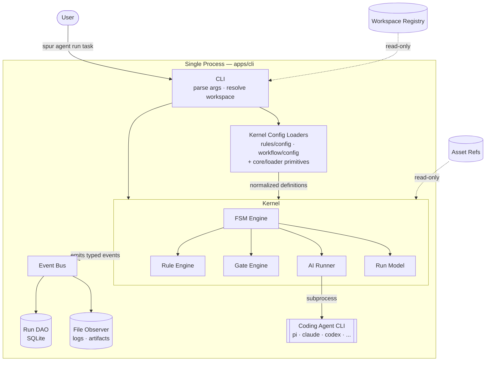

# 03 Architecture — Spur

**Version:** 0.7.0
**Status:** Canonical
**Derived from:** `docs/01_PRD.md` §10
**Last Updated:** 2026-05-19 (v0.7.0)
**Owner:** Robin Min

[TOC]

> This document specifies the **architecture** of Spur — the boundaries between modules, the shape of the domain, and the invariants every implementation must preserve. It deliberately does not specify schemas, file paths, regex patterns, code signatures, or anything that should be free to change without a boundary shift. Such details live in code, the Roadmap, or in [`docs/06_DECISIONS.md`](./06_DECISIONS.md).
>
> When this document conflicts with a decision in [`docs/06_DECISIONS.md`](./06_DECISIONS.md), the decision wins — flag the drift and resolve it explicitly.

## 1. Architecture Goals

| Goal                                   | Architectural Implication                                                |
| -------------------------------------- | ------------------------------------------------------------------------ |
| Local-first, single-machine in Phase 1 | Persistence and execution are co-located; no network in the core loop    |
| Coding-agent agnostic                  | Kernel speaks one abstraction; vendor-specific glue lives behind it      |
| Rules and workflows are configuration  | Engines interpret normalized definitions; code does not encode policy    |
| Events over coupling                   | Modules communicate through a typed event bus; observers persist         |
| Seams before ecosystems                | First-party registry now; external plugins post-Phase 3 — same interface |
| Reversible decisions                   | Every persisted artifact is inspectable, redactable, and re-derivable    |

Non-goals (PRD §10): BYOK, sandboxing, key storage, multi-tenant cloud, desktop/mobile — all deferred to Phase 6+.

## 2. Top-Level Topology

The five product architecture categories from PRD §7 (Kernel, Profiles, Workspaces, Assets, Tooling) are realized as **peer packages**, alongside the typescript-bun-starter packages (`contracts`, `api-types`, `core`) which provide infrastructure primitives Spur layers consume. Per D-027, "Profiles" is a product-architecture category rather than a standalone package: generic loader mechanics live in `@spur/core/loader`, and rule/workflow authoring schemas, loaders, and normalization live with their engines inside `@spur/kernel`.

```text
spur/
├── apps/
│   ├── cli/                       — CLI surface (Phase 1 primary entry)
│   ├── server/                    — HTTP surface (Phase 2 web inspection)
│   └── web/                       — Browser surface (Phase 2+)
├── packages/
│   ├── contracts/                 — Cross-tier DTOs and schemas
│   ├── api-types/                 — Type-only seam: server → web RPC
│   ├── core/                      — Runtime, persistence, event-bus, telemetry, loader (starter-inherited)
│   │   └── src/loader/      [new] — Generic YAML/file/source loading primitives (D-027)
│   ├── kernel/                    — FSM/workflow, rule, gate, AI runner, run model
│   │   ├── src/rules/config/      — Rule/preset/extension authoring schemas + loaders (D-027)
│   │   └── src/workflow/config/   — State-machine + transition-flow authoring schemas + loaders (D-027)
│   ├── workspaces/                — Workspace registry (static binding records)
│   ├── assets/                    — Asset reference and inspection
│   └── tooling/                   — Pure utility libraries
└── drizzle/, scripts/, contracts/ — supporting infrastructure
```

### 2.1 Package Dependency Rules

Allowed direction (left depends on right; the reverse is forbidden):

```text
apps/* ──► kernel,workspaces,assets,tooling,contracts,api-types
                                                      │
kernel ──► tooling ──► core ──► contracts
   │            │
   │            └─► workspaces (read-only registry queries)
   └─► assets (asset references for audit trail)
```

Hard constraints (each enforceable as a rule in the rule engine — §6):

1. `core` never imports `apps/*` or any Spur-specific package.
2. `kernel` never reads YAML or filesystem paths directly — it consumes **normalized definitions** produced by its own config modules (`kernel/src/rules/config`, `kernel/src/workflow/config`), which in turn use the generic loader primitives in `@spur/core/loader`. Kernel evaluation/execution code must not import raw YAML or filesystem APIs.
3. `workspaces` is a registry only — it never executes workflows or runs.
4. `assets` is a reference catalog — it never owns Run state.
5. `tooling` is pure functions — no durable state, no DB writes.
6. `contracts` and `api-types` are type-only at runtime where possible. They own cross-tier DTOs and HTTP/event contracts; engine-specific authoring schemas (rule files, preset files, workflow dialects) live with their engines under `@spur/kernel/*/config`.
7. `apps/web` imports types from `api-types` only — never directly from `apps/server`.
8. `@spur/core` and `@spur/contracts` never import `@spur/kernel`; the standalone `@spur/profiles` package has been retired and must not be reintroduced (D-027).

### 2.2 Why Peer Packages

The PRD's five categories exist at the product level. Collapsing them into subdirectories of a single package hides the boundary inside one compilation unit, where imports drift over time. Five peer packages make every boundary an `import` line — checkable, refusable, and visible in code review.

`packages/core` keeps its starter-inherited scope (runtime, db, event-bus, telemetry, scheduler, job-queue). Spur layers consume `core`; they do not extend it.

## 3. Runtime Architecture

### 3.1 Process Model (Phase 1)

Phase 1 is single-process: the CLI owns the run. The server is dormant; the web tier is deferred to Phase 2.



Phase 2+ adds the server as a separate read-only process for inspection; the kernel and CLI continue to be the writers.

### 3.2 Runtime Selection

`packages/core/src/runtime/` already abstracts node-bun vs cloudflare-workers. Spur layers must use that abstraction — no direct platform imports outside `core`. Phase 1 exercises the node-bun runtime only; Cloudflare Workers compatibility is preserved by going through the runtime factory rather than re-coded per-package.

## 4. Domain Model

### 4.1 Entity Relationships

```text
Workspace 1──* Run 1──* PhaseRun 1──* RunEvent
                │            │
                │            ├──* GateResult
                │            │
                │            └──* Artifact
                │
                ├──* ConstraintFinding
                │
                └──* AssetRef (audit trail)

WorkflowDefinition (file-backed, registered)
WorkflowState (live FSM cursor) ◄── PhaseRun
```

### 4.2 Entity Roles

| Entity                | Role                                                                                               |
| --------------------- | -------------------------------------------------------------------------------------------------- |
| **Workspace**         | Static binding: which repo + workdir is bound to which agents and which workflow, for what purpose |
| **Run**               | One execution of a workflow against a task                                                         |
| **PhaseRun**          | One occupancy episode of a single FSM state within a Run                                           |
| **RunEvent**          | Append-only typed record of something the kernel emitted                                           |
| **GateResult**        | Outcome of a transition predicate evaluation                                                       |
| **Artifact**          | Reference to a captured output file (log, patch, report, generated content)                        |
| **ConstraintFinding** | A rule-engine match linked back to the Run that triggered evaluation                               |
| **AssetRef**          | Audit-trail link from a Run to an asset that influenced it                                         |
| **WorkflowState**     | Live FSM cursor for an active PhaseRun                                                             |

### 4.3 Append-Only Invariant for `RunEvent`

`RunEvent` is **append-only**. Two architectural reasons:

1. **ETL has trivial input.** Phase 2 projections derive from immutable history; reprocessing is safe.
2. **Redaction is enforced once.** Plaintext never reaches the store. Re-derivation cannot re-leak what was never written.

Updates that _look_ like mutations (run finished, phase exited) are emitted as new events. Projections compute the latest state.

### 4.4 Redaction Metadata

Every persisted event carries metadata about what redaction did to it: which rule classes matched and how many matches occurred. Plaintext is never stored, including in the metadata. Concrete schema lives in `@spur/contracts`.

## 5. FSM Workflow Engine

### 5.1 Grammar Concepts

A workflow definition declares:

- A set of **states**, one of which is the initial state and zero or more of which are terminal.
- For each non-terminal state, an ordered list of **actions** to execute on entry.
- For each state, an ordered list of **transitions** to candidate next states.
- Each transition carries an optional **gate predicate** (the condition under which the transition is taken) and an optional **guard** (a meta-condition such as iteration bounds).
- A workflow-level **iteration bound** preventing unbounded loops.

The grammar is deliberately small: states, actions, transitions, gates, guards. No pseudo-states for "evaluate gate" or "increment counter" — those are properties of transitions.

### 5.2 Engine Contract

The FSM engine accepts a normalized workflow definition (already validated, dialect-dispatched, and template-expanded by `kernel/src/workflow/config`) and exposes a single capability: drive an instance to completion against a run context. While driving, the engine emits the events listed in §8. The execution code never reads YAML or filesystem state directly — that boundary belongs to the workflow config module, which uses `@spur/core/loader` primitives to read YAML and resolve source layers (D-027).

The workflow config module is dialect-aware: missing or `state-machine` `kind` produces a `NormalizedStateMachineWorkflow` driven by `StateMachineDriver`; `kind: transition-flow` produces a `NormalizedTransitionFlowWorkflow` driven by `TransitionFlowDriver`. Dialects share authoring primitives (vars, env, action, condition, trigger refs) but have disjoint structural fields; loaders reject cross-dialect fields.

### 5.3 Gates Are Transition Predicates

Per PRD §10/S4, gates are predicates on transitions, not standalone actions. The engine evaluates a gate only when considering whether a transition is permitted. This keeps the FSM small (no gate pseudo-state) and makes the iteration boundary live on a transition guard, not on a state.

### 5.4 Iteration Bounding

Iteration is bounded at the transition level. When a guard such as "iterations remaining" fails, the engine selects the next transition in declaration order — typically a fallback to a terminal failure state. Bounded loops are self-terminating; no action ever needs to consult or increment a counter.

## 6. Rule Engine

### 6.1 Schema Concept

A constraint rule declares an identifier, a severity, a target (the files or paths it applies to), an evaluator method, optional allowlist exceptions, and a remediation message. The rule engine reads only the **normalized** form produced by `kernel/src/rules/config`, which composes presets, resolves extension references, and applies source-layer ordering on top of the generic YAML/file primitives in `@spur/core/loader` (D-027).

### 6.2 Evaluator Set

Evaluators are grouped by backend. Each evaluator type resolves through `EVALUATOR_ALIASES` when multiple names map to the same implementation.

**Primitive backends:**

| Evaluator             | Backend      | Concern                         |
| --------------------- | ------------ | ------------------------------- |
| `rg` / `regex`        | `rg`         | Content pattern matching        |
| `sg`                  | `sg`         | AST pattern matching (ast-grep) |
| `file-exist` / `path` | `rg --files` | File presence/absence           |
| `exit-code`           | shell        | Command exit code               |

**Domain-specific evaluators** (exist because the check cannot be expressed with primitives alone):

| Evaluator          | Backend      | Concern                           |
| ------------------ | ------------ | --------------------------------- |
| `tsdoc-export`     | `sg` + `rg`  | JSDoc on exports                  |
| `test-location`    | `rg --files` | Test file layout                  |
| `coverage-gate`    | lcov file    | Per-file coverage thresholds      |
| `schema-artifact`  | pure JS      | JSON schema structural validation |
| `secrets-scanner`  | `rg`         | Hardcoded secret detection        |
| `forbidden-import` | `rg`         | Forbidden module import/usage     |
| `import-boundary`  | `rg`         | Architectural import boundaries   |

Tree-sitter–backed evaluators land in Phase 2 (Roadmap §2.9) when finer AST queries are needed.

### 6.3 Output

The engine produces a stream of structured findings (rule id, severity, target, evidence, remediation). When invoked by a workflow gate, findings are linked to the Run; when invoked standalone, findings are reported on stdout. Concrete shape lives in `@spur/contracts`.

### 6.4 Host-Driven Registration

Capabilities are registered through `RuleEngineHost`, which owns 4 typed registries: evaluators, fixers, resolvers, and formatters. Each registry is a `CapabilityRegistry<T>` with origin tracking (`builtin` | `extension`) and conflict warnings.

- Built-in capabilities are wired in `host/builtins.ts`, called once from the `RuleEngine` constructor.
- Extensions are loaded from the preset `extensions:` block and registered after built-ins (D-026).
- An extension with the same registry key as a built-in wins, with a warning.
- Extension loading is **disabled by default** and must be explicitly enabled in the profile config (`rules.allowExtensions: true`). Extension path resolution is performed by `kernel/src/rules/config` against the preset/rule source root (D-027).
- Conflict policy: extension overrides built-in (warning), extension overrides extension (warning, latest wins), duplicate built-in throws (bug).

### 6.5 Auto-Fix Authority

Auto-fix uses a three-layer authority model:

1. **Rule YAML** declares `fix.mode`: `none` (default), `suggest`, or `auto`.
2. **Preset overrides** can downgrade via `overrides.<ruleId>.fix.mode`. Promotion is rejected at load time.
3. **CLI** only writes when invoked with `--fix` or `--fix=suggest`.

Fixes are byte-range edits: `{ ruleId, findingId, file, range: [start, end], replacement }`. The engine groups by file, applies non-overlapping edits end-to-start, and defers overlapping edits with a re-run notice.

## 7. AI Runner / Executor

### 7.1 Role

`ai-runner` is the kernel's coding-agent abstraction (PRD §10/S1, lives in `kernel`). It exposes three capabilities:

- **Doctor** — probe each known coding agent for installation, version, authentication, and usability. The output matches the `airunner doctor` table contract from PRD §10.
- **List** — enumerate detected agents and their channels.
- **Run** — execute a single agent invocation against a workdir, capturing stdout/stderr as `Artifact` references rather than returning them inline.

### 7.2 Boundary

`ai-runner` is the only place in the system that knows how to spawn a coding-agent CLI. Vendor-specific behavior (channel resolution, slash-command translation, doctor probing) lives behind this boundary; everything else in the kernel speaks to agents only through it. Authentication is the agent's concern — Spur does not see keys (PRD §10/B2).

### 7.3 Default Agent

Pi is the default when no agent is specified (PRD §10). Selection precedence: invocation flag → workspace binding → profile default (from the project's `.spur/config.yaml`, loaded by the kernel runner-defaults config module) → built-in default (Pi).

## 8. Event Taxonomy

The event bus uses a hierarchical, stable namespace. New events extend the namespace; existing names never change semantics.

```text
run.started            run.completed         run.failed
phase.entered          phase.exited
action.started         action.completed      action.failed
gate.evaluated         transition.taken      iteration.bounded
artifact.created
constraint.evaluated   constraint.finding
asset.referenced
redaction.applied
```

Event payloads are typed and validated. A persistent observer subscribes to the relevant subtrees and writes each event as a `RunEvent` after redaction.

## 9. Redaction & ETL

### 9.1 Pre-Persistence Position

Redaction sits **between the event bus and the store**:

```text
emitter → event bus → observer → redaction → DAO → store
                                     │
                                     └─ writes redaction metadata alongside
```

No event payload reaches durable storage without passing through redaction. This is an architectural invariant, not a configuration: removing redaction would require removing the observer.

### 9.2 Rule Pack as Profile Concern

The set of redaction rules in force is part of the Profile, not the kernel. The kernel treats redaction as a pipeline stage with a pluggable rule pack; the concrete patterns live in `@spur/contracts/redaction-rules` so that Phase 1 pre-persistence and Phase 2 ETL share one source of truth.

### 9.3 ETL Framing

Per PRD §10/S5, redaction is the pre-processing stage of an ETL pipeline. Phase 1 hardcodes that single stage at the persistence boundary. Phase 2 generalizes to a multi-stage ETL workflow:

```text
ingest → pre-process (redact, normalize) → parse → project → store
```

Phase 2 ETL reuses the same FSM engine (§5) — no new orchestration primitive is introduced.

## 10. Workspace Model

Per PRD §10/S2 (Option A), Workspace is a **static binding record**: repo root, workdir, default agent, bound workflow, free-form purpose. It has no mutable lifecycle field. Run owns lifecycle.

Git context (current branch, dirty status, ahead/behind) is computed at read time from the workdir, not stored. The registry never carries stale branch information.

## 11. Profile

`.spur/config.yaml` is the single Profile entry point per project. Profile loading is no longer concentrated in one package; per D-027 it is composed from three concerns:

| Concern                                                                                                                                            | Owner                              |
| -------------------------------------------------------------------------------------------------------------------------------------------------- | ---------------------------------- |
| YAML read/parse, source-path resolution, schema validation adapter, structured loader errors                                                       | `@spur/core/loader`                |
| Rule-engine authoring schemas (rule files, presets, extensions), preset composition, rule source layering, rule normalization                      | `@spur/kernel/src/rules/config`    |
| Workflow-engine authoring schemas (state-machine and transition-flow dialects), workflow source layering, dialect dispatch, workflow normalization | `@spur/kernel/src/workflow/config` |
| Cross-tier DTOs (Run, PhaseRun, RunEvent, ConstraintFinding, redaction metadata, etc.)                                                             | `@spur/contracts`                  |

The CLI resolves `.spur/config.yaml` from the closest ancestor of the working directory, then delegates to the kernel config modules to produce dialect-aware `NormalizedRuleSet` / `NormalizedWorkflow` values. The kernel's execution code (`rules/host`, `workflow/driver`, etc.) consumes only the normalized values — it never reads YAML or filesystem paths directly.

Backward compatibility:

- Existing state-centric workflow YAML continues to load with absent `kind:` treated as `state-machine`.
- The transition-flow dialect (`kind: transition-flow`) has a full runtime driver (`TransitionFlowDriver`) plus a dialect-aware CLI (`spur workflow validate`, `spur workflow plan`, `spur workflow run --trigger`).

`spur init` generates the scaffold; hand-editing afterwards is supported.

## 12. CLI Surface (Phase 1)

Phase 1 ships these capabilities through the CLI:

| Command                     | Capability                                                      | Status                                  |
| --------------------------- | --------------------------------------------------------------- | --------------------------------------- |
| `spur init`                 | Scaffold a project profile                                      | stable                                  |
| `spur agent run <task>`     | Execute a prompt or slash command through a coding agent        | stable (D-028)                          |
| `spur agent list`           | Probe coding-agent installations, authentication, and usability | stable (D-028)                          |
| `spur status [run-id]`      | Current/recent run status                                       | stable                                  |
| `spur inspect <run-id>`     | Run timeline, events, gates, artifacts, findings                | stable                                  |
| `spur rule run`             | Evaluate rules and report findings                              | stable (D-025 reference implementation) |
| `spur rule check`           | Validate rule files or preset without evaluation                | stable                                  |
| `spur rule list`            | List available presets or rules                                 | stable                                  |
| `spur asset inspect <path>` | Show metadata for a referenced asset                            | stable                                  |
| `spur workflow <...>`       | Workflow entity group (validate, plan, run — dialect-aware)     | stable (D-025)                          |
| `spur workspace add/list`   | Workspace registry                                              | undecided (D-025)                       |

Every command supports both human and machine-readable output.

> **Note (D-025/D-028):** The CLI is migrating to an entity-centric command surface. `spur rule` is the reference implementation. Agent execution lives under `spur agent run`; agent health inspection lives under `spur agent list`. Files under `apps/cli/src/commands` are transport wrappers over package-owned services so the server can reuse the same behavior. Utility commands (`init`, `help`) remain stable. `workspace` direction is deferred. The standalone `packages/profiles` direction was resolved by D-027: it has been retired in favor of `@spur/core/loader` plus engine-owned config modules under `@spur/kernel`.

## 13. Storage Layout

The project owns three top-level data locations:

| Location | Purpose                                                                  |
| -------- | ------------------------------------------------------------------------ |
| `.spur/` | Profile config, rule definitions, workflow definitions, asset references |
| `data/`  | SQLite database and run artifacts                                        |
| `logs/`  | Process logs and the event-observer file output                          |

`data/` and `logs/` are gitignored. Concrete file names within these directories are an implementation detail.

## 14. Observability

Observability rides on `core/telemetry` (OpenTelemetry). The architectural commitment is:

- A trace span per Run, with child spans per PhaseRun.
- Metrics for run/phase duration and gate/constraint outcomes.
- Telemetry export is opt-in via Profile; the default is local-only.

Specific span names and metric names live in code.

## 15. Extension Seams

Phase 1 ships first-party-only seams; later phases promote them to plugin-loaded contributions without changing the seam contract.

| Seam                  | Phase 1           | Later                                |
| --------------------- | ----------------- | ------------------------------------ |
| Rule evaluator        | Built-in registry | Plugin-contributed (Phase 4)         |
| Gate type             | Built-in registry | Plugin-contributed (Phase 4)         |
| Workflow action       | Built-in registry | Plugin-contributed (Phase 4)         |
| Asset adapter         | Built-in registry | Plugin-contributed (Phase 4)         |
| Cooperation transport | Not present       | Phase 3 (durable) → Phase 5 (remote) |

The registry interface is stable across phases; first-party and plugin implementations remain interchangeable.

## 16. Architectural Risks

| Risk                                                  | Mitigation                                                                     |
| ----------------------------------------------------- | ------------------------------------------------------------------------------ |
| FSM grammar grows ad hoc as needs surface             | Lock §5 grammar; new constructs require a new decision (see `06_DECISIONS.md`) |
| `kernel` accidentally couples to YAML or filesystem   | Boundary enforced by an `import-boundary` rule on the kernel package           |
| Redaction pack drifts between Phase 1 and Phase 2 ETL | Single source of truth in `@spur/contracts`; consumed by both stages           |
| Workspace registry accretes runtime state             | Type-level: no mutable lifecycle field on Workspace; Run owns lifecycle        |
| ai-runner subprocess leaks stderr secrets             | All stderr passes through redaction before becoming an Artifact                |
| Storage write contention under parallel runs          | Phase 1 single-process; Phase 2 introduces job-queue serialization             |

## 17. Implementation References

Spur is a consolidation project. Most of the architectural pieces in this document have a working precedent somewhere in `~/projects/`, `~/xprojects/`, or in a vendored external project. This section is the **map from architecture sections to existing implementations** — read it when you start work on a section and want to learn from what already exists.

> **Status legend.**
> 🟢 **Reuse** — extract or wrap with minimal changes.
> 🟡 **Adapt** — borrow patterns and selected code; redesign the rest.
> 🔵 **Reference** — read for design lessons; do not reuse code.
> 🔴 **Excluded** — known-bad path; documented to prevent re-discovery.

### 17.1 Internal Projects

| Project                | Path                                | Stance              | Why It Matters                                                                                                                                                                                                                           |
| ---------------------- | ----------------------------------- | ------------------- | ---------------------------------------------------------------------------------------------------------------------------------------------------------------------------------------------------------------------------------------- |
| typescript-bun-starter | `~/projects/typescript-bun-starter` | 🟢 Reuse            | Foundation already merged into Spur: monorepo layout, `core` infrastructure (runtime, db, event-bus, telemetry, scheduler, job-queue), `bun run check` gate. Spur's `packages/{contracts,api-types,core}` come from here.                |
| cc-agents              | `~/projects/cc-agents`              | 🟢🟡 Mixed          | Source of `airunner` (🟢 reuse — D-004) and rd3 plugin assets (🟡 adapt — see §17.2). Skills, slash commands, subagents, hooks live under `plugins/rd3/`.                                                                                |
| cc-bridge              | `~/projects/cc-bridge`              | 🔵 Reference        | POC for execution, channels, sessions, memory, scheduling, permissions. Read its reverse-engineering review for design ideas; do not extract code.                                                                                       |
| magnifier              | `~/xprojects/magnifier`             | 🟡 Adapt (Phase 2+) | Local-first analytics, per-platform ETL, raw-events + projections. The mature ETL-pipeline patterns inform Phase 2's redaction-and-projection FSM (D-012). Higher-level "intelligence" features remain experimental — adapt selectively. |

### 17.2 cc-agents Sub-Components

| Component                           | Path                                                              | Stance                  | Maps To                                                                                                                                                                                                                  |
| ----------------------------------- | ----------------------------------------------------------------- | ----------------------- | ------------------------------------------------------------------------------------------------------------------------------------------------------------------------------------------------------------------------ |
| airunner script                     | `~/projects/cc-agents/scripts/airunner.ts`                        | 🟢 Reuse (Phase 1 wrap) | §7 AI Runner / Executor — wrapped via subprocess (D-004); extracted into typed library in Phase 2                                                                                                                        |
| airunner library                    | `~/projects/cc-agents/scripts/lib/ai-runner.ts`                   | 🟢 Reuse (Phase 1 wrap) | §7 — installed-agent detection, doctor, channel resolution, slash-command translation                                                                                                                                    |
| rd3 skills/commands/subagents       | `~/projects/cc-agents/plugins/rd3/{skills,commands,agents,hooks}` | 🟡 Adapt                | §15 Extension Seams — first-party registry seeds; `/rd3:dev-*` task lifecycle is the template Spur consumes rather than rebuilds                                                                                         |
| rd3 quick-grep skill                | `~/projects/cc-agents/plugins/rd3/skills/quick-grep`              | 🔵 Direction reference  | §6 Rule Engine — incomplete; consult `SKILL.md` and `examples/` for `rg`/`sg` invocation shape, but do not extract code                                                                                                  |
| rd3 orchestration-v2 skill          | `~/projects/cc-agents/plugins/rd3/skills/orchestration-v2`        | 🔵 Direction reference  | §5 FSM Workflow Engine — DAG-based pipeline with FSM lifecycle, event-sourced SQLite state, gates, resume, CLI runner. Closest precedent for D-006 + D-013; not mature, no code reuse (D-015 keeps v1/v2 reference-only) |
| rd3 reverse-engineering doc         | `~/projects/cc-agents/docs/reverse-engineering-rd3.md`            | 🔵 Reference            | Skill/command/subagent taxonomy; task lifecycle; feature-tree foundation                                                                                                                                                 |
| oh-my-agent reverse-engineering doc | `~/projects/cc-agents/docs/reverse-engineering-oma.md`            | 🔵 Reference            | §15 — SSOT asset model, vendor adaptation, install/doctor workflow                                                                                                                                                       |
| rd3 orchestration v1/v2             | (under rd3 plugin)                                                | 🔴 Excluded             | D-015 — design lessons fed into D-006; no code reuse                                                                                                                                                                     |

### 17.3 cc-bridge Sub-Components

| Component                     | Path                                                      | Stance       | Maps To                                                                          |
| ----------------------------- | --------------------------------------------------------- | ------------ | -------------------------------------------------------------------------------- |
| cc-bridge reverse-engineering | `~/projects/cc-bridge/docs/reverse-engineering-review.md` | 🔵 Reference | §3 Process Model — channels, sessions, gateway concepts                          |
| paseo review                  | `~/projects/cc-bridge/docs/paseo-review.md`               | 🔵 Reference | §5 FSM Engine — loop execution, normalized agent timelines, cooperation patterns |
| paseo vendor                  | `~/projects/cc-bridge/vendors/paseo`                      | 🔵 Reference | §3, §5 — same as above; read source for orchestration ideas                      |
| ACP / acpx                    | (under cc-bridge)                                         | 🔴 Excluded  | D-015 — performance and stability issues                                         |

### 17.4 External Projects (Vendored)

| Project                  | Path                                                              | Stance       | Maps To                                                                       |
| ------------------------ | ----------------------------------------------------------------- | ------------ | ----------------------------------------------------------------------------- |
| pi-mono                  | `~/projects/cc-agents/vendors/pi-mono`                            | 🔵 Reference | §7 AI Runner — Pi internals; useful when implementing the ai-runner ↔ Pi edge |
| flue                     | `~/projects/cc-agents/vendors/flue`                               | 🔵 Reference | §3, §10 — sessions, sandbox boundaries, structured results                    |
| flue reverse-engineering | `~/projects/cc-agents/vendors/flue/reverse-engineering-report.md` | 🔵 Reference | Companion doc for flue                                                        |
| oh-my-agent              | https://github.com/first-fluke/oh-my-agent                        | 🔵 Reference | §15 Extension Seams — asset model and vendor adaptation patterns              |

### 17.5 Architecture Documents Worth Reading First

| Document                                 | Path                                                              | Read Before Implementing             |
| ---------------------------------------- | ----------------------------------------------------------------- | ------------------------------------ |
| typescript-bun-starter architecture spec | `~/projects/typescript-bun-starter/docs/01_ARCHITECTURE_SPEC.md`  | §2 Topology, §3 Runtime, §13 Storage |
| magnifier architecture spec              | `~/xprojects/magnifier/docs/01_ARCHITECTURE_SPEC.md`              | §9 Redaction & ETL (Phase 2 framing) |
| rd3 reverse-engineering                  | `~/projects/cc-agents/docs/reverse-engineering-rd3.md`            | §6 Rule Engine, §15 Extension Seams  |
| cc-bridge reverse-engineering            | `~/projects/cc-bridge/docs/reverse-engineering-review.md`         | §3 Process Model                     |
| paseo review                             | `~/projects/cc-bridge/docs/paseo-review.md`                       | §5 FSM Engine                        |
| flue reverse-engineering                 | `~/projects/cc-agents/vendors/flue/reverse-engineering-report.md` | §10 Workspace Model                  |
| oh-my-agent reverse-engineering          | `~/projects/cc-agents/docs/reverse-engineering-oma.md`            | §15 Extension Seams                  |

### 17.6 In-Repo Precedent

| Component                  | Path                                                   | Stance                 | Maps To                                                                                                                                  |
| -------------------------- | ------------------------------------------------------ | ---------------------- | ---------------------------------------------------------------------------------------------------------------------------------------- |
| policy-check script        | `~/xprojects/spur/scripts/policy-check.ts`             | 🔵 Direction reference | §6 Rule Engine — incomplete; useful for the `PolicyRule` / `MatchSpec` shape and the `rg` / `sg` engine split, but not extractable as-is |
| Bun + Drizzle DAO patterns | `~/xprojects/spur/packages/core/src/db/`               | 🟢 Reuse               | §4 Domain Model — Spur entities use these DAO conventions                                                                                |
| Event bus                  | `~/xprojects/spur/packages/core/src/event-bus/`        | 🟢 Reuse               | §8 Event Taxonomy                                                                                                                        |
| Process executor           | `~/xprojects/spur/packages/core/src/process-executor/` | 🟢 Reuse               | §7 AI Runner — subprocess wrapping for the Phase 1 ai-runner                                                                             |

### 17.7 Consolidation Stance

- **Reuse over rewrite** when a piece is mature, has a clear contract, and lives behind a stable boundary (typescript-bun-starter `core`, airunner).
- **Adapt** when the patterns are sound but the implementation would not survive Spur's boundary rules (rd3 skills, magnifier ETL, policy-check).
- **Reference only** when the project is a POC, has known issues, or its concerns differ from Spur's (cc-bridge, paseo, flue, pi-mono internals).
- **Exclude with prejudice** when reuse has already been ruled out (ACP/acpx, rd3 orchestration v1/v2 — see D-015).

**Section-specific notes.**

- **§5 FSM Workflow Engine.** `~/projects/cc-agents/plugins/rd3/skills/orchestration-v2` is the closest precedent: DAG-based phases under FSM supervision, event-sourced SQLite state, transition gates, resume from last successful phase, CLI-first runner. Not mature, and D-015 forbids direct code reuse — but read its `engine/`, `state/`, and `verification/` subdirectories for design lessons that informed D-006 (FSM engine), D-007 (gates as predicates), and D-013 (append-only event store). If a cleaner precedent surfaces during Phase 1 implementation, prefer it.

- **§6 Rule Engine.** Read both `~/projects/cc-agents/plugins/rd3/skills/quick-grep/` and `~/xprojects/spur/scripts/policy-check.ts` together. Neither is complete; both are direction references. quick-grep contributes the skill-level intent and `rg`/`sg` invocation patterns; `policy-check.ts` contributes the rule-shape sketch (`PolicyRule`, `MatchSpec`, engine split). The rule engine consolidates these into one boundary-respecting implementation rather than continuing either as a parallel artifact.

When this section references a decision, the canonical record is in `docs/06_DECISIONS.md`. This document describes architecture boundaries; decisions recorded there are definitive.

## 18. Decisions

All architecture decisions are recorded in **[`docs/06_DECISIONS.md`](./06_DECISIONS.md)** — the single source of truth. New decisions are appended there as `D-NNN` entries.

**Canonical form:** Each decision carries Context, Decision, Consequences, and Alternatives Considered.

**Mapping to old ADRs:** The original `ADR-001` through `ADR-014` (formerly in this section) have been migrated to `D-002` through `D-015` in `docs/06_DECISIONS.md`. All references to `ADR-NNN` in this document have been updated to `D-NNN` accordingly.

---

## 19. Changelog

| Version | Date       | Change                                                                                                                                                                                                                                                                                                                                                                                                                                              |
| ------- | ---------- | --------------------------------------------------------------------------------------------------------------------------------------------------------------------------------------------------------------------------------------------------------------------------------------------------------------------------------------------------------------------------------------------------------------------------------------------------- |
| 0.7.0   | 2026-05-18 | §5.2 updated: TransitionFlowDriver no longer "future" — delivered in tasks 0120–0122. §11 updated: transition-flow runtime driver status now complete with dialect-aware CLI. §12 updated: `spur workflow` status changed from transitional to stable with validate/plan/run subcommands and dialect grouping. Workflow README fully documents both dialects with examples, public API, persistence differences, and event differences (task 0123). |
| 0.6.0   | 2026-05-17 | §2 package map updated for D-027: `packages/profiles` retired; generic loaders move to `@spur/core/loader`; rule/workflow authoring schemas and loaders move to `@spur/kernel/src/{rules,workflow}/config`. §3.1 diagram, §5.2, §6.1, §6.4, §7.3, §11, §12 updated to point at the new owners. §11 documents the dialect-aware workflow config (state-machine + transition-flow) introduced for Task 0116.                                          |
| 0.5.0   | 2026-05-15 | §6 updated: split evaluator table into primitive/domain-specific, added §6.5 auto-fix authority, expanded §6.4 host-driven registration with extension system (D-026). §12 CLI surface updated with entity-centric migration status (D-025).                                                                                                                                                                                                        |
| 0.4.0   | 2026-05-11 | Migrated all ADRs to [`docs/06_DECISIONS.md`](./06_DECISIONS.md). §18 reduced to pointer. All `ADR-NNN` → `D-NNN` references updated.                                                                                                                                                                                                                                                                                                               |
| 0.3.3   | 2026-05-08 | Renamed `spur constraints` to `spur check` in §12 CLI surface.                                                                                                                                                                                                                                                                                                                                                                                      |
| 0.3.4   | 2026-05-13 | Renamed `spur check` to `spur rule run` as part of entity-centric CLI migration. Design doc updated in lockstep.                                                                                                                                                                                                                                                                                                                                    |
| 0.3.2   | 2026-05-08 | Added rd3 orchestration-v2 as 🔵 direction reference for §5 FSM Workflow Engine (DAG + FSM lifecycle + event-sourced state). Added matching §17.7 section-specific note. Reconciled D-015 to name orchestration-v2 as the prime design reference for §5 while preserving the no-code-reuse exclusion.                                                                                                                                               |
| 0.3.1   | 2026-05-08 | Reclassified rd3 quick-grep and `scripts/policy-check.ts` as 🔵 direction references (both incomplete, neither extractable). Added §17.7 section-specific note pairing them as joint references for §6 Rule Engine.                                                                                                                                                                                                                                 |
| 0.3.0   | 2026-05-08 | Added §17 Implementation References mapping internal/external projects to architecture sections. ADRs renumbered to §18; Changelog renumbered to §19.                                                                                                                                                                                                                                                                                               |
| 0.2.0   | 2026-05-08 | Removed implementation-level details (concrete schemas, regex patterns, code signatures, file enumerations, build order). Added Mermaid for §3.1 process model. Added ADR section with 14 seed entries.                                                                                                                                                                                                                                             |
| 0.1.0   | 2026-05-08 | Initial architecture draft, derived from PRD v0.7.0 / Roadmap v0.7.0                                                                                                                                                                                                                                                                                                                                                                                |
