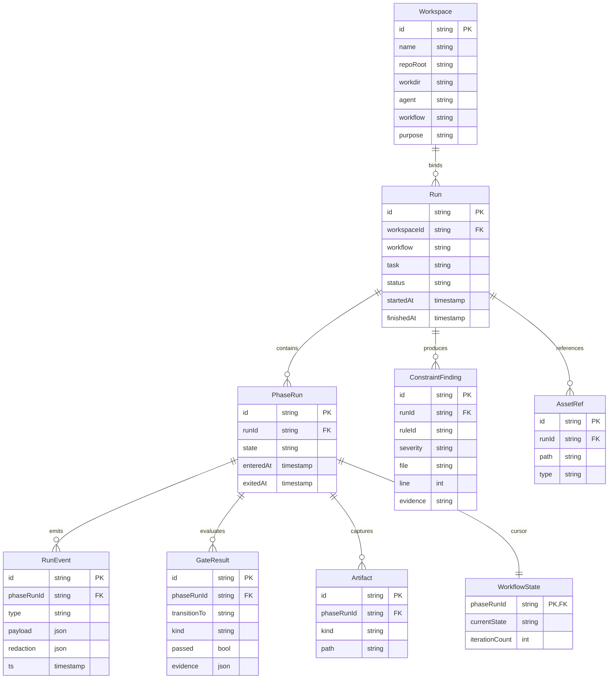

# 04 Design — Spur

**Version:** 0.1.0
**Status:** Draft
**Derived from:** `docs/01_PRD.md` v0.7.0, `docs/02_ROADMAP.md` v0.8.1, `docs/03_ARCHITECTURE.md` v0.5.0
**Last Updated:** 2026-05-15
**Owner:** Robin Min

> This document specifies the **external and shared design surface** of Spur — everything a user, integrator, or downstream package sees that is _not_ tied to a single feature. Feature-internal design lives in code and in feature-scoped notes.
>
> Scope:
>
> 1. Full CLI surface (every command, every flag, every output mode).
> 2. External YAML configuration schemas (`.spur/config.yaml`, rule files, workflow files, redaction rules).
> 3. External environment variable dependencies.
> 4. Simplified ER diagram (key entities only).
> 5. Common / shared library design (`@spur/contracts`, `@spur/api-types`, `@spur/tooling`, `@spur/core`).
>
> Out of scope: feature-internal class diagrams, internal package APIs (`@spur/kernel` including its `rules/config` and `workflow/config` subpaths, `@spur/workspaces`, `@spur/assets`, `@spur/core/loader`), build/release pipeline.
>
> When this document conflicts with a decision in [`docs/06_DECISIONS.md`](./06_DECISIONS.md), the decision wins — flag the drift and resolve it explicitly.

---

## 1. Conventions

### 1.1 Schema Notation

| Notation         | Meaning                           |
| ---------------- | --------------------------------- |
| `field: type`    | Required field                    |
| `field?: type`   | Optional field                    |
| `string \| null` | Union type                        |
| `<placeholder>`  | Replace with concrete value       |
| `…`              | Repeats per element               |
| `# comment`      | Inline doc; not part of the value |

Schemas in this doc are **conceptual**. The runtime source of truth is Zod schemas in `@spur/contracts`. When this doc and the Zod schema disagree, the schema wins; this doc is updated in the same commit.

### 1.2 CLI Conventions

- **Two output modes per command:** human-readable (default) and machine-readable (`--json`).
- **Exit codes:** `0` success, `1` user error or expected failure (e.g. constraint violations, gate failure), `2` system error (config invalid, DB unreachable).
- **Common flags** (every command):
  - `--workdir <path>` — override the working directory used to resolve `.spur/` and the bound workspace. Default: `process.cwd()`.
  - `--profile <path>` — override the profile path. Default: `<workdir>/.spur/config.yaml`.
  - `--log-level trace|debug|info|warning|error|fatal` — override `logging.level`.
  - `--json` — emit machine-readable output (NDJSON for streamable commands, JSON document otherwise).
  - `-h, --help` — context-sensitive help.
  - `-V, --version` — print version, runtime, build hash.
- **Color** is auto-detected (TTY + `NO_COLOR` respected). No flag.
- **Subcommands** use a verb-then-noun pattern only when grouping is needed (e.g. `workspace add`). Single-noun commands stay flat (`spur run`, `spur doctor`).

---

## 2. CLI Surface

### 2.1 Command Index

| Command                            | Phase | Purpose                                               | Status                              |
| ---------------------------------- | ----- | ----------------------------------------------------- | ----------------------------------- |
| `spur init`                        | 1     | Scaffold `.spur/` for the current project             | stable                              |
| `spur doctor`                      | 1     | Probe coding-agent installations                      | stable                              |
| `spur run <task>`                  | 1     | Execute one workflow Run end-to-end                   | transitional → `spur agent` (D-025) |
| `spur agent <...>`                 | 1     | Agent entity group (replaces `spur run`)              | upcoming (D-025)                    |
| `spur status [run-id]`             | 1     | Show current or last Run status                       | stable                              |
| `spur inspect <run-id>`            | 1     | Show Run timeline, events, gates, artifacts, findings | stable                              |
| `spur rule run`                    | 1     | Evaluate rules and report findings                    | stable (D-025 reference)            |
| `spur rule check`                  | 1     | Validate rule files or preset without evaluation      | stable                              |
| `spur rule list`                   | 1     | List available presets or rules                       | stable                              |
| `spur asset inspect <path>`        | 1     | Show metadata for a referenced asset                  | stable                              |
| `spur workflow <...>`              | 1     | Workflow entity group                                 | transitional (D-025)                |
| `spur workspace add <repo-root> …` | 1     | Register a workspace                                  | undecided (D-025)                   |
| `spur workspace list`              | 1     | List registered workspaces                            | undecided (D-025)                   |

Phase 2+ commands (server, web inspection, ETL) are out of scope for this section.

> **Note (D-025):** The CLI is migrating to an entity-centric command surface. `spur rule` is the reference implementation for entity groups. `spur run` will become `spur agent`. `spur workflow` will be re-implemented following the same pattern. Utility commands (`init`, `doctor`, `help`) remain stable.

### 2.2 `spur init`

Scaffolds `.spur/` for the current project with default profile, empty rule directory, empty workflow directory, and an empty SQLite DB at the configured `data/` path.

```text
spur init [--workdir <path>] [--force] [--minimal]
```

| Flag        | Purpose                                              | Default |
| ----------- | ---------------------------------------------------- | ------- |
| `--force`   | Overwrite existing `.spur/` if present               | off     |
| `--minimal` | Skip example rules and workflows; create config only | off     |

**Outputs (human):** A summary of files written.
**Outputs (`--json`):** `{ "created": ["<path>", ...], "skipped": ["<path>", ...] }`.
**Failure modes:** existing `.spur/` without `--force` (exit 1).

### 2.3 `spur doctor`

Per-agent self-report (`installed / version / authenticated / usable`). Spur never reads credentials — it asks each agent's own CLI (PRD §10/B2, D-002).

```text
spur doctor [--agent <name>] [--json]
```

| Flag             | Purpose                                                                        | Default   |
| ---------------- | ------------------------------------------------------------------------------ | --------- |
| `--agent <name>` | Probe one agent (`pi`, `claude`, `codex`, `gemini`, `antigravity`, `opencode`) | all known |

**Outputs (human):** Aligned table matching the PRD §10/B3 contract.
**Outputs (`--json`):** Array of `{ agent, installed: bool, version: string\|null, authenticated: bool, usable: bool, channels: string[], error: string\|null }`.
**Exit code:** `0` if all probed agents are `usable`; `1` otherwise.

### 2.4 `spur run <task>`

Executes one Run of the bound workspace's workflow against the supplied task description.

```text
spur run <task>
  [--agent <name>]
  [--workflow <name>]
  [--max-iterations <n>]
  [--dry-run]
  [--json]
```

| Flag               | Purpose                                                        | Default                                          |
| ------------------ | -------------------------------------------------------------- | ------------------------------------------------ |
| `--agent`          | Override workspace's bound agent                               | workspace binding → profile default → Pi (D-003) |
| `--workflow`       | Override workspace's bound workflow                            | workspace binding → profile default              |
| `--max-iterations` | Override the workflow's iteration bound                        | workflow definition's `iterationBound`           |
| `--dry-run`        | Validate profile, rules, workflow, and binding; do not execute | off                                              |

**Outputs (human):** Live status updates per phase entry/exit, gate result, transition. Final summary with run-id.
**Outputs (`--json`):** NDJSON event stream, terminated by `{ "type": "run.completed", ... }` or `{ "type": "run.failed", ... }`.
**Exit code:** `0` if Run reaches a non-failure terminal state; `1` if Run reaches a failure terminal state; `2` for system errors.

### 2.5 `spur status`

```text
spur status [run-id] [--json]
```

Without `run-id`: show the most recent Run for the current workspace.
With `run-id`: show that Run.

**Outputs (human):** One-line summary + current/last phase.
**Outputs (`--json`):** `{ runId, workspaceId, status, currentPhase, startedAt, finishedAt }`.

### 2.6 `spur inspect <run-id>`

```text
spur inspect <run-id>
  [--events] [--gates] [--artifacts] [--findings]
  [--since <iso8601>] [--limit <n>]
  [--json]
```

| Flag          | Purpose                                        | Default |
| ------------- | ---------------------------------------------- | ------- |
| `--events`    | Include event timeline                         | on      |
| `--gates`     | Include gate results                           | on      |
| `--artifacts` | Include artifact references                    | on      |
| `--findings`  | Include constraint findings linked to this Run | on      |
| `--since`     | Filter events by timestamp                     | none    |
| `--limit`     | Cap events returned                            | 1000    |

Each `--<section>` flag, when _any_ are passed explicitly, narrows output to those sections only.

**Outputs (`--json`):** `{ run, phases, events, gates, artifacts, findings }` shaped per `@spur/contracts`.

### 2.7 `spur rule run`

Evaluates the project's rule set without launching a Run. Useful as a pre-commit hook or CI check.

```text
spur rule run
  [--preset <name>]
  [--rules <path>]
  [--rule <id>]
  [--target <glob>]
  [--severity error|warning|info]
  [--fail-on error|warning|info|never]
  [--fix | --fix=suggest]
  [--dry-run]
  [--json]
```

| Flag            | Purpose                                      | Default                 |
| --------------- | -------------------------------------------- | ----------------------- |
| `--preset`      | Use a named preset instead of rule discovery | —                       |
| `--rules`       | Load rules from an explicit directory/path   | `.spur/rules`           |
| `--rule`        | Run only the named rule(s) — repeatable      | all rules in profile    |
| `--target`      | Override target globs — repeatable           | rule's declared targets |
| `--severity`    | Minimum severity to report                   | `info`                  |
| `--fail-on`     | Severity that causes non-zero exit           | `error`                 |
| `--fix`         | Apply auto-mode fixes                        | —                       |
| `--fix=suggest` | Apply auto + suggest fixes                   | —                       |
| `--dry-run`     | Print unified diff without writing           | —                       |
| `--json`        | Machine-readable output                      | false                   |
| `--fail-on`     | Minimum severity that exits non-zero         | `error`                 |

**Outputs (human):** Findings grouped by severity; summary footer.
**Outputs (`--json`):** `{ findings: [{ ruleId, severity, file, line, evidence, remediation }], summary: { errors, warnings, infos } }`.
**Exit code:** `0` if no findings at or above `--fail-on` severity; `1` otherwise.

### 2.8 `spur asset inspect <path>`

```text
spur asset inspect <path> [--json]
```

Reads asset metadata (manifest, type, dependencies if declared). The asset can be a path inside the workspace or a registered asset reference.

**Outputs (`--json`):** `{ path, type, manifest, references: { runs: [run-id, ...] } }`.

### 2.9 `spur workspace add`

```text
spur workspace add <repo-root>
  [--workdir <path>]
  [--agent <name>]
  [--workflow <name>]
  [--purpose <text>]
  [--name <slug>]
  [--json]
```

Registers a Workspace as a static binding record (D-009). All flags except `<repo-root>` are optional and may be left to profile defaults.

**Failure modes:** `<repo-root>` is not a Git repo (warning, not error — a workspace can predate `git init`); duplicate `--name` (exit 1).

### 2.10 `spur workspace list`

```text
spur workspace list [--json]
```

Lists registered workspaces with **read-time** Git context (current branch, dirty status, ahead/behind). Stale Workspaces (workdir missing) are flagged but kept in the registry.

**Outputs (`--json`):** Array of `{ id, name, repoRoot, workdir, agent, workflow, purpose, git: { branch, dirty, ahead, behind } | null }`.

---

## 3. External Configuration — YAML Schemas

Spur's external configuration lives in two places:

1. **Project profile** under `.spur/` in each project (the only thing `spur` reads at runtime besides the DB and CLI args).
2. **Server runtime config** at `<repo-root>/config/config.yaml` for the `apps/server` HTTP tier (Phase 2+) — inherited from typescript-bun-starter and out of scope here.

This section specifies the **project profile** schemas only.

### 3.1 `.spur/config.yaml` — Profile Root

The closest-ancestor `.spur/config.yaml` to the working directory is the active profile.

```yaml
# .spur/config.yaml
version: 1 # schema major version; 1 covers Phase 1

project:
  name: <slug> # project identity — used in telemetry and run names
  purpose?: <text> # free-form purpose, surfaced in inspect output

defaults:
  agent?: <name> # default coding agent: pi | claude | codex | gemini | …
  workflow?: <name> # default workflow name (see §3.3)
  iterationBound?: <int> # workflow-wide iteration bound default
  maxRunDurationSeconds?: <int> # safety cap for any single Run

storage:
  dataDir?: <path> # default: data/
  logsDir?: <path> # default: logs/
  artifactsDir?: <path> # default: data/artifacts/

rules:
  enabled: <bool> # default: true
  paths: # rule files / dirs; globs allowed
    - .spur/rules/*.yaml
  failOn?: error|warning|info|never # severity that fails CLI rule run and gate evaluations

workflows:
  paths: # workflow files / dirs
    - .spur/workflows/*.yaml

redaction:
  enabled: <bool> # default: true
  rulePack?: builtin # only "builtin" in Phase 1; future: named packs
  overrides?: # project-level additions to the builtin pack
    - id: <slug>
      pattern: <regex>
      replacement?: <string> # default: "[REDACTED:<id>]"
  passthrough?: # plaintext-allowed paths (USE WITH CARE)
    - <glob>

telemetry:
  enabled: <bool> # default: false (local-only)
  exporter?:
    endpoint?: <url> # OTLP endpoint
    headers?:
      <key>: ${ENV_VAR} # env interpolation only — never inline secrets
  serviceName?: <slug> # default: project.name
```

**Schema invariants:**

- `version` must be present; mismatched majors are a hard error.
- `project.name` is required; everything else has a default.
- Any `${ENV_VAR}` token must resolve at load time; missing env var is a hard error unless the field is optional and unset.
- Unknown top-level keys are a hard error in `--strict` mode (`spur init` writes a strict profile); known top-level keys with unknown sub-keys produce a warning and are dropped.
- The profile loader is the **only** YAML reader for the project profile. Per D-027, profile loading is composed: `@spur/core/loader` provides generic YAML/source-loading primitives; `@spur/kernel/src/rules/config` and `@spur/kernel/src/workflow/config` own rule and workflow authoring schemas, source layering, and normalization. Kernel evaluation/execution code consumes only the resulting normalized values (Architecture §11).

### 3.2 `.spur/rules/*.yaml` — Rule Files

Each rule file declares one or more constraint rules. Files are loaded in lexicographic order; later files override earlier ones for the same `id`.

```yaml
# .spur/rules/<topic>.yaml
version: 1

rules:
  - id: <slug> # globally unique within the project
    description: <text>
    severity: error|warning|info # default: warning
    targets: # globs — at least one required
      - <glob>
    evaluator: <evaluator-name> # see §3.2.1
    options?: # evaluator-specific options
      <key>: <value>
    allowlist?: # exceptions — file paths or globs
      - <glob>
    remediation?: <text> # human-facing fix hint
    enabled?: <bool> # default: true; useful for staging new rules
```

#### 3.2.1 Phase 1 Evaluator Catalog

Per D-011, Phase 1 evaluators use `rg` and `sg` only.

**Primitive backends:**

| Evaluator             | Purpose                                    | Required `options`       | Optional `options`                   |
| --------------------- | ------------------------------------------ | ------------------------ | ------------------------------------ |
| `rg` / `regex`        | Content pattern match (powered by ripgrep) | `pattern: <regex>`       | `flags?: string`, `multiline?: bool` |
| `sg`                  | AST pattern match (powered by ast-grep)    | `pattern: <ast-pattern>` | `language?: string`                  |
| `file-exist` / `path` | File presence/absence                      | `must: present\|absent`  | —                                    |
| `exit-code`           | Shell command exit code                    | `command: <string>`      | —                                    |

**Domain-specific evaluators** (exist because the check cannot be expressed with primitives alone):

| Evaluator          | Purpose                           | Required `options`                                 | Optional `options`                               |
| ------------------ | --------------------------------- | -------------------------------------------------- | ------------------------------------------------ |
| `tsdoc-export`     | Exported symbols missing TSDoc    | —                                                  | `kinds?: (function\|class\|type\|const\|enum)[]` |
| `test-location`    | Tests reside in prescribed layout | `expected: <glob>`                                 | `forbid?: <glob>[]`, `resolver?: string`         |
| `coverage-gate`    | Per-file coverage thresholds      | `threshold: <number>`                              | `lcovPath?: <path>`                              |
| `schema-artifact`  | JSON schema structural validation | `schemaPath: <path>`                               | —                                                |
| `secrets-scanner`  | Hardcoded secret detection        | —                                                  | `entropyThreshold?: number`                      |
| `forbidden-import` | Forbidden module import/usage     | `forbid: <package-glob>[]`                         | `allow?: <package-glob>[]`                       |
| `import-boundary`  | Architectural import boundaries   | `from: <package-glob>`, `forbid: <package-glob>[]` | `allow?: <package-glob>[]`                       |

**Per-evaluator notes:**

- `regex.pattern` is interpreted by `rg` — full Rust regex syntax. Use `(?i)` for case-insensitive instead of a `flags` option to reduce ambiguity.
- `import-boundary.from` and `forbid` are **package globs**, not file globs (e.g. `@spur/kernel` matches the whole package; `@spur/*` matches any package).
- `tsdoc-export.kinds` defaults to all five kinds.
- `test-location.expected` describes where tests _must_ live; `forbid` describes where they _must not_. Both can be combined.

**Example (boundary rule):**

```yaml
# .spur/rules/boundaries.yaml
version: 1
rules:
  - id: kernel-no-yaml
    description: kernel must not import yaml or read filesystem paths directly
    severity: error
    targets:
      - "packages/kernel/src/**/*.ts"
    evaluator: import-boundary
    options:
      from: "@spur/kernel"
      forbid:
        - "yaml"
        - "js-yaml"
        - "node:fs"
    remediation: |
      Move YAML/FS access into @spur/core/loader or the relevant
      kernel config module (@spur/kernel/src/rules/config or
      @spur/kernel/src/workflow/config). Kernel evaluation/execution
      code consumes the normalized values produced there (D-027).
```

### 3.3 `.spur/workflows/*.yaml` — Workflow Files

Each workflow file declares one workflow. The filename (without extension) is the workflow's name unless `name` is set explicitly.

```yaml
# .spur/workflows/<name>.yaml
version: 1
name?: <slug> # default: filename
description?: <text>

iterationBound: <int> # required at workflow level (D-006, §5.4)

initial: <state-id> # must reference a declared state
terminal: # zero or more terminal states
  - <state-id>

states:
  - id: <state-id>
    description?: <text>
    actions: # ordered; entry actions
      - kind: <action-kind> # see §3.3.1
        options?:
          <key>: <value>
    transitions: # ordered; engine takes the first whose gate passes
      - to: <state-id>
        gate?: # transition predicate (D-007); omitted = always taken
          kind: <gate-kind> # see §3.3.2
          options?:
            <key>: <value>
        guard?: # meta-condition; e.g. iteration cap
          kind: <guard-kind> # see §3.3.3
          options?:
            <key>: <value>
        description?: <text> # surfaced in `spur inspect` for transition labels
```

**Schema invariants:**

- Every `to:` references a declared state.
- The `initial` state is not in `terminal`.
- Every non-terminal state has at least one transition.
- A transition with no `gate` is unconditional and must be the **last** transition in its state's list (or the only one).
- Iteration is bounded at `iterationBound` (workflow-wide); transition guards may impose tighter bounds.

#### 3.3.1 Phase 1 Action Catalog

| Kind        | Purpose                                                                 | Required `options`              |
| ----------- | ----------------------------------------------------------------------- | ------------------------------- |
| `agent.run` | Invoke the bound coding agent with a prompt template                    | `prompt: <text>`                |
| `shell`     | Run a shell command in the workdir; captures stdout/stderr as artifacts | `command: <string>`             |
| `check`     | Run the rule engine inline; findings flow into the Run                  | `failOn?: error\|warning\|info` |
| `note`      | Emit a `note` event with a static message                               | `message: <text>`               |

#### 3.3.2 Phase 1 Gate Catalog

Gates are transition predicates (D-007).

| Kind            | Purpose                              | Required `options`                       |
| --------------- | ------------------------------------ | ---------------------------------------- |
| `command`       | Shell command exit code (`0` = pass) | `command: <string>`                      |
| `file-exists`   | A path exists in the workdir         | `path: <glob>`                           |
| `content-match` | A file contains a regex match        | `path: <glob>`, `pattern: <regex>`       |
| `compound`      | Combine multiple gates               | `mode: all\|any`, `gates: [<gate>, ...]` |

#### 3.3.3 Phase 1 Guard Catalog

| Kind        | Purpose                                                                            | Required `options` |
| ----------- | ---------------------------------------------------------------------------------- | ------------------ |
| `iteration` | True while the transition has been taken fewer than `max` times in the current Run | `max: <int>`       |
| `time`      | True while the Run's elapsed time is under `seconds`                               | `seconds: <int>`   |

**Example (the canonical `implement → check → fix-until-pass` workflow):**

```yaml
# .spur/workflows/basic.yaml
version: 1
name: basic
description: Minimal harness loop — implement, check, fix until pass or iterations exhausted.
iterationBound: 2
initial: implement
terminal:
  - done
  - failed

states:
  - id: implement
    actions:
      - kind: agent.run
        options:
          prompt: "Implement task: ${task}"
    transitions:
      - to: check

  - id: check
    actions:
      - kind: check
        options:
          failOn: error
    transitions:
      - to: done
        gate:
          kind: command
          options:
            command: "bun run check"
      - to: fix
        guard:
          kind: iteration
          options:
            max: 2
      - to: failed

  - id: fix
    actions:
      - kind: agent.run
        options:
          prompt: "Address the failures from the previous check pass."
    transitions:
      - to: check

  - id: done
  - id: failed
```

### 3.4 Redaction Rule Pack

The builtin redaction pack lives in `@spur/contracts/redaction-rules` (D-012) — it is **not** an external file in Phase 1. Project-level additions to the pack are declared inline in `.spur/config.yaml` under `redaction.overrides`. A future "named packs" mechanism (post-Phase 1) will let projects load alternative packs by name; that schema will be specified when introduced.

---

## 4. Environment Variables

Spur's runtime is **secret-light**. The CLI reads no secrets in Phase 1. The server tier (Phase 2+) inherits the typescript-bun-starter env contract. This section enumerates every variable Spur itself reads.

### 4.1 CLI (Phase 1)

| Variable            | Required       | Default          | Purpose                                             |
| ------------------- | -------------- | ---------------- | --------------------------------------------------- |
| `SPUR_PROFILE`      | no             | —                | Override profile path (equivalent to `--profile`)   |
| `SPUR_WORKDIR`      | no             | `process.cwd()`  | Override workdir (equivalent to `--workdir`)        |
| `SPUR_LOG_LEVEL`    | no             | profile / `info` | Override log level (equivalent to `--log-level`)    |
| `SPUR_NO_TELEMETRY` | no             | unset            | Force-disable telemetry regardless of profile       |
| `NO_COLOR`          | no             | unset            | Standard convention; disables colored output if set |
| `HOME`              | yes (on \*nix) | inherited        | Used to resolve user-level paths if needed          |

The CLI does **not** read `DATABASE_URL`, `API_KEY`, `PORT`, etc. — those belong to the server tier.

### 4.2 Server (Phase 2+)

The HTTP server inherits the starter's env contract (`apps/server`); it is documented here for completeness and re-validated when Phase 2 begins.

| Variable                      | Required         | Default                         | Purpose                                                                       |
| ----------------------------- | ---------------- | ------------------------------- | ----------------------------------------------------------------------------- |
| `DATABASE_URL`                | no               | `.spur/spur.db`                 | bun-sqlite path or `:memory:`; on Cloudflare, the D1 binding takes precedence |
| `API_KEY`                     | yes (production) | —                               | API key for `apps/server` auth middleware                                     |
| `PORT`                        | no               | `3000`                          | HTTP port                                                                     |
| `LOG_LEVEL`                   | no               | `info` (dev) / `warning` (prod) | Server log level                                                              |
| `NODE_ENV`                    | no               | `development`                   | Selects `config.${NODE_ENV}.yaml` overlay                                     |
| `OTEL_EXPORTER_OTLP_ENDPOINT` | no               | unset                           | OTLP export target (when telemetry enabled)                                   |

### 4.3 Telemetry Interpolation

Profile fields that interpolate environment variables (`${VAR}`) are limited to:

- `telemetry.exporter.headers.<key>`
- (Future) named-pack auth tokens.

The interpolator has no fallthrough: a missing `${VAR}` is a load-time error. This prevents accidental empty-string secrets.

### 4.4 What Spur Never Reads

- Coding-agent provider keys (`ANTHROPIC_API_KEY`, `OPENAI_API_KEY`, etc.). Each agent CLI owns its own credentials (D-002).
- Cloud provider credentials. Spur Phase 1 has no cloud surface.
- SSH or Git credentials. Git context comes from `git` itself.

---

## 5. Simplified Entity Diagram

> Full entity model lives in `03_ARCHITECTURE.md` §4. This is the **shared shape** every consumer (CLI, future web, future ETL) sees. Projection-only and Phase 2+ entities are omitted.



**Invariants surfaced here:**

- `RunEvent` is append-only (D-013); there is no `updatedAt`.
- `Workspace` has no lifecycle field (D-009); `Run.status` is the single source of run lifecycle.
- `WorkflowState` is one-to-one with `PhaseRun` — the live FSM cursor for that occupancy episode.
- `GateResult.transitionTo` records which transition the gate evaluated, not which one was ultimately taken (a gate can fail and still be recorded for audit).

Concrete column types, indexes, and migration order live in code (`packages/core/src/db/`) and are not reproduced here.

---

## 6. Common / Shared Library Design

This section specifies the shared packages that **everyone** depends on. Spur-feature packages (`kernel` — including its `rules/config` and `workflow/config` subpaths — `workspaces`, `assets`) are out of scope. Per D-027, `@spur/profiles` has been retired; its responsibilities now live in `@spur/core/loader` (covered in §6.4) and in the kernel config submodules.

### 6.1 Layering

```text
@spur/contracts ◄─── @spur/api-types ◄─── apps/web        (type-only, runtime-free)
       ▲
       │
@spur/core      ◄─── @spur/tooling                         (runtime utilities)
       ▲
       │
all @spur/* feature packages, apps/cli, apps/server
```

Strict layering rules:

1. `@spur/contracts` has **zero runtime dependencies on Spur code** — only Zod and standard libs.
2. `@spur/api-types` is a type-only re-export seam from `apps/server`'s OpenAPI router type to `apps/web`. It must not contain runtime code.
3. `@spur/core` is the starter-inherited infrastructure layer (runtime, db, event-bus, telemetry, scheduler, job-queue). Spur-specific code never extends `core`; it consumes `core`.
4. `@spur/tooling` contains pure functions — no I/O, no DB, no global state, no event-bus subscription. If a utility needs I/O, it belongs in a feature package.

### 6.2 `@spur/contracts` — Cross-Tier DTOs and Schemas

**Purpose.** The single source of truth for every cross-tier shape: CLI ↔ kernel, server ↔ web, redaction rule pack, plus the project-level `config.yaml` envelope. Per D-027, engine-private authoring schemas (rule files, preset files, workflow dialects) are owned by the kernel config submodules, not `@spur/contracts`.

**What lives here:**

| Group                 | Examples                                                                                                               |
| --------------------- | ---------------------------------------------------------------------------------------------------------------------- |
| Domain DTOs           | `Workspace`, `Run`, `PhaseRun`, `RunEvent`, `GateResult`, `Artifact`, `ConstraintFinding`, `AssetRef`, `WorkflowState` |
| Profile config schema | Zod schema for `.spur/config.yaml` only (the project-level config envelope). Rule/preset/workflow authoring schemas now live with their engines under `@spur/kernel/src/{rules,workflow}/config` per D-027 |
| Event taxonomy        | Discriminated-union types for every event in Architecture §8                                                           |
| Redaction             | Builtin rule pack + the `RedactionMetadata` shape persisted with each event                                            |
| HTTP helpers          | OpenAPI helper types shared between server and web                                                                     |
| JSON Schema artifacts | JSON Schema (Draft 2020-12) artifacts for the project `config.yaml`. Per D-027, rule/preset/workflow JSON Schemas are generated and exported by their owning kernel config modules and surfaced via `@spur/kernel` subpath exports |

**What does not live here:**

- Business logic.
- Filesystem or process I/O.
- Anything Spur-internal that no external surface consumes.

**Versioning.** Breaking changes to a contract follow the rule: every consumer of the changed shape must compile. Adding a new optional field is non-breaking; removing or renaming a field requires a coordinated update across consumers in the same commit.

**JSON Schema artifacts.** Hand-maintained JSON Schema (Draft 2020-12) files live in `packages/contracts/schemas/`:

| Schema file            | Covers                | Owner (D-027)                                | YAML `$schema` value                            |
| ---------------------- | --------------------- | -------------------------------------------- | ----------------------------------------------- |
| `config.schema.json`   | `.spur/config.yaml`   | `@spur/contracts/schemas/`                   | `https://spur.dev/schemas/config.schema.json`   |
| `rule.schema.json`     | Constraint rule files | `@spur/kernel/src/rules/config/json-schema`  | `https://spur.dev/schemas/rule.schema.json`     |
| `preset.schema.json`   | Preset definitions    | `@spur/kernel/src/rules/config/json-schema`  | `https://spur.dev/schemas/preset.schema.json`   |
| `workflow.schema.json` (state-machine + transition-flow dialects) | Workflow definitions  | `@spur/kernel/src/workflow/config/json-schema`  | `https://spur.dev/schemas/workflow.schema.json` |

These artifacts support `$schema`-based editor validation. To enable editor autocomplete in a YAML file, add `$schema: https://spur.dev/schemas/<type>.schema.json` at the top. The Zod runtime loader silently strips unknown keys (including `$schema`), so adding the key is safe but optional. Runtime Zod validation remains authoritative; JSON Schema is for tooling only.

A drift-check script (`scripts/check-jsonschema-drift.ts`) runs as part of `bun run check` to ensure artifacts stay structurally aligned with their Zod counterparts.

### 6.3 `@spur/api-types` — Type-Only Server → Web Seam

**Purpose.** Let `apps/web` import the `AppType` from `apps/server`'s OpenAPI router for compile-time-checked RPC, **without** depending on the server runtime.

**Rules (already enforced by AGENTS.md):**

- Type-only re-exports only. No values, no functions.
- `apps/web` imports `AppType` from `@spur/api-types`, never directly from `@spur/server`.
- The package compiles to nothing at runtime.

This package's design is fixed by the starter and is unlikely to change shape during Spur's Phase 1.

### 6.4 `@spur/core` — Infrastructure (Starter-Inherited)

**Purpose.** Runtime, persistence, observability, job execution — the things every application tier needs but that have no Spur-specific semantics.

**Sub-modules** (recap from AGENTS.md):

| Module              | Role                                             | Spur Consumption                                                                  |
| ------------------- | ------------------------------------------------ | --------------------------------------------------------------------------------- |
| `runtime/`          | node-bun vs cloudflare-workers selection         | All packages route through the factory; no direct platform imports outside `core` |
| `db/`               | bun-sqlite + D1 adapters, DAO patterns           | `@spur/kernel` uses these for entity DAOs                                         |
| `event-bus/`        | Typed EventBus + lifecycle observers             | `@spur/kernel` emits via this; the redacting observer subscribes                  |
| `events/`           | Domain event factory + system-bus                | Spur's event taxonomy extends this                                                |
| `job-queue/`        | DB-backed producer/consumer                      | Phase 2+ ETL; not used in Phase 1                                                 |
| `process-executor/` | Subprocess wrapper (`execa`)                     | The Phase 1 `airunner` subprocess wrap (D-004) goes through this                  |
| `scheduler/`        | node-cron / cloudflare / noop adapters           | Not used by Spur in Phase 1                                                       |
| `telemetry/`        | OpenTelemetry tracing, metrics, SDK              | Spur emits Run/Phase spans through this                                           |
| `config/`           | YAML loader + Zod validation + env interpolation | Used by `@spur/core/loader` and consumed by `@spur/kernel/src/{rules,workflow}/config` per D-027 |
| `loader/`     [new] | Generic YAML read/parse, source-path resolution, schema validation adapter, structured loader errors (D-027) | Foundation under the kernel rule/workflow config modules; no kernel dependency |

**Spur's stance:** consume, do not extend. New infrastructure primitives that don't fit the starter's shape go in a Spur package, not in `core`.

### 6.5 `@spur/tooling` — Pure Utility Library

**Purpose.** Small, pure, side-effect-free helpers shared across feature packages and apps. The package's defining trait: **everything in it is testable without filesystem, network, DB, or event bus**.

**Phase 1 scope (illustrative — final list lives in code):**

| Group                       | Examples                                                                                              |
| --------------------------- | ----------------------------------------------------------------------------------------------------- |
| Path & glob                 | Glob-to-regex compilation, path normalization, closest-ancestor search (no I/O — operates on strings) |
| Time & duration             | ISO-8601 round-tripping, duration parsing for `--max-iterations`, `seconds` guard                     |
| String redaction primitives | The pure regex-replace step used by the redaction observer (the I/O wiring lives in the observer)     |
| Result/Either helpers       | Lightweight typed-error patterns used across kernel and the core loader                               |
| Schema helpers              | Zod refinement helpers shared across `@spur/contracts` consumers                                      |

**Hard rules:**

- No `fs`, `path` (only string manipulation), `process`, `os`, or DB imports.
- No global state.
- Every export is unit-testable from `tests/` with no setup.
- Any utility that crosses the I/O boundary must live in a feature package and may _consume_ `@spur/tooling` primitives.

### 6.6 Common Patterns Across Shared Packages

- **Every export carries TSDoc** (project rule) — including in `@spur/contracts` and `@spur/tooling`.
- **Public surface is `src/index.ts`** — anything not re-exported there is internal.
- **Tests mirror `src/`** in a sibling `tests/` directory; no `__tests__` and no `.test.ts` under `src/`.
- **Naming:** kebab-case file names, PascalCase types, camelCase values.
- **Error shape:** typed error classes for known categories — cross-tier ones (`RuleEvaluationError`, `RedactionError`, etc.) live in `@spur/contracts`; loader-tier ones (`YamlParseError`, `SchemaValidationError`, `SourceResolveError`) live in `@spur/core/loader`; engine-config error classes (`RuleConfigError`, `WorkflowConfigError`) live in their respective `@spur/kernel/src/{rules,workflow}/config` modules per D-027. Consumers `instanceof`-check, never string-match.

---

## 6.7 History Ingestion Data Flow

> Canonical decisions: **D-031** (ETL standardized layer), **D-032** (generic ETL + traits), **D-029** (naming), **D-012/D-013** (redaction + append-only). When this section and `06_DECISIONS.md` conflict, the decision log wins.

The history subsystem (`spur history import|analyze|report`) moves coding-agent history through **three storage layers**, each with a distinct contract:

```
source .jsonl ──ingest──▶ history_raw_*  ──ETL──▶ history_etl_*  ──normalize──▶ history_conversation / history_message
 (Pi, Claude,    (redact,   (lossless,       (explode +    (flattened,        history_tool_usage / history_token_usage
  Codex, …)       append)    append-only)     flatten)      re-derivable)      history_invocation, summaries)
```

### Layer contracts

| Layer | Tables | Mutability | Owns |
| --- | --- | --- | --- |
| **Raw (landing)** | `history_raw_*` | Append-only, lossless (D-013) | One row per source record; multi-block content kept verbatim in `content_text`; `content_sha256` is the redaction-audit integrity anchor (D-012). Never renamed, never mutated by ETL. |
| **ETL (standardized)** | `history_etl_*` | Re-derivable projection (`--force` rebuilds) | One row **per content block** (exploded); nested block objects flattened into typed columns with a `type` discriminator; `raw_event_id` lineage to `history_raw_event.id`; `model`/`project_name`/identity carried through. **No** `content_text`/`content_sha256` here (D-031 §3). |
| **Normalized (analytics)** | `history_conversation`, `history_message`, `history_tool_usage`, `history_token_usage`, `history_invocation`, summaries | Re-derivable projection | Conversation/message/tool/token rows for reporting; `history_invocation` records the originating slash-command / agent-skill per conversation. Consumes `history_etl_*`, not raw. |

Raw→ETL table mapping is fixed (D-031): `history_raw_<suffix>` → `history_etl_<suffix>` for `usage_claude`, `transcript_claude`, `session_codex`, `session_pi`, `message_opencode`, `message_gemini`, `message_antigravity`, `message_openclaw`.

### Pipeline phases

The `analyze` orchestrator runs `post-process → etl → normalize → classify → cost → aggregate → features → baselines`. The new **`etl`** phase sits before `normalize`; both are re-derivable and idempotent via `processing_status` + cursor.

### Generic engine + per-agent trait (D-032)

The ETL explode/flatten is **one generic engine** parameterized by a per-agent **trait** (strategy), registered in a first-party internal registry keyed by platform (D-014). The split:

| Generic engine (shared) | Per-agent trait |
| --- | --- |
| Chunked read loop, `processing_status`/cursor transitions, batch insert, per-chunk commit, error isolation, idempotent `--force` re-run, `raw_event_id` lineage + `model`/`project_name`/identity carry-through, the explode driver | `parseContent(rawRow): Block[]` (string / block-array / array-container / no-content → common `Block`); `blockColumns(block)` (type + complementary attrs → ETL columns); `recordTypeOf` + token-field locations (incl. Codex separate `token_count` events); `composeConversationKey` |

The `Block` / `EtlRow` contract and the common ETL column superset live in `@spur/contracts`; the engine and trait registry live in `@spur/history-analytics`. The recognized `type` set (`text`, `thinking`, `tool_use`, `tool_result`, …) and complementary columns are designed from each agent's actual schema and extended as agents/block types are added.

---

## 7. Cross-References

| Topic            | This doc   | PRD            | Architecture | Roadmap |
| ---------------- | ---------- | -------------- | ------------ | ------- |
| CLI surface      | §2         | §10            | §12          | §1.\*   |
| Profile schema   | §3.1       | §10/M2, §10/S3 | §11          | §1.7    |
| Rule schema      | §3.2       | §10/M4         | §6           | §1.1    |
| Workflow schema  | §3.3       | §10/S4         | §5           | §1.2    |
| Redaction        | §3.4, §4.3 | §10/S5         | §9           | §1.9    |
| Env vars         | §4         | §10/B2         | —            | —       |
| Entities         | §5         | §7             | §4           | §1.4    |
| Shared libraries | §6         | —              | §2           | —       |
| History ETL flow | §6.7       | §10 (D-031/032)| §9           | §2 ETL  |

---

## 8. Changelog

| Version | Date       | Change                                                                                                                                                                                                                                                          |
| ------- | ---------- | --------------------------------------------------------------------------------------------------------------------------------------------------------------------------------------------------------------------------------------------------------------- |
| 0.4.0   | 2026-05-24 | History ETL alignment (D-031/D-032): added §6.7 History Ingestion Data Flow (three-layer raw→ETL→normalized contracts, raw→ETL table mapping, `etl` pipeline phase, generic-engine/per-agent-trait split), §7 cross-reference row. |
| 0.3.0   | 2026-05-17 | D-027 alignment: §3.1 profile loader note, §3.2 boundary rule example remediation, §6.1 layering preamble, §6.2 contracts row split (cross-tier DTOs only) and JSON-Schema ownership table, §6.4 `@spur/core` modules updated with new `loader/` entry, §6.6 typed-error shapes updated to reflect new owners. References to `@spur/profiles` retired throughout the doc. |
| 0.2.0   | 2026-05-15 | §2 CLI surface: added entity-centric migration status (D-025), added `spur rule check/list`, `spur agent` (upcoming), `spur workflow` (transitional). §3.2.1 evaluator catalog: split into primitive/domain-specific tables, added all current evaluator types. |
| 0.1.0   | 2026-05-08 | Initial design doc — full CLI surface, YAML schemas (profile, rules, workflows, redaction), env var contract, simplified ER diagram, shared library design (`@spur/contracts`, `@spur/api-types`, `@spur/core`, `@spur/tooling`).                               |
