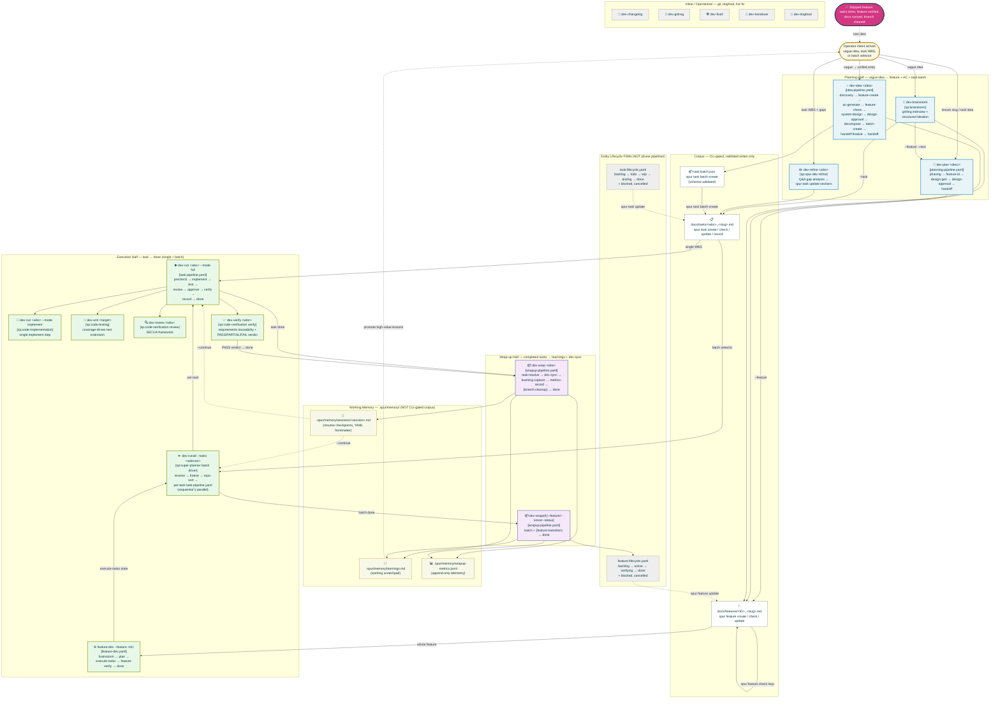

# Design — End-to-end Workflow System for System Development

Owning task: [`0167`](../tasks2/0167_sp-plugin-hands-off-ready-idea-to-feature-flow-post-executio.md).
Surface index row: [`04_DESIGN.md §0`](../04_DESIGN.md). Feature: `I` (sp plugin hands-off ready).

## Purpose

This is the all-in-one design document for Spur's system-development workflow system: the existing
workflow set, the new 0167 idea/wrap-up workflows, the command wrappers that invoke them, the HITL
and auto-routing contract, the checkpoint/memory artifacts, and the structural tests that keep the
system aligned.

The system is pipeline-based. Each pipeline owns one lifecycle phase and is implemented as a
`spur workflow` state-machine YAML file. Skills perform phase work; workflows orchestrate phase order;
CLI verbs perform validated corpus writes.

## System At A Glance

The complete end-to-end flow — from a vague operator utterance to shipped, documented code — is
visualized below. Each phase is owned by exactly one pipeline; each pipeline is invoked by exactly
one (or a small set of) slash command; each command delegates to a backing skill or directly to the
spur CLI.



### Reading The Diagram

- **Solid edges** = data/control flow between commands, pipelines, and corpus.
- **Dashed edges** = cross-cutting relationships (lifecycle guards, checkpoint resumption,
  feedback loops).
- **Subgraphs** = the four operational halves (planning, execution, wrap-up) plus utilities
  and the working-memory layer.
- **Lifecycle FSMs** (`task-lifecycle.yaml`, `feature-lifecycle.yaml`) are *not* phase pipelines
  — they guard every CLI verb that mutates entity status. Every pipeline routes status changes
  through `spur task update` / `spur feature update` so the FSM guards run.

### Stage ↔ Slash Command Map

The diagram is the authoritative visual; the linear map is the operator-friendly companion.

| Stage | Slash command(s) | Owning pipeline / skill | Output |
| --- | --- | --- | --- |
| Intake / ideation | `/sp:dev-brainstorm <topic>` | `sp:brainstorm` | Decision tree + brainstorm artifact in `docs/plans/...` |
| Unified idea entry | `/sp:dev-idea "<idea>"` | `idea-pipeline.yaml` | Feature file + task batch (handoff, no execution) |
| Front-half plan | `/sp:dev-plan "<desc>"` | `planning-pipeline.yaml` | Design doc + feature with AC; handoff |
| Refine a task | `/sp:dev-refine <wbs>` | `sp:spur-dev refine` | Updated task sections via `spur task update --section` |
| Run one task | `/sp:dev-run <wbs> --mode full` | `task-pipeline.yaml` | Task at `done` + verdict artifact |
| Run single step | `/sp:dev-run <wbs> --mode implement` | `sp:code-implementation` | Code + `## Solution` change-map |
| Test pass | `/sp:dev-unit <target>` | `sp:code-testing` | Coverage-driven test extension |
| Code review | `/sp:dev-review <wbs>` | `sp:code-verification review` | `## Review` findings (SECUA) |
| Requirements verify | `/sp:dev-verify <wbs>` | `sp:code-verification verify` | PASS/PARTIAL/FAIL verdict |
| Batch run | `/sp:dev-runall --tasks <sel>` | `sp:super-planner` + `task-pipeline.yaml` | Batch report; topological execution |
| Feature umbrella | `/sp:dev-runall --feature <id>` | `feature-dev.yaml` | Verified feature end-to-end |
| Wrap one | `/sp:dev-wrap <wbs>` | `wrapup-pipeline.yaml` | Learnings + metrics + doc-sync |
| Wrap batch | `/sp:dev-wrapall [--feature/--since/--status]` | `wrapup-pipeline.yaml` | Batch wrap-up + optional feature transition |
| Inline ops | `/sp:dev-changelog`, `/sp:dev-gitmsg`, `/sp:dev-fixall`, `/sp:dev-handover`, `/sp:dev-dogfood` | inline / `sp:dogfood-testing` | git/handover/dogfood utilities |

### The 27 Steps — Linear Map To Workflow YAMLs

The mermaid diagram above is the visual; this table is the linearized, fully-decomposed map.
Every operational step in the E2E flow is listed in pipeline-execution order, mapped to the
exact state id in its owning workflow YAML and the slash command (or CLI verb) that triggers or
executes it. Terminal states (`done`, `failed`, `handoff`, `cancelled`, `skipped`) are
intentionally omitted — they are outcomes, not work. Entity-lifecycle FSMs
(`task-lifecycle.yaml`, `feature-lifecycle.yaml`) are also separate: they guard every status
transition a pipeline invokes, but their states are not pipeline steps themselves.

| #  | Step (state id)              | Workflow YAML                                       | Phase                       | Slash command / CLI verb                                                  | Primary action                                                   | Gate? |
|----|------------------------------|-----------------------------------------------------|-----------------------------|--------------------------------------------------------------------------|------------------------------------------------------------------|-------|
| 1  | `brainstorm`                 | `feature-dev.yaml`                                  | Umbrella execution          | `/sp:dev-runall --feature <id>`                                          | `agent.run /sp:dev-brainstorm --feature`                          | —     |
| 2  | `discovery`                  | `idea-pipeline.yaml`                                | Ideation                    | `/sp:dev-idea "<idea>"`                                                  | `agent.run sp:brainstorm` (records design summary + `needs_design`) | —     |
| 3  | `phasing`                    | `planning-pipeline.yaml`                            | Front-half planning         | `/sp:dev-plan "<desc>"` (interactive only — auto skips entry)            | `hitl.confirm` — decide whether to stage a 02_ROADMAP phase       | obj   |
| 4  | `feature-id`                 | `planning-pipeline.yaml`                            | Front-half planning         | `/sp:dev-plan "<desc>"`                                                  | `agent.run` — derive child id (scans `docs/features` + `05_FEATURES`) | —     |
| 5  | `design-gen`                 | `planning-pipeline.yaml`                            | Front-half planning         | `/sp:dev-plan --design "<desc>"`                                         | `agent.run` — author `docs/design/<slug>.md`                      | —     |
| 6  | `feature-create`             | `idea-pipeline.yaml`                                | Ideation                    | `/sp:dev-idea "<idea>"`                                                  | `agent.run` — `spur feature create` / select existing id; writes Goal/Scope intent artifacts via `spur feature update --section` (0515) | —     |
| 7  | `ac-generate`                | `idea-pipeline.yaml`                                | Ideation                    | `/sp:dev-idea "<idea>"`                                                  | `agent.run` + `shell spur feature update --section` (BDD AC)      | —     |
| 8  | `feature-check`              | `idea-pipeline.yaml`                                | Ideation                    | `/sp:dev-idea "<idea>"`                                                  | `shell spur feature check <id> --strict` + `hitl.confirm`         | obj   |
| 9  | `system-design`              | `idea-pipeline.yaml`                                | Ideation                    | `/sp:dev-idea "<idea>" --design` (or signal-driven)                      | `agent.run sp:sys-architecture` (ADR / architecture / satellites) + run-scoped design-review artifact; reconciles invalidated AC (0515) | —     |
| 10 | `design-approval`            | `idea-pipeline.yaml` / `planning-pipeline.yaml`     | Ideation / Planning         | `/sp:dev-idea "<idea>"` or `/sp:dev-plan "<desc>"`                       | `hitl.confirm` — taste gate (NOT auto-clicked by `--auto`); rejection records `## Operator feedback`, capped at 1 revise (0515) | taste |
| 11 | `decompose`                  | `idea-pipeline.yaml`                                | Ideation                    | `/sp:dev-idea "<idea>"`                                                  | `agent.run sp:spec-decomposition` → `.spur/run/idea-task-batch.json` + task-order sidecar `idea-task-order.json` (0518) | —  |
| 12 | `batch-create`               | `idea-pipeline.yaml`                                | Ideation                    | `/sp:dev-idea "<idea>"`                                                  | `shell spur task batch-create --file ...` + `hitl.confirm`; `--json` result captured atomically to `idea-batch-create-result.json` (0518) | obj   |
| 13 | `handoff-finalize`           | `idea-pipeline.yaml`                                | Ideation                    | `/sp:dev-idea "<idea>"`                                                  | `shell` — zip batch names → created WBS, `spur task deps` ordering, feature roster refresh, per-task `spur task check`, write `idea-handoff.md` with one next command (0518) | obj   |
| 14 | `plan`                       | `feature-dev.yaml`                                  | Umbrella execution          | `/sp:dev-runall --feature <id>`                                          | `agent.run /sp:dev-plan --feature <id>`                           | —     |
| 15 | `execute-tasks`              | `feature-dev.yaml`                                  | Umbrella execution          | `/sp:dev-runall --feature <id>`                                          | `agent.run` — drive every todo task through `task-pipeline.yaml`  | —     |
| 16 | `precheck`                   | `task-pipeline.yaml`                                | Task execution              | `/sp:dev-run <wbs>` (or per-task inside `dev-runall` / `feature-dev`)    | `shell spur task check <wbs>` (block report on fail)              | obj   |
| 17 | `implement`                  | `task-pipeline.yaml`                                | Task execution              | `/sp:dev-run <wbs>`                                                      | `agent.run /sp:dev-run --mode implement` (writes `## Solution`)    | —     |
| 18 | `test`                       | `task-pipeline.yaml`                                | Task execution              | `/sp:dev-run <wbs>`                                                      | `agent.run /sp:dev-unit` + `shell bun run lint`                   | —     |
| 19 | `review`                     | `task-pipeline.yaml`                                | Task execution              | `/sp:dev-run <wbs>`                                                      | `agent.run /sp:dev-review` (SECUA findings → `## Review`)         | —     |
| 20 | `approve`                    | `task-pipeline.yaml`                                | Task execution              | `/sp:dev-run <wbs>` (interactive only — auto skips entry)               | `hitl.confirm` — operator approves review                         | obj*  |
| 21 | `verify`                     | `task-pipeline.yaml`                                | Task execution              | `/sp:dev-run <wbs>`                                                      | `agent.run /sp:dev-verify --auto --fix all` → `.spur/run/<wbs>-verdict.json` | obj   |
| 22 | `record`                     | `task-pipeline.yaml`                                | Task execution              | `/sp:dev-run <wbs>`                                                      | `shell spur task record <wbs> --solution-from-diff --transition testing` | — |
| 23 | `feature-verify`             | `feature-dev.yaml`                                  | Umbrella execution          | `/sp:dev-runall --feature <id>`                                          | `shell spur feature check <id> --strict`                          | obj   |
| 24 | `task-resolve`               | `wrapup-pipeline.yaml`                              | Wrap-up                     | `/sp:dev-wrap <wbs>` / `/sp:dev-wrapall ...`                             | `shell` — validate `vars.tasks` non-empty (route to `skipped` if not) | — |
| 25 | `doc-sync`                   | `wrapup-pipeline.yaml`                              | Wrap-up                     | `/sp:dev-wrap` or `/sp:dev-wrapall`                                      | `agent.run sp:doc-evolve` (drift repair in 04/03/00, `docs/design/*`) | —  |
| 26 | `learning-capture`           | `wrapup-pipeline.yaml`                              | Wrap-up                     | `/sp:dev-wrap` or `/sp:dev-wrapall`                                      | `agent.run` → `.spur/run/wrapup-learnings.md` + `shell` append to `.spur/memory/learnings.md` | — |
| 27 | `metrics-record`             | `wrapup-pipeline.yaml`                              | Wrap-up                     | `/sp:dev-wrap` or `/sp:dev-wrapall`                                      | `agent.run` → `.spur/run/wrapup-metrics.jsonl` + `shell` append to `.spur/memory/wrapup-metrics.jsonl` | — |
| —  | `feature-transition`         | `wrapup-pipeline.yaml`                              | Wrap-up (conditional)       | `/sp:dev-wrapall --feature <id>`                                         | `shell` — bounded `feature sync`; after an applied transition, run `featureGateCmd` (default `bun run spur-check-new`) and report PASS/FAIL softly | obj |
| —  | `branch-cleanup`             | `wrapup-pipeline.yaml`                              | Wrap-up (conditional)       | `/sp:dev-wrap --merge` / `/sp:dev-wrapall --merge`                        | `hitl.confirm` — irreversible (always pauses, even under `--auto`) | irrev |

**Reading the table.** Steps 1–15 cover the planning half (intake → ideation → design →
decomposition → handoff finalization). Steps 16–23 cover the execution half (single-task pipeline +
feature umbrella). Steps 24–27 cover wrap-up. The two trailing rows (`feature-transition`,
`branch-cleanup`) are conditional branches of the wrapup-pipeline and are counted separately;
together with the 27 steps they form the complete operational surface.

**Gate column legend.** `obj` = objective (auto-routable under `--auto`); `taste` = subjective
(never auto-clicked); `irrev` = irreversible (always pauses); `obj*` = the task `approve` gate
is auto-routed when `profile=auto`, otherwise pauses. See §"HITL And Auto Mode" for the full
taxonomy.

**Why 27.** The count deliberately excludes terminal states and lifecycle FSMs because they are
outcomes (not work) and guards (not steps). If you count them, the full state surface across all
ten workflows is 53 distinct states; the 27 above are the operator-walked operational sequence.

## Path Model

Workflow paths in this repository:

| Path | Role | Rule |
| --- | --- | --- |
| `.spur/workflows/<name>.yaml` | Project-facing workflow root used by operators, plugin commands, and seeded local config | Prefer this path in command examples and wrapper command docs. |
| `config/workflows/<name>.yaml` | Physical repo source for this checkout; `.spur/workflows` is a symlink to it | **Monorepo edit SSOT.** Do not copy between `config/` and `.spur/` — same inodes. |
| `apps/cli/config/workflows/` | Gitignored `build:bundle` / `bundle-config` output for npm package ship | Do **not** hand-edit or hand-`cp` after pipeline edits. Rebuild the CLI package when you need the published tree. |

Implementation and validation may use either of the first two paths. Plugin command examples should
use `.spur/workflows/*` because it is the stable project-local surface after `spur init`. Repository
tests may validate `config/workflows/*` directly because that is the committed physical source.
**Never** treat `apps/cli/config/` as a third source of truth that must stay manually in sync.

## System Principles

1. **Orchestration is configuration.** Workflow YAMLs own phase order. Skills do not become pipeline
   controllers.
2. **Every corpus write is CLI-gated.** Task and feature mutations go through `spur task` /
   `spur feature`. Direct writes are allowed only for working memory under `.spur/memory/`.
3. **Pipelines own phases, not entities.** Entity lifecycle legality remains in
   `feature-lifecycle.yaml` and `task-lifecycle.yaml`.
4. **No nested state machines.** A pipeline may invoke another workflow through a command wrapper
   only at a phase boundary; it must not inline another pipeline's state graph.
5. **Design before decomposition.** Brainstorm always records a design summary. The heavier
   `sp:sys-architecture` step runs unless the design signal or an explicit flag bypasses it.
6. **Doc-sync after implementation.** Post-execution doc drift repair is wrap-up work, not initial
   design work.
7. **HITL is explicit.** Objective gates can be routed around in auto mode before entering a
   `hitl.confirm` state. Taste and irreversible gates still pause.
8. **Checkpoint all long-running phases.** Existing and future pipelines write resumable checkpoints
   after gates and phase transitions.

## Workflow Inventory

The eight committed workflows split into three categories: **phase pipelines** (own a lifecycle
phase), **entity lifecycle FSMs** (guard status transitions), and **canonical examples** (schema
reference).

| Workflow | Path | Category | Phase / role | Entry point | Terminal states | Status |
| --- | --- | --- | --- | --- | --- | --- |
| `basic.yaml` | `.spur/workflows/basic.yaml` | Example | Generic implement/check/fix loop | direct `spur workflow run` | `done`, `failed` | existing |
| `feature-lifecycle.yaml` | `.spur/workflows/feature-lifecycle.yaml` | Entity FSM | Feature status FSM | `spur feature update` | `done`, `cancelled` | existing |
| `task-lifecycle.yaml` | `.spur/workflows/task-lifecycle.yaml` | Entity FSM | Task status FSM | `spur task update` | `done`, `cancelled` | existing |
| `planning-pipeline.yaml` | `.spur/workflows/planning-pipeline.yaml` | Phase | Design from known slug | `/sp:dev-plan` | `handoff`, `cancelled` | existing |
| `task-pipeline.yaml` | `.spur/workflows/task-pipeline.yaml` | Phase | Single-task execution | `/sp:dev-run --mode full` | `done`, `failed` | existing |
| `feature-dev.yaml` | `.spur/workflows/feature-dev.yaml` | Phase (umbrella) | Feature end-to-end execution | `/sp:dev-runall --feature` | `done`, `failed` | existing |
| `idea-pipeline.yaml` | `.spur/workflows/idea-pipeline.yaml` | Phase (ideation) | Idea to feature + AC + task batch | `/sp:dev-idea` | `handoff`, `cancelled`, `failed` | new in 0167 |
| `wrapup-pipeline.yaml` | `.spur/workflows/wrapup-pipeline.yaml` | Phase (post-execution) | Post-execution wrap-up | `/sp:dev-wrap`, `/sp:dev-wrapall` | `done`, `skipped` | new in 0167 |

No new `*-lifecycle.yaml` files are added by 0167. Persistent entity lifecycle remains in the two
existing lifecycle workflows.

## Lifecycle Contracts

### Feature Lifecycle

```
backlog -> active -> verifying -> done
      \        \          \         \
       --------> blocked -> cancelled
```

Required guards:

| Transition | Guard |
| --- | --- |
| `backlog -> active` | always |
| `active -> verifying` | `spur feature check <id>` |
| `verifying -> done` | `spur feature check <id> --strict` |

Wrap-up must advance a feature idempotently through legal edges only. For `dev-wrapall --feature <id>`:

1. If `backlog`, run `backlog -> active`.
2. Run or confirm the normal feature check for `active -> verifying`.
3. Run strict feature check for `verifying -> done`.
4. Never attempt `backlog|active -> done` directly.

### Task Lifecycle

```
backlog -> todo -> wip -> testing -> done
      \      \      \        \        \
       -------> blocked -----> cancelled
```

Task execution pipelines may move the task through execution states. Wrap-up does not mutate task
status; it consumes completed tasks unless an explicit `--status` filter selects tasks for
analysis-only wrap-up.

The `done` state is re-enterable (reopen with warning + mandatory History entry).

## Existing Pipeline Contracts

### `planning-pipeline.yaml`

Purpose: front-half planning from a known slug or task idea to a design handoff.

State contract:

```
start -> phasing -> feature-id -> design-gen -> design-approval -> handoff
```

Rules:

- `phasing` may be auto-routed when `profile=auto`.
- `design-gen` produces a `docs/design/<slug>.md` satellite when requested by the seam heuristic.
- `design-approval` is a taste gate. Auto mode may skip objective routing into the gate only when
  prior approval is already encoded; otherwise it pauses.
- The pipeline stops at handoff. It does not execute tasks.

### `task-pipeline.yaml`

Purpose: run one task through implementation, testing, review, verification, record, and done.

State contract:

```
precheck -> implement -> test -> review -> approve -> verify -> record -> done
          \                                                    \
           -------------------------- failed -------------------
```

Rules:

- `precheck` runs `spur task check <wbs>` before implementation.
- `implement`, `test`, `review`, and `verify` dispatch existing `sp` competency skills through
  `agent.run`.
- Every workflow `agent.run` uses the traced, buffered service path: stdin is non-interactive,
  the sanitized resolved invocation is persisted in the action result, and `capture` controls only
  whether buffered stdout is exposed as `data.answer`.
- `approve` is the human review gate; `profile=auto` can route around it only by objective verdict.
- `verify` must produce a task verdict at `.spur/run/<wbs>-verdict.json` (PASS / PARTIAL / FAIL).
- `record` records the verdict and solution through `spur task record`.
- `done` is reached only after a PASS verdict and legal task transition.
- Internal pipeline stages call **only single-step** operations — never `/sp:dev-run --mode full`,
  which would recurse. The pipeline dispatches `/sp:dev-run --mode implement`, `/sp:dev-unit`,
  `/sp:dev-review`, `/sp:dev-verify` per stage.

### `feature-dev.yaml`

Purpose: umbrella feature execution from brainstorm/plan through task execution and feature verify.

State contract:

```
brainstorm -> plan -> execute-tasks -> feature-verify -> done
                                      \-> failed
```

Rules:

- It is the full-loop workflow. Unlike `idea-pipeline.yaml`, it continues past task creation.
- It delegates task execution to the task pipeline through command/workflow invocation at the
  execution phase boundary (the `execute-tasks` state runs each task through `task-pipeline.yaml`
  via `spur workflow run`).
- `feature-verify` runs `spur feature check <featureId> --strict`.
- `done` requires the strict feature check to pass.

### `basic.yaml`

Purpose: generic implement/check/fix loop for simple non-corpus work.

State contract:

```
implement -> check -> done
              \-> fix -> check
```

Rules:

- It is not the standard task lifecycle path for `sp` task execution.
- It remains a canonical minimal workflow example for schema and action-shape authors.

## New 0167 Pipeline Contracts

### `idea-pipeline.yaml`

Purpose: unified entry from a vague idea to a feature, acceptance criteria, and executable task batch.

Command wrapper:

```bash
spur workflow run .spur/workflows/idea-pipeline.yaml \
  --vars '{"idea":"<text>","profile":"interactive|auto","design":"auto|force|skip"}'
```

State contract:

```
start
  -> discovery
  -> feature-create
  -> ac-generate
  -> feature-check
  -> system-design
  -> design-approval
  -> decompose
  -> batch-create
  -> handoff
```

Required actions:

| State | Action |
| --- | --- |
| `discovery` | Dispatch `sp:brainstorm`; write a brainstorm artifact and emit `needs_design`. |
| `feature-create` | Use `spur feature create` or select an existing feature id. |
| `ac-generate` | Generate AC using `ac-style-guide.md`; write through `spur feature update`. |
| `feature-check` | Run `spur feature check <id> --strict`; objective gate. |
| `system-design` | Dispatch `sp:sys-architecture` when design is required; create ADR/architecture/design artifacts through constitution rules. |
| `design-approval` | HITL taste gate; not auto-clicked by `--auto`. |
| `decompose` | Dispatch `sp:spec-decomposition` with brainstorm/design context. |
| `batch-create` | Validate and create tasks through `spur task batch-create`; objective gate. |
| `handoff` | Output feature id, task WBS list, and next command. No task execution. |

Routing rules:

- Brainstorm always records a design summary.
- `--design` forces `system-design`.
- `--skip-design` skips `system-design` but not the brainstorm design summary.
- With neither flag, `needs_design=true` runs `system-design`; `needs_design=false` routes directly
  from `feature-check` to `decompose`.
- Ties run design.
- `--auto` routes around objective gates (`feature-check`, `batch-create`) when the required checks
  pass. It does not bypass `design-approval` unless an explicit prior approval is represented in the
  workflow vars.

### `wrapup-pipeline.yaml`

Purpose: post-execution wrap-up for one task or a batch.

Command wrappers:

```bash
spur workflow run .spur/workflows/wrapup-pipeline.yaml \
  --vars '{"tasks":"[\"0167\"]","profile":"interactive|auto"}'

spur workflow run .spur/workflows/wrapup-pipeline.yaml \
  --vars '{"tasks":"[\"0167\",\"0168\"]","feature":"I","profile":"auto"}'
```

State contract:

```
start
  -> task-resolve
  -> doc-sync
  -> learning-capture
  -> metrics-record
  -> feature-transition   (conditional: vars.feature set)
  -> branch-cleanup       (conditional: vars.merge=true)
  -> done
```

Required actions:

| State | Action |
| --- | --- |
| `task-resolve` | Resolve explicit tasks or wrapper-selected task list; reject empty selection. |
| `doc-sync` | Dispatch `sp:doc-evolve` once for the batch. |
| `learning-capture` | Append working learnings to `.spur/memory/learnings.md`. |
| `metrics-record` | Append one JSONL row per task to `.spur/memory/wrapup-metrics.jsonl`. |
| `feature-transition` | If `feature` is set, run bounded feature sync; after an applied transition, run the corpus-aware `featureGateCmd` before returning. |
| `branch-cleanup` | If `merge=true`, dispatch `sp:branch-workflow` behind an irreversible HITL gate. |
| `done` | Output wrap-up summary and next action. |

Rules:

- Project-level doc-sync runs once per batch.
- Learning capture aggregates the batch, then writes task-specific entries.
- Metrics are append-only and machine-readable.
- `featureGateCmd` is trusted project configuration executed through `sh -c`; its failure is
  reported but does not hard-fail the wrap-up shell.
- Branch cleanup always pauses unless the operator explicitly confirms the irreversible action.
- Task statuses are not mutated.

## Design Step Routing

The system has two related design mechanisms:

| Mechanism | Pipeline | Input | Output | Default |
| --- | --- | --- | --- | --- |
| Brainstorm design summary | `idea-pipeline.yaml` discovery | vague idea | short design summary in brainstorm artifact | always |
| System architecture step | `idea-pipeline.yaml` system-design | feature + AC + brainstorm signal | ADR entries, architecture updates, design satellites | run unless confidently trivial |
| Design satellite generation | `planning-pipeline.yaml` design-gen | known slug/task | `docs/design/<slug>.md` | controlled by `dev-plan --design/--auto` |

`needs_design` criteria:

| Signal | Criteria |
| --- | --- |
| `true` | multiple subsystems, schema/config/DTO change, new module/package/service, new transport/boundary, new dependency, cross-cutting convention |
| `false` | single-module fix, docs/chores, boundary-preserving refactor, existing pattern with no architectural impact |

Flag truth table:

| Flags | Signal | Route |
| --- | --- | --- |
| `--design` | ignored | run `system-design` |
| `--skip-design` | ignored | skip `system-design`; keep brainstorm summary |
| neither | `true` | run `system-design` |
| neither | `false` | skip `system-design` |

## HITL And Auto Mode

Gate taxonomy:

| Gate | Pipeline | Decision type | Auto route allowed |
| --- | --- | --- | --- |
| `phasing` | planning | objective (whether to stage a roadmap phase) | yes (skip entry under profile=auto) |
| `design-approval` | idea/planning | taste / architecture approval | no by default; `design_approved=true` |
| `feature-check` | idea | objective schema/check result | yes |
| `batch-create` | idea | objective schema/check result | yes |
| `approve` | task | objective if review verdict is PASS; taste otherwise | conditional (skip entry under profile=auto) |
| `branch-cleanup` | wrapup | irreversible | no (always pauses) |

Auto-decision principles (the seven laws that govern `--auto`):

1. Schema-valid → auto-approve.
2. Gate-passed → auto-continue.
3. Tests-green → auto-continue.
4. Verdict-PASS → auto-continue.
5. Taste-decision → surface to human.
6. Irreversible action → surface to human.
7. Error → stop.

Implementation rule: `--auto` sets `profile=auto`. YAML transitions must route around an
auto-resolvable HITL state **before entry** — the workflow engine does not auto-dismiss
`hitl.confirm` states. Declaration order matters: the auto-skip guard is declared FIRST so the
engine never enters the gate when the objective precondition is met.

## Command Surface

The full slash-command surface maps 1:1 (or 1:few) onto the workflow inventory. Every command is
a thin wrapper: it builds `--vars` JSON, delegates to the backing skill or pipeline, and surfaces
paused run ids back to the operator.

| Command | Workflow | Required flags/options | Contract |
| --- | --- | --- | --- |
| `/sp:dev-brainstorm` | (no pipeline) | `"<topic>"`, `--depth`, `--options`, `--task` / `--feature`, `--next`, `--agent` | Inline grilling interview + `sp:brainstorm` ideation; exits to `--task` (one task) or `--feature` (validated feature). |
| `/sp:dev-plan` | `.spur/workflows/planning-pipeline.yaml` | `"<desc>"`, `--feature`, `--parent`, `--design`, `--auto`, `--agent` | Known idea/slug to design handoff via `sp:spur-dev plan`. |
| `/sp:dev-refine` | (no pipeline) | `<wbs>`, `--focus`, `--auto`, `--next`, `--agent` | Task requirements gap analysis + section writes; chains to `dev-run --mode implement` under `--next`. |
| `/sp:dev-run` | `.spur/workflows/task-pipeline.yaml` | `<wbs>`, `--mode full\|implement`, `--auto`, `--wrap`, `--continue`, `--agent` | One task through execution; implement mode is inline by default, while full workflow actions remain subprocess-backed. |
| `/sp:dev-runall` | `.spur/workflows/task-pipeline.yaml` per selected task | `--tasks <selector>`, `--mode sequential\|parallel`, `--keep-going`, `--auto`, `--wrap`, `--agent` | Batch orchestrator starts inline; each full per-task workflow keeps its explicit subprocess boundary. |
| `/sp:dev-idea` | `.spur/workflows/idea-pipeline.yaml` | `"<idea>"`, `--auto`, `--design`, `--skip-design` | Vague idea to feature + task batch handoff (no execution). |
| `/sp:dev-wrap` | `.spur/workflows/wrapup-pipeline.yaml` | `<wbs>`, `--auto`, `--merge`, `--dry-run` | Single-task wrap-up. |
| `/sp:dev-wrapall` | `.spur/workflows/wrapup-pipeline.yaml` | `--since`, `--feature`, `--status`, `--auto`, `--merge`, `--dry-run` | Batch wrap-up. |
| `/sp:dev-unit` | (no pipeline) | `<target>`, `--coverage`, `--auto`, `--agent` | Coverage-driven test extension via `sp:code-testing`. |
| `/sp:dev-review` | (no pipeline) | `<wbs>`, `--focus`, `--fix`, `--auto`, `--agent` | SECUA review via `sp:code-verification review`. |
| `/sp:dev-verify` | (no pipeline) | `<wbs>`, `--fix`, `--focus`, `--bdd`, `--auto`, `--force`, `--next`, `--agent` | Requirements traceability + verdict via `sp:code-verification verify`. `--next` chains to `done`. |
| `/sp:dev-changelog` | (inline) | `[--since, --until, --version]` | Conventional-commit changelog. |
| `/sp:dev-gitmsg` | (inline) | `[--commit, --squash, --scope]` | Conventional commit message(s). |
| `/sp:dev-fixall` | (inline) | `[--scope, --gate-log]` | Lint + test fix loop. |
| `/sp:dev-handover` | (inline) | `"<blocker>"` | Structured handover document. |
| `/sp:dev-dogfood` | (no pipeline) | `<target>` | Backing skill `sp:dogfood-testing` drives end-to-end validation. |

Wrapper duties (for commands that invoke pipelines directly):

- Build `--vars` JSON.
- Resolve task selections for batch commands (`spur task list --json`).
- Prefer `.spur/workflows/<name>.yaml` in operator-facing command text.
- Pass `profile=auto` when `--auto` is set.
- Surface paused run ids and `spur workflow continue <run-id> --yes` instructions.
- Never directly mutate task/feature files.

### Inline-default execution surface

Direct model-bearing dev commands execute their backing skill in the current coding-agent session.
Omitting `--agent` is `--agent inline`, which states that default; `--agent auto` / `--agent <name>`
force `spur agent run`. A different agent/model, headless or unattended work, a durable auditable
record, or workspace/credential isolation also forces subprocess and the applied trigger is named.
Triggers override `inline`.

Direct `spur agent run` and workflow `agent.run` are explicit subprocess surfaces. Inline has no
isolated workspace, separate run record, independent timeout/abort boundary, or tier-selected
executor. `--agent` remains the operator-layer coding-agent selector; `executor` remains the
domain-layer role.

## Memory And Telemetry Artifacts

| Artifact | Format | Writer | Purpose | Corpus-gated |
| --- | --- | --- | --- | --- |
| `.spur/memory/learnings.md` | Markdown | `wrapup-pipeline.yaml` | Working learnings grouped by date/task | no |
| `.spur/memory/wrapup-metrics.jsonl` | JSONL | `wrapup-pipeline.yaml` | Per-task wrap-up telemetry | no |
| `.spur/memory/sessions/<session>.md` | Markdown + YAML frontmatter | all long-running pipelines | Resume checkpoint | no |

### Learning Log Format

```markdown
## <YYYY-MM-DD> — Task <WBS>

- **Convention discovered:** <what the agent learned about the project>
- **Error hit and resolved:** <what went wrong, how it was fixed>
- **Pattern that worked:** <approach worth repeating>
- **Gotcha:** <what to watch for in future tasks>
```

Not CLI-gated, not validated corpus, append-only within a session, operator-readable markdown.
High-value learnings are promoted to `docs/99_PROJECT_CONSTITUTION.md §8` by `sp:doc-evolve`, not
by the learning-capture step itself.

### Checkpoint Frontmatter

```yaml
---
session_id: "2026-07-01-0167"
workflow: "task-pipeline"
run_id: "wf_..."
task_wbs: "0167"
feature_id: "I"
phase: "verify"
last_gate: "review-approved"
timestamp: "2026-07-01T18:30:00Z"
next_action: "run verification"
---
```

Write checkpoints after:

- every HITL gate decision;
- every phase transition in `planning-pipeline`, `task-pipeline`, `feature-dev`, `idea-pipeline`,
  and `wrapup-pipeline`;
- every terminal state.

Read checkpoints when:

- `/sp:dev-run --continue` or `/sp:dev-runall --continue` is used;
- the operator asks to resume a task or feature;
- a workflow run is paused and later continued.

One file per session (`<date>-<wbs-or-feature>`); resumed sessions overwrite the same file.

## Documentation Boundaries

| Operation | When | Writes |
| --- | --- | --- |
| Initial system design | before decomposition/code | `docs/00_ADR.md`, `docs/03_ARCHITECTURE.md`, `docs/04_DESIGN.md`, `docs/design/*` as needed |
| Post-implementation doc sync | after task/feature execution | drift repairs in docs, lessons in `docs/99_PROJECT_CONSTITUTION.md §8` |
| Working learning capture | during wrap-up | `.spur/memory/learnings.md` |

The initial design step is allowed to create or update design artifacts. The wrap-up doc-sync step is
allowed to repair drift and promote lessons. Neither step writes task or feature corpus files directly.

## Workflow YAML Contract

All workflow files in this system use:

| Field | Required value |
| --- | --- |
| `$schema` | `@gobing-ai/spur/schemas/state-machine-workflow.schema.json` |
| `kind` | `state-machine` |
| `initialState` | existing state id |
| `states[].id` | unique state id |
| `transitions[]` | explicit `from`, `to`, and guard |
| LLM action kind | `agent.run` |
| Shell action kind | `shell` |
| HITL action kind | `hitl.confirm` |
| Dry-run-safe notes | `note` |
| Pause flag | `pause: true` on HITL states |

Validation commands:

```bash
bun run apps/cli/src/index.ts workflow validate .spur/workflows/idea-pipeline.yaml --json
bun run apps/cli/src/index.ts workflow validate .spur/workflows/wrapup-pipeline.yaml --json
bun run apps/cli/src/index.ts workflow validate .spur/workflows/task-pipeline.yaml --json
bun run apps/cli/src/index.ts workflow validate .spur/workflows/planning-pipeline.yaml --json
bun run apps/cli/src/index.ts workflow validate .spur/workflows/feature-dev.yaml --json
```

Repository-local CI or tests may validate `config/workflows/*.yaml` directly.

## Structural Invariants

Task 0167 extends `plugins/sp/tests/skill-structure.test.ts` without renumbering existing R29.

| Invariant | Coverage |
| --- | --- |
| R30 | `dev-idea`, `dev-wrap`, and `dev-wrapall` command docs exist, have valid frontmatter, and delegate to the correct workflows. |
| R31 | `gate-checklists.md` exists and is linked from `plugins/sp/skills/spur-dev/SKILL.md`. |
| R32 | `dev-operations.md` registers `idea`, `wrap`, and `wrapall`. |
| R33 | `cross-cutting.md` contains auto-decision, iron laws, design approval, learning log, checkpoint, and pipeline alignment sections. |
| R34 | `idea-pipeline.yaml` and `wrapup-pipeline.yaml` exist and validate against the state-machine schema. |
| R35 | `sp:brainstorm` documents the design approval gate and `needs_design` signal. |

Additional invariants for future workflow additions:

- Every new pipeline has exactly one owning phase.
- Every new pipeline is listed in this document and in the relevant plugin README/reference.
- Every new workflow validates with `spur workflow validate`.
- Any new HITL gate is classified as objective, taste, irreversible, or error.
- Any new working-memory artifact lives under `.spur/memory/` and has a documented format.
- Any new pipeline respects the no-nesting principle — no inline state graphs from other pipelines.

## Iron Laws (Lifecycle-Wide Invariants)

Seven non-negotiable invariants apply across the entire spur-dev lifecycle. These live in
`plugins/sp/skills/spur-dev/references/cross-cutting.md` and are restated here for convenience:

1. **NEVER skip the verification gate.** A task is not done until `spur task check <wbs> --strict-core`
   returns PASS and every AC scenario has a corresponding verify command that exited 0.
2. **NEVER write to task/feature corpus outside the `spur` CLI.** Direct file edits to
   `docs/tasks2/*.md` or `docs/features/*.md` are forbidden. The only exception is working memory
   under `.spur/memory/`.
3. **NEVER mark a task done without a PASS verdict.** `testing → done` requires
   `spur task check --strict-core` PASS and a recorded verdict.
4. **NEVER proceed past a failed gate without explicit operator approval.** A failed
   `feature-check`, `batch-create`, `precheck`, `review`, or `verify` stops the run.
5. **NEVER suppress gate failures with `--no-verify`, `--force`, or new `biome-ignore` /
   `eslint-disable` suppressions.** Suppression is a silent bypass.
6. **NEVER create a standalone PM skill or command.** Product-management judgment lives in
   `product-planning.md` as a lens applied during intake and decomposition.
7. **NEVER claim completion without fresh verification evidence.** "Tests pass" must be backed by
   the actual `bun run test` tail pasted into the record. Stale evidence is not evidence.

## Implementation Sequence For 0167

1. Add cross-cutting references: auto-decision principles, iron laws, pipeline alignment, learning log,
   session checkpoints, gate checklists.
2. Enhance `sp:brainstorm` to emit the design summary and `needs_design` contract.
3. Add `wrapup-pipeline.yaml`, `dev-wrap`, `dev-wrapall`, and `--wrap` integration.
4. Add `idea-pipeline.yaml` and `dev-idea`.
5. Add checkpoint write/read actions to existing and new pipelines.
6. Register new operations in `dev-operations.md` and plugin README.
7. Add R30-R35 structural tests.
8. Validate workflows, run plugin tests, then run the project gate.

## Acceptance Trace

| Acceptance | Design coverage |
| --- | --- |
| AC1 | R30-R35 invariants section |
| AC2 | workflow validation contract |
| AC3 | `idea-pipeline.yaml` contract |
| AC4 | `wrapup-pipeline.yaml` contract and memory artifacts |
| AC5 | lifecycle contracts |
| AC6 | HITL and auto mode |
| AC7 | checkpoint contract |
| AC8 | path model, command surface, registration invariants |
