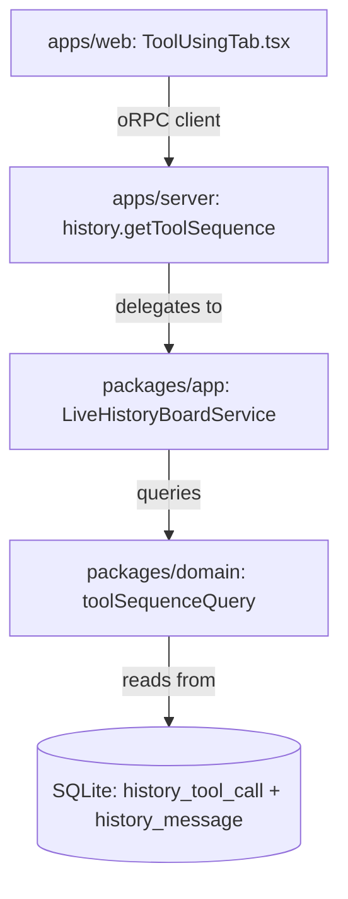

# Design Satellite: History Board Tool Using Tab

**Feature:** E81 (History Board Tool Using Tab)
**Status:** Built (0724, 0725)
**Date:** 2026-08-31

> Not to be confused with the **Observability** module's Tool Using tab (`04_DESIGN` §7.8b), which
> tails the indexed-context JSONL ledger over `GET /api/observability/tool-use`. This tab reads the
> imported forensic corpus (`history_tool_call` + `history_message`) over `POST /history/tool-sequence`.

## 1. Overview & Goal

The History Board module (`apps/web/src/modules/history`) provides comprehensive forensic visibility into coding-agent execution history (Claude Code, Codex, Antigravity CLI, OMP, OpenCode, Pi, etc.).

While the `Timeline` tab presents the turn-based conversational skeleton (user prompts vs assistant responses), developers and operators investigating agent runs need a specialized **tool execution sequence view**. The `Tool Using` tab exposes data from the `history_tool_call` table joined with `history_message`, providing a dedicated interface to inspect:
- The exact chronological sequence of tool invocations.
- Tool categories (file read/write, bash execution, code search, MCP/subagent calls).
- Execution latency and status (`ok` vs `error`).
- Detailed argument payloads (`args_raw`), digests (`args_digest`), and error traces (`error_text`).
- Telemetry correlation (input tokens, cache reads, output tokens, call IDs).

## 2. Architecture & Seams



### 2.1 Tab Navigation (`apps/web/src/modules/history/tabs.ts`)

The tab is positioned directly after `Timeline` and before `Sessions`:

```typescript
export const HISTORY_TABS: readonly HistoryTab[] = [
    { id: 'summary', label: 'Summary', component: SummaryTab },
    { id: 'timeline', label: 'Timeline', component: TimelineTab },
    { id: 'tool-using', label: 'Tool Using', component: ToolUsingTab },
    { id: 'sessions', label: 'Sessions', component: SessionsTab },
    { id: 'insights', label: 'Insights', component: InsightsTab },
    { id: 'sources', label: 'Sources', component: SourcesTab },
];
```

### 2.2 Contract & DTO Schemas (`packages/contracts/src/history.ts`)

Extends `historyContract` with `getToolSequence`:
- **Input (`historyToolSequenceInputSchema`)** — a `z.intersection` of a `mode` discriminated union
  and the shared filter object:
  - Single session: `{ mode: 'session', source, sessionId }`
  - Consolidated: `{ mode: 'consolidated', filter? }` (`historyFilterSchema` — range, from, to,
    sources, models, tools, skills, bucket, dimension)
  - Shared optional filters: `toolNames?: string[]`, `status: 'all' | 'ok' | 'error'` (defaults to
    `all`), `search?: string` (matched against `args_raw`, `error_text`, and `tool_name`)
- **Output (`historyToolSequenceResponseSchema`)** — `apiSuccessSchema(historyToolSequenceResponseDataSchema)`:
  - `mode`: `'session' | 'consolidated'`
  - `scope` (`historyToolSequenceScopeSchema`): `sessionId`, `source`, `model` (null when the scope
    spans several models), `start`, `end`, `totalCalls`, `uniqueTools`, `errorCount`, `errorRate`
    (0..1), `totalDurationMs` (**measured rows only**), `meanDurationMs`, `durationUnmeasured`,
    `sessionCount`, `tokens`
  - `items[]` (`historyToolCallItemSchema`): `seq` (1-based position in the returned stream),
    `toolSeq` (`history_tool_call.seq`), `ts`, `toolName`, `category`, `status`
    (`ok | error | unknown`), `durationMs` (nullable), `durationSource`, `resultBytes`, `argsRaw`,
    `argsDigest`, `errorText`, `callId`, `messageHash`, `sessionId`, `source`, `model`, `tokens`
  - `truncated`: boolean

`category` is `historyToolCategoryEnum` (`read | write | bash | search | mcp | other`). It is derived
**server-side** in `packages/app` (`toolCategory`), never in `packages/contracts`, `packages/domain`,
or the web client. Precedence is `mcp` → `search` → `write` → `read` → `bash` → `other`, so
`mcp__x__read_file` classifies as `mcp`, not `read`.

### 2.3 Domain Query Layer (`packages/domain/src/analytics/forensic-query.ts`)

```ts
export async function toolSequenceQuery(
    db: DbAdapter,
    scope: { mode: 'session'; source: string; sessionId: string } | { mode: 'consolidated'; sel: ArtifactSelector },
    filters?: ToolSequenceFilters,
    limit?: number,   // default 5000
): Promise<ToolSequenceQueryResult>;
```

- Queries `history_tool_call tc JOIN history_message m ON m.record_hash = tc.message_hash` (INNER —
  there is no message-only row in this stream).
- Session mode predicates on `tc.source` + `tc.session_id` so `idx_history_tool_call_session_id_seq`
  on `(session_id, seq)` is reachable; consolidated mode uses `buildMessageWhere(sel, 'm')`.
- Applies the same `request_id` message-dedup predicate `queryTimelineEvents` uses, so a duplicated
  assistant message does not double every tool row it links.
- `search` is escaped through `escapeLike` (`ESCAPE '!'`).
- Ordered by `COALESCE(tc.started_at, m.ts), tc.source, tc.session_id, tc.seq`; fetches `limit + 1`
  rows to set `truncated` and returns the first `limit`.
- Returns **raw rows only**. Category derivation, the token split, and scope aggregation are the
  app layer's job (`LiveHistoryBoardService.getToolSequence`).

### 2.4 Web Component (`apps/web/src/modules/history/ToolUsingTab.tsx`)

The tab is a **pure renderer**: every number it shows comes from the response. It never re-filters,
re-sorts, re-aggregates, or re-derives a category client-side. All state lives in `HistoryShell.tsx`
and arrives as props.

- **Top Bar Controls**:
  - Single Session vs Consolidated mode toggle.
  - Session dropdown selector. The switcher is **tab-local** (`selectToolSession`) — it does not
    reuse `selectTimelineSession`, which force-switches to the Timeline tab.
  - Search box for filtering arguments and error messages (debounced **250 ms** in the shell, then
    sent as a request parameter).
  - Tool filter chips & status toggle (`ALL` / `OK` / `ERROR`).
- **Summary Metrics Strip** — read from `data.scope` only, so it always matches the server's
  filtered scope: Total Calls, Unique Tools, Errors & Error Rate, Mean Latency (with the
  `durationUnmeasured` count surfaced when `> 0`), Token Load.
- **Sequence Waterfall & Stream**:
  - Numbered step list (`item.seq` as returned) with category-colored badges keyed on
    `item.category`:
    - Read (`#10b981`)
    - Write / Edit (`#eab308`)
    - Bash / Exec (`#3b82f6`)
    - Search / Grep (`#a855f7`)
    - Subagent / MCP (`#6366f1`)
    - Other (`#64748b`)
  - Status pill (`OK` / `ERR`) and latency — `durationMs === null` renders `—` carrying
    `durationSource`, **never** `0 ms`.
  - Argument preview snippet.
  - Explicit `truncated` notice, and distinct empty states for "no tool calls in scope" versus
    "filters matched nothing".
- **Inspection Drawer** — one item at a time, keyed on `${sessionId}:${messageHash}:${toolSeq}`:
  - `args_raw` pretty-printed via `JSON.parse` → `JSON.stringify(v, null, 2)` in a `<pre>`, falling
    back to the raw string when it is not JSON, with copy-to-clipboard (guarded for a missing
    `navigator.clipboard`). When `args_raw` is `null` the digest is shown with a "raw payload omitted
    at import" note.
  - Error traceback viewer for failed tool executions.
  - Call metadata (`call_id`, `message_hash`, `session_id`, `source`, `model`, `ts`).

**Filtering is server-side.** Tool name, status, and search are request parameters, not a client-side
`Array.filter`. A client-side slice would desynchronise the metrics strip from the stream whenever
the result is truncated.

## 3. Performance & Safety Invariants

- **Read-only**: History data is completely immutable. No migration and no write path; the tab adds
  no column to `history_tool_call`.
- **Indexed performance**: single-session queries are served through the existing composite index
  `idx_history_tool_call_session_id_seq` on `(session_id, seq)`. The enforceable invariant is
  boundedness plus the index-covered path; the feature's `<50ms` figure is a target, not a test
  assertion against in-memory SQLite.
- **Bounded output**: maximum 5,000 tool calls per request, with a `truncated: true` flag. No
  unbounded `SELECT` over `history_message`.
- **Pure token accounting**: no currency or cost field anywhere on the surface.

### 3.1 Token telemetry is a derived share

`history_tool_call` carries **no token columns**, so no per-call token value may be invented. The
invoking message's tokens are split evenly across its linked tool calls (`links`), mirroring the
timeline convention in `queryTimelineEvents`:

```
freshInputTokens = (m.input_tokens ?? 0) / max(links, 1)      // likewise cacheRead, output
billedTokens     = freshInputTokens + outputTokens
```

**Shares are not rounded.** They stay exact so that the items belonging to one message sum back to
that message's totals — a message with three tool calls contributes its tokens once, not three times,
and `scope.tokens` is the sum of the returned items' shares. Rounding a share independently
(`Math.round(tokens / links)`) breaks that invariant for any count not divisible by the link count
(401 across 3 calls → 3 × 134 = 402) and must not be reintroduced in the DTO.

Rounding is a **presentation** concern: `ToolUsingTab.tsx` applies a module-local `fmtTokens` at
render. Any other consumer must round at its own edge, never in the contract or the service.

### 3.2 A missing duration is a fact

Per the ETL contract's `duration_ms` precedence rule, a NULL duration is never zero-filled or
interpolated from neighbouring rows. The scope block therefore carries `totalDurationMs` (summed over
measured rows only) alongside `durationUnmeasured` (the count of NULL rows), so a mean is never
computed over an invented zero, and the UI renders `—` rather than `0 ms`.

## 4. Workstream Mapping

| Task | Title | Surfaces |
| :--- | :--- | :--- |
| **0724** | oRPC API contracts, domain query, and service implementation | `packages/contracts/src/history.ts`, `packages/domain/src/analytics/forensic-query.ts`, `packages/app/src/services/history-board-{mock-,}service.ts`, `apps/server/src/modules/history/handlers.ts` |
| **0725** | Web tab UI, sequence stream, inspection drawer, and shell integration | `apps/web/src/modules/history/{tabs.ts,ToolUsingTab.tsx,HistoryShell.tsx}` |
