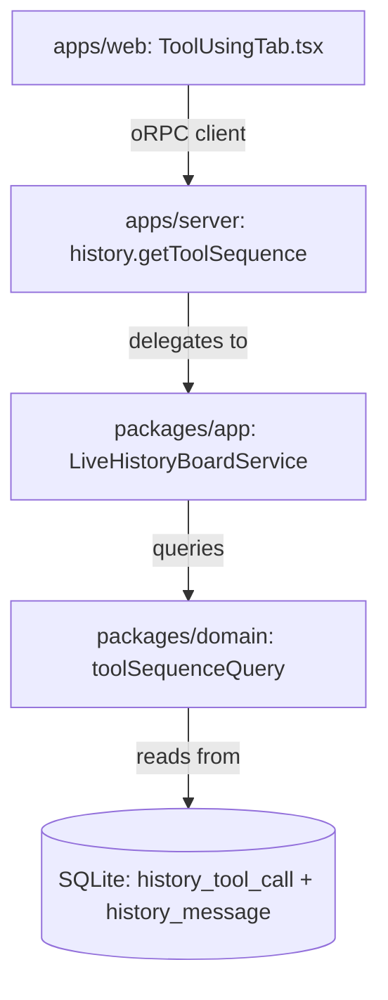

# Design Satellite: History Board Tool Using Tab

**Feature:** E81 (History Board Tool Using Tab)
**Status:** Approved
**Date:** 2026-08-31

## 1. Overview & Goal

The History Board module (`apps/web/src/modules/history`) provides comprehensive forensic visibility into coding-agent execution history (Claude Code, Codex, Antigravity CLI, OMP, OpenCode, Pi, etc.).

While the `Timeline` tab presents the turn-based conversational skeleton (user prompts vs assistant responses), developers and operators investigating agent runs need a specialized **tool execution sequence view**. The `Tool Using` tab exposes data from the `history_tool_call` table joined with `history_message`, providing a dedicated interface to inspect:
- The exact chronological sequence of tool invocations.
- Tool categories (file read/write, bash execution, code search, MCP/subagent calls).
- Execution latency and status (`ok` vs `error`).
- Detailed argument payloads (`args_raw`), digests (`args_digest`), and error traces (`error_text`).
- Telemetry correlation (input tokens, cache reads, output tokens, call IDs).

## 2. Architecture & Seams



### 2.1 Tab Navigation (`apps/web/src/modules/history/tabs.ts`)

The tab is positioned directly after `Timeline` and before `Sessions`:

```typescript
export const HISTORY_TABS: readonly HistoryTab[] = [
    { id: 'summary', label: 'Summary', component: SummaryTab },
    { id: 'timeline', label: 'Timeline', component: TimelineTab },
    { id: 'tool-using', label: 'Tool Using', component: ToolUsingTab },
    { id: 'sessions', label: 'Sessions', component: SessionsTab },
    { id: 'insights', label: 'Insights', component: InsightsTab },
    { id: 'sources', label: 'Sources', component: SourcesTab },
];
```

### 2.2 Contract & DTO Schemas (`packages/contracts/src/history.ts`)

Extends `historyContract` with `getToolSequence`:
- **Input (`historyToolSequenceInputSchema`)**:
  - `mode: 'session' | 'consolidated'`
  - Single session: `source`, `sessionId`
  - Consolidated: `filter` (range, from, to, sources, models, tools)
  - Optional filters: `toolName`, `status` (`'all' | 'ok' | 'error'`), `search` (in arguments/errors)
- **Output (`historyToolSequenceResponseSchema`)**:
  - `scope`: `sessionId`, `source`, `model`, `totalCalls`, `uniqueTools`, `errorCount`, `errorRate`, `totalDurationMs`, `tokens`
  - `items[]`: Array of `historyToolCallItem` (`seq`, `toolSeq`, `toolName`, `category`, `status`, `durationMs`, `argsRaw`, `argsDigest`, `errorText`, `callId`, `tokens`, `ts`, `source`, `sessionId`, `model`)
  - `truncated`: boolean

### 2.3 Domain Query Layer (`packages/domain/src/analytics/forensic-query.ts`)

- `toolSequenceQuery(db, opts)`:
  - Queries `history_tool_call tc JOIN history_message m ON m.record_hash = tc.message_hash`.
  - Uses index `idx_history_tool_call_session_id_seq` on `(session_id, seq)` for instant lookups.
  - Aggregates scope stats (total calls, unique tool names, error counts, duration).

### 2.4 Web Component (`apps/web/src/modules/history/ToolUsingTab.tsx`)

- **Top Bar Controls**:
  - Single Session vs Consolidated mode toggle.
  - Session dropdown selector & Previous/Next navigation.
  - Search box for filtering arguments and error messages.
  - Tool filter chips & Error-only quick toggle.
- **Summary Metrics Strip**:
  - Total Calls, Unique Tools, Errors & Error Rate, Total Duration & Mean Latency, Token Load.
- **Sequence Waterfall & Stream**:
  - Numbered step list with category-colored badges:
    - Read (`#10b981`)
    - Write / Edit (`#eab308`)
    - Bash / Exec (`#3b82f6`)
    - Search / Grep (`#a855f7`)
    - Subagent / MCP (`#6366f1`)
    - Other (`#64748b`)
  - Latency bar & status pill (`OK` / `ERR`).
  - Argument preview snippet.
- **Inspection Drawer**:
  - Formatted JSON viewer for `args_raw` with copy-to-clipboard.
  - Error traceback viewer for failed tool executions.
  - Call metadata (`call_id`, `message_hash`, `session_id`, `model`).

## 3. Performance & Safety Invariants

- **Read-only**: History data is completely immutable.
- **Indexed performance**: Single-session queries resolve in <10ms via existing composite index `(session_id, seq)`.
- **Bounded output**: Maximum 5,000 tool calls returned per request, with `truncated: true` flag.
