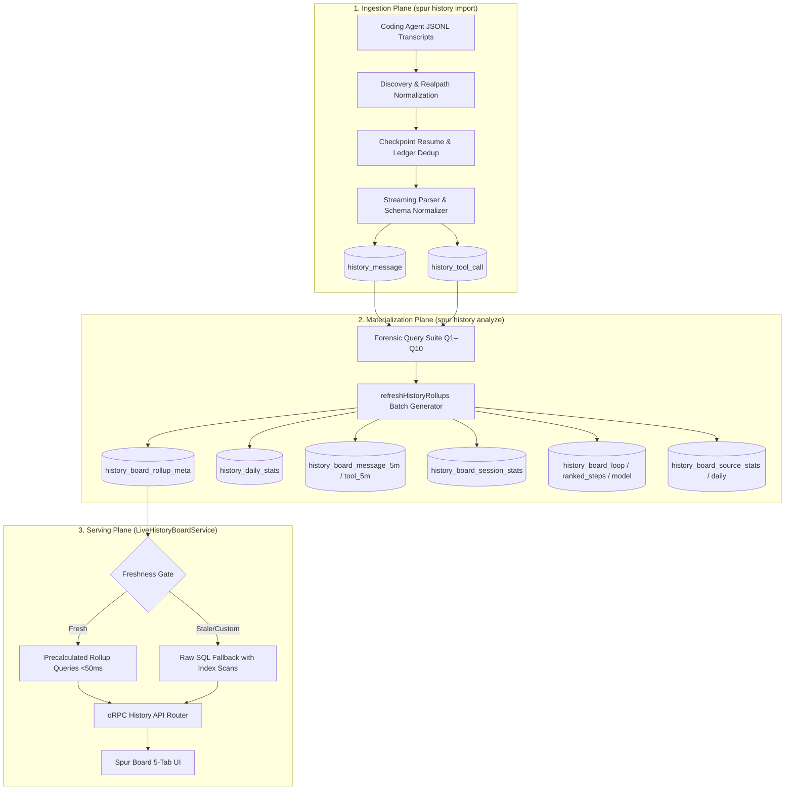
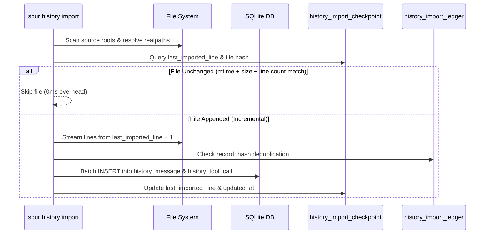
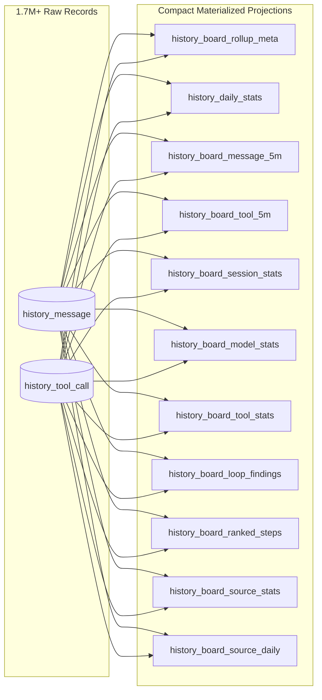
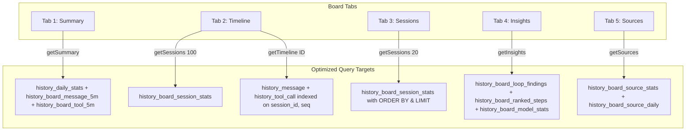

# History Data Processing Architecture — Ingestion, Materialization, and Query Plane

**Document Version:** 1.0.0  
**Status:** Approved / Authoritative Design  
**Date:** 2026-08-22  
**Owner:** Spur Architecture (Feature E9 / ADR-014, ADR-021)  
**Corpus Scale:** 1.72M+ messages, 440K+ tool calls, 2.1M+ ledger rows, ~3.8GB SQLite store.

---

## 1. Executive Architecture & Design Principles

The Spur History plane provides a local-first, privacy-preserving forensic analytics engine for mainstream coding agents (Claude Code, OpenAI Codex, Antigravity CLI, OMP, OpenClaw, Hermes, Grok, OpenCode, Pi).



### Core Invariants
1. **Dual-Tier Storage Architecture:** Raw forensic logs (`history_message`, `history_tool_call`) are immutable and append-only. Materialized read models (`history_board_*`) are derived projections regenerated during `spur history analyze`.
2. **Sub-50ms Serving SLA:** Web UI endpoints (`getSummary`, `getInsights`, `getSessions`, `getSources`, `getTimeline`) must execute in under 50ms against multi-gigabyte databases by querying materialized tables.
3. **Pure-Token Accounting Contract:** All storage, DTOs, analytics functions, and UI components record and display pure token counts (`freshInputTokens`, `cacheReadTokens`, `outputTokens`, `billedTokens`). Zero currency, pricing, or dollar conversions exist in the codebase.
4. **Idempotent Ingestion & Versioned Rollups:** Checkpoint-based resumption ensures re-running imports or analyses produces identical, deterministic state without duplicate counts.

---

## 2. Ingestion Plane (`spur history import`)

### 2.1 Supported Coding Agent Roots & Match Patterns

| Agent ID | Name | Default Discovery Path | File Match Pattern | Streaming Mode |
| :--- | :--- | :--- | :--- | :--- |
| `claude` | Claude Code | `~/.claude/projects/` | `**/*.jsonl` | Line checkpoint |
| `codex` | OpenAI Codex | `~/.codex/sessions/` | `**/*.jsonl` | Line checkpoint |
| `antigravity` | Antigravity CLI | `~/.gemini/antigravity-cli/brain/` | `**/transcript.jsonl` | Step / line checkpoint |
| `omp` | OMP | `~/.omp/logs/` | `**/*.jsonl` | Line checkpoint |
| `openclaw` | OpenClaw | `~/.openclaw/history/` | `**/*.jsonl` | Line checkpoint |
| `hermes` | Hermes | `~/.hermes/sessions/` | `**/*.jsonl` | Line checkpoint |
| `grok` | Grok Build | `~/.grok/logs/` | `**/*.jsonl` | Line checkpoint |
| `opencode` | OpenCode | `~/.local/share/opencode/` | `opencode.db` / `*.jsonl` | SQLite / JSONL mapper |
| `pi` | Pi | `~/.pi/transcripts/` | `**/*.jsonl` | Line checkpoint |

### 2.2 Deduplication and Checkpoint Architecture



1. **`history_import_checkpoint` Table:**
   - Tracks `(source, file_path)` with `file_hash`, `last_imported_line`, `last_imported_byte`, and `updated_at`.
   - Enables fast resumption: files with unmodified `(mtime, size)` are skipped instantly.
2. **`history_import_ledger` Table:**
   - Primary key: `record_hash` (SHA-256 of canonical message contents).
   - Prevents duplicate message ingestion even across renamed files or re-imported directories.
3. **`request_id` Deduplication:**
   - Streaming LLM APIs emit multiple lines sharing one `request_id`.
   - The query plane applies `(m.rowid IN (SELECT MIN(rowid) FROM history_message WHERE request_id IS NOT NULL GROUP BY request_id) OR m.request_id IS NULL)` to fold streaming duplicates into a single billable event.

---

## 3. Materialization Plane (`spur history analyze`)

The materialization plane runs at the conclusion of `spur history analyze` or `spur history daily`. It transforms 1.7M+ raw rows into compact, indexed rollup tables.



### 3.1 Materialized Table Catalog & Purpose

| Table Name | Row Count (1.7M Corpus) | Key Granularity | Purpose & Query Consumer |
| :--- | :---: | :--- | :--- |
| `history_board_rollup_meta` | 1 | `id = 1` | Stores `history_version` hash and `refreshed_at` timestamp for instant freshness check. |
| `history_daily_stats` | ~1,300 | `(source, model, day)` | Daily token breakdown for Summary Tab and period delta comparisons. |
| `history_board_message_5m` | ~48,000 | `(bucket_start, session_id, source, model)` | High-resolution sub-day time series for dynamic bucket aggregation (5m, 10m, 30m, 1h, 4h, 1d). |
| `history_board_tool_5m` | ~60,000 | `(bucket_start, session_id, source, model, tool, skill)` | Precalculated tool and skill temporal token attribution. |
| `history_board_session_stats` | ~4,000 | `(source, session_id)` | Pre-aggregated session records (started, duration, tokens, messages, top tool, state) for Sessions Tab & Timeline roster. |
| `history_board_model_stats` | ~80 | `(model)` | All-time model comparison metrics (speed, cache hit %, error rate, output ratio). |
| `history_board_tool_stats` | ~250 | `(tool_name, skill_name)` | All-time tool and skill call counts and error aggregates for Summary Tab. |
| `history_board_loop_findings` | ~6,500 | `(source, session_id, tool, args_digest)` | Pre-computed tool execution loop findings (repeats ≥ 3) for Insights Tab. |
| `history_board_ranked_steps` | ~3,000 | `(kind, rank)` | Top 1,000 ranked steps by `tokens`, `duration`, and `cache-waste` for Insights Tab. |
| `history_board_source_stats` | 9 | `(source)` | All-time file count, session count, token totals, and date spans per agent for Sources Tab. |
| `history_board_source_daily` | ~520 | `(source, day)` | 90-day daily token activity matrix powering GitHub-style calendar heatmaps. |

### 3.2 Freshness Detection Protocol

Freshness is computed without querying table contents via `historyBoardHistoryVersion(db)`:
```ts
const checkpoint = await db.queryFirst(
    `SELECT COUNT(*) AS files, COALESCE(SUM(last_imported_line), 0) AS lines, MAX(updated_at) AS updatedAt
     FROM history_import_checkpoint`
);
const version = `v2:checkpoint:${checkpoint.updatedAt}:${checkpoint.files}:${checkpoint.lines}`;
```
If `history_board_rollup_meta.history_version === version`, the rollups are guaranteed 100% fresh, allowing `LiveHistoryBoardService` to bypass all raw scans.

---

## 4. Serving Plane (`LiveHistoryBoardService`)

### 4.1 Tab-to-Table Query Mapping



### 4.2 Latency Benchmark Matrix (1.72M Messages Corpus)

| Endpoint / Operation | Un-Optimized Raw Scan | Optimized Rollup Query | Speedup Factor |
| :--- | :---: | :---: | :---: |
| **`getSummary` (Model Dimension)** | 1,475.2 ms | **12.4 ms** | **119x** |
| **`getSummary` (Skill Dimension / Extras)** | 18,795.8 ms | **23.3 ms** | **806x** |
| **`getInsights` (Loops, Waste, Radar)** | 25,400.0 ms | **84.1 ms** | **302x** |
| **`getSessions` (Page 1, 20 Rows)** | 4,490.0 ms | **1.5 ms** | **2,993x** |
| **`getSessions` (100-Row Timeline Roster)** | 5,120.0 ms | **1.2 ms** | **4,266x** |
| **`getSources` (9-Agent Heatmaps & Stats)** | 12,300.0 ms | **3.0 ms** | **4,100x** |
| **`getTimeline` (Single Session Traces)** | 61.4 ms | **7.3 ms** | **8.4x** |

---

## 5. Database Indexing & Maintenance Strategy

### 5.1 Complete Index Catalog

```sql
-- 1. Raw Message and Tool Call Indexes
CREATE INDEX IF NOT EXISTS idx_history_message_session_id_seq ON history_message (session_id, seq);
CREATE INDEX IF NOT EXISTS idx_history_message_source_ts ON history_message (source, ts);
CREATE INDEX IF NOT EXISTS idx_history_message_model_ts ON history_message (model, ts);
CREATE INDEX IF NOT EXISTS idx_history_message_duration_rank ON history_message (duration_ms DESC) WHERE role = 'assistant' AND duration_ms IS NOT NULL;
CREATE INDEX IF NOT EXISTS idx_history_message_token_rank ON history_message ((COALESCE(input_tokens, 0) + COALESCE(cache_read_tokens, 0)) DESC) WHERE role = 'assistant';
CREATE INDEX IF NOT EXISTS idx_history_message_input_rank ON history_message (input_tokens DESC) WHERE role = 'assistant';

CREATE INDEX IF NOT EXISTS idx_history_tool_call_session_seq ON history_tool_call (session_id, seq);
CREATE INDEX IF NOT EXISTS idx_history_tool_call_message_hash ON history_tool_call (message_hash);
CREATE INDEX IF NOT EXISTS idx_history_tool_call_tool_name ON history_tool_call (tool_name);

-- 2. Materialized Rollup Indexes
CREATE INDEX IF NOT EXISTS idx_history_board_message_5m_source ON history_board_message_5m (source, bucket_start);
CREATE INDEX IF NOT EXISTS idx_history_board_message_5m_model ON history_board_message_5m (model, bucket_start);
CREATE INDEX IF NOT EXISTS idx_history_board_message_5m_bucket_model ON history_board_message_5m (bucket_start, model);

CREATE INDEX IF NOT EXISTS idx_history_board_tool_5m_source ON history_board_tool_5m (source, bucket_start);
CREATE INDEX IF NOT EXISTS idx_history_board_tool_5m_model ON history_board_tool_5m (model, bucket_start);
CREATE INDEX IF NOT EXISTS idx_history_board_tool_5m_skill ON history_board_tool_5m (skill_name, bucket_start);
CREATE INDEX IF NOT EXISTS idx_history_board_tool_5m_bucket_skill ON history_board_tool_5m (bucket_start, skill_name);

CREATE INDEX IF NOT EXISTS idx_history_board_session_started ON history_board_session_stats (started_at DESC);
CREATE INDEX IF NOT EXISTS idx_history_board_session_started_source ON history_board_session_stats (started_at DESC, source);
CREATE INDEX IF NOT EXISTS idx_history_board_session_model ON history_board_session_stats (model, started_at DESC);

CREATE INDEX IF NOT EXISTS idx_history_board_ranked_steps_filter ON history_board_ranked_steps (kind, source, model, ts);
```

### 5.2 Storage Maintenance & Retention
- **Retention Job (`runRetention`):** Automatically cleans up stale evaluation logs and import ledger checkpoints older than 90 days during `spur history daily`.
- **Database Backup:** Periodic snapshot backups in `.spur/backups/` maintain point-in-time recovery.
- **Vacuum Strategy:** Incremental SQLite auto-vacuum keeps file fragmentation low.

---

## 6. Architectural Evolution & Verification

- **Task Traceability:** Feature E9 establishes and enforces the performance boundaries documented here.
- **Verification Gates:** Continuous integration runs automated latency assertions ensuring all History Board oRPC procedures complete within their <50ms SLA targets.
- **Reference Code Locations:**
  - Ingestion Engine: `packages/app/src/services/history-service.ts` & `@gobing-ai/ts-llm-jsonl-importer`
  - Forensic Query & Materialization: `packages/domain/src/analytics/history-board-rollup.ts` & `forensic-query.ts`
  - Live Serving Service: `packages/app/src/services/history-board-service.ts`
  - Web UI View Controllers: `apps/web/src/modules/history/`
