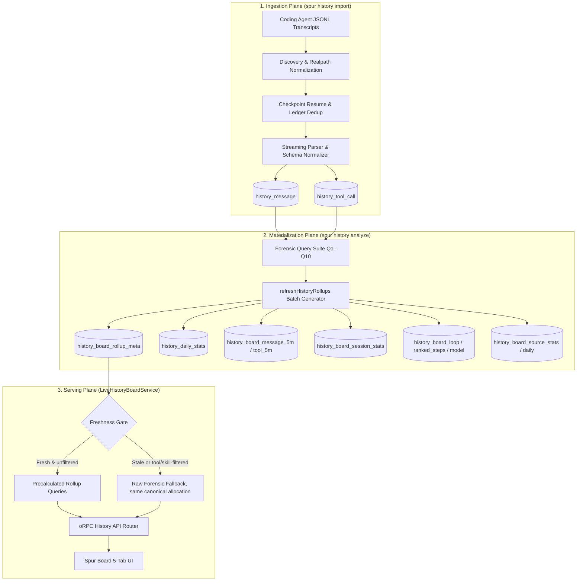
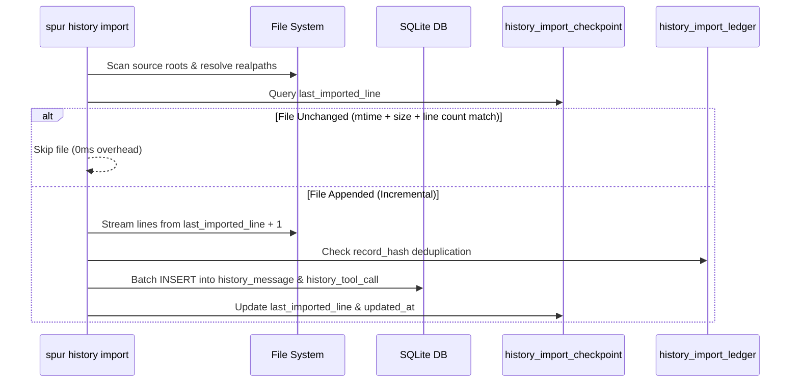
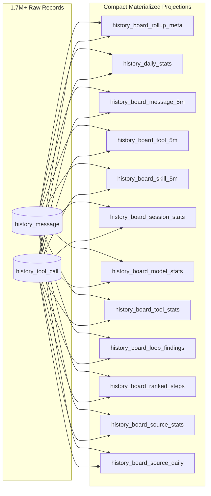
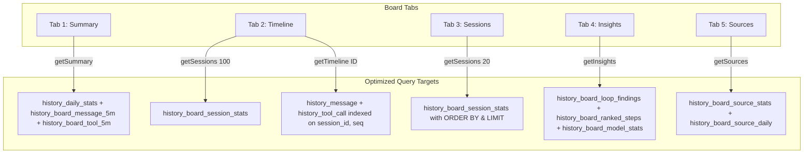

# History Data Processing Architecture — Ingestion, Materialization, and Query Plane

**Document Version:** 1.0.1
**Status:** Design (current-tree corrected; task 0632 R4)  
**Date:** 2026-08-22  
**Owner:** Spur Architecture (Feature E9)  
**Corpus Scale (measured 2026-08-22 on `.spur/spur.db`, task 0632 evidence):** 1,724,061 messages; 441,117 tool calls; 60,218 `history_board_tool_5m` rows.

---

## 1. Executive Architecture & Design Principles

The Spur History plane provides a local-first, privacy-preserving forensic analytics engine for mainstream coding agents (Claude Code, OpenAI Codex, Antigravity CLI, OMP, OpenClaw, Hermes, Grok, OpenCode, Pi).



### Core Invariants

1. **Dual-Tier Storage Architecture:** Raw forensic logs (`history_message`, `history_tool_call`) are append-only during incremental imports, but a full-mode import runs reconciliation that **deletes stale rows** no longer present in the source files — raw history is curated, not immutable. Materialized read models (`history_board_*`) are derived projections fully deleted and regenerated during `spur history analyze`.
2. **Sub-50ms Serving SLA:** Web UI endpoints (`getSummary`, `getInsights`, `getSessions`, `getSources`, `getTimeline`) must execute in under 50ms against multi-gigabyte databases by querying materialized tables.
3. **Accounting Boundary:** Forensic storage and analyze artifacts retain currency (`history_message.cost_usd`, `costUsd` in analyzer rows). The **History Board transport DTOs** are pure-token (`freshInputTokens`, `cacheReadTokens`, `outputTokens`, `billedTokens`) and carry no currency, pricing, or dollar conversion. "Pure token" applies to the Board surface only.
4. **Idempotent Ingestion & Versioned Rollups:** Checkpoint-based resumption ensures re-running imports or analyses produces identical, deterministic state without duplicate counts.

---

## 2. Ingestion Plane (`spur history import`)

### 2.1 Source Catalogs: Importer vs Board

Two distinct catalogs exist and must not be conflated:

**Importer source ids (10)** — `SOURCE_DEFINITIONS` in `@gobing-ai/ts-llm-jsonl-importer@0.4.41` (`src/sources.ts`):

| Source ID | Name | Discovery Roots (relative to home) | Match Pattern |
| :--- | :--- | :--- | :--- |
| `pi` | Pi | `.pi/agent/sessions` | `*.jsonl` |
| `claude` | Claude Code | `.claude/projects` | `*.jsonl` |
| `codex` | Codex | `.codex/sessions` | `*.jsonl` |
| `omp` | OMP | `.omp/agent/sessions` | `*.jsonl` |
| `grok` | Grok Build | `.grok/sessions` | `*.jsonl` |
| `agy` | Antigravity CLI | `.gemini/antigravity-cli/brain` | `*.jsonl` (corrupt lines skipped) |
| `gemini` | Gemini CLI | `.gemini/tmp`, `.config/gemini` | `*.jsonl` |
| `opencode` | OpenCode | `.opencode`, `.local/share/opencode` | `*.jsonl` |
| `antigravity` | Antigravity | `.antigravity` | `*.jsonl` |
| `openclaw` | OpenClaw | `.openclaw` | `*.jsonl` |

**Board card catalog (9)** — `AGENT_CATALOG` in `packages/app/src/services/history-board-service.ts`: `claude`, `codex`, `agy`, `omp`, `openclaw`, `hermes`, `grok`, `opencode`, `pi`. The Board renders nine agent cards; the importer ingests ten source ids. The sets differ (importer has `gemini`/`antigravity`, Board has `hermes`), so neither count substitutes for the other.

### 2.2 Deduplication and Checkpoint Architecture



1. **`history_import_checkpoint` Table (actual DDL, importer `src/schema-sql.ts`):**
   - Columns: `source`, `source_file`, `last_imported_line`, `updated_at`; primary key `(source, source_file)`.
   - There is **no** `file_hash` or `last_imported_byte` column. Resumption is by imported line count.
2. **`history_import_ledger` Table (actual DDL):**
   - Columns: `record_hash` (primary key), `source`, `source_file`, `source_line`, `split_index`, `target_table`, `imported_at`.
   - Prevents duplicate ingestion even across renamed files or re-imported directories.
3. **`request_id` Deduplication:**
   - Streaming LLM APIs emit multiple lines sharing one `request_id`.
   - The query plane applies `(m.rowid IN (SELECT MIN(rowid) FROM history_message WHERE request_id IS NOT NULL GROUP BY request_id) OR m.request_id IS NULL)` to fold streaming duplicates into a single billable event.

---

### 2.3 Task Attribution from Imported Sessions (task 0722)

History that predates the invoke boundary (or arrives through agents that never invoke Spur)
carries no `task_wbs`/`run_id`, so `history analyze --task <wbs>` returns nothing for it. Import
therefore recovers a **direct task↔session authority** alongside the run-chain mapping:

- **Session selection** — bounded and scope-honest: full imports (and dry-run previews) evaluate
  every discovered session of the source; incremental imports evaluate only sessions the import
  itself touched (`imported_at >= import start`). Never unbounded (`ATTRIBUTION_SESSION_LIMIT`).
- **Evidence prefilter** — per session, at most `ATTRIBUTION_EVIDENCE_LIMIT` normalized rows are
  fetched, allowlist-prefiltered (`content_text LIKE '%/sp%' OR '%spur task%'` for user rows,
  `args_raw LIKE '%spur task%' OR args_raw LIKE '%index.ts task%'` for tool calls — the second arm
covers the source-local `bun run apps/cli/src/index.ts task …` spelling). The corpus is never materialized.
- **Pure classifier** (`classifyTaskAttribution`) — deterministic, first-party allowlisted syntax
  only, one extractor per evidence kind (the **echo rule**, run-2 remediation R9): a user row links
  only through a line-anchored task-scoped `/sp:dev-*` slash invocation; the structured
  `spur task <verb> <wbs>` operation syntax links **only through tool-call args**, where a genuinely
  executed CLI operation lands. A user-kind row is first-party speech, but pi flattens `toolResult`
  records into user rows before persistence, so quoted command strings (dispatch prompts,
  tool-output echoes, pasted prose, doc frontmatter) appear there and must never link — they are
  counted as **skipped** mentions instead (the cd09d701#222 grep-output class that linked before
  the rule). Dates, versions, and paths are excluded by the operand shape.
- **Bash-evidence channel — upstream gap (recorded, not worked around).** Genuine `spur task`
  operations in pi sessions execute as bash `toolCall` blocks, but
  `@gobing-ai/ts-llm-jsonl-importer@0.4.48` persists every pi bash call with `args_raw = NULL`
  (`maybeArgsRaw` retains args only for the todo-tool allowlist), so the tool-args channel above
  never sees those commands. The importer's declared extension point cannot fix this caller-side:
  `fieldTransforms` are per-source and receive only the mapper's **split record** (never the raw
  JSONL object), and `piSplit` drops `call.input` for non-allowlisted tools at split time — only a
  one-way `args_digest` survives — while a source-level `args_raw` transform also fires on
  `history_message` split records and its key presence makes the typed message insert throw
  (`Typed table "history_message" has unknown columns: args_raw`; reproduced live against
  0.4.48). The fix belongs upstream: persist pi tool-call args (or route the transform per target
  table with the raw line in `TransformContext`); a full re-import then feeds the channel. Until
  then, bash-driven batches recover attribution only through slash-command evidence.
- **Validation + writes** — every candidate WBS must resolve through the task locator
  (`TaskService.findByWbs`) before persistence; links land in `history_task_session`
  (migration `0028`) with `exactness='estimated'`, idempotent under the
  `(wbs, source, session_id)` primary key, exact-over-estimated precedence enforced by
  `TaskSessionDao`. Evidence is a bounded locator (`<file basename>#<line>`), never transcript
  content. Attribution failure degrades the source report (`attributionError` +
  `attribution-failed` warning) — it never fails the import.
- **Read path** — `history analyze --task <wbs>` unions the run-chain branch
  (`task_run_links` → `history_run_session`) with `history_task_session`; task+run selection keeps
  intersection semantics through the run chain only.

### 2.4 Tool Arguments Extraction, Ingestion Diagnostics, and Field Provenance

Tool execution arguments (`args_raw`, `args_digest`, `call_id`) are ingested per tool call into `history_tool_call`. For full source JSONL mapping matrices, root-cause taxonomy of missing payloads (`args_raw IS NULL`), the 5-step diagnostic recovery procedure, and config-driven frontend syntax highlighting rules, refer to the companion satellite:

- **Satellite SSOT:** [`docs/design/history-importer-arguments-provenance.md`](history-importer-arguments-provenance.md)

## 3. Materialization Plane (`spur history analyze`)

The single refresh choke point is `refreshHistoryRollups(db)` (`packages/app/src/services/history-analysis-service.ts`), invoked at the end of `HistoryService.analyze()` — which `spur history analyze` and the `spur history daily` pipeline both route through. It is a no-op when `historyBoardRollupsFresh(db)` reports the stored version current; otherwise it fully deletes and rebuilds every `history_board_*` / `history_daily_stats` table via `replaceHistoryBoardRollups`.



### 3.1 Materialized Table Catalog & Purpose

| Table Name | Row Count (1.7M Corpus) | Key Granularity | Purpose & Query Consumer |
| :--- | :---: | :--- | :--- |
| `history_board_rollup_meta` | 1 | `id = 1` | Stores `history_version` hash and `refreshed_at` timestamp for instant freshness check. |
| `history_daily_stats` | (per source/model/day; no recorded count) | `(source, model, day)` | Daily token breakdown for Summary Tab and period delta comparisons. |
| `history_board_message_5m` | (no recorded count) | `(bucket_start, session_id, source, model)` | High-resolution sub-day time series for dynamic bucket aggregation (5m, 10m, 30m, 1h, 4h, 1d). |
| `history_board_tool_5m` | 60,218 (measured, task 0632) | `(bucket_start, session_id, source, model, tool, skill)` | Precalculated tool and skill temporal token attribution.
| `history_board_skill_5m` | (no recorded count) | `(bucket_start, source, skill_name, invocation_kind)` | Precalculated skill-load call counts for the Summary tab skill-load breakdown (0737); rebuilt by `skillCallRollup` via `replaceHistoryBoardRollups`. | |
| `history_board_session_stats` | (no recorded count) | `(source, session_id)` | Pre-aggregated session records (started, duration, tokens, messages, top tool, state) for Sessions Tab & Timeline roster. |
| `history_board_model_stats` | (no recorded count) | `(model)` | All-time model comparison metrics (speed, cache hit %, error rate, output ratio). |
| `history_board_tool_stats` | (no recorded count) | `(tool_name, skill_name)` | All-time tool and skill call counts and error aggregates for Summary Tab. |
| `history_board_loop_findings` | (no recorded count) | `(source, session_id, tool, args_digest)` | Pre-computed tool execution loop findings (repeats ≥ 3) for Insights Tab. |
| `history_board_ranked_steps` | (no recorded count) | `(kind, rank)` | Top 1,000 ranked steps by `tokens`, `duration`, and `cache-waste` for Insights Tab. |
| `history_board_source_stats` | one per imported source (no recorded count) | `(source)` | All-time file count, session count, token totals, and date spans per agent for Sources Tab. |
| `history_board_source_daily` | (no recorded count) | `(source, day)` | 90-day daily token activity matrix powering GitHub-style calendar heatmaps. |

### 3.2 Freshness Detection Protocol

Freshness is computed without querying table contents via `historyBoardHistoryVersion(db)`:

```ts
const checkpoint = await db.queryFirst(
    `SELECT COUNT(*) AS files, COALESCE(SUM(last_imported_line), 0) AS lines, MAX(updated_at) AS updatedAt
     FROM history_import_checkpoint`
);
const version = `v2:checkpoint:${checkpoint.updatedAt}:${checkpoint.files}:${checkpoint.lines}`;
```

If `history_board_rollup_meta.history_version === version`, the rollups are guaranteed 100% fresh, allowing `LiveHistoryBoardService` to bypass all raw scans.

### 3.3 Forensic Query Contract (Q1–Q10)

Q1–Q10 are logical forensic questions, not ten mandatory SQL statements. The current query plane
consolidates compatible aggregates while retaining each question's semantics:

| Query | Question | Current owner |
| :---: | :--- | :--- |
| Q1 | Tool wall-clock cost | `byTool`; `history_board_tool_5m` duration aggregates |
| Q2 | Tool result/context/token footprint | `byTool.resultBytes`; allocated token columns in `history_board_tool_5m` |
| Q3 | Tool-call counts | `byTool`; `history_board_tool_stats` |
| Q4 | Repeated `args_digest` loops | `loops`; `history_board_loop_findings` |
| Q5 | Session leaderboard | `bySession`; `history_board_session_stats` |
| Q6 | Tool error concentration | `byTool`; `history_board_tool_stats` |
| Q7 | Turn shape by `disposition` / `record_type` | Raw forensic contract; materialization excludes `meta` rows when deriving session state |
| Q8 | Source/model/day token and spend rollups | `messageRollup` / `toolRollup`; `history_daily_stats` and the 5-minute tables |
| Q9 | Exact Spur run/task attribution | `buildMessageWhereClauses` applies `provenance = 'spur-run'` with `run_id` / `task_wbs`; task-only selection additionally unions the `history_task_session` authority recovered at import (task 0722) |
| Q10 | Unknown-disposition drift | `drift`, grouped by source and `record_type` |

---

## 4. Serving Plane (`LiveHistoryBoardService`)

### 4.1 Tab-to-Table Query Mapping



### 4.1.1 Summary Skill Series and Previous Window (task 0632)

- Both `tool` and `skill` Summary series read `history_board_tool_5m` (`r.tool_name` / `r.skill_name`; the skill branch excludes `skill_name = ''`). A fresh, unfiltered Summary never touches the raw tables for any dimension.
- **Canonical allocation:** a message's tokens divide across **all** linked tool calls, and skill rows are selected only after that division. The stale/missing-rollup fallback (`bucketedTokenSeries(..., 'skill')` in `forensic-query.ts`) applies the same order of operations, so fresh and stale results stay numerically equal.
- **Previous-window KPIs** always call `historyBoardSummaryFromRollup(db, previousSel, '1d', 'model')`, so they read the bounded `history_daily_stats` projection regardless of the active bucket (24h/7d requests no longer re-aggregate 5-minute rows).
- The freshness gate itself (`historyBoardHistoryVersion`) may read a single `history_message` row (`ORDER BY rowid DESC LIMIT 1`) only when no import checkpoint exists; it is a one-row probe, never a scan.

### 4.2 Measured Latency Evidence

Only numbers tied to recorded evidence are stated. Measured 2026-08-22 on the `.spur/spur.db` corpus above (task 0632 background):

| Operation | Latency | Evidence |
| :--- | :---: | :--- |
| Fresh 30-day model Summary, skill extras on the **live skill scan** (pre-0632) | 26,217 ms | task 0632 background measurement |
| Equivalent `history_board_tool_5m` skill aggregation | 19.7 ms | task 0632 background measurement |

Task 0633 owns end-to-end refresh and per-endpoint latency regression evidence; numbers without a recorded command/corpus/date must not be added here.

---

## 5. Database Indexing & Maintenance Strategy

### 5.1 Index Catalog (mirrors `packages/domain/src/migrations.ts`)

```sql
-- Raw-plane indexes
CREATE INDEX IF NOT EXISTS idx_history_message_session_id_seq ON history_message (session_id, seq);
CREATE INDEX IF NOT EXISTS idx_history_message_source_ts ON history_message (source, ts);
CREATE INDEX IF NOT EXISTS idx_history_message_model_ts ON history_message (model, ts);
CREATE INDEX IF NOT EXISTS idx_history_message_duration_rank ON history_message (duration_ms DESC) WHERE role = 'assistant' AND duration_ms IS NOT NULL;
CREATE INDEX IF NOT EXISTS idx_history_message_token_rank ON history_message ((COALESCE(input_tokens, 0) + COALESCE(cache_read_tokens, 0)) DESC) WHERE role = 'assistant';
CREATE INDEX IF NOT EXISTS idx_history_message_input_rank ON history_message (input_tokens DESC) WHERE role = 'assistant';
CREATE INDEX IF NOT EXISTS idx_history_tool_call_session_id_seq ON history_tool_call (session_id, seq);

-- Rollup-plane indexes
CREATE INDEX IF NOT EXISTS idx_history_board_message_5m_source ON history_board_message_5m (source, bucket_start);
CREATE INDEX IF NOT EXISTS idx_history_board_message_5m_model ON history_board_message_5m (model, bucket_start);
CREATE INDEX IF NOT EXISTS idx_history_board_message_5m_session ON history_board_message_5m (session_id, source);
CREATE INDEX IF NOT EXISTS idx_history_board_message_5m_bucket_model ON history_board_message_5m (bucket_start, model);
CREATE INDEX IF NOT EXISTS idx_history_board_tool_5m_source ON history_board_tool_5m (source, bucket_start);
CREATE INDEX IF NOT EXISTS idx_history_board_tool_5m_model ON history_board_tool_5m (model, bucket_start);
CREATE INDEX IF NOT EXISTS idx_history_board_tool_5m_tool ON history_board_tool_5m (tool_name, bucket_start);
CREATE INDEX IF NOT EXISTS idx_history_board_tool_5m_skill ON history_board_tool_5m (skill_name, bucket_start);
CREATE INDEX IF NOT EXISTS idx_history_board_tool_5m_session ON history_board_tool_5m (session_id, source);
CREATE INDEX IF NOT EXISTS idx_history_board_tool_5m_bucket_skill ON history_board_tool_5m (bucket_start, skill_name);
CREATE INDEX IF NOT EXISTS idx_history_board_session_started ON history_board_session_stats (started_at DESC);
CREATE INDEX IF NOT EXISTS idx_history_board_session_model ON history_board_session_stats (model, started_at DESC);
CREATE INDEX IF NOT EXISTS idx_history_board_session_source_started ON history_board_session_stats (source, started_at DESC);
CREATE INDEX IF NOT EXISTS idx_history_board_ranked_steps_filter ON history_board_ranked_steps (kind, source, model, ts);
```

There is no `history_tool_call (message_hash)` or `(tool_name)` index in the current tree; tool-call joins ride the primary-key/rowid paths plus the session-leading index above.

### 5.2 Storage Maintenance & Retention

- **Retention Job (`runRetention`):** Automatically cleans up stale evaluation logs and import ledger checkpoints older than 90 days during `spur history daily`.
- **Database Backup:** Periodic snapshot backups in `.spur/backups/` maintain point-in-time recovery.
- **Vacuum Strategy:** Incremental SQLite auto-vacuum keeps file fragmentation low.

---

## 6. Architectural Evolution & Verification

- **Task Traceability:** Feature E9 establishes and enforces the performance boundaries documented here.
- **Verification Gates:** `packages/app/tests/services/history-board-service.test.ts` asserts the five Board tabs across eight read paths respond in <50 ms on a seeded corpus; production-scale latency evidence is owned by task 0633.
- **Reference Code Locations:**
  - Ingestion Engine: `packages/app/src/services/history-service.ts` & `@gobing-ai/ts-llm-jsonl-importer`
  - Forensic Query & Materialization: `packages/domain/src/analytics/history-board-rollup.ts` & `forensic-query.ts`
  - Live Serving Service: `packages/app/src/services/history-board-service.ts`
  - Web UI View Controllers: `apps/web/src/modules/history/`
