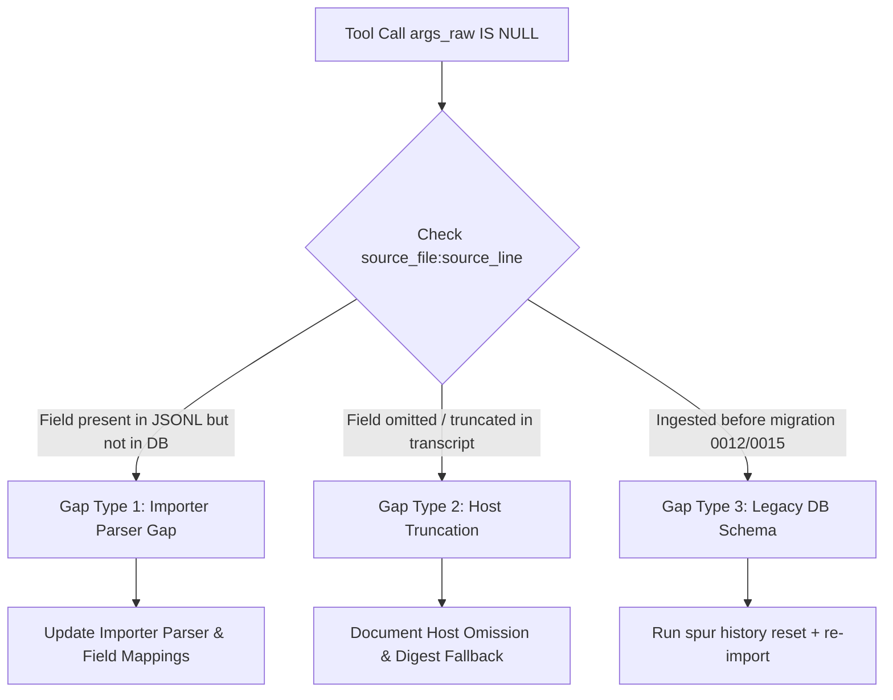

# Tool Call Arguments Extraction, Ingestion Diagnostics, and Field Provenance Standard Procedure

**Document Version:** 1.0.0  
**Status:** Accepted Design  
**Date:** 2026-09-01  
**Owner:** Spur Architecture (Feature E9 / History Forensics)  
**Related Documents:** [`docs/design/history-data-processing.md`](history-data-processing.md), [`docs/04_DESIGN.md`](../04_DESIGN.md), [`docs/03_ARCHITECTURE.md`](../03_ARCHITECTURE.md)

---

## 1. Executive Summary

This document establishes the standard engineering procedure and diagnostic framework for the capture, normalization, verification, and presentation of tool call execution arguments (`history_tool_call.args_raw`, `args_digest`, and `call_id`) across all supported coding agent sources (Claude Code, Antigravity CLI, OpenAI Codex, Pi, OMP, OpenCode, Hermes, Grok, OpenClaw).

It defines:
1. The **transcript schema mapping matrix** for all agent engines.
2. The root cause classification for missing or unrecorded tool arguments (`args_raw IS NULL` / empty digest `74234e98...`).
3. The **5-step standard diagnostic and recovery procedure** for auditing, fixing importer parsers, and reconciling history.
4. The **config-driven syntax highlighting contract** for rendering raw payloads in the Spur Board UI.

---

## 2. Tool Arguments Storage & Provenance Model

Tool invocations are stored in the SQLite forensic table `history_tool_call` (DDL migration `0012` + `0015` in `packages/domain/src/migrations.ts`):

```sql
CREATE TABLE history_tool_call (
    record_hash     TEXT PRIMARY KEY,
    message_hash    TEXT NOT NULL,
    source          TEXT NOT NULL,
    source_file     TEXT NOT NULL,
    source_line     INTEGER NOT NULL,
    session_id      TEXT NOT NULL,
    seq             INTEGER NOT NULL,
    tool_name       TEXT NOT NULL,
    status          TEXT NOT NULL,
    args_digest     TEXT NOT NULL,
    args_raw        TEXT,           -- Full serialized JSON or command string
    call_id         TEXT,           -- Engine-native call identifier
    duration_ms     INTEGER,
    duration_source TEXT,
    imported_at     TEXT NOT NULL
);
```

### 2.1 Invariant Rules

1. **Deterministic Hashing:** `args_digest` is always the SHA-256 hash of the canonicalized raw argument representation. When `args_raw` is an empty object or omitted, `args_digest` evaluates to `74234e98afe7498fb5daf1f36ac2d78acc339464f950703b8c019892f982b90b` (`SHA256("{}")`).
2. **Payload Integrity:** When present in the raw source transcript, `args_raw` MUST retain the exact JSON structure or command string executed by the agent without destructive truncation.
3. **Provenance Backlink:** Every row in `history_tool_call` retains its exact `source_file` and `source_line` so any ingested record can be cross-referenced against the raw file on disk in 0ms.

---

## 3. Agent Transcript Schema Mapping Matrix

Different coding agents structure tool calls differently in their streaming JSONL session logs:

| Agent Source (`source`) | Transcript Path (relative to home) | JSON Path to Tool Calls | Tool Name Field | Arguments Field | Arguments Type |
| :--- | :--- | :--- | :--- | :--- | :--- |
| **`claude`** (Claude Code) | `.claude/projects/**/*.jsonl` | `content[type="tool_use"]` | `.name` | `.input` | JSON Object (e.g. `{"command": "..."}`) |
| **`agy`** (Antigravity CLI) | `.gemini/antigravity-cli/brain/**/transcript*.jsonl` | `tool_calls[]` | `.name` | `.args` | JSON Object (e.g. `{"CommandLine": "...", "AbsolutePath": "..."}`) |
| **`codex`** (OpenAI Codex) | `.codex/sessions/**/*.jsonl` | `tool_calls[]` or `function_call` | `.name` or `.function.name` | `.arguments` or `.function.arguments` | Stringified JSON string |
| **`pi`** (Pi Agent) | `.pi/agent/sessions/**/*.jsonl` | `message.tool` | `.name` | `.input` or `.command` | JSON Object / command string |
| **`opencode`** (OpenCode) | `.opencode/**/*.jsonl` | `tool_calls[]` | `.function.name` | `.function.arguments` | Stringified JSON string |
| **`omp`** (OMP) | `.omp/agent/sessions/**/*.jsonl` | `tools[]` | `.name` | `.args` or `.input` | JSON Object |
| **`gemini`** (Gemini CLI) | `.gemini/tmp/**/*.jsonl` | `tool_calls[]` | `.name` | `.args` / `.parameters` | JSON Object |

---

## 4. Root Cause Analysis of Missing Arguments

When inspecting tool calls such as `run_command`, `grep_search`, `view_file`, or `replace_file_content` in the History Board, an empty or `null` `args_raw` field is caused by one of three mechanisms:



### 4.1 Gap Type 1: Importer Parser Gap (Recoverable)
- **Description:** The agent transcript records valid arguments (e.g., Antigravity `tool_calls[i].args` or Codex `function.arguments`), but the importer parser looked for a different property name (e.g., `input`).
- **Symptom:** `history_tool_call.args_raw IS NULL`, while `args_digest = '74234e98...'` (hash of empty object `{}`).
- **Resolution:** Update `@gobing-ai/ts-llm-jsonl-importer`, bump the minimum safe importer version guard, and re-import.

### 4.2 Gap Type 2: Host Truncation (Non-Recoverable)
- **Description:** The host engine explicitly omits the payload in token-efficient logs (e.g. `transcript.jsonl` vs `transcript_full.jsonl` where `truncated_fields: ["tool_calls"]` is written).
- **Symptom:** The raw JSONL file on disk itself has `tool_calls: [{ name: "view_file" }]` with no `args` property.
- **Resolution:** The UI gracefully falls back to `args_digest` and displays the informative note: `Raw payload omitted at import; digest available: <hash>`.

### 4.3 Gap Type 3: Legacy Historical Ingestion (Recoverable)
- **Description:** The session was ingested before schema migration `0012` (which added `args_raw`) or with an early version of the importer.
- **Resolution:** Re-run `spur history import --source <id>` (with `--mode full` or following a reset).

---

## 5. Standard Diagnostic & Recovery Procedure

When auditing or refining tool call argument extraction for any existing or newly introduced coding agent, follow this 5-step checklist:

### Step 1: Query Forensic Ingestion State
Run SQL query to identify missing arguments grouped by source and tool name:
```bash
bun -e "
import { Database } from 'bun:sqlite';
const db = new Database('.spur/spur.db', { readonly: true });
const rows = db.query(\`
    SELECT source, tool_name, (args_raw IS NOT NULL) AS has_raw, COUNT(*) AS count
    FROM history_tool_call
    GROUP BY source, tool_name, (args_raw IS NOT NULL)
    ORDER BY source, tool_name;
\`).all();
console.table(rows);
"
```

### Step 2: Inspect Source Transcript JSONL Line
Take a sample row with missing `args_raw` and read its exact source file and line:
```bash
bun -e "
import { Database } from 'bun:sqlite';
import fs from 'fs';
const db = new Database('.spur/spur.db', { readonly: true });
const row = db.query('SELECT source_file, source_line, tool_name FROM history_tool_call WHERE args_raw IS NULL AND source = ? LIMIT 1').get('agy');
if (row) {
    const lines = fs.readFileSync(row.source_file, 'utf8').split('\n');
    console.log('Source:', row.source_file, 'Line:', row.source_line);
    console.log('Raw JSON Line:', lines[row.source_line - 1]);
}
"
```

### Step 3: Classify the Parser Extractors
Check if the raw line contains tool arguments under alternative property names:
- `.args` vs `.input` vs `.parameters` vs `.arguments`
- Stringified JSON vs nested Object vs plain command string.

### Step 4: Update Importer & Bump Safety Boundary
1. Implement the property resolution in `@gobing-ai/ts-llm-jsonl-importer` mapper.
2. If the fix resolves a previously broken command evidence channel, declare a `MIN_SAFE_<SOURCE>_IMPORTER_VERSION` in `packages/app/src/services/history-service.ts` (as done for Pi in `MIN_SAFE_PI_BASH_IMPORTER_VERSION = '0.4.49'`).
3. Add unit test fixtures in `packages/domain/tests/analytics/forensic-query-history.test.ts`.

### Step 5: Reset & Re-import Source
Execute the safe re-import cycle:
```bash
spur history reset --source agy
spur history import --source agy
spur history analyze
```

---

## 6. Config-Driven Syntax Highlighting Architecture

The Spur History Board UI renders tool arguments using a declarative, config-driven syntax highlighter in [`apps/web/src/modules/history/ToolCallDetail.tsx`](../../apps/web/src/modules/history/ToolCallDetail.tsx).

### 6.1 Syntax Registry Schema

```typescript
export type SyntaxLanguage = 'json' | 'bash' | 'diff' | 'markdown' | 'text';

export interface ToolSyntaxRule {
    /** Target language for raw payload or primary command string */
    defaultLanguage: SyntaxLanguage;
    /** Field-level language overrides for nested JSON keys */
    fieldLanguages?: Record<string, SyntaxLanguage>;
}
```

### 6.2 Default Tool Registry Mapping

| Tool Identifier | Default Language | Field Overrides |
| :--- | :--- | :--- |
| `bash`, `Bash`, `shell`, `exec` | `bash` | — |
| `run_command` | `json` | `CommandLine: 'bash'`, `command: 'bash'`, `cmd: 'bash'`, `script: 'bash'` |
| `view_file`, `read`, `Read` | `json` | — |
| `replace_file_content`, `edit`, `Edit` | `json` | `TargetContent: 'diff'`, `ReplacementContent: 'diff'`, `old_string: 'diff'`, `new_string: 'diff'` |
| `write_to_file`, `write`, `Write` | `json` | `CodeContent: 'text'`, `content: 'text'` |
| `grep_search`, `find_by_name` | `json` | — |

### 6.3 Adding New Languages or Custom Tools

To add syntax highlighting for a new tool or language (e.g. SQL queries in a database tool, or Python scripts):
1. Extend `SyntaxLanguage` in `ToolCallDetail.tsx` (e.g. adding `'sql'` or `'python'`).
2. Add a tokenizer/highlighter function (e.g. `highlightSql(code)`).
3. Register the tool entry in `DEFAULT_TOOL_SYNTAX_RULES`:
   ```typescript
   execute_sql: {
       defaultLanguage: 'json',
       fieldLanguages: { query: 'sql', sql: 'sql' }
   }
   ```
4. The `<CodeHighlight>` component automatically applies the nested syntax coloring across all History Board tabs (`Tool Using`, `Timeline`, and `Insights`).
