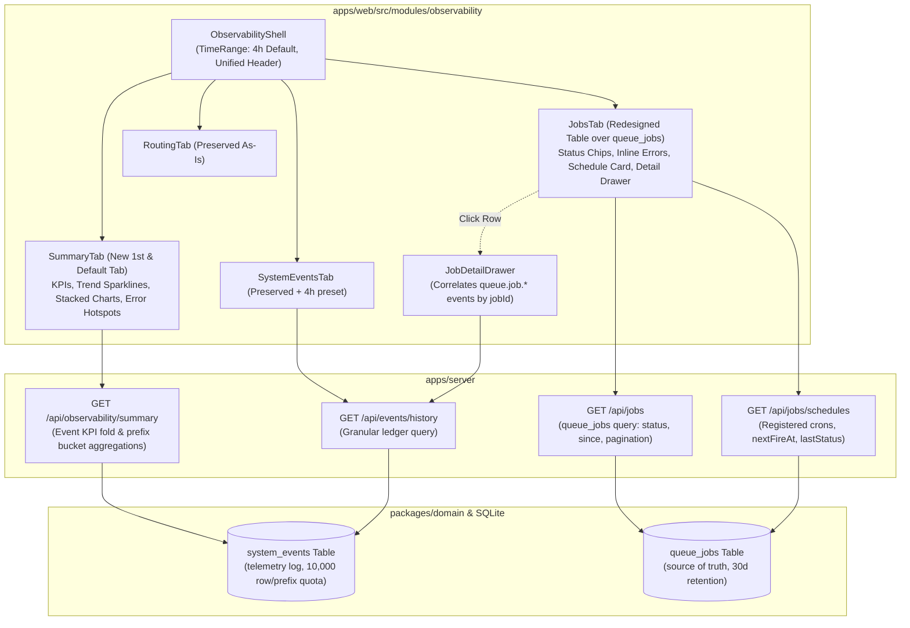

# Observability Board Module Refactor: Summary Tab, 4h Default, Truthful Jobs Table, and Schedule Tracing

Feature **J93** elevates the `Observability` module across `apps/web`, `apps/server`, and `packages/domain` into a high-level operational cockpit and truthful queue/scheduler execution tracer, matching the design caliber and components of the `History` module.

---

## 1. System Architecture & Boundaries



---

## 2. Core Architectural Decisions

### 2.1 Tab Layout & Order
In `apps/web/src/modules/observability/tabs.ts`:
1. `summary`: **Summary** (New default tab)
2. `system-events`: **System Events** (Unfiltered real-time + historical log)
3. `jobs`: **Jobs** (Redesigned persistent execution table)
4. `routing`: **Routing** (Attributed executor routing; preserved as-is)

### 2.2 Time-Range Standardization
- Supported presets: `'30s' | '5m' | '1h' | '4h' | '24h' | '7d' | 'all'`.
- Default: `'4h'` (matching `HistoryShell.tsx:64`).
- `TIME_RANGE_MS['4h'] = 4 * 60 * 60_000` (14,400,000 ms).

### 2.3 Truthful Jobs Table over `queue_jobs`
- **Problem Fixed:** Previously, `JobsTab.tsx` reconstructed job lists by querying `system_events` for `prefix=queue` and `prefix=scheduler` and merging client-side. Rolling retention quotas in `system_events` caused older job runs to silently vanish.
- **Solution:** Query the canonical `queue_jobs` SQLite table directly. `queue_jobs` stores all jobs (including scheduled ticks like `system.events.prune`, `smoke.tick`, `scheduler.custom`), and only purges terminal rows older than the retention cutoff (30 days).

### 2.4 Server-Side Timing & Status Filtering
- In `queue_jobs`, SQLite holds `created_at`, `processing_at`, and `updated_at` (epoch ms).
- Server endpoint `GET /api/jobs` maps these to typed, first-class fields:
  - `queuedAt`: `new Date(row.created_at).toISOString()`
  - `startedAt`: `row.processing_at ? new Date(row.processing_at).toISOString() : null`
  - `endedAt`: `['completed', 'failed'].includes(row.status) ? new Date(row.updated_at).toISOString() : null`
  - `durationMs`: computed duration in ms.
- Filtering is handled in SQL: `WHERE status = ?` and `WHERE created_at >= ?`, supporting keyset/offset pagination.

### 2.5 Active Schedules Card
- Exposes registered built-in and bootstrap cron jobs via `GET /api/jobs/schedules`.
- Computes `nextFireAt` for interval built-in entries; cron entries render `cron (unknown)` if `nextFireAt` is null.
- Displays name, cron string, cadence description, next-fire time, and latest execution status in a card above the Jobs table.

### 2.6 Job Detail Slide-Over Drawer
- Clicking a job row opens `JobDetailDrawer` keyed by `jobId`.
- Fetches detailed `queue.job.*` lifecycle events from `/api/events/history?prefix=queue` correlated by payload `jobId`.
- Synthesizes `queue.job.started` derived from `startedAt` (`processing_at`) as no direct start event exists in the catalog.
- If no lifecycle events are recorded in `system_events` (diagnostic tier by default), renders an informative note rather than an error.
- Displays formatted payload parameters and highlighted error stack traces without exposing raw unstructured JSON in table rows.

### 2.7 Failure-First Filtering & Retention Transparency
- Jobs tab header displays status filter chips with counts: `All (N)`, `Failed (N)` (red pill), `Running (N)` (pulsing blue pill), `Completed (N)`.
- If `failedCount > 0`, a warning banner surfaces: `⚠️ N jobs failed in this window. [Filter to Failed]`.
- Inline error preview: failed rows display `last_error` inline in a badge with an expandable tooltip.
- Retention badge in the controls bar: `ℹ️ Retention: events capped at 10,000 rows per prefix · terminal jobs pruned after 30d`.

---

## 3. Server Endpoints & Data Contracts

### 3.1 `GET /api/observability/summary`
```ts
export interface ObservabilitySummaryResponse {
    window: { since: string; until: string; range: string };
    kpis: {
        totalEvents: number;
        activeJobs: number;
        completedJobs: number;
        failedJobs: number;
        successRatePct: number;
        errorEventCount: number;
        warningEventCount: number;
    };
    eventVolumeBuckets: Array<{
        timestamp: string;
        total: number;
        byPrefix: Record<string, number>; // e.g. { agent: 12, workflow: 5, queue: 8 }
        bySeverity: { info: number; warning: number; error: number; unknown: number };
    }>;
    topEventTypes: Array<{
        name: string;
        prefix: string;
        count: number;
        latestAt: string;
    }>;
    recentErrors: Array<{
        id: string;
        source: 'event' | 'job';
        name: string;
        occurredAt: string;
        message: string;
        refId?: string;
    }>;
}
```

### 3.2 `GET /api/jobs`
```ts
export interface QueueJobRow {
    id: string;
    type: string;
    status: 'pending' | 'processing' | 'completed' | 'failed';
    attempts: number;
    maxRetries: number;
    queuedAt: string;
    startedAt: string | null;
    endedAt: string | null;
    durationMs: number | null;
    lastError: string | null;
    payload: Record<string, unknown> | null;
}

export interface QueueJobListResponse {
    jobs: QueueJobRow[];
    total: number;
    hasMore: boolean;
    countsByStatus: {
        all: number;
        pending: number;
        processing: number;
        completed: number;
        failed: number;
    };
}
```

### 3.3 `GET /api/jobs/schedules`
```ts
export interface SchedulerScheduleRow {
    name: string;
    cron: string;
    cadence: string;
    nextFireAt: string;
    lastFiredAt: string | null;
    lastStatus: 'completed' | 'failed' | 'processing' | 'none';
}

export interface SchedulerSchedulesResponse {
    schedules: SchedulerScheduleRow[];
}
```
