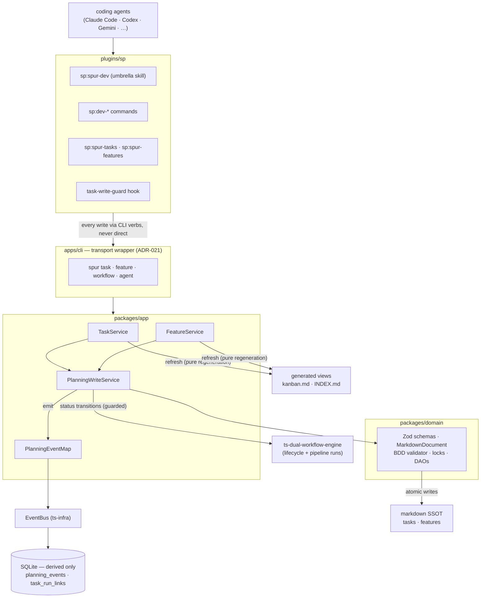

# rd3 Migration — System Design

**Date:** 2026-06-12 · **Status:** **Accepted** (operator review passed 2026-06-12) · **Updated:**
2026-06-12 (review round 1: mermaid overview, `verifying` status, hierarchical feature IDs,
R-numbering, upstream-task memo, DD-05 temp naming, plugin-convert out-of-scope)
**Inputs:** `docs/plans/rd3-migration-delivery.md` (surface catalog — exact names),
`docs/plans/2026-06-10-rd3-migration-feature-list.md` (dispositions),
`docs/plans/2026-06-10-rd3-tasks-bdd-research.md` (BDD evidence),
`cc-agents/docs/plans/2026-06-10-rd3-tasks-operator-feedback.md` (feature-file spec, matrix),
legacy source `cc-agents/plugins/rd3` (read-only reference).
**Governing decisions:** ADR-020–023. Mechanism constraints: `03_ARCHITECTURE.md §12`.

This is the Stage-D collective design (ADR-023(3)): everything in the batch is designed here
**together**; implementation follows by priority (§14). Items tagged TBD / held / postponed /
deferred are excluded from design-for-build and listed in §16 so nothing is silently lost.
Design level only — no implementation internals; the few code-shaped artifacts below (YAML
skeletons, field tables, one sequence) are normative contracts, not source code.

---

## 1. System overview



Load-bearing invariants (from ADR-020–022; restated because every section below depends on them):

1. **Files are the SSOT.** SQLite holds only derived, rehydratable data.
2. **One write path.** Every mutation, from any transport, goes through `PlanningWriteService`.
3. **Lifecycles run on the workflow engine.** No local FSM; engine gaps close upstream.
4. **Orchestration is configuration, not code.** Workflow YAML on `spur workflow run`; the batch
   builds no new orchestration machinery.
5. **Fat Skills, thin wrappers; deterministic work goes to CLI verbs.** LLM output is always
   CLI-validated before write.

---

## 2. Data design

### 2.1 Task file

Location: `<task-folder>/<WBS>_<slug>.md` (folders registered in config, §9). Heading
convention: `## <WBS>. <name>` title, `### <Section>` body sections (legacy-compatible — the
corpus already reads this way).

Frontmatter schema (`taskFrontmatterSchema`, Zod — the parse-validate-serialize SSOT):

| Field | Type | Req | Design notes |
|---|---|---|---|
| `schema_version` | literal `1` | ✔ | Gates strictness and future evolution (DD-03). |
| `name` | string | ✔ | Title; used in slug. |
| `description` | string | — | **No default**; legacy `description == name` noise dropped at migration. |
| `status` | `TaskStatus` | ✔ | Lowercase canonical (DD-01); see §2.3. |
| `type` | `task \| brainstorm` | — | Default `task`; `brainstorm` retained for corpus compatibility. |
| `profile` | enum (`simple\|standard\|complex\|research\|refine\|plan\|unit\|review\|docs`) | — | Single key; legacy `preset`/`profile` collapse here (DD-02). |
| `feature_id` | feature ID (§2.4) \| null | — | The **single traceability edge** to features. Renamed from legacy `feature-id` (DD-07). |
| `parent_wbs` | string \| null | — | The **single** sub-task convention (X02); replaces three competing legacy conventions. |
| `priority` | `P0..P3` | — | Aligned with the feature priority scale. |
| `tags` | string[] | — | Free-form filtering. |
| `dependencies` | string[] (WBS refs) | — | Soft references; `check` warns on dangling. |
| `created_at` / `updated_at` | ISO 8601 | ✔ | `updated_at` written **only** by the write service (fixes the legacy reliability problem). |

Removed from the legacy schema (A17 strips them): `impl_progress` (frozen-state problem; the
pipeline + lifecycle replace it), `folder` (derivable from file location), `preset` (collapsed).

Body sections come from the **canonical section vocabulary** (DD-08):
`Background · Requirements (optional, R-numbered — §3.1) · Acceptance Criteria · Q&A · Design ·
Plan · Solution · Root Cause · Testing · Review · References · History`.
Templates (§8) select from this vocabulary; no template or agent may invent synonym sections —
that is what keeps the matrix (§3.2) and tooling simple.

### 2.2 Feature file

Location: `docs/features/<ID>_<slug>.md`, flat namespace; the tree is encoded **in the ID
itself** (§2.4, DD-14) and rendered by `INDEX.md`. Heading convention: `# <ID>: <name>` title,
`## <Section>` sections (per the feature-file design spec).

Frontmatter schema (`featureFrontmatterSchema`):

| Field | Type | Req | Design notes |
|---|---|---|---|
| `schema_version` | literal `1` | ✔ | Same evolution mechanism as tasks. |
| `id` | feature ID (`^[A-Z][1-9]*$`) | ✔ | Position-encoding hierarchical ID (§2.4, DD-14); the parent is derived by dropping the last character — no `parent_id` field exists. |
| `name` | string | ✔ | |
| `status` | `FeatureStatus` | ✔ | `backlog \| active \| verifying \| blocked \| done \| cancelled` (§2.3, DD-13). |
| `priority` | `P0..P3` | ✔ | The P0 feature in `active`/`verifying` is the project goal (B09). |
| `tags` | string[] | — | |
| `created_at` / `updated_at` | ISO 8601 | ✔ | Write-service-owned, same as tasks. |

Body sections: `## Goal` (drives B09 default Background), `## Scope` (in/out), `## Acceptance
Criteria` (two-tier BDD, §3.3), `## Tasks` (auto-generated between HTML marker comments — the
only machine-owned region in any SSOT file), `## Notes`, `## History`.

### 2.3 Canonical statuses & lifecycle graphs

One lowercase canonical vocabulary for both domains (DD-01); display layers capitalize. Input is
case-insensitive and alias-tolerant (the legacy alias map — `completed→done`, `wip`, `dropped→
cancelled`, etc. — is preserved as input normalization, never as storage).

**TaskStatus:** `backlog · todo · wip · testing · blocked · done · cancelled`

```
backlog ──► todo ──► wip ──► testing ──► done
              ▲▼       ▲▼       ▲▼          │ (reopen, warned)
             blocked ◄─┴────────┘           ▼
                                           wip
   any non-terminal ──► cancelled (terminal)
```

Guard placement (executed by the lifecycle workflow, §5): `wip → testing` runs `task check`
warning-first; `testing → done` runs `task check` with the hard core (AC format, Solution
`file:line`, Review table) plus Testing-evidence presence. `done → wip` (reopen) is allowed with
a warning + mandatory History entry; `cancelled` is terminal.

**FeatureStatus:** `backlog · active · verifying · blocked · done · cancelled` (DD-13)

```
backlog ──► active ──► verifying ──► done        blocked ◄─► active
              ▲             │
              └── rework ◄──┘
   any non-terminal ──► cancelled (terminal)
```

`verifying` is the state that makes **feature verification work derivable** — listable
(`feature list --status verifying`), event-triggerable, assignable to machine or human. Guard
placement: `active → verifying` warns unless all linked tasks are done/cancelled;
`verifying → done` runs `feature check --strict` (AC validated, traceability clean) with an
optional HITL approval; `verifying → active` is rework (mandatory History entry).

"One active P0 goal" is a `feature check` rule, not an FSM constraint — the FSM stays
project-agnostic. Goal derivation counts `{active, verifying}` so a feature under acceptance
still owns the goal until it is done.

### 2.4 Identity & allocation

- **WBS:** zero-padded 4-digit, allocated per registered folder as
  `base_counter + max(existing) + 1`, under the **create-lock** (§4.2) — the race-safe legacy
  pattern preserved.
- **Feature ID (DD-14):** position-encoding hierarchical letter+digit. At project start the
  operator defines a small set of **orthogonal feature groups** (modules / components / business
  domains — properly sized, not too many, not too few); each group is a top-level feature file
  with a single-letter ID (`A`, `B`, …). Children append one digit per level: `A1` … `A9`,
  grandchildren `A11` … — **ID length = depth**. Allocation scans the parent's children under
  the create-lock; parent derivation is "drop the last character".
  - **≤9 children per node**, enforced by `feature check` — overflow is a *split-the-parent*
    signal, not a limitation to engineer around (the undotted/dotted hybrid was evaluated and
    rejected: dual written forms reintroduce reading ambiguity — DD-14).
  - **Moves are renames** (the ID encodes position): rare, CLI-mediated cascade rename — file,
    descendants, every task `feature_id` edge, History entries appended. Possible precisely
    because the CLI owns all writes (§4.1).
  - `spur feature create <name> --parent <id>` places a feature; creating with no parent
    allocates the next free group letter (init seeds the initial group set).
- Slugs are derived from `name` (filesystem-safe); renames change the slug only via the CLI so
  links stay consistent.

### 2.5 Derived DB schema (`drizzle/0003_spur_cli_planning.sql`)

| Table | Columns (design level) | Purpose |
|---|---|---|
| `planning_events` | `id`, `entity_kind` (`task\|feature`), `entity_id`, `event`, `from_status?`, `to_status?`, `run_id?`, `payload` (JSON), `created_at` | Append-only event ledger (§7); rebuildable from files' `## History`. |
| `task_run_links` | `id`, `wbs`, `run_id`, `kind` (`lifecycle\|pipeline`), `created_at` | Task ↔ engine-run traceability (D06). |

Engine run state persists in the existing engine tables. Rebuild rule: `spur migrate` (DB) can
always reconstruct both tables from the corpus — the test suite proves it (§13).

---

## 3. Validation architecture

Four layers, one entry point (`spur task check` / `spur feature check`), all behind the write
service for writes and callable standalone for reads:

| Layer | What it validates | Severity model |
|---|---|---|
| L1 — Schema | Frontmatter against the Zod SSOT | Hard error, always |
| L2 — Presence | Section-Status-Matrix: required/optional/forbidden sections for the current status | Warning-first; hard only where the matrix says `gate: true` |
| L3 — Format | Per-section format rules (table below) | Warning-first; hard core: AC format, Solution `file:line`, Review P1–P4 table |
| L4 — Traceability | `feature_id` edge exists & target not done/cancelled; task AC ⊆ feature AC; orphan-scenario warnings; dangling `dependencies`/`parent_wbs` | Warning-first |

`check` exit behavior: `0` clean or warnings-only, non-zero on any hard failure; `--strict`
elevates warnings to failures (for CI / workflow guards that want it).

### 3.1 Section format rules (L3 core set)

| Section | Format contract | Validated by |
|---|---|---|
| Requirements | Numbered requirement items (`R1.`, `R2.`, …) — a referenceable list that feeds AC generation, ideally 1:1 scenario mapping. **Recommended convention, not mandatory** (warning-level, only when the section exists) | format rule |
| Acceptance Criteria | Tier 1: fenced ```` ```gherkin ```` block (Gherkin subset) — spec tasks/features. Tier 2: checklist `- [ ]` — sub-tasks. Scenarios may reference R-ids in titles for requirement traceability | BDD validator (§3.3) |
| Solution | Must contain ≥1 `file:line` citation | format rule |
| Review | P1–P4 findings table (Severity/File/Finding/Recommendation) | table-shape rule |
| Testing | Results + numeric coverage claim or explicit `N/A` | format rule |
| Plan | Ordered checklist or table, not free-form prose | format rule |

### 3.2 Section-Status-Matrix (`config/tasks/section-matrix.yaml`)

Config, not code (ADR-015) — evaluated **CLI-side only**. Shape (normative skeleton):

```yaml
# per template variant; entries reference the canonical section vocabulary (§2.1)
variants:
  feature-impl:
    backlog:  { required: [Background],                          forbidden: [Solution, Review] }
    wip:      { required: [Background, Acceptance Criteria, Plan], optional: [Design] }
    testing:  { required: [Solution, Testing] }
    done:     { required: [Solution, Testing, Review], gate: true }
```

Tightening follows compliance data, not aspiration (03 §12.3): the matrix ships permissive,
`check --json` output is the measurement instrument.

### 3.3 BDD validator (X01 — `packages/domain` bdd module)

Port of the legacy `validate-feature.ts` (543 lines, 100% coverage), generalized:

- **Parser:** Gherkin subset (`Feature / Scenario / Given / When / Then / And / But`, tags) with
  AST types aligned to `@cucumber/gherkin` (no runtime dependency) — interop is free if a real
  cucumber toolchain ever appears. Plus a checklist parser (`- [ ]` / `- [x]`).
- **Validation:** structural issues (missing Feature line, empty scenario, step order) as
  `ValidationIssue[]` with line numbers — the legacy result contract is kept.
- **Coverage check (L4):** a task *covers* a feature scenario when the task's AC contains a
  scenario whose normalized title matches (or a checklist item that names it). Subset rule:
  every task scenario must map to a feature scenario; feature scenarios with no covering task
  are **orphan warnings** (never errors — features legitimately precede decomposition).
- Tag filters (`@wip`, `@phase-2`, …) pass through the AST for future pipeline use.

Promotion path: this module's API is frozen as if it were already `@gobing-ai/ts-bdd` (§9 of the
delivery doc) — no Spur-internal imports inside the module, so promotion is a move, not a
rewrite.

---

## 4. Write path & concurrency

### 4.1 `PlanningWriteService` — the one mutation sequence

Every verb that mutates a file executes this exact sequence (normative):

```
1  acquire lock            create-lock (new file) or per-WBS/per-FT lock (existing)
2  read + parse            MarkdownDocument → Zod (L1 hard-fails abort here)
3  apply mutation          frontmatter change | section replace | create-from-template
4  validate                L2/L3 (warning-first; hard core aborts)
5  lifecycle transition    only if status changed: engine requestTransition (§5) —
                           guard failure aborts the whole write
6  serialize + write       atomic: write temp file, fsync, rename (DD-05)
7  history append          status changes append one `## History` line (timestamp, from→to, actor)
8  emit + persist event    PlanningEventMap publish → planning_events insert
9  release lock
```

Consequences: `updated_at` is set in step 6 only (single writer of truth); a failed guard never
half-writes; CLI and any future server route are race-free **by construction** because both are
this code path (ADR-021).

### 4.2 Locking (H04)

- **Create-lock:** one per folder (`<folder>/.create.lock`) serializing WBS/FT allocation.
- **Entity lock:** one per WBS / FT id, serializing read-modify-write.
- **Staleness:** lock files carry pid + timestamp; locks older than a configured TTL are
  broken with a warning event (legacy semantics preserved).
- One lock domain: the lock module lives in `packages/domain` and is reachable **only** through
  `PlanningWriteService` — no other code may import it (enforced by review + a rule preset).

### 4.3 Generated artifacts (`refresh`)

`kanban.md` and `INDEX.md` are pure functions of the corpus: full regeneration, no incremental
patching, deterministic ordering (so diffs are meaningful). `INDEX.md` renders the ID-encoded
tree (§2.4) in `tree`-command style with per-node status and a markdown link per feature. Feature
`## Tasks` blocks are rewritten only between the auto-gen markers; everything else in a feature
file is operator/agent territory.

---

## 5. Lifecycle on the workflow engine (ADR-022)

### 5.1 Definitions

`config/workflows/task-lifecycle.yaml` and `feature-lifecycle.yaml` are `kind: state-machine`
definitions (existing engine schema): **states = the §2.3 statuses, transitions = the §2.3
graphs, guards = `spur task|feature check` invocations** at the placements in §2.3. Skeleton
(normative shape, abbreviated):

```yaml
"$schema": "@gobing-ai/ts-dual-workflow-engine/schemas/state-machine-workflow.schema.json"
kind: state-machine
name: task-lifecycle
initialState: backlog
terminalStates: [cancelled]        # done is re-enterable (reopen); cancelled is not
states:  [...one per TaskStatus...]
transitions:
  - { from: wip, to: testing, guard: { kind: rule-or-shell, runs: spur task check <wbs> } }
  - { from: testing, to: done,  guard: { ... check --strict-core + testing evidence ... } }
  # ... full §2.3 graph ...
```

### 5.2 Run binding & rehydration

- One lifecycle run per entity, keyed `task:<wbs>` / `feature:<id>` (DD-04).
- `spur task update <wbs> <status>` → write service → engine `requestTransition` on the attached
  run. The engine answers allowed/denied(+guard report); the file write proceeds only on allowed.
- **Rehydration rule (the ADR-022 invariant made operational):** if the engine has no run for an
  entity, or the run's current state disagrees with the file's frontmatter `status`, the file
  wins — the service re-seeds the run at the frontmatter status and emits a
  `task.transitioned`-free corrective event. Engine persistence is a cache of the files, never
  an authority.

### 5.3 Upstream capability contract (ts-libs gate for Wave 0)

The engine work items from the delivery doc §9, specified as capabilities the planning layer
consumes (the ts-libs tasks are written against these):

| # | Capability | Consumed by |
|---|---|---|
| E1 | Durable named runs: create-or-attach by external key; state survives process exits | §5.2 binding |
| E2 | External transition request API: `requestTransition(run, to)` → allowed/denied + guard report, without the engine driving the loop | `task|feature update` |
| E3 | Pause/resume: a run can suspend at a state and continue later (`spur workflow continue [run-id] [--yes]`) | D04 HITL, §6 |
| E4 | Stable event seam across rehydration: `on_transition` / `on_guard_fail` / `on_complete` fire identically for attached and fresh runs | §7 events |

No local fallback exists by design — if an upstream item slips, the dependent wave slips (risk
R1, §17). That is the ADR-022 trade accepted knowingly.

---

## 6. Execution pipeline (`config/workflows/task-pipeline.yaml`)

`kind: state-machine` run **per execution attempt** of one task (vars: `wbs`). Design shape:

```
precheck ──► implement ──► test ──► review ──► approve(HITL) ──► verify ──► record ──► done
   │ guard: spur task check <wbs>                  │ pause (E3); spur workflow continue
   └─ fail → blocked-report                        └─ skippable via --auto profile
```

- Steps are `agent.run` actions carrying `sp:dev-*` command inputs (the feature-dev.yaml
  precedent) plus deterministic `rule.check`/shell gates — no new action kinds needed.
- `record` writes results into the task (`## Testing`, `## Review`) **via
  `spur task update --section`** — the pipeline never touches files directly (invariant 2).
- The pipeline requests status transitions (`wip` on start, `testing` after implement+test,
  `done` after record) through the normal verb — so lifecycle guards apply identically whether a
  human or the pipeline drives the task.
- `approve` is the single HITL gate of the standard pipeline; profiles (a `--var` choice, not a
  fork of the YAML) may skip it. Run linkage lands in `task_run_links`.

---

## 7. Events & observability

Emission point: step 8 of the write sequence (§4.1) — exactly one emitter. Envelope (normative
core, payload details Stage-D-frozen at implementation):

```
{ event, entity: { kind: task|feature, id }, at, from?, to?, run_id?, data? }
```

| Event | Emitted on |
|---|---|
| `task.created` / `feature.created` | create, incl. each batch-create item |
| `task.updated` / `feature.updated` | any non-status write |
| `task.transitioned` / `feature.transitioned` | lifecycle transition committed (incl. cancel/reopen) |

Engine-seam events (`on_transition`, `on_guard_fail`, `on_complete`) remain engine-level;
`PlanningEventMap` is the Spur-typed layer over the seam. Persistence: every event → one
`planning_events` row. Consumers now: observability (`--json` queries, future
`spur task trace` if it earns a verb); consumers later, zero rework: SSE/board (postponed),
scheduler auto-trigger (D07), custom extensions (D08). No `*.deleted` events — no delete verbs.

---

## 8. Templates (`config/templates/`)

One base + four purpose variants (operator-selected), each a real markdown file with
`{{ PLACEHOLDER }}` substitution (legacy mechanism kept — it is sufficient; no template engine
dependency):

| Template | Sections (from the canonical vocabulary) | Notes |
|---|---|---|
| `task/default.md` | Background · Acceptance Criteria · Plan · Solution · Testing · Review · References · History | The neutral shape; Q&A/Design opt-in via matrix `optional` |
| `task/feature-impl.md` | + Design (optional), AC pre-seeded from the linked feature's scenarios | The workhorse; `--feature <id>` pulls Goal → Background (B09) |
| `task/issue.md` | Background (repro) · Root Cause · Solution · Testing · History | Bug/issue report |
| `task/review.md` | Background · Review (P1–P4 table) · History | Review-summary task |
| `task/meta.md` | Background · Plan · History | Process/docs/chore; **no AC requirement** |
| `feature/default.md` | Goal · Scope · Acceptance Criteria · Tasks (markers) · Notes · History | Per the feature-file spec |
| `bdd/gherkin.md` · `bdd/checklist.md` | — | The two AC-tier skeletons templates and the pipeline embed |

Variant choice is recorded nowhere in frontmatter — the matrix keys on the variant only at
creation; afterwards the file is judged by its sections (files stay self-describing, no hidden
template state). This is what fixes the "6–8 empty stubs" failure: a variant creates only the
sections its purpose needs.

---

## 9. Configuration

`.spur/config.yaml` additions (zod schema in `packages/config`, camelCase keys per existing
convention):

```yaml
tasks:
  folders:
    docs/tasks: { baseCounter: 0, label: Core }   # legacy folders/base_counter absorbed
  active: docs/tasks                               # default folder for create
features:
  dir: docs/features
```

`spur init` copies the §8 templates, `config/tasks/section-matrix.yaml`, and the two lifecycle +
pipeline workflow YAMLs into the project (ADR-015 pattern, same as rules/workflows today).
JSON schemas (`apps/cli/schemas/`): `spur-config.schema.json` extended; `task-batch.schema.json`
(the LLM gate — §12.2); `section-matrix.schema.json`; generated
`task-frontmatter.schema.json` / `feature-frontmatter.schema.json` from the Zod SSOT.

---

## 10. CLI behavior contracts

Surface is fixed in the delivery doc §1; this section fixes the **behavior conventions** all
task/feature verbs share:

- **Output:** human text by default; `--json` returns the ts-utils api-response envelope
  (`ok/data/error`) — same shape as existing `spur rule|workflow` commands. Machine consumers
  parse only the envelope.
- **Exit codes:** `0` success (warnings allowed) · `1` operation/validation hard failure · `2`
  usage error — aligned with the existing spur convention; `check --strict` makes warnings exit
  `1`.
- **Error messages:** what failed + expected + the path/WBS/FT involved (project error rule).
- **Read verbs never lock; write verbs always go through §4.1.** `list`/`show`/`check`/`resolve`
  are side-effect-free and safe under concurrent writes (they read committed files only).
- **Filters:** `list` filter semantics are spec'd and tested as part of the verb (the legacy
  filter bugs are a rewrite requirement — delivery doc §1.1); filters compose with AND.

---

## 11. Corpus migration (`spur task migrate` — A17)

One idempotent normalization pass over all 7 legacy corpora. Pipeline:
**discover → lenient-parse → transform (rules below) → strict-validate → atomic write → report**.
`--dry-run` produces the full report with zero writes; re-running on migrated corpora is a
no-op (idempotency is a tested property).

| # | Rule | From → To |
|---|---|---|
| M1 | Status canon | alias/case normalize; `Canceled` → `cancelled`; unknown → `backlog` (flagged in report) |
| M2 | Key collapse | `preset`/`profile` → `profile` (profile wins when both present) |
| M3 | Edge rename | `feature-id` → `feature_id`; empty string → key removed |
| M4 | Noise removal | drop `impl_progress`; drop `folder`; drop `description` when `== name` |
| M5 | Sub-task unification | the three legacy parent conventions → `parent_wbs` (unresolvable → report) |
| M6 | Versioning | add `schema_version: 1` |
| M7 | Timestamp repair | missing/implausible `updated_at` recovered from git log (fallback: file mtime, flagged) |
| M8 | History seed | append a `## History` migration entry; never rewrite existing history |

Body sections are **not** rewritten (M-rules touch frontmatter + append-only History only):
legacy `Requirements` prose is not converted to Gherkin — the matrix treats migrated files
leniently via their content, and new work uses the new templates.

**Cutover (operator decision 2026-06-12):** the tool ships in Wave 0; corpus cutover executes
only when the new board (server/web design task) is daily-driver usable. Until then the legacy
`tasks` CLI + board own the legacy corpora, and `spur task` is used on fresh corpora only —
the two toolchains never write the same folder (enforced by simply not registering legacy
folders in `.spur/config.yaml` until cutover).

---

## 12. Agent layer (`plugins/sp`)

### 12.1 `sp:spur-dev` — the umbrella skill contract

Two halves, one skill, every write CLI-gated:

**Planning half (C01–C03):**

```
vague description
  → intake (clarify scope/constraints — prompt work)
  → spur feature create … ; AC authored/generated (spur agent run, bdd templates)
  → GATE: spur feature check   (BDD validator; loop until clean)
  → decomposition (prompt work) → task-batch JSON
  → GATE: task-batch.schema.json + spur task batch-create (atomic: all-or-nothing)
```

**Execution half:**

```
pick task (spur task list --json)
  → spur workflow run config/workflows/task-pipeline.yaml --var wbs=<wbs>
  → on HITL pause: surface to operator → spur workflow continue [run-id] [--yes]
```

The skill knows *how to think* (decomposition quality, AC style, when to ask); the CLI knows
*what is valid*. Neither crosses into the other's half — that is the ADR-016/023 line in
operation.

### 12.2 The LLM→CLI gates

Two machine contracts make the skill safe: `spur feature check` (AC quality gate) and
`task-batch.schema.json` (decomposition shape gate). A skill/LLM regression can therefore never
corrupt the corpus — worst case is a rejected write with a findings report the skill can react
to.

### 12.3 Companions, commands, subagents, hook

- `sp:spur-tasks` / `sp:spur-features`: reference companions (verb usage, conventions,
  check-before-write discipline). No pipeline logic — they document; `sp:spur-dev` acts.
- `sp:dev-*` commands: thin wrappers parameterizing `sp:spur-dev` entry points (candidate set in
  the delivery doc §7.3; final subset = ADR-016 test at implementation of Wave 3).
- `sp:expert-dev` / `sp:expert-tasks` / `sp:expert-features`: thin subagent wrappers of the
  skills, for isolated-context runs.
- `task-write-guard` hook (PreToolUse): file path → `spur task resolve` → if owned by a task, deny
  the raw write and steer to the `spur task` CLI. Pure delegation; an env toggle
  (`SPUR_WRITE_GUARD=off`) is the escape hatch. **Shipped ownership-only (0067):** the post-edit
  `spur task check` gate is deferred until the corpus is migrated to the DD-07 schema — today
  `check` rejects every rd3-authored task file, so gating on it would block all legitimate edits.
  The resolve/`info` call-count TBD (delivery §1.3) is settled: ownership needs only `resolve`, so
  no `info` verb is added.

### 12.4 Prompt-skill dispositions

Per the delivery doc §7.2 (designed but independent of the core waves): `sp:brainstorm`
(move + later scenario-command set), `sp:doc-evolve` (constitution-native rewrite; its design is
its own small spec at build time — it operates on `docs/99` rules, not planning files),
`sp:daily-summary` (verify-then-adopt), `sp:anti-hallucination` (move-only). Review/verification
wrappers: held (§16).

---

## 13. Cross-cutting

- **Errors/output/Result:** consolidate on `@gobing-ai/ts-utils` (H02/H13); config via the
  existing ts-runtime/ts-infra stack (H03); file I/O through ts-runtime `FileSystem` (H12). Any
  gap = upstream change first (shared-library evolution rule). No local utility forks.
- **Testing strategy (H05):** per-file ≥90% line+function (repo bar). Domain: schema
  round-trip property (parse→serialize is lossless), BDD validator ported with its full legacy
  test suite, lock contention tests (concurrent create/update on temp dirs). App: write-sequence
  tests against in-memory SQLite + temp corpora; **idempotency test for migrate** (run twice ⇒
  zero diff); **rebuild test** for derived tables (§2.5); golden-file tests for `kanban.md` /
  `INDEX.md`. CLI: verb-level integration via temp projects. Helpers live per-workspace in
  `tests/helpers.ts` (shared workspace held — §16).
- **Doc sync (X05):** each wave's landing commits fill the matching `04_DESIGN.md §7.x`
  subsection and flip `05_FEATURES.md` rows — scheduled per wave, not remembered.

---

## 14. Implementation priority (waves, post-review of 2026-06-12)

Dependency-ordered; each wave gates the next. The board wave is gone (postponed); cleanup is
last and gated per item.

| Wave | Contents | Gated by |
|---|---|---|
| **W0 — Upstream + foundation** | ts-libs: E1–E4 engine capabilities (§5.3) + ts-utils/ts-runtime gap closures · `taskFrontmatterSchema`/`featureFrontmatterSchema` · `MarkdownDocument` · BDD validator · locks · lifecycle YAMLs · `migrate` tool (build only) | this design passing review |
| **W1 — Task domain + CLI** | `TaskService`, `PlanningWriteService`, events + DAOs + `0003` migration file · all `spur task` verbs · section-matrix + templates · config keys | W0 |
| **W2 — Feature domain + CLI** | `FeatureService` · all `spur feature` verbs · INDEX/tree · traceability (L4) · B09 goal derivation | W1 (shares the write path) |
| **W3 — Pipeline + agent layer** | `task-pipeline.yaml` + `workflow continue` (E3) · `sp:spur-dev` + companions + `dev-*` subset (ADR-016 test) + `expert-*` + write-guard hook · M12 team-mode verification | W2 |
| **W4 — Cleanup (cc-agents side)** | I-group as dispositioned, each item gated on its replacement being verified; I01/I02 (legacy UI/server) additionally gated on the future board | W3 + per-item verification |
| **(outside waves)** | A17 corpus cutover — after the server/web design task delivers the board | board |

X05 doc sync runs continuously from W1.

**Upstream-task memo (W0 ts-libs work, and any later upstream item):**

- Upstream tasks are managed **in the owning project**: run the `tasks` CLI from that project's
  root (e.g. `~/xprojects/ts-libs`) so task files are created and operated there — never in this
  repo's task folders.
- Upstream task files must be **self-contained**: carry the full capability contract (§5.3
  rows), acceptance criteria, and context inline, so they are executable without referencing
  back to spur-new tasks or docs.
- Enhancing `@gobing-ai/ts-*` packages is sanctioned whenever genuinely needed (shared-library
  evolution rule) — smallest upstream change that makes the package the right facade, verified
  by ts-libs' own gates, consumed by semver release (temporary `bun link` only while validating).

---

## 15. Design decisions register

Reviewable, numbered; silence = accepted with the doc.

| DD | Decision | Rationale / alternative rejected |
|---|---|---|
| DD-01 | **Lowercase canonical statuses** for both domains; case/alias-tolerant input; display capitalizes | One vocabulary across tasks+features+YAML; A17 rewrites every file anyway. Alt (keep TitleCase tasks / lowercase features): two conventions forever. |
| DD-02 | `profile` is the single profile key; `preset` dies at migration | Two keys for one concept was a documented corpus bug. |
| DD-03 | `schema_version: 1` literal in both schemas; bumps are explicit migration events | Cheap now, structural later. |
| DD-04 | Lifecycle runs keyed `task:<wbs>` / `feature:<id>`; **file wins** on engine/file disagreement (re-seed + corrective event) | Makes the ADR-022 "no second authority" invariant mechanical. |
| DD-05 | Atomic writes: temp + fsync + rename, always under the entity lock. Temp names always compose **project name + WBS/feature id** (+ random suffix), e.g. `.spur-new.0042.<rand>.tmp` | Crash-safe; no partially-written SSOT files; no temp-name collisions across projects/entities sharing a filesystem. |
| DD-06 | Matrix ships permissive (hard core only); tightening is data-driven via `check --json` telemetry | 03 §12.3 verbatim; avoids the legacy over-prescription failure. |
| DD-07 | Frontmatter keys are snake_case; `feature-id` → `feature_id` at migration | One key style (`schema_version`, `parent_wbs`, `created_at` already are). |
| DD-08 | Canonical section vocabulary; templates/variants select from it, never invent synonyms. `Requirements` is an **optional structured section** (R-numbered items, §3.1) feeding AC generation; legacy free-form Requirements prose is left untouched by migration | Matrix + format rules stay closed-world; migration never rewrites prose; R-ids give a cheap reference + 1:1 AC mapping convention. |
| DD-09 | AC coverage matching by normalized scenario title (tags reserved for filtering, not identity) | Simplest contract agents reliably produce; revisit only with evidence. |
| DD-10 | Frontmatter drops `folder` (derivable) and the `description==name` default | Noise removal; both flagged by the evidence review. |
| DD-11 | `task/feature create` heading + section structure comes only from templates; the CLI never hardcodes body content | Operator-customizable corpus shape (ADR-015 spirit). |
| DD-12 | The two legacy-vs-new toolchains never share a folder pre-cutover (legacy folders simply aren't registered in `.spur/config.yaml`) | Cheapest possible isolation; no write fencing code needed. |
| DD-13 | Feature lifecycle gains a `verifying` status between `active` and `done` (§2.3) | Makes feature verification work observable/derivable (listable, event-triggerable) for humans and machines; a guard-only design would check but leave the work invisible. |
| DD-14 | Hierarchical letter+digit feature IDs (§2.4): orthogonal groups at init, one digit per level, length = depth, ≤9 children/node, parent derived from ID, no `parent_id` field; moves = CLI cascade-rename | Position readable in any flat list; overflow is a decomposition signal. The undotted/dotted **hybrid was rejected**: dual written forms reintroduce ambiguity (A12 vs A.12) the scheme exists to eliminate. Replaces the feature-file spec's `FT-NNN` + `parent_id`. |

## 16. Exclusions registry (designed-around, not designed-for-build)

| Tag | Items |
|---|---|
| Rejected | `spur task info` / `spur feature info` — decided against at 0067: the write-guard hook (their only proposed consumer) is ownership-only and needs just `spur task resolve`, so a one-call frontmatter verb collapses no subprocesses (delivery §1.3) |
| Held | `@gobing-ai/spur-testing` workspace · review/verification prompt wrappers (drop-or-rewrite later) · `plan-*` command names |
| Postponed | HTTP API · SSE endpoint · board UI · oRPC planning contracts · board launcher (X03) — all behind the server/web design task; §4–§7 designs already provide their attachment points (write service, event ledger) |
| Out of scope | Cross-agent plugin conversion/adapter tooling (F05–F11, M11 `spur plugin convert`) — the operator builds it as an **independent tool** outside Spur (decision 2026-06-12); Spur's `plugins/sp` stays Claude-Code-shaped until that tool exists |
| Deferred (triage) | E02–E07 web · F05–F11 adapters · meta-tooling M01–M11 + H07–H11 · K01–K04/K06/K07 extraction · L-group · `spur inspect` N-group · D07 auto-trigger · C05 overview |
| Rejected (triage) | A09, B10, C06, K05-as-package, L05, N06, N07 — plus `task/feature delete` (this round) |

## 17. Risks

| # | Risk | Mitigation |
|---|---|---|
| R1 | Upstream engine capabilities (E1–E4) slip and gate W0/W1 | ts-libs tasks are the first work items of W0; no local fallback exists **by design** (ADR-022) — schedule risk is accepted, scope risk is not |
| R2 | Matrix/format rules too strict in practice → agents fight the gate | DD-06 permissive start + telemetry; only the 3-rule hard core gates |
| R3 | Lifecycle-run drift vs files at scale | DD-04 file-wins rehydration is self-healing and tested |
| R4 | `sp:spur-dev` grows into a god-skill | The two-halves contract (§12.1) is its internal seam; split there when size hurts (operator-accepted trade) |
| R5 | Dual toolchain confusion pre-cutover | DD-12 folder isolation + delivery-doc cutover rule (operator never boardless) |
| R6 | Migration surprises in 7 heterogeneous corpora | `--dry-run` report first; M-rules flag rather than guess (M1/M5/M7); idempotency tested |

## 18. Review & next step

Review gate for this document: (1) DD-01…DD-12 each accepted or amended; (2) §5.3 capability
contract confirmed as the ts-libs task list; (3) wave order accepted. On pass, the next step is
**feature finalizing + task creation/decomposition**: the batch becomes feature files (grouped
under the §2.4 ID scheme) with BDD AC and decomposed tasks (created with the legacy tasks CLI until cutover — eating the
new dog food arrives with W1), executed wave by wave per §14.

---

*Surface names: `docs/plans/rd3-migration-delivery.md`. Dispositions:
`docs/plans/2026-06-10-rd3-migration-feature-list.md`. Mechanism: `03_ARCHITECTURE.md §12`.
Decisions: ADR-020–023. As items ship, the normative shapes here land in `04_DESIGN.md §7`
(same-commit rule); this document then remains the design rationale record.*
