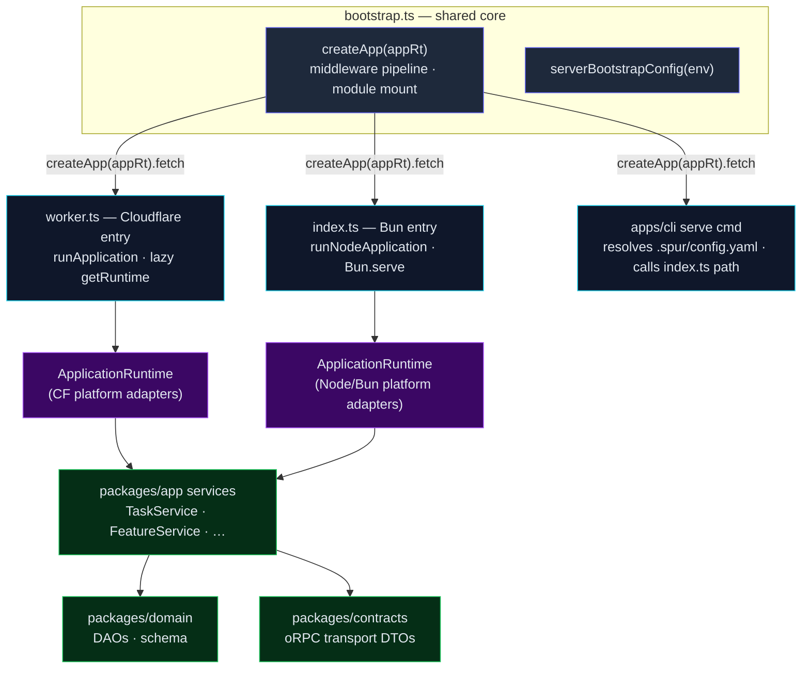
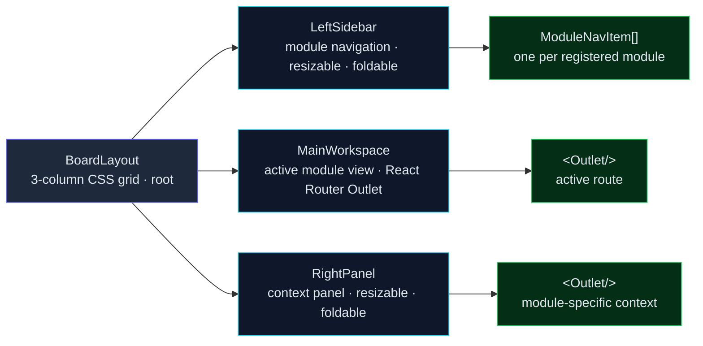
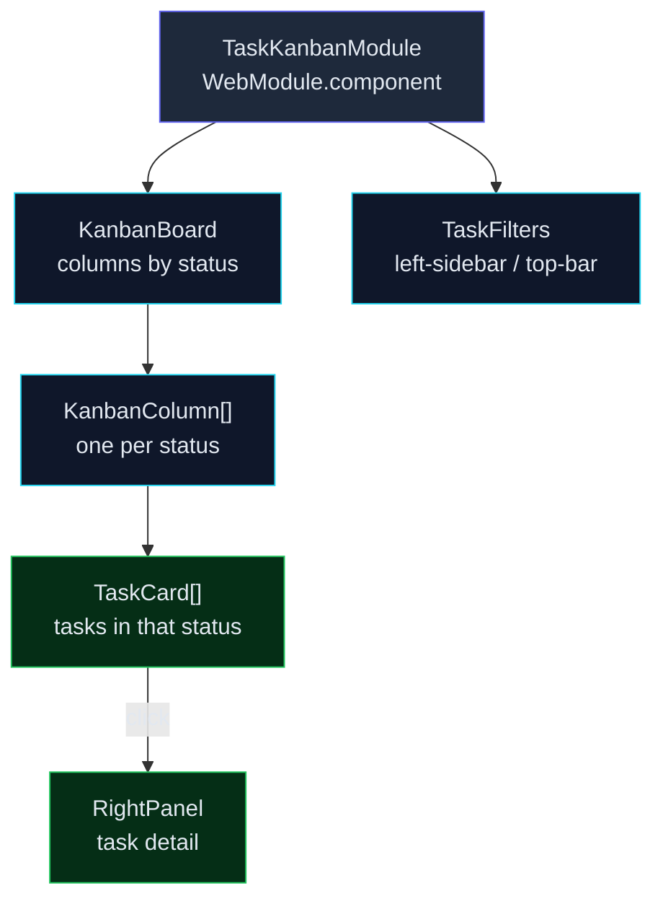

# Server-Side Adjustment — Design

**Date:** 2026-06-14 · **Status:** Design v0.1 (step 2 of 6 — derives mechanism from the v0.3
feature list; all open questions resolved in the feature draft)

**Source of truth for:** module interface shapes (`ServerModule`, `WebModule`), middleware order,
`ServerContext` wiring, oRPC contract shapes, layout component tree, module manifest format,
error/output envelopes, `spur serve` config resolution, deployment-target divergence.

**Not the source of truth for:** the feature list and scope (that is
`server-side-adjustment-feature-drafted.md`); decisions and one-line reasons (`00_ADR.md`); module
boundaries and data-flow rationale (`03_ARCHITECTURE.md`); command/flag/env surface shapes that
land in `04_DESIGN.md` in the same commit a command ships.

**Architecture anchors (binding):**

- ADR-005: oRPC is the type seam — contracts in `packages/contracts`, handlers bound via
  `implement(contract)`, OpenAPI generated, client via `OpenAPILink`.
- ADR-017: CLI bootstrap on `runNodeApplication`; `.spur/config.yaml` with a portable `bootstrap:`
  section. The server reuses the identical wiring.
- ADR-019: two entries (`worker.ts` for Cloudflare via `runApplication`; `index.ts` for Bun via
  `runNodeApplication`) sharing `bootstrap.ts`.
- ADR-021: apps are transport wrappers; functionality lives in `packages/app`. Both CLI commands
  and server routes call the same services — one write path, one lock domain.
- ADR-022: lifecycle transitions go through `spur workflow` definitions; the markdown `status` is
  the SSOT.

---

## 1. Design principles

1. **One core, two thin entries.** `createApp(appRt)` in `bootstrap.ts` is the entire server.
  `worker.ts` and `index.ts` are ≤30-line adapters that build an `ApplicationRuntime` and call
  `createApp(appRt).fetch`. No business logic in either entry — mirrors the CLI's `main(argv)` vs
  `index.ts` split.
2. **Module pattern over per-route wiring.** A `ServerModule` interface is the standard for every
  API domain (health, task, feature, workflow, …). `createApp` iterates registered modules; no
  domain code touches `createApp` directly. Mirrors `registerXxxCommand(program, context)` in the
  CLI.
3. **One transport on the web tier.** `OpenAPILink` is the sole HTTP transport. No `APIClient`,
  no facade, no second abstraction layer. Cross-cutting concerns (timeout, tracing, error
  reporting) are a thin fetch wrapper + an oRPC interceptor on the link chain.
4. **Config is one file.** `.spur/config.yaml` gains a `server:` block. No second config file, no
  parallel load path. Precedence: CLI flag → config → env → default.
5. **Markdown is the SSOT; DB is derived.** The server's task/feature routes call the same
  `packages/app` services the CLI uses. The server never reads or writes markdown directly; it
  never owns a lock; it never owns a lifecycle transition — the write service does.
6. **Cloudflare-default, local-capable — via `ts-runtime`, not by forking code.** The same source
  compiles to a Cloudflare Worker (default deployment) and a local Bun binary (`spur serve`).
  Platform divergence is **never** expressed as `if (isCloudflare)` branches in app code; it lives
  exclusively behind `@gobing-ai/ts-runtime`'s `RuntimeFactory` abstraction (§2.1.1). **If the
  shared library cannot express a divergence cleanly, enhance the library first, then consume the
  enhanced version — do not paper over the gap in Spur app code.**

---

## 2. Server architecture

### 2.1 Entry wrappers and shared core



### 2.1.1 Runtime adaptation is `ts-runtime`'s job, not Spur's

The **only** place platform divergence (Cloudflare Workers vs local Bun) is allowed to live is
behind `@gobing-ai/ts-runtime`'s `RuntimeFactory` seam. Spur app code (`bootstrap.ts`, modules,
services, entries) is platform-agnostic; it calls `loadRuntimeFactory()` and consumes whatever
the factory returns. No `isCloudflareWorkerRuntime()` checks, no `if (c.env)` branching, no
platform-specific imports outside the runtime layer.

**Current state of `ts-runtime` (verified 2026-06-15 against the installed `@gobing-ai/ts-runtime@0.3.18`
type declarations / `~/xprojects/ts-libs/packages/runtime/src`):**

| Facility | Status | Notes |
|---|---|---|
| `RuntimeFactory` interface (`createFileSystem` / `createProcessExecutor` / `loadConfig`) | ✅ present | `runtime-factory.ts` — the seam both factories implement. |
| `loadRuntimeFactory()` auto-detection | ✅ present | `platform.ts` — probes `navigator.userAgent`, caches, lazy-imports the right factory. |
| `nodeBunFactory` | ✅ present | `runtime-node-bun.ts` — real FS, `ProcessExecutor`, YAML config loader. |
| `cloudflareWorkersFactory` | ✅ present | `runtime-cf.ts` — CF stub FS, throws on process exec, YAML from `CONFIG_YAML` binding. |
| `RuntimeContext` service container | ✅ present | `context.ts` — typed `register/get/require`, `dispose()` cascades, scope field. |
| `RuntimeCapabilities` (`hasFilesystem` / `hasProcessExecution` / `hasPersistentStorage`) | ⚠️ declared but **not surfaced for DB** | CF factory sets all three to `false`; Bun factory sets all to `true`. There is **no DB factory method** on `RuntimeFactory` and **no `hasSqlDatabase` capability** — the server needs both. |

**The gap this design depends on:** the server's `ServerContext.getDb()` (§2.3) must obtain a
migrated `DbAdapter` on both runtimes. Today that wiring lives in the Spur bootstrap (`createMigratedDb`
on Bun; nothing on Workers). Per the enhance-first rule, this must move into `ts-runtime` (or its
sibling `ts-db`), not be forked per-platform in `apps/server`.

**Required `ts-runtime` enhancement (prerequisite to S1, done in `ts-libs` first):**

1. **Add a DB facility to `RuntimeFactory`.** Extend the interface with
   `createDbAdapter(config: DatabaseConfig): Promise<DbAdapter>` (returns `@gobing-ai/ts-db`
   `DbAdapter`). This keeps `ts-runtime` as the single platform-adaptation seam and prevents
   `apps/server` from importing `ts-db` directly (resolving the dead-dep note in S1).

2. **Add `hasSqlDatabase` to `RuntimeCapabilities`.** Currently the capabilities bag covers FS /
   process / persistent-storage; it needs an explicit SQL-DB flag so `ServerContext` can decide at
   runtime whether to build an eager DB (Bun) or defer to `DATABASE_URL` / D1 binding (Workers).

3. **`cloudflareWorkersFactory.createDbAdapter`** resolves a Cloudflare D1 binding (named in
   `bootstrap.database.driver` / a new `d1Binding` key) into a `DbAdapter`. D1 support itself lives
   in `ts-db` (see §2.3.1); `ts-runtime` only selects it.

4. **`nodeBunFactory.createDbAdapter`** wires Bun SQLite at the configured path through `ts-db`
   (current behavior, relocated from Spur bootstrap).

5. **Scheduler + EventBus adapters are already abstracted** in `ts-infra` (`scheduler-cloudflare` /
   Node scheduler). No `ts-runtime` work needed for those; the server just calls the factory.

**Enhancement rule (binding):** each item above is shipped as a `ts-libs` change first, versioned,
and consumed by Spur through a published semver bump or an explicit temporary `bun link` (per
`AGENTS.md` "Dependency source"). A `ts-runtime` gap is **never** patched by `if`-branching in
`apps/server`. If a gap surfaces during implementation that this list missed, stop, file the
`ts-libs` enhancement, and resume once released — do not accumulate divergence.

**What stays identical across both entries (the invariant):**

- `createApp(appRt)` — Hono app, middleware pipeline, oRPC handler mount, module registration.
- `serverBootstrapConfig(env)` — logging/telemetry/events config from env.
- `packages/app` services — `TaskService`, `FeatureService`, `PlanningWriteService`, etc.
- `packages/contracts` — oRPC contracts; same types on both targets.

**What diverges (the only divergence):**

| Concern | Cloudflare Workers | Local Bun binary |
|---|---|---|
| Bootstrap | `runApplication` (portable, no `node:*`) | `runNodeApplication` (`node:fs`, file sink) |
| Runtime cache | Per-isolate `getRuntime` singleton (lazy promise) | Single process; `runNodeApplication` owns lifecycle |
| Logger | Console-based (Workers log stream) | File + console (pino-style via ts-infra) |
| Database | External via `DATABASE_URL`, or Durable Object SQLite | Bun SQLite at `.spur/spur.db` |
| Scheduler | Cron Triggers (`scheduler-cloudflare`) | `setInterval` / node-cron |
| Static assets | Workers Static Assets binding (SPA fallback) | Hono `serveStatic` from `webDistPath` |
| Shutdown | Per-request (stateless); no drain needed | SIGINT/SIGTERM → `app.stop()` → drain |

### 2.2 Middleware pipeline (S1)

**Order matters.** Each middleware depends on the context set by the one above it. The order is
fixed in `createApp`:

```
1. secureHeaders()          — X-Frame-Options, X-Content-Type-Options, etc. (existing)
2. cors()                   — configurable origins; default same-origin
3. requestId()              — injects c.var.requestId (UUID v4); threads into logs + errors
4. bodyLimit({ maxSize })   — rejects oversized bodies before oRPC parse (default 1 MiB)
5. requestLogger()          — structured log: method, path, requestId; logs response on completion
6. errorHandler()           — global try/catch; maps to api-response envelope; never leaks stack in prod
7. compress()               — gzip/deflate for JSON responses
8. contextInjector(appRt)   — sets c.var.rt, c.var.ctx (ServerContext) for downstream handlers
```

**Rationale for the order:**

- `secureHeaders` first: every response gets security headers, including error responses.
- `cors` before `requestId`: CORS preflight (`OPTIONS`) must succeed without a request-id.
- `requestId` before `requestLogger`: the logger needs the id for correlation.
- `bodyLimit` before the oRPC handler: defense-in-depth; a 100 MiB body never reaches Zod parse.
- `requestLogger` wraps the handler so it captures the final status code and duration.
- `errorHandler` wraps the handler so unhandled throws become structured envelopes, not HTML 500s.
- `compress` is last-before-handler so it compresses the actual response body.
- `contextInjector` sets `c.var.ctx` right before the oRPC mount so the handler sees it.

**Existing code change:** `bootstrap.ts` currently has only `secureHeaders()` + the oRPC mount.
The pipeline replaces lines 50–73 of the current `createApp`.

**`ContextVariableMap` extension:**

```typescript
declare module 'hono' {
    interface ContextVariableMap {
        rt: ApplicationRuntime;
        ctx: ServerContext;       // new — lazy service bundle
        requestId: string;        // new — set by requestId middleware
    }
}
```

### 2.3 ServerContext — service wiring (S1)

The server needs a context object analogous to `CliContext` — a bundle of lazily-initialized
`packages/app` services that oRPC handlers access via `c.get('ctx')`. This is `ServerContext`.

**Shape:**

```typescript
// apps/server/src/context.ts
import type { ApplicationRuntime } from '@gobing-ai/ts-infra/application';
import type { DbAdapter } from '@gobing-ai/spur-domain';
import type { FileSystem } from '@gobing-ai/ts-runtime';
import type { TaskService, FeatureService, /* … */ } from '@gobing-ai/spur-app';

/** Server-side service bundle, built once from the ApplicationRuntime. */
export interface ServerContext {
    cwd: string;
    fs: FileSystem;
    getDb(): Promise<DbAdapter>;
    taskService(): TaskService;
    featureService(): FeatureService;
    // Future: workflowService(), ruleService(), agentService(), historyService(), teamService()
}
```

**Construction:** `createServerContext(appRt, options)` mirrors `createCliContext`. It receives
the `ApplicationRuntime` (for `db`, `events`, `logger`) plus `cwd` and `fs`. Services are
lazy-initialized on first call — same pattern as `CliContext.agentService()` / `ruleService()`.

**Wiring in `createApp`:**

```typescript
export function createApp(appRt?: ApplicationRuntime): Hono {
    const app = new Hono();

    // … middleware pipeline …

    const ctx = appRt ? createServerContext(appRt) : undefined;

    app.use('/api/*', async (c, next) => {
        if (appRt) {
            c.set('rt', appRt);
            if (ctx) c.set('ctx', ctx);
        }
        // … oRPC handler mount …
    });

    // … module mount (see §2.4) …
    return app;
}
```

**Why lazy:** the Cloudflare Worker isolates are cheap to create but services may need DB/file
access that should defer to first request. On Bun, lazy init means a misconfigured DB path doesn't
crash startup — it surfaces on first API call.

**DB wiring — via `ts-runtime`, not via Spur bootstrap.** Per §2.1.1, the platform divergence in
DB access is owned by `ts-runtime`'s `RuntimeFactory.createDbAdapter(config)`, not by per-entry
branching in `apps/server`. `ServerContext.getDb()` obtains the migrated adapter once, caches it,
and returns it. The two factories select:

- `nodeBunFactory.createDbAdapter` → Bun SQLite at `config.url` (the connection logic relocated into
  the shared library; **the Spur CLI-owned schema migration stays Spur's** — see below).
- `cloudflareWorkersFactory.createDbAdapter` → throws `D1NotConfiguredError` until the D1 round ships
  (operator decision; D1 binding name reserved via `DatabaseConfig.d1Binding`).

> **API note — ground-truth from the shipped `@gobing-ai/ts-runtime@0.3.19` (task 0037, released
> 2026-06-15):**
> - The factory method is `createDbAdapter(config: DatabaseConfig): Promise<RuntimeDbAdapter>`.
>   `DatabaseConfig = { url: string; driver?: string; d1Binding?: string }`. `RuntimeDbAdapter` is a
>   **structural** subset (`exec / run / queryFirst / queryAll / close`) — ts-runtime cannot import
>   ts-db's `DbAdapter` type (build order is runtime → db). A ts-db `DbAdapter` **is assignable** to
>   `RuntimeDbAdapter` (it implements every method). `D1NotConfiguredError` + `hasSqlDatabase` are
>   exported from `@gobing-ai/ts-runtime`.
> - **Consumer typing:** Spur's services (`TaskService` etc. over `BaseDao`) need the **full** ts-db
>   `DbAdapter`, which is the wider type — so `ServerContext.getDb()` returns `DbAdapter` (from
>   `@gobing-ai/spur-domain`), obtained through the factory. The Bun factory returns a real ts-db
>   adapter at runtime; the structural `RuntimeDbAdapter` return type is widened back to `DbAdapter`
>   at the spur-domain seam (a checked cast in the domain helper, documented there — NOT in
>   `apps/server`). The Worker path throws `D1NotConfiguredError` before any cast.
> - **`createMigratedDb` already does the right split** (`packages/domain/src/db.ts`): it calls
>   ts-db's `createDbAdapter({ driver:'bun-sqlite', url })` then `applyCliMigrations(adapter)`. The
>   CLI keeps that Bun-only path. For the server, add a **runtime-factory-backed** sibling in
>   `packages/domain` — `createMigratedDbViaRuntime(config)` — that calls
>   `loadRuntimeFactory().createDbAdapter(config)` (platform-selected) then `applyCliMigrations`, and
>   returns the widened `DbAdapter`. This keeps `apps/server` free of both `ts-db` AND platform
>   detection (invariant #9); the platform select + the structural-to-`DbAdapter` widening live in
>   the domain helper.

`apps/server` never imports `ts-db` directly; it consumes the `DbAdapter` from the spur-domain helper
above. The dead `@gobing-ai/ts-db` declaration in `apps/server/package.json` is removed; the server's
`DbAdapter` type comes through `@gobing-ai/spur-domain`.

#### 2.3.1 D1 support — required `ts-db` enhancement (scoped out of this round)

**Operator decision (2026-06-14):** on Cloudflare Workers, the database is **Cloudflare D1**. This
requires an enhancement to `@gobing-ai/ts-db` (a `D1DbAdapter` / D1-backed `BaseDao` flavor) so that
`cloudflareWorkersFactory.createDbAdapter` can return a real `DbAdapter`. Per the enhance-first rule,
that work is done in `ts-libs` and consumed back into Spur by semver bump.

**Scoping decision:** for the simplicity of the current round, **D1 support is scoped out**. The
design assumes the local Bun path (`nodeBunFactory`) is exercised by all current waves (S0–S1,
W0–W1); the Cloudflare deployment runs in read-only / no-DB mode (health + OpenAPI only) until D1
ships in `ts-db`. Concretely:

- **In scope now (SHIPPED in 0.3.19):** `nodeBunFactory.createDbAdapter` (Bun SQLite,
  `hasSqlDatabase: true`) — full functionality.
- **Deferred (later `ts-libs` round):** the `ts-db` `D1DbAdapter`. The
  `cloudflareWorkersFactory.createDbAdapter` method already exists on the interface and **throws
  `D1NotConfiguredError`** (`hasSqlDatabase: false`) until D1 ships, so app code does not change when
  D1 lands — the CF factory body just starts returning a real adapter.
- **No Durable Object SQLite, no external-DATABASE_URL-on-Workers path.** Previous design draft
  mentioned those as Worker DB options; D1 is the chosen Worker DB. The DO / external paths are
  removed from scope to keep the DB story single-track.

This deferral is tracked as a new open item (§11 item 7) and as a scope note in the feature draft.

### 2.4 Server module system (S2)

**Interface:**

```typescript
// apps/server/src/modules/types.ts
import type { Hono } from 'hono';
import type { ServerContext } from '../context';

/** A server API module — the standard for adding a new API domain. */
export interface ServerModule {
    /** Unique module identifier (e.g. 'health', 'task', 'feature'). */
    readonly name: string;

    /**
     * Mount the module's routes/middleware onto the Hono app.
     * Called once during createApp, after the shared middleware pipeline.
     *
     * Modules receive the ServerContext (if available) and mount their
     * oRPC router sub-tree under their route prefix.
     */
    mount(app: Hono, ctx: ServerContext | undefined): void;

    /** Optional: middleware scoped to this module's routes. */
    readonly middleware?: MiddlewareHandler[];
}
```

**Registry:**

```typescript
// apps/server/src/modules/registry.ts
import type { ServerModule } from './types';

/** Built-in modules registered in deterministic order. */
const builtins: ServerModule[] = [
    healthModule,
    // taskModule,        // S3
    // featureModule,     // S3
    // workflowModule,    // later
    // …
];

/** Register modules. Built-ins are fail-fast; a broken built-in aborts startup. */
export function registerModules(app: Hono, ctx: ServerContext | undefined): void {
    for (const mod of builtins) {
        try {
            mod.mount(app, ctx);
        } catch (err) {
            throw new Error(`Failed to mount server module '${mod.name}': ${String(err)}`);
        }
    }
}
```

**`createApp` integration:**

```typescript
export function createApp(appRt?: ApplicationRuntime): Hono {
    const app = new Hono();

    // 1. Shared middleware pipeline (§2.2)
    mountMiddleware(app);

    // 2. OpenAPI spec + docs endpoints
    app.get('/openapi.json', async (c) => c.json(await generateOpenApiSpec({})));

    // 3. Build context (if runtime provided)
    const ctx = appRt ? createServerContext(appRt) : undefined;

    // 4. Mount oRPC handler (existing pattern)
    app.use('/api/*', async (c, next) => {
        if (appRt) c.set('rt', appRt);
        if (ctx) c.set('ctx', ctx);
        const { matched, response } = await handler.handle(c.req.raw, {
            prefix: '/api',
            context: appRt
                ? { logger: appRt.logger, events: appRt.events, db: appRt.db, ctx }
                : {},
        });
        if (matched) return c.newResponse(response.body, response);
        return next();
    });

    // 5. Mount domain modules (their routes live under /api/* too)
    registerModules(app, ctx);

    // 6. Static assets (S5) — only on local-fallback mode
    if (ctx?.webDistPath) {
        app.use('*', serveStatic({ root: ctx.webDistPath }));
    }

    app.get('/', (c) => c.redirect('/api/health'));
    app.notFound((c) => c.json({ error: 'Not Found' }, 404));
    return app;
}
```

**Why modules mount alongside the oRPC handler:** each module *is* an oRPC router sub-tree. The
module's `mount()` merges its contract into the global router, and the single oRPC handler serves
all of them. This avoids per-module fetch handlers — one oRPC dispatch, one contract merge, one
OpenAPI document.

**Health as the reference module (S2 proof):**

```typescript
// apps/server/src/modules/health/index.ts
import type { ServerModule } from '../types';

export const healthModule: ServerModule = {
    name: 'health',
    mount(_app, _ctx) {
        // Health is already in the global contract; no additional route to mount.
        // This module exists to prove the registry pattern works.
        // Enhanced health (S1: health/ready with DB check) updates the contract.
    },
};
```

### 2.5 Contracts — per-module vertical slice (S4)

Each module ships its contract + handler + web integration as one vertical slice. Contracts live in
`packages/contracts/src/`; the `contract` export composes them.

**Task contract (S4 — the critical path):**

```typescript
// packages/contracts/src/task.ts
import { oc } from '@orpc/contract';
import { z } from 'zod';
import { TASK_STATUSES, PRIORITIES } from '@gobing-ai/spur-domain';

// ── DTOs (transport shapes — domain types never re-declared, but enums are reused) ──

export const taskSummarySchema = z.object({
    wbs: z.string().regex(/^\d{4}$/),
    name: z.string(),
    status: z.enum(TASK_STATUSES as [string, ...string[]]),
    priority: z.enum(PRIORITIES as [string, ...string[]]).optional(),
    featureId: z.string().nullable().optional(),
    parentWbs: z.string().nullable().optional(),
    filePath: z.string(),
});

export const taskListResponseSchema = z.object({
    ok: z.literal(true),
    data: z.array(taskSummarySchema),
});

export const taskShowResponseSchema = z.object({
    ok: z.literal(true),
    data: z.object({
        wbs: z.string(),
        name: z.string(),
        status: z.string(),
        frontmatter: z.record(z.string(), z.unknown()),
        content: z.string(),          // full markdown body
        filePath: z.string(),
    }),
});

export const taskCreateInputSchema = z.object({
    title: z.string().min(1),
    featureId: z.string().optional(),
    parentWbs: z.string().optional(),
    folder: z.string().optional(),
});

export const taskCreateResponseSchema = z.object({
    ok: z.literal(true),
    data: z.object({
        wbs: z.string(),
        filePath: z.string(),
    }),
});

export const taskTransitionInputSchema = z.object({
    wbs: z.string(),
    toStatus: z.enum(TASK_STATUSES as [string, ...string[]]),
    actor: z.string().optional(),
});

// ── Contract (oRPC route definitions) ──

export const taskContract = {
    list: oc
        .route({ method: 'GET', path: '/tasks', summary: 'List tasks', tags: ['task'] })
        .output(taskListResponseSchema),

    show: oc
        .route({ method: 'GET', path: '/tasks/{wbs}', summary: 'Show a task', tags: ['task'] })
        .input(z.object({ wbs: z.string() }))
        .output(taskShowResponseSchema),

    create: oc
        .route({ method: 'POST', path: '/tasks', summary: 'Create a task', tags: ['task'] })
        .input(taskCreateInputSchema)
        .output(taskCreateResponseSchema),

    transition: oc
        .route({ method: 'PATCH', path: '/tasks/{wbs}/status', summary: 'Transition task status', tags: ['task'] })
        .input(taskTransitionInputSchema)
        .output(z.object({ ok: z.literal(true), data: z.object({ wbs: z.string(), status: z.string() }) })),
};
```

**Feature contract (S4):** same pattern — `featureContract` with `list`, `show`, `create`,
`transition`, `refresh` verbs over `FeatureService`.

**Composition:**

```typescript
// packages/contracts/src/index.ts
import { healthContract } from './health';
import { taskContract } from './task';
import { featureContract } from './feature';

export const contract = {
    health: healthContract.health,
    ...taskContract,
    ...featureContract,
};
```

**Handler binding (server-side):**

```typescript
// apps/server/src/modules/task/index.ts
import { implement } from '@orpc/server';
import { contract } from '@gobing-ai/spur-contracts';
import type { ServerContext } from '../../context';

const os = implement(contract);

function taskHandlers(ctx: ServerContext) {
    return {
        list: os.list.handler(async () => {
            const svc = ctx.taskService();
            const tasks = await svc.list();
            return { ok: true as const, data: tasks };
        }),

        show: os.show.handler(async ({ input }) => {
            const svc = ctx.taskService();
            const result = await svc.show(input.wbs);
            if (!result) throw new NotFoundError(`Task ${input.wbs} not found`);
            return { ok: true as const, data: result };
        }),

        create: os.create.handler(async ({ input }) => {
            const svc = ctx.taskService();
            const result = await svc.create({
                title: input.title,
                featureId: input.featureId,
                parentWbs: input.parentWbs,
            });
            return { ok: true as const, data: { wbs: result.ref.id, filePath: result.ref.filePath } };
        }),

        transition: os.transition.handler(async ({ input }) => {
            const svc = ctx.taskService();
            const result = await svc.updateStatus(input.wbs, input.toStatus, input.actor);
            return { ok: true as const, data: { wbs: input.wbs, status: input.toStatus } };
        }),
    };
}
```

**Contract↔handler drift is a compile error** — `implement(contract)` enforces the handler
signature against the contract's input/output schemas at type-check time. This is the ADR-005
invariant.

### 2.6 Output envelope and error mapping (S4)

**Envelope:** every JSON response uses the `ts-utils` `api-response` shape — the same envelope as
CLI `--json` output:

```typescript
// Success
{ "ok": true, "data": <payload> }

// Error
{ "ok": false, "error": { "code": "<MACHINE_CODE>", "message": "<human message>", "details": {…} } }
```

**Error mapping** — domain errors map to HTTP status codes + the error envelope:

| Domain error | HTTP status | Error code | Condition |
|---|---|---|---|
| `NotFoundError` | 404 | `NOT_FOUND` | Task/feature ID does not exist |
| `ValidationError` (Zod) | 422 | `VALIDATION_FAILED` | Input schema mismatch |
| `GuardDeniedError` (lifecycle) | 409 | `GUARD_DENIED` | Workflow guard blocked the transition |
| `LockTimeoutError` | 503 | `LOCK_TIMEOUT` | Planning write lock contention |
| `ConflictError` | 409 | `CONFLICT` | Duplicate ID, race on allocation |
| Unhandled | 500 | `INTERNAL_ERROR` | Never leaks stack in production |

**Implementation:** a custom `oRPCError` class hierarchy (or reuse `ts-utils` errors if they
exist) thrown by handlers, caught by the `errorHandler` middleware, mapped to the envelope. The
oRPC handler's `onError` option can also centralize this.

**Request ID in errors:** every error response includes the `requestId` from `c.var.requestId` so
operators can correlate a failed API call to the log line.

### 2.7 Graceful shutdown (S1 — Bun path only)

The Cloudflare Worker is stateless — there is no process to shut down. The Bun path needs
graceful shutdown.

**What's already there (do not rewrite):** the current `apps/server/src/index.ts` already does
`buildConfigFromEnv(env)` → `runNodeApplication({ config: serverBootstrapConfig(env), start })` →
`Bun.serve({ fetch: createApp(appRt).fetch, port: config.server.port })`. The **only** new work is
(a) capturing the `Bun.serve` handle so it can be drained, and (b) the SIGINT/SIGTERM handlers
below. The serve entry is also extracted to `startServer()` for `spur serve` reuse (§4.3) — that
extraction and these handlers are the entire S0/S1 change to this file.

```typescript
// apps/server/src/index.ts (Bun entry — ONLY the handle capture + signal handlers are new)
if (isEntrypoint) {
    const env = process.env as Record<string, string | undefined>;
    const config = buildConfigFromEnv(env);

    const app = await runNodeApplication({
        config: serverBootstrapConfig(env),
        async start(appRt: ApplicationRuntime) {
            const server = Bun.serve({                          // ← capture the handle (was discarded)
                fetch: createApp(appRt).fetch,
                port: config.server.port,
            });

            // Graceful shutdown: drain in-flight, close DB, flush logs
            const shutdown = async (signal: string) => {
                appRt.logger.info({ signal }, 'Shutting down server');
                server.stop(true);  // true = drain in-flight requests
                await appRt.stop('shutdown');
                process.exit(0);
            };

            process.on('SIGINT', () => void shutdown('SIGINT'));
            process.on('SIGTERM', () => void shutdown('SIGTERM'));
        },
    });

    // Also wire stop on process exit for non-signal termination
    process.on('beforeExit', () => void app.stop('exit'));
}
```

**Deadline:** `server.stop(true)` drains with a default timeout (Bun: 10s). If in-flight requests
exceed it, they're dropped. Configurable via `server.shutdownTimeoutMs` in a future enhancement.

### 2.8 Static asset serving (S5)

**Cloudflare-default:** Workers Static Assets binding. `wrangler.toml` gains:

```toml
[assets]
directory = "../web/dist"
not_found_handling = "single-page-application"
```

The Worker's `fetch` handler checks the assets binding first; unmatched routes fall through to
`createApp(appRt).fetch` for API handling.

**Local-fallback:** Hono `serveStatic` from `webDistPath`. `createApp` mounts it after the API
routes:

```typescript
if (ctx?.webDistPath) {
    const { serveStatic } = await import('hono/serve-static');
    app.use('*', serveStatic({ root: ctx.webDistPath }));
}
```

The SPA fallback (serving `index.html` for client-side routes) is handled by a catch-all that
serves `index.html` for non-`/api` paths:

```typescript
app.get('*', async (c) => {
    if (c.req.path.startsWith('/api')) return c.notFound();
    // Serve index.html for SPA routes
    return c.html(await getIndexHtml(ctx.webDistPath));
});
```

### 2.9 SSE event stream — design now, implement later (S6 / W6)

**Scope posture:** SSE is **fully designed here** but **implementation is deferred** to a later
wave. The first board ships with polling (§3.5); SSE replaces polling once the server module system
is stable. Designing both now keeps the contract surface coherent and lets the polling hook be
shaped as a drop-in swap.

**Why SSE over WebSocket:** the board needs one-way push (server → client: "task W0001 changed
status"). SSE is the right shape for one-way streaming over HTTP: it reuses the same origin, the
same auth, the same fetch transport, and works through Cloudflare's edge without a separate
protocol upgrade. WebSocket would add a second transport and a protocol negotiation for no gain.

#### 2.9.1 Endpoint shape

The SSE stream is a single long-lived endpoint, **not** a per-entity endpoint:

```text
GET /api/events/planning
Accept: text/event-stream
 → 200 text/event-stream, keep-alive
   id: <seq>
   event: planning.task.transitioned
   data: {"ok":true,"data":{"wbs":"0001","from":"todo","to":"wip","actor":"cli",…}}

   id: <seq>
   event: planning.feature.created
   data: {"ok":true,"data":{"featureId":"F1","name":"…",…}}
```

`/events/planning` is one stream per client; it carries **all** `PlanningEventName` events. Clients
filter by `event:` type. A second stream `/events/server` (health, job-queue state) is reserved but
not in the first cut.

#### 2.9.2 Contract — `planningEventContract` (S4)

The contract is added to `packages/contracts/src/planning-event.ts` **now**, even though the
handler and client subscription ship later. Defining the contract now means the polling → SSE swap
is a handler implementation, not a contract change.

```typescript
// packages/contracts/src/planning-event.ts
import { oc } from '@orpc/contract';
import { z } from 'zod';

// Wire shape of one SSE frame's `data:` field — reuses the api-response envelope
// so the same DTOs flow over SSE and over plain JSON.
export const planningEventEnvelopeSchema = z.object({
    ok: z.literal(true),
    data: z.object({
        eventName: z.string(),                          // PlanningEventName
        occurredAt: z.string().datetime(),
        actor: z.string().nullable().optional(),
        payload: z.record(z.string(), z.unknown()),     // event-specific; typed client-side
    }),
});

export const planningEventContract = {
    // oRPC event-stream procedure. oRPC natively supports async-iterator output streamed as SSE
    // (see @orpc/server streaming docs); the handler returns an AsyncIterable<PlanningEventFrame>.
    stream: oc
        .route({
            method: 'GET',
            path: '/events/planning',
            summary: 'Subscribe to planning events (SSE)',
            tags: ['events'],
        })
        // `.output(schema)` types ONE frame: the handler returns an AsyncIterable that yields
        // values of this shape, and oRPC streams each as an SSE `data:` field. The schema is the
        // per-yield frame type, not a single terminal response object. (Confirm the exact
        // event-iterator output form against the installed @orpc/server version at S6 impl time;
        // the contract shape here is the per-frame DTO either way.)
        .output(planningEventEnvelopeSchema),
};
```

The composed contract (§2.5) merges `planningEventContract` alongside `taskContract` /
`featureContract`. OpenAPI generation marks the route as `text/event-stream` (oRPC handles this
when the handler returns an `AsyncIterable`).

#### 2.9.3 Server handler shape (deferred implementation)

```typescript
// apps/server/src/modules/events/index.ts — SHIPS LATER (S6)
import type { ServerContext } from '../../context';
import type { PlanningEvent, PlanningEventName } from '@gobing-ai/spur-app';

function eventsHandlers(ctx: ServerContext) {
    return {
        stream: async function* (): AsyncGenerator<{ eventName: string; data: unknown }> {
            // Subscribe to the server-side EventBus<PlanningEventMap> (already wired in S1).
            // Each emitted PlanningEvent is framed into an SSE event and yielded.
            // On client disconnect, the generator's return() is called → unsubscribe.
            const queue = ctx.eventBus().subscribe();
            try {
                for await (const evt of queue) {
                    yield {
                        eventName: `planning.${evt.name}`,
                        data: { ok: true, data: serializeEvent(evt) },
                    };
                }
            } finally {
                ctx.eventBus().unsubscribe(queue);
            }
        },
    };
}
```

**Why this is deferred:** the handler depends on (a) the `EventBus<PlanningEventMap>` being wired
into `ServerContext` (S1 infra) and (b) the `BusPlanningEventEmitter` already publishing to it.
Both exist on the write path (the emitter publishes to both the `planning_events` table and the
bus), so the only new work is the SSE framing + the oRPC async-iterator handler. That work is small
but is gated on the module system being proven — hence deferred, not designed-later.

#### 2.9.4 Client subscription shape (deferred implementation)

The `useTasks` hook (§3.5) is shaped so the polling → SSE swap is localized:

```typescript
// apps/web/src/modules/task-kanban/usePlanningEvents.ts — SHIPS LATER (W6)
import { useEffect } from 'react';

// Swaps in for the polling interval in useTasks. Same setState contract.
export function usePlanningEvents(onEvent: (evt: PlanningEventFrame) => void) {
    useEffect(() => {
        const es = new EventSource('/api/events/planning');
        const names = ['planning.task.transitioned', 'planning.task.created', 'planning.task.updated'];
        for (const name of names) {
            es.addEventListener(name, (e) => onEvent(JSON.parse((e as MessageEvent).data)));
        }
        return () => es.close();
    }, [onEvent]);
}
```

The board keeps the 5s polling hook as a fallback (SSE disconnected → poll; SSE connected → poll
every 30s as a correctness net). The dual-source merge is a small reducer; this is standard.

#### 2.9.5 Backpressure and reconnection

- **Last-Event-ID:** the client sends `Last-Event-ID: <seq>` on reconnect; the server replays missed
  events from the `planning_events` table (the emitter already persists them) starting at `seq + 1`.
  This gives at-least-once delivery across reconnects without a separate durable queue.
- **Heartbeat:** the server emits a `:ping` comment every 15s to keep proxies / Workers from
  closing idle connections.
- **Cloudflare Workers:** long-lived SSE works on Workers (each request can run up to the CPU
  limit; the stream is I/O-bound). No Durable Object needed for the relay — the EventBus is
  per-isolate, and the `planning_events` table (D1, once §2.3.1 ships) provides cross-isolate
  replay via `Last-Event-ID`. Until D1 ships, SSE runs only on the local Bun path; the Worker path
  returns `501 Not Implemented` from `/events/planning` and clients fall back to polling.

#### 2.9.6 Feature IDs

| Feature ID | Feature | Wave | Status |
|---|---|---|---|
| **S4** (partial) | `planningEventContract` + frame DTO — contract lands now; not a deferred item | S1 | **In scope now** |
| **S6** | SSE server handler (`/api/events/planning`), EventBus subscription, Last-Event-ID replay | deferred | Design here, implement later |
| **W6** | `usePlanningEvents` hook, polling/SSE dual-source merge, `EventSource` reconnection | deferred | Design here, implement later |

S6/W6 are added to the feature draft's "Deferred" list (see the companion doc edit). The contract
(S4 partial) ships with S1 so the polling hook can be authored against the eventual SSE types.


## 3. Web architecture

### 3.1 Stack migration (W1)

**From:** Astro `output: 'server'` + Cloudflare adapter, single `index.astro`, no React, no
Tailwind, no daisyUI.

**To:** Astro `output: 'static'` + `@astrojs/react` + Tailwind v4 (`@tailwindcss/vite`) + daisyUI
5. Client-side React islands for interactive views; static HTML shell.

**`astro.config.mjs` (revised):**

```javascript
import react from '@astrojs/react';
import tailwindcss from '@tailwindcss/vite';
import { defineConfig } from 'astro/config';

export default defineConfig({
    output: 'static',
    integrations: [react()],
    vite: {
        plugins: [tailwindcss()],
        server: {
            // Unified dev server: Vite serves everything, delegates /api to Hono
            // via @hono/vite-dev-server (configured in vite.config.ts)
        },
    },
});
```

**Tailwind v4 CSS-first config (no `tailwind.config.js`):**

```css
/* apps/web/src/styles/global.css */
@import "tailwindcss";
@plugin "daisyui";

@theme {
    --color-spur-bg: #0f1117;
    --color-spur-surface: #1a1d27;
    --color-spur-accent: #6366f1;
    /* … spacing and typography scales … */
}
```

**Why CSS-first:** Tailwind v4 deprecated the JS config file. The `@theme` directive in CSS is
the recommended path; `@plugin "daisyui"` loads daisyUI as a Tailwind plugin. Both are validated
by the web research (2026-06-14).

### 3.2 Data layer — extending rpc-client.ts (W2, Q3 resolved)

**No `APIClient`, no facade.** The existing `rpc-client.ts` is extended with two small wrappers.
It remains the single `{ api }` import.

**Revised `apps/web/src/lib/rpc-client.ts`:**

```typescript
import { contract } from '@gobing-ai/spur-contracts';
import type { ClientContext } from '@orpc/client';
import { createORPCClient } from '@orpc/client';
// NOTE: ContractRouterClient is exported from @orpc/contract in this repo's pinned versions
// (the existing rpc-client.ts imports it from there). Do not switch to @orpc/client.
import type { ContractRouterClient } from '@orpc/contract';
import type { JsonifiedClient } from '@orpc/openapi-client';
import { OpenAPILink } from '@orpc/openapi-client/fetch';
import { onError } from '@orpc/shared';

// ── 1. Timeout fetch wrapper ──
// OpenAPILink's `fetch` option has a custom signature (request, init, options, path, input),
// NOT `typeof fetch`. We adapt a timeout-wrapped fetch to that signature.

const DEFAULT_TIMEOUT_MS = 10_000;

function withTimeout(timeoutMs = DEFAULT_TIMEOUT_MS) {
    return async (request: Request): Promise<Response> => {
        const controller = new AbortController();
        const timer = setTimeout(() => controller.abort(), timeoutMs);
        try {
            return await fetch(request.url, {
                method: request.method,
                headers: request.headers,
                body: request.body,
                signal: controller.signal,
                redirect: request.redirect,
            });
        } finally {
            clearTimeout(timer);
        }
    };
}

// ── 2. Tracing/error interceptors (on the link chain) ──
// Verified API against installed @orpc/client@1.14.4 + @orpc/shared@1.14.4:
//   - LinkFetchClientOptions.fetch: (request, init, options, path, input) => Promise<Response>
//   - LinkFetchClientOptions.adapterInterceptors: Interceptor<LinkFetchInterceptorOptions, Promise<Response>>[]
//   - @orpc/shared exports onStart / onSuccess / onError / onFinish interceptor builders.

const link = new OpenAPILink<ClientContext>(contract, {
    url: resolveApiUrl(),
    fetch: (request, _init, _options, _path, _input) => withTimeout()(request),
    adapterInterceptors: [
        // OTel span start — emitted before the fetch is dispatched.
        // onStart(request-side) + onSuccess/onError(response-side) come from @orpc/shared.
        onError((error, options) => {
            // Structured error log + error-boundary emit. The options carry request path/input.
            console.error('[api]', options.path, error);
        }),
        // onSuccess((result, options) => { /* span end, metric */ }),
    ],
});

// ── 3. Single export ──

export type ApiClient = JsonifiedClient<ContractRouterClient<typeof contract>>;

export const api: ApiClient = createORPCClient(link);

// ── resolveApiUrl unchanged ──

export function resolveApiUrl(envUrl = import.meta.env.PUBLIC_API_URL): string {
    if (envUrl) return envUrl;
    if (import.meta.env.DEV) return 'http://localhost:3000/api';
    return '/api';
}
```

**API grounding (item #1, resolved):** verified against the installed type declarations
(`@orpc/client/dist/adapters/fetch/index.d.ts`, `@orpc/shared/dist/index.d.ts`). The real API is
`adapterInterceptors: Interceptor<LinkFetchInterceptorOptions, Promise<Response>>[]` plus
`onStart`/`onSuccess`/`onError`/`onFinish` helpers from `@orpc/shared`. The earlier draft's
`generators: [{ onRequest, onResponse }]` shape did not exist — corrected here. The `fetch` option
also has a custom 5-arg signature, so `withTimeout` wraps a `Request` directly rather than
pretending to be `typeof fetch`. See §11 item 1 for the disposition.

**What changed from the existing file:** `withTimeout` fetch wrapper, `onError` interceptor on the
link's `adapterInterceptors` chain, typed `ApiClient` export. The `createApiClient` factory is
removed (it was only used to create the singleton `api`). ~30 lines net.

**What modules import:** `{ api }` from `lib/rpc-client`. Never `@orpc/*` directly. Never
`OpenAPILink` directly. The interceptor and timeout are wired once.

### 3.3 Layout component tree (W2)



**CSS grid (the resizable 3-column shell):**

```css
.board-layout {
    display: grid;
    grid-template-columns: var(--sidebar-w) 1fr var(--rightpanel-w);
    grid-template-rows: 100vh;
    height: 100vh;
    overflow: hidden;
}

/* CSS variables persisted to localStorage by the resize handle */
:root {
    --sidebar-w: 240px;
    --rightpanel-w: 320px;
}

/* Collapsed states */
.board-layout[data-sidebar-collapsed="true"] { --sidebar-w: 48px; }
.board-layout[data-rightpanel-collapsed="true"] { --rightpanel-w: 0px; }
```

**Resizable drag handle:** a thin `<div class="resize-handle">` between columns. On drag, updates
the CSS variable; on mouseup, persists to `localStorage`. ~40 lines with `onPointerDown` /
`onPointerMove` / `onPointerUp`.

**Persistence:**

```typescript
// apps/web/src/lib/layout-state.ts
const STORAGE_KEY = 'spur-board-layout';

export function loadLayoutState(): LayoutState {
    try {
        return JSON.parse(localStorage.getItem(STORAGE_KEY) ?? '') ;
    } catch {
        return { sidebarWidth: 240, rightPanelWidth: 320, sidebarCollapsed: false, rightPanelCollapsed: true };
    }
}

export function saveLayoutState(state: LayoutState): void {
    localStorage.setItem(STORAGE_KEY, JSON.stringify(state));
}
```

**Responsive behavior:**

| Breakpoint | Layout |
|---|---|
| ≥ `lg` (1024px) | Full 3-column; sidebar + workspace + right panel |
| `md` (768–1023px) | Sidebar collapses to icon bar; workspace + right panel |
| < `md` (< 768px) | Single column; sidebar becomes slide-in drawer; right panel becomes bottom sheet |

### 3.4 Web module system (W2)

**Interface:**

```typescript
// apps/web/src/modules/types.ts
import type { ComponentType } from 'react';

/** A web board module — self-contained view + optional sidebar/right-panel contributions. */
export interface WebModule {
    /** Unique module identifier (e.g. 'tasks', 'features'). Matches the route segment. */
    readonly id: string;

    /** Display name shown in the sidebar. */
    readonly name: string;

    /** Icon (daisyUI icon class or SVG component). */
    readonly icon: string;

    /** Route segment under /board/ (e.g. 'tasks' → /board/tasks). */
    readonly route: string;

    /** Main workspace component — rendered inside <MainWorkspace>. */
    readonly component: ComponentType;

    /** Optional: component rendered in the right panel when this module is active. */
    readonly rightPanelComponent?: ComponentType;

    /** Optional: sidebar label override (defaults to name). */
    readonly sidebarLabel?: string;
}
```

**Registry:**

```typescript
// apps/web/src/modules/registry.ts
import type { WebModule } from './types';
import { TaskKanbanModule } from './task-kanban';
// import { FeatureTreeModule } from './feature-tree';  // future

const builtins: WebModule[] = [
    TaskKanbanModule,
    // FeatureTreeModule,  // future
];

export const modules: ReadonlyArray<WebModule> = builtins;

export function getModule(id: string): WebModule | undefined {
    return builtins.find((m) => m.id === id);
}

export const defaultModule = builtins[0];
```

**Routing (React Router 7, Q4 confirmed):**

```typescript
// apps/web/src/router.tsx
import { createBrowserRouter, RouterProvider } from 'react-router';
import { modules } from './modules/registry';
import { BoardLayout } from './components/BoardLayout';

const routes = [
    {
        path: '/board',
        element: <BoardLayout />,
        children: modules.map((mod) => ({
            path: mod.route,
            element: <mod.component />,
            // right panel contribution rendered by BoardLayout via context
        })),
    },
    {
        path: '/',
        element: <Navigate to={`/board/${modules[0].id}`} replace />,
    },
];

export const router = createBrowserRouter(routes);
```

**The React island (Astro `client:only="react"`):**

```astro
---
// apps/web/src/pages/index.astro
import { RouterProvider } from 'react-router';
import { router } from '../router';
---

<html lang="en">
  <head>
    <meta charset="utf-8" />
    <title>Spur Board</title>
  </head>
  <body>
    <div id="root">
      <RouterProvider router={router} client:only="react" />
    </div>
  </body>
</html>
```

Astro generates a static HTML shell; the React island hydrates and owns all client-side routing.
No SSR compute for views.

### 3.5 Task Kanban module (W3)

**The first module — proves the design end-to-end.**



**Columns** are the 7 canonical task statuses from `TASK_STATUSES`:

```typescript
const KANBAN_COLUMNS = TASK_STATUSES; // ['backlog', 'todo', 'wip', 'testing', 'blocked', 'done', 'cancelled']
```

**Task card:**

```typescript
interface TaskCardProps {
    task: TaskSummary;  // from the taskContract.list DTO
    onClick: (wbs: string) => void;
}
```

Renders: WBS number, name, status badge (daisyUI badge colored by status), priority badge,
feature link. Compact daisyUI `card` variant.

**Drag-and-drop:** HTML5 drag events (`onDragStart`, `onDragOver`, `onDrop`). On drop to a new
column, calls `api.transition({ wbs, toStatus: newStatus })`. Optimistic update + revert on error.

**Live polling (Q3 — no TanStack Query, no SSE initially):**

```typescript
// apps/web/src/modules/task-kanban/useTasks.ts
import { useEffect, useState, useCallback } from 'react';
import { api } from '../../lib/rpc-client';
import type { TaskSummary } from '@gobing-ai/spur-contracts';

const POLL_INTERVAL_MS = 5_000;

export function useTasks(filters?: TaskListFilters) {
    const [tasks, setTasks] = useState<TaskSummary[]>([]);
    const [loading, setLoading] = useState(true);
    const [error, setError] = useState<Error | null>(null);

    const refresh = useCallback(async () => {
        try {
            const result = await api.list({ query: filters });
            setTasks(result.data);
            setError(null);
        } catch (err) {
            setError(err as Error);
        } finally {
            setLoading(false);
        }
    }, [filters]);

    useEffect(() => {
        void refresh();
        const interval = setInterval(refresh, POLL_INTERVAL_MS);
        return () => clearInterval(interval);
    }, [refresh]);

    return { tasks, loading, error, refresh };
}
```
**Why polling now, SSE later:** SSE is fully designed (§2.9) but its implementation is
deferred to wave S6/W6 — gated on the module system being stable and on D1 landing for the
Cloudflare path. Polling is simpler and sufficient for a single-operator board. The
`planningEventContract` (§2.9.2) ships with S1 so this polling hook is authored against the
eventual SSE types; the swap to `usePlanningEvents` (§2.9.4) is a localized handler change,
not a contract change.

**Right-panel task detail:**

```typescript
// apps/web/src/modules/task-kanban/TaskDetail.tsx
// Rendered in <RightPanel> when a task is selected.
// Shows: full frontmatter, status transition buttons (daisyUI btn-group), section viewer.
// Read-only initially; inline editing is a follow-up (deferred).
```

---

## 4. Board launcher — `spur serve` (S0)

### 4.1 Command surface

```
spur serve [--port <n>] [--host <addr>] [--no-open] [--cwd <path>] [--json]
```

| Flag | Default | Source |
|---|---|---|
| `--port` | 3000 | CLI flag → `config.server.port` → `PORT` env → 3000 |
| `--host` | `localhost` | CLI flag → `config.server.host` → `HOST` env → `localhost` |
| `--no-open` | (open by default) | CLI flag → `config.server.openBrowser` |
| `--cwd` | `process.cwd()` | CLI flag (same as all verbs) |
| `--json` | false | Emits `{ port, url, pid }` for scripting |

**The command is a hybrid** — it resolves config from `.spur/config.yaml`, builds the
`ApplicationRuntime`, calls `createApp(appRt)`, and starts `Bun.serve`. This is the same path as
`apps/server/src/index.ts`; the CLI verb wraps it with config resolution and browser-open.

### 4.2 Config resolution

**No new config block — extend the existing `configSchema.server`.** `packages/config` already
defines `configSchema` (parsed by `buildConfigFromEnv`, which the current `apps/server/src/index.ts`
reads as `config.server.port`). It already has a `server: { port }` block. **Adding a second
`server:` block to `spurConfigSchema` would collide with this one** (two schemas, two `server.port`,
no precedence story). The serve-specific keys are added to the existing `configSchema.server`
instead — one server-config home (invariant #6):

```typescript
// packages/config/src/index.ts — extend the EXISTING configSchema.server
// (was: server: z.object({ port }).default({ port: 3000 }))
export const configSchema = z.object({
    database: z.object({ url: z.string().default(':memory:') }).default({ url: ':memory:' }),
    server: z
        .object({
            port: z.coerce.number().int().positive().default(3000),
            host: z.string().default('localhost'),          // new — HOST env
            openBrowser: z.boolean().default(true),          // new — spur serve only
            webDistPath: z.string().nullable().default(null),// new — local static-assets path (S5)
        })
        .default({ port: 3000, host: 'localhost', openBrowser: true, webDistPath: null }),
    telemetry: /* unchanged */ z.object({ enabled: z.boolean().default(false), endpoint: z.string().optional() }).default({ enabled: false }),
    logging: /* unchanged */ z.object({ level: z.enum(SPUR_LOG_LEVELS).default('info') }).default({ level: 'info' }),
});
```

`spurConfigSchema` (the `.spur/config.yaml` project schema — `{ tasks?, features? }`) is **not**
touched. `buildConfigFromEnv` is extended to read `HOST` alongside the existing `PORT`. The
`.spur/config.yaml` `server:` keys (when present) merge into the env-built `Config` in the serve
command handler — see the precedence chain below.

> **Note (config-source amendment).** The feature drafts described a `server:` block in
> `.spur/config.yaml` `spurConfigSchema`. That is superseded here: the server keys live in
> `configSchema.server` (the env-config schema) to avoid the collision. The `.spur/config.yaml`
> `bootstrap:`/`server:` story for serve is: env + CLI flags own server runtime config; `.spur` owns
> planning config (`tasks`/`features`). If a file-based `server:` override is later wanted, it merges
> into `configSchema.server` through one documented path — never a parallel schema.

**`config/config.example.yaml` addition (documents the env-backed keys):**

```yaml
# ── Server (spur serve / apps/server) ──
# These map to configSchema.server; PORT / HOST env override; CLI flags override both.
server:
  port: 3000          # ${PORT} env overrides
  host: localhost     # ${HOST} env; 0.0.0.0 for LAN access
  openBrowser: true   # open board on start (spur serve only)
  webDistPath: null   # null = bundled web build; path = custom build location
```

**Precedence chain (highest wins):**

```
1. CLI flag         (--port 8080)
2. Environment      (PORT=8080 → buildConfigFromEnv)
3. Schema default   (3000)
```

The command handler resolves this chain before calling `createApp`:

```typescript
// apps/cli/src/commands/serve.ts (simplified)
function resolvePort(flag: number | undefined, config: Config, env: Record<string, string | undefined>): number {
    if (flag !== undefined) return flag;
    // env already folded into config.server.port by buildConfigFromEnv (PORT)
    return config.server.port;
}
```

### 4.3 Implementation shape

```typescript
// apps/cli/src/commands/serve.ts
export function registerServeCommand(program: Command, context: CliContext): void {
    program
        .command('serve')
        .summary('Launch the local server + board.')
        .option('--port <n>', 'Port number (default: 3000)')
        .option('--host <addr>', 'Bind address (default: localhost)')
        .option('--no-open', 'Do not open browser on start')
        .option('--json', 'Output machine-readable JSON')
        .action(async (options) => {
            const config = await loadSpurConfig(resolveConfigFile(context.cwd));
            const port = resolvePort(options.port, config, context.env);
            const host = options.host ?? config.server?.host ?? 'localhost';
            const openBrowser = options.open ?? config.server?.openBrowser ?? true;

            // Start the server via the same createApp path as apps/server/src/index.ts
            // The CLI depends on @gobing-ai/spur-server (or an extracted entry function).
            await startServer({ port, host, openBrowser, cwd: context.cwd, json: options.json, context });
        });
}
```

**Dependency question:** the CLI needs to call `createApp` and `serverBootstrapConfig`. Two
options:

1. **CLI depends on `@gobing-ai/spur-server`** (`apps/server`) — adds a workspace dep. The CLI
   imports `createApp` and runs `Bun.serve` itself.
2. **Extract the serve entry to a shared function** — `apps/server/src/index.ts` exports a
   `startServer(options)` function that both the CLI's `spur serve` and the standalone
   `apps/server/src/index.ts` entry call.

**Recommendation:** option 2 — extract `startServer` to `apps/server/src/serve.ts`. Both the
standalone entry and the CLI command call it. `apps/server/src/index.ts` becomes:

```typescript
if (import.meta.main) {
    const env = process.env as Record<string, string | undefined>;
    const config = buildConfigFromEnv(env);
    await startServer({ port: config.server.port, host: 'localhost', openBrowser: false, cwd: process.cwd(), json: false });
}
```

And the CLI command calls the same `startServer` with CLI-resolved config. One function, two
entry points — same pattern as `createApp`.

---

## 5. Build & dev toolchain

### 5.1 Unified Vite dev server (B1 confirmed)

**Current friction:** two dev servers (`bun --hot run apps/server/src/index.ts` on :3000,
`astro dev` on :4321) with a Vite proxy in `astro.config.mjs`. CORS in dev, proxy drift, two
processes to manage.

**Unified approach:** a single Vite dev server serves both the Hono API and the Astro frontend.
`@hono/vite-dev-server` intercepts API requests and routes them to the Hono app in dev.

**`apps/server/vite.config.ts` (new):**

```typescript
import { honoDevServer } from '@hono/vite-dev-server';
import { defineConfig } from 'vite';

export default defineConfig({
    plugins: [
        honoDevServer({
            entry: 'src/worker.ts',  // The Hono app entry
        }),
    ],
});
```

**`apps/web/vite.config.ts` (new or extended):**

The web's Vite config integrates with the server's dev server. In the monorepo, a root-level
`vite.config.ts` can orchestrate both, or each app keeps its own and the root `bun run dev` runs
the server dev server which proxies to the web's Astro integration. The exact wiring is a
task-implementation detail; the design constraint is: **one port, one process, no CORS in dev**.

**The standalone `apps/server/src/index.ts` entry remains** for the Bun-binary production path
(`spur serve`, Docker, air-gapped). Vite is dev-only; production builds don't involve Vite for
the local-fallback path.

### 5.2 Production builds

| Target | Server build | Web build | Deploy |
|---|---|---|---|
| **Cloudflare (default)** | `@hono/vite-build/cloudflare-workers` bundles `worker.ts` | `astro build` → static files | `wrangler deploy` from `apps/server` |
| **Local (fallback)** | `bun build --compile` → single binary | `astro build` → static files (served by Hono `serveStatic`) | `spur serve` or run the binary |

**`apps/server/wrangler.toml` (revised for S5):**

```toml
name = "spur-server"
main = "src/worker.ts"
compatibility_date = "2026-05-30"

[assets]
directory = "../web/dist"
not_found_handling = "single-page-application"
```

---

## 6. Module manifest format

As modules grow, a manifest can declare module metadata declaratively. For the initial
implementation, the module registry is code (TypeScript objects). A manifest format is reserved
for when plugin-contributed modules need it:

```yaml
# Reserved future format: apps/server/src/modules/<name>/manifest.yaml
name: task
version: 1.0.0
contract: ./contract.ts        # oRPC contract export
handler: ./handler.ts          # handler export
middleware: []                 # optional module-scoped middleware
tags: [task, planning]
```

**Not implemented in this round.** The code-based registry suffices; the manifest is noted here so
the module interface design doesn't preclude it.

---

## 7. Invariants

1. **One write path.** Server routes call `packages/app` services, never write markdown directly,
   never own a lock. Same services as the CLI — ADR-021 invariant.
2. **One transport on web.** `OpenAPILink` is the sole HTTP transport. No `APIClient`, no facade,
   no parallel abstraction. Cross-cutting concerns are a fetch wrapper + link interceptor.
3. **Contract↔handler drift is a compile error.** `implement(contract)` enforces it at
   type-check time — ADR-005 invariant.
4. **Markdown is the SSOT.** The DB holds only derived data; deleting the DB loses no planning
   state — ADR-008 / §12.1 invariant.
5. **Two entries, one core.** `worker.ts` and `index.ts` are thin adapters over `createApp`. No
   business logic in either entry — ADR-019 invariant.
6. **Config is one file.** `.spur/config.yaml` is the sole Spur config. No second file, no parallel
   load path — ADR-017 invariant.
7. **Middleware order is fixed.** The pipeline order (§2.2) is load-bearing; reordering it breaks
   the context dependencies. Any change to the order is a design-doc update first.
8. **Module isolation.** A module's `mount()` only mounts its own routes. No module modifies
   another module's routes or the shared middleware pipeline. Cross-module communication goes
   through the `ServerContext` services, not through shared route state.
9. **Platform divergence lives only in `ts-runtime`.** No `isCloudflareWorkerRuntime()` checks,
   no `if (c.env)` branching, no platform-specific imports in `apps/server`. The enhance-first
   rule (§2.1.1) is binding: a `ts-runtime` gap is fixed in `ts-libs`, not patched in Spur.
10. **The SSE contract ships before the SSE handler.** `planningEventContract` (§2.9.2) is part of
    S4; the handler (S6) and client hook (W6) are deferred. Polling is shaped as a drop-in swap
    for SSE — never the other way around.

---

## 8. Risks & mitigations

| Risk | Mitigation |
|---|---|
| oRPC link interceptor API shape | **Resolved (item #1).** Verified against installed `@orpc/client@1.14.4` + `@orpc/shared@1.14.4` type declarations. Real API: `adapterInterceptors: Interceptor<LinkFetchInterceptorOptions, Promise<Response>>[]` + `onStart`/`onSuccess`/`onError`/`onFinish` from `@orpc/shared`; `fetch` option has a custom 5-arg signature. §3.2 code reflects this. No remaining unknowns. |
| `@hono/vite-dev-server` monorepo wiring | **Resolved (item #2).** One root-level `vite.config.ts` orchestrates both apps via `honoDevServer({ entry: 'apps/server/src/worker.ts' })` + Astro's Vite integration. Existing-repo changes: drop the proxy block from `apps/web/astro.config.mjs`, change `apps/server` dev script from `bun --hot run src/index.ts` to `vite`. No production build changes. Benefit: one process, one port, no CORS-in-dev, no proxy drift. If unified dev proves fragile, the two-process fallback is dev-only and doesn't affect production. |
| Cloudflare Workers DB (D1) | **Resolved (item #3).** Operator decision: D1 is the Workers DB. Requires a `ts-db` `D1DbAdapter` enhancement, **scoped out of this round** for simplicity (§2.3.1). Until D1 ships, the Cloudflare path runs health + OpenAPI only; full functionality runs on the local Bun path. The factory interface ships now (returns `D1NotConfiguredError` until D1 lands), so app code is forward-compatible. No Durable Object / external-DATABASE_URL path. |
| Polling latency for board updates | 5s interval is acceptable for single-operator use. SSE is fully designed (§2.9); the `planningEventContract` ships with S1 so the polling → SSE swap is a localized handler change. The dual-source merge (poll + SSE) is a small reducer. |
| `ts-runtime` enhancement slips | The DB-factory enhancement (§2.1.1) is a prerequisite to S1. If it slips, S1 blocks on the Bun path too — not just Workers. Mitigation: the enhancement is small (one new factory method + one capability flag); ship it first in `ts-libs`, consume by semver bump before any S1 task starts. |
| Drag-and-drop reliability across browsers | HTML5 drag events are well-supported; daisyUI/Tailwind don't interfere. **Resolved (item #5):** start native, upgrade to `@dnd-kit` only if needed. Additive, not a redesign. |
| Module registry order dependencies | Built-in modules are registered in deterministic order (health first, then domain modules). No module depends on another module being mounted first — each is self-contained. |
| SSE on Cloudflare Workers before D1 ships | Mitigated by design (§2.9.5): until D1 lands, `/events/planning` on Workers returns `501`; clients fall back to polling. SSE runs on the local Bun path immediately. No correctness gap for the board. |

---

## 9. Testing strategy

### 9.1 Server tests

**Existing pattern:** `apps/server/tests/app.test.ts` and `bootstrap.test.ts` use
`createApp().request('/api/health')` — in-memory Hono app, no server bind. This pattern extends
to all modules.

**Module tests:** each module ships with tests that:
1. Mount the module on a test app.
2. Call its endpoints via `app.request()`.
3. Assert the response shape, status code, and error mapping.

**Service mocking:** modules depend on `ServerContext`, which provides real services. Tests
inject a test `ServerContext` with in-memory or mock services (same pattern as CLI tests using
in-memory SQLite via `:memory:`).

**Middleware tests:** the pipeline is tested by asserting that each middleware sets the expected
context variable (`requestId`, `rt`, `ctx`) and that error responses use the envelope.

**Contract tests:** `generateOpenApiSpec()` is asserted to include all module paths — this is
already the pattern in `app.test.ts` line 21–26.

### 9.2 Web tests

**Component tests:** React Testing Library for `TaskCard`, `KanbanBoard`, `BoardLayout`.
Asserting render output and interaction (click, drag).

**Module registry tests:** assert that registered modules produce the expected routes.

**RPC client tests:** assert that `withTimeout` aborts on timeout; the interceptor logs errors.

### 9.3 Integration tests

**End-to-end board test:** start the server (in-memory), call the task API endpoints, verify the
Kanban board renders the tasks. This is the proof that the module system works end-to-end.

---

## 10. File inventory (target — not exhaustive)

New files created during implementation:

```
apps/server/src/
  context.ts                    # ServerContext, createServerContext (S1)
  serve.ts                      # startServer(options) shared entry (S0)
  modules/
    types.ts                    # ServerModule interface (S2)
    registry.ts                 # registerModules(app, ctx) (S2)
    health/index.ts             # reference module (S2)
    task/index.ts               # TaskService-backed module (S3)
    task/handlers.ts            # oRPC handlers for task contract
    feature/index.ts            # FeatureService-backed module (S3)
    feature/handlers.ts         # oRPC handlers for feature contract
    events/index.ts             # SSE handler for planningEventContract (S6 — DEFERRED)
  middleware/
    pipeline.ts                 # mountMiddleware(app) — the ordered pipeline (S1)
    request-id.ts               # requestId middleware
    request-logger.ts           # structured request logging
    error-handler.ts            # global error handler → envelope
    context-injector.ts         # sets c.var.rt, c.var.ctx

apps/web/src/
  modules/
    types.ts                    # WebModule interface (W2)
    registry.ts                 # module registry (W2)
    task-kanban/
      index.tsx                 # TaskKanbanModule (W3)
      KanbanBoard.tsx           # columns + drag-and-drop
      TaskCard.tsx              # card component
      TaskDetail.tsx            # right-panel detail
      TaskFilters.tsx           # left-sidebar filters
      useTasks.ts               # polling hook (ships now)
      usePlanningEvents.ts      # SSE subscription hook (W6 — DEFERRED)
    MainWorkspace.tsx           # active module render
    RightPanel.tsx              # context panel
    ResizeHandle.tsx            # drag-to-resize
  lib/
    rpc-client.ts               # extended (W2, Q3)
    layout-state.ts             # localStorage persistence (W2)
  router.tsx                    # React Router 7 config (W2)
  pages/
    index.astro                 # static shell + React island (W1)

apps/cli/src/
  commands/
    serve.ts                    # spur serve command (S0)

packages/contracts/src/
  task.ts                       # taskContract + DTOs (S4)
  feature.ts                    # featureContract + DTOs (S4)
  planning-event.ts             # planningEventContract + SSE frame DTO (S4 partial — ships now)
  shared.ts                     # api-response envelope, pagination types (S4)
```

(`packages/config/src/index.ts` is **modified**, not new — see Modified files below.)

**Modified files:**

- `apps/server/src/bootstrap.ts` — middleware pipeline, module mount, context injection.
- `apps/server/src/worker.ts` — no change (thin adapter, already correct).
- `apps/server/src/index.ts` — delegates to `startServer()`; SIGINT/SIGTERM handling.
- `apps/server/vite.config.ts` — NEW: `honoDevServer` for unified dev server (item #2).
- `apps/server/wrangler.toml` — `[assets]` block for static serving.
- `apps/server/package.json` — remove dead `@gobing-ai/ts-db` dep; add `hono/serve-static`, `@hono/vite-dev-server` (dev).
- `apps/web/astro.config.mjs` — `output: 'static'`, React integration, Tailwind plugin; **drop the `/api` + `/openapi.json` proxy block** (unified Vite dev replaces it).
- `apps/web/src/lib/rpc-client.ts` — timeout wrapper + interceptor (corrected API, §3.2).
- `apps/web/package.json` — React, Tailwind, daisyUI, React Router deps.
- `packages/config/src/index.ts` — extend the existing `configSchema.server` (add `host` /
  `openBrowser` / `webDistPath`); `buildConfigFromEnv` reads `HOST` alongside `PORT`. (D1 `d1Binding`
  key deferred with D1, §2.3.1.)
- `config/config.example.yaml` — `server:` block; `d1Binding` key documented.
- `apps/cli/src/index.ts` — register `registerServeCommand`.
- `docs/04_DESIGN.md` — `spur serve` surface, server config keys (same commit the command ships).

**Upstream (`ts-libs` — prerequisite to S1, per enhance-first rule §2.1.1):**

- `packages/runtime/src/runtime-factory.ts` — add `createDbAdapter(config)` to `RuntimeFactory`.
- `packages/runtime/src/types.ts` — add `hasSqlDatabase` to `RuntimeCapabilities`.
- `packages/runtime/src/runtime-node-bun.ts` — implement `createDbAdapter` (Bun SQLite via `ts-db`).
- `packages/runtime/src/runtime-cf.ts` — stub `createDbAdapter` returning `D1NotConfiguredError` until D1 ships.
- `packages/db/` — `D1DbAdapter` + D1-backed `BaseDao` flavor (DEFERRED — §2.3.1).

---

## 11. Open items — operator dispositions (2026-06-14)

All six items from v0.1 are now resolved. The dispositions below feed task decomposition (step 4);
none is a design blocker.

1. **oRPC link interceptor API — RESOLVED.** Verified against installed `@orpc/client@1.14.4` +
   `@orpc/shared@1.14.4`. Real API: `OpenAPILinkOptions` extends `LinkFetchClientOptions` which
   provides `adapterInterceptors: Interceptor<LinkFetchInterceptorOptions, Promise<Response>>[]`
   and a custom 5-arg `fetch` signature. Interceptor helpers `onStart`/`onSuccess`/`onError`/
   `onFinish` come from `@orpc/shared`. §3.2 code reflects the corrected API. No further work.

2. **Vite monorepo wiring — RESOLVED.** One root-level orchestration via
   `honoDevServer({ entry: 'apps/server/src/worker.ts' })` + Astro's Vite integration; one process,
   one port, no CORS-in-dev. **Existing-repo changes:** (a) drop the `/api` + `/openapi.json` proxy
   block from `apps/web/astro.config.mjs`; (b) change `apps/server` dev script from
   `bun --hot run src/index.ts` to `vite`; (c) add `apps/server/vite.config.ts` with `honoDevServer`.
   **Benefit over current setup:** eliminates proxy drift, eliminates the two-process juggle,
   eliminates CORS config in dev. Production builds are unaffected (Vite is dev-only; production
   uses `bun build --compile` / `@hono/vite-build/cloudflare-workers`). The standalone
   `apps/server/src/index.ts` entry remains for `spur serve`.

3. **Workers DB — RESOLVED + SCOPED OUT.** Cloudflare **D1** is the Workers DB (operator decision).
   This requires a `@gobing-ai/ts-db` `D1DbAdapter` enhancement, done in `ts-libs` first per the
   enhance-first rule. **For the simplicity of the current round, D1 is scoped out** (§2.3.1):
   the local Bun path carries full functionality; the Cloudflare path runs health + OpenAPI only
   until D1 ships. The `RuntimeFactory.createDbAdapter` interface ships now (returns
   `D1NotConfiguredError` on Workers), so app code is forward-compatible. D1 implementation is
   tracked as item 7 below.

4. **daisyUI theme customization — DEFERRED (no work now).** Operator: "so far, no." W4 design
   tokens ship with sensible defaults; the daisyUI default theme is used. Customization is a
   visual-design decision for a later round; the `@theme` structure (§3.1) makes it additive.

5. **Drag-and-drop library — RESOLVED.** Start with native HTML5 drag events; upgrade to
   `@dnd-kit` only if real-world reliability issues surface. Additive swap, not a redesign.

6. **SSE transport — DESIGNED NOW, IMPLEMENTATION DEFERRED.** SSE is fully designed in §2.9
   (endpoint shape, contract, server handler shape, client hook, backpressure/reconnection,
   Workers behavior before D1). **Implementation is deferred** to wave S6 (server handler) /
   W6 (client hook), gated on module-system stability and D1 landing. The `planningEventContract`
   ships with S1 so the polling hook is authored against the eventual SSE types — the swap is a
   localized handler change, not a contract change. Decision: **SSE over WebSocket** (one-way push
   over HTTP; reuses origin/auth/transport; no protocol upgrade).

7. **D1 support in `ts-db` — NEW OPEN ITEM (deferred).** Cloudflare D1 `DbAdapter` + D1-backed
   `BaseDao` flavor. Prerequisite to running the full server (task/feature modules, SSE replay) on
   the Cloudflare path. Done in `ts-libs`; consumed back into Spur by semver bump. Until it ships,
   the Cloudflare Worker runs health + OpenAPI only; all waves S0–S1 / W0–W1 are exercised on the
   local Bun path.

---

*Companion documents:*
- `docs/plans/server-side-adjustment-feature-drafted.md` — feature list and scope (step 1, v0.3).
- `docs/design/server-side-adjustment-feature-finalized.md` — confirmed feature list after this
  design is reviewed (step 3, to be created).
- `docs/00_ADR.md` — binding decisions (ADR-005, 017, 019, 021, 022).
- `docs/03_ARCHITECTURE.md` — module boundaries, runtime model, type seam, planning layer.
- `docs/04_DESIGN.md` — CLI/config surface shapes (updated same-commit as each command ships).
