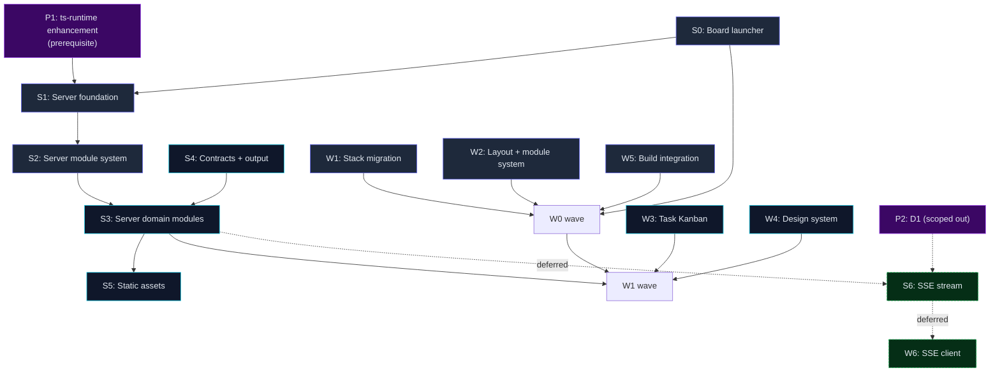

# Server-Side Adjustment — Finalized Feature List

**Date:** 2026-06-14 · **Status:** Finalized v1.0 (step 3 of 6 — rough feature list and design both
operator-confirmed; this document fixes the final feature IDs, scope, acceptance criteria, and wave
sequencing. Feeds task decomposition — step 4.)

**Source documents (both agreed):**

- `docs/plans/server-side-adjustment-feature-drafted.md` v0.4 — rough feature list, all 6 open
  questions resolved, SSE + D1 dispositions documented.
- `docs/design/server-side-adjustment-design.md` v0.2 — mechanism: mermaid diagrams, ts-runtime
  enhance-first rule (§2.1.1), SSE design-complete (§2.9), oRPC interceptor API corrected, 10
  invariants, risks resolved.

**Purpose.** This is the authoritative input to task decomposition. Each feature below has a stable
ID, a one-sentence purpose, a scope boundary (in/out), Gherkin acceptance criteria, a priority, and
a wave assignment. After this document is reviewed, tasks are created in `docs/tasks/` and
decomposed per feature; the `docs/features/S_*.md` and `docs/features/W_*.md` files are generated
from this list.

---

## 1. ID scheme — alignment with `docs/features/`

### Existing convention (from `docs/features/*.md`)

| Element | Pattern | Examples |
|---|---|---|
| Group node | Single uppercase letter | A, B, C, D, E, F, G, H |
| Child feature | Letter + number | F1, F2, B1, H1, H2, H3 |
| File name | `<id>_<slug>.md` | `F1_planning-foundation.md`, `B1_agent-run-hardening.md` |
| Group file | `<id>_<slug>.md` | `F_planning.md`, `B_agent-execution.md` |

### New groups added by this work

| ID | Name | Slug | File |
|---|---|---|---|
| **S** | Server API | `server-api` | `docs/features/S_server-api.md` |
| **W** | Web board | `web-board` | `docs/features/W_web-board.md` |

S and W are free single-letter IDs (existing range is A–H). Chosen for mnemonic value (S=Server,
W=Web) over strict sequential ordering. They are independent top-level groups — not children of any
existing group, not part of the rd3-migration F-series.

### Child feature IDs

| ID | Name | Priority | Wave | Status | Slug |
|---|---|---|---|---|---|
| **S0** | Board launcher (`spur serve`) | P1 | S0 | planned | `board-launcher` |
| **S1** | Server foundation | P1 | S0 | planned | `server-foundation` |
| **S2** | Server module system | P1 | S0 | planned | `server-module-system` |
| **S3** | Server domain modules (task + feature) | P1 | S1 | planned | `server-domain-modules` |
| **S4** | Server contracts and output standard | P1 | S1 | planned | `server-contracts-output` |
| **S5** | Server static asset serving | P1 | S1 | planned | `server-static-assets` |
| **S6** | SSE planning event stream | P2 | deferred | deferred | `sse-planning-events` |
| **W1** | Web stack migration | P1 | W0 | planned | `web-stack-migration` |
| **W2** | Web layout and module system | P1 | W0 | planned | `web-layout-module-system` |
| **W3** | Task Kanban module | P1 | W1 | planned | `task-kanban-module` |
| **W4** | Web design system and theming | P2 | W1 | planned | `web-design-system` |
| **W5** | Web build integration | P1 | W0 | planned | `web-build-integration` |
| **W6** | SSE client subscription | P2 | deferred | deferred | `sse-client-subscription` |

**Note on S0:** no existing feature uses a `0` suffix (existing children start at 1). S0 is
intentional — the board launcher is a prerequisite to S1 (foundation) and is sequenced in the same
wave but conceptually first. The numbering encodes "comes before S1" without inventing a new group.

---

## 2. Group S — Server API

### S (group node)

**File:** `docs/features/S_server-api.md`

| Field | Value |
|---|---|
| id | S |
| name | Server API |
| status | active |
| priority | P1 |
| tags | [group, server-side-adjustment] |

**Goal:** Make `apps/server` a reliable, robust, reusable, flexible base API server aligned with
`apps/cli`'s transport-wrapper role; wire `packages/app` services behind oRPC contracts; leverage
ts-libs infrastructure. The server is a thin Hono wrapper over `createApp(appRt)` — two entry
wrappers (Cloudflare Worker + local Bun binary), one shared core (ADR-019).

**Scope:** `apps/server` — middleware pipeline, graceful shutdown, `ServerContext` service wiring,
module system, domain modules (task + feature critical path), contracts, output standard, static
asset serving, board launcher.

**Out:** SSE handler implementation (S6, deferred), D1 adapter (scoped out), domain modules beyond
task/feature (follow incrementally), authentication (future).

---

### S0 — Board launcher (`spur serve`)

| Field | Value |
|---|---|
| id | S0 |
| name | Board launcher (`spur serve`) |
| status | planned |
| priority | P1 |
| tags | [server-side-adjustment, wave-S0] |
| wave | S0 |

**Purpose.** The operator's one command to go from terminal to board. Resolves `.spur/config.yaml`
`server:` block, builds the `ApplicationRuntime`, calls `createApp(appRt)`, starts `Bun.serve`,
optionally opens the browser, handles SIGINT for graceful shutdown. The local-fallback deployment
path; primary deployment is Cloudflare (`wrangler deploy`).

**Scope.** `spur serve [--port <n>] [--host <addr>] [--no-open] [--cwd <path>] [--json]` CLI verb in
`apps/cli`. Config resolution: CLI flag → `PORT`/`HOST` env (folded by `buildConfigFromEnv`) →
schema default (3000 / localhost). Browser auto-open. SIGINT/SIGTERM → `runNodeApplication` graceful
shutdown. Serve keys (`host`, `openBrowser`, `webDistPath`) added to the **existing**
`configSchema.server` in `packages/config` — **not** a new `server:` block on `spurConfigSchema`
(that would collide with the existing env-config `server.port`; see design §4.2).

**Out.** Cloudflare `wrangler deploy` (that's the Workers entry, not `spur serve`). Vite dev server
integration (that's W5/S5 build toolchain).

**Design reference.** Design doc §4 (Board launcher), §4.1 (command surface), §4.2 (config
resolution), §4.3 (implementation shape).

**Acceptance Criteria:**

```gherkin
Feature: Board launcher (spur serve)

  Scenario: One command starts the board
    Given a project resolving server config (configSchema.server defaults + PORT/HOST env)
    When spur serve runs
    Then Bun.serve starts on the configured port
    And the browser opens to the board URL
    And the startup info is printed (port, URL, pid)

  Scenario: Config precedence is CLI flag > env > default
    Given PORT env is 4000
    When spur serve --port 5000 runs
    Then the server listens on port 5000
    And with no --port flag it would listen on 4000 (env), else 3000 (default)

  Scenario: Graceful shutdown drains connections
    Given a running spur serve with in-flight requests
    When SIGINT is received
    Then in-flight requests complete within the shutdown deadline
    And the DB adapter is closed
    And logs are flushed

  Scenario: --no-open skips browser
    Given a headless environment
    When spur serve --no-open runs
    Then the server starts without attempting to open a browser
```

**Task decomposition guidance.** Likely 2–3 tasks: (1) `server:` config schema + keys in
`packages/config`; (2) `spur serve` command in `apps/cli` (config resolution, runtime build,
`createApp` call, `Bun.serve`, browser open); (3) graceful shutdown wiring (SIGINT handler,
drain deadline). Depends on S1 (foundation must exist for `createApp` to work).

---

### S1 — Server foundation

| Field | Value |
|---|---|
| id | S1 |
| name | Server foundation |
| status | planned |
| priority | P1 |
| tags | [server-side-adjustment, wave-S0] |
| wave | S0 |

**Purpose.** Establish the cross-cutting request lifecycle, production-safe shutdown, and
service/infrastructure wiring that every domain module inherits. Without this, no domain module can
function.

**Scope.**

- **Middleware pipeline** (design §2.2): CORS → request-id → logger → error-handler → body-limit →
  compress. Order is load-bearing (invariant #7).
- **Graceful shutdown** (design §2.7): `Bun.serve` shutdown wired into
  `ApplicationRuntime.stop()` — drain in-flight, close DB, flush logs, deadline timeout. Bun path
  only; Workers have no process lifecycle.
- **Health endpoints**: `health` (liveness) + `health/ready` (readiness — checks DB + critical
  services).
- **ServerContext** (design §2.3): extend Hono `ContextVariableMap` to carry lazily-initialized
  `packages/app` services (TaskService, FeatureService, etc.) built from `ApplicationRuntime`'s
  `db`, `events`, `logger`. Mirrors `apps/cli/src/context.ts` `CliContext`.
- **DB wiring**: SQLite `DbAdapter` via `ts-runtime`'s `RuntimeFactory.createDbAdapter()` (design
  §2.3, §2.1.1). Remove dead `@gobing-ai/ts-db` declaration or make it real.
- **FileSystem wiring**: `ts-runtime` `FileSystem` (cwd-bound) into server context.
- **EventBus wiring**: `ts-infra` `EventBus<PlanningEventMap>` into server context — pub/sub seam
  for SSE (future), PlanningEventMap events.
- **JobQueue wiring**: `ts-db` `QueueJobDao` + `ts-infra` `DBJobQueue`/`DBQueueConsumer`. Bun entry
  starts consumer; Workers entry enqueues only.
- **Scheduler wiring**: `ts-infra` scheduler (Node adapter for Bun, Cloudflare adapter for Workers).

**Out.** Domain module handlers (S3). Contracts (S4). D1 adapter (scoped out, design §2.3.1).

**Prerequisite.** `ts-runtime` enhancement (design §2.1.1): `RuntimeFactory.createDbAdapter()`,
`RuntimeCapabilities.hasSqlDatabase`. S1 does not start until this ships in `ts-libs` and is
consumed.

**Design reference.** Design doc §2.1.1 (runtime adaptation), §2.2 (middleware), §2.3
(ServerContext), §2.3.1 (D1 scoped out), §2.7 (shutdown).

**Acceptance Criteria:**

```gherkin
Feature: Server foundation

  Scenario: Middleware pipeline order is load-bearing
    Given the server running with the full middleware stack
    When a request arrives
    Then it passes through CORS, request-id, logger, error-handler, body-limit, compress in that order
    And the request-id is present in logs and error responses

  Scenario: Graceful shutdown drains connections
    Given a running server with in-flight requests
    When SIGTERM is received
    Then in-flight requests complete within the shutdown deadline
    And the DB adapter is closed
    And logs are flushed before exit

  Scenario: Health distinguishes liveness from readiness
    Given a running server with DB connectivity
    When GET /api/health runs
    Then it returns 200 with uptime and memory
    When GET /api/health/ready runs
    Then it returns 200 only if DB SELECT 1 succeeds
    And returns 503 if the DB is unreachable

  Scenario: ServerContext carries lazily-initialized services
    Given a server with ApplicationRuntime wired
    When an oRPC handler accesses c.get('ctx').services.taskService
    Then it gets a TaskService built from the runtime's db, events, logger
    And the service is the same instance across requests in the same process

  Scenario: DB adapter comes from ts-runtime, not Spur code
    Given the server bootstrapping on the Bun platform
    When ServerContext.getDb() is first called
    Then it obtains the DbAdapter via RuntimeFactory.createDbAdapter() from ts-runtime
    And the migration step (today's packages/domain createMigratedDb) is applied through that path
    And no platform-detection code exists in apps/server (invariant #9)
```

**Task decomposition guidance.** Likely 5–7 tasks: (1) middleware pipeline (6 middlewares, fixed
order); (2) graceful shutdown + health endpoints; (3) ServerContext service wiring; (4) DB +
FileSystem wiring via ts-runtime; (5) EventBus + JobQueue + Scheduler wiring. Gated by ts-runtime
enhancement.

---

### S2 — Server module system

| Field | Value |
|---|---|
| id | S2 |
| name | Server module system |
| status | planned |
| priority | P1 |
| tags | [server-side-adjustment, wave-S0] |
| wave | S0 |

**Purpose.** Establish the `ServerModule` interface — the standard contract for adding a new API
domain. Every future module (task, feature, workflow, rule, agent, history, team) follows this
pattern. Existing `health` is migrated to this pattern as the reference module.

**Scope.**

- `ServerModule` interface (design §2.4): `{ name, register(app, ctx), middleware?, contract? }`.
- Module registry/factory: collects built-in modules (fail-fast on broken built-in), extension
  point for plugin-contributed modules.
- Per-module OpenAPI: each module contributes its oRPC contract sub-tree;
  `generateOpenApiSpec` merges them automatically.
- `health` migrated to `ServerModule` as the reference implementation.

**Out.** Domain modules themselves (S3). Web module system (W2). Module manifest YAML format
(design §6 — reserved, not implemented this round).

**Design reference.** Design doc §2.4 (Server module system), §6 (manifest format — reserved).

**Acceptance Criteria:**

```gherkin
Feature: Server module system

  Scenario: A module registers its routes via the interface
    Given a ServerModule implementing { name, register(app, ctx) }
    When the server boots
    Then the module's routes are mounted under its namespace
    And its middleware (if any) applies only to its routes

  Scenario: Health is the reference module
    Given the server booted with the module registry
    When GET /api/health runs
    Then the response comes from the health ServerModule
    And the health module was registered through the same interface as all other modules

  Scenario: OpenAPI reflects all mounted modules
    Given modules task and feature registered
    When GET /openapi.json runs
    Then the spec contains paths for both task and feature
    And no manual path maintenance was needed

  Scenario: Module isolation is enforced
    Given two registered modules A and B
    When module A's register() runs
    Then it mounts only its own routes
    And it never modifies module B's routes or the shared middleware pipeline
```

**Task decomposition guidance.** Likely 2–3 tasks: (1) `ServerModule` interface + registry; (2)
health module migration; (3) per-module OpenAPI merge. Proves the pattern before S3 uses it.

---

### S3 — Server domain modules (task + feature critical path)

| Field | Value |
|---|---|
| id | S3 |
| name | Server domain modules (task + feature) |
| status | planned |
| priority | P1 |
| tags | [server-side-adjustment, wave-S1] |
| wave | S1 |

**Purpose.** Give the server real surface. The task and feature modules are the board's API
dependency — the critical path. Each wraps a `packages/app` service behind an oRPC contract.
Others (workflow, rule, agent, history, team) follow the same pattern incrementally.

**Scope.**

- `server-module-task`: wraps `TaskService`. Verbs: CRUD, list, check, batch-create, resolve. Write
  verbs go through `PlanningWriteService` (one lock domain, ADR-021 invariant #1).
- `server-module-feature`: wraps `FeatureService`. Verbs: CRUD, list, check, refresh. Same write
  path contract.

**Out.** Workflow, rule, agent, history, team modules (follow incrementally after task/feature
prove the pattern). Inline editing on the server side (read-only first).

**Design reference.** Design doc §2.4 (module system — S3 modules implement it), §2.5 (contracts —
per-module vertical slice).

**Acceptance Criteria:**

```gherkin
Feature: Server domain modules (task + feature)

  Scenario: Task module exposes CRUD over TaskService
    Given the task module registered
    When POST /api/tasks creates a task
    Then it calls TaskService.create (not PlanningWriteService directly from the route)
    And the response uses the api-response envelope

  Scenario: Write verbs go through the unified write path
    Given a task update request
    When PATCH /api/tasks/:wbs runs
    Then it calls PlanningWriteService (the 9-step sequence)
    And no route writes markdown directly (invariant #1)

  Scenario: Feature module follows the same pattern
    Given the feature module registered
    When GET /api/features runs
    Then it returns features via FeatureService
    And the response shape matches featureContract

  Scenario: Error mapping is consistent
    Given a task update that violates a lifecycle guard
    When the request runs
    Then the response is 409 Conflict with the error envelope
    And validation failures return 422
    And not-found returns 404
```

**Task decomposition guidance.** Likely 2–4 tasks: (1) task module (contract + handler +
TaskService wiring); (2) feature module (same pattern); (3) error mapping (domain errors → HTTP
status codes). Depends on S2 (module system), S4 (contracts), and the planning layer (F2/F3 in
`packages/app`).

---

### S4 — Server contracts and output standard

| Field | Value |
|---|---|
| id | S4 |
| name | Server contracts and output standard |
| status | planned |
| priority | P1 |
| tags | [server-side-adjustment, wave-S1] |
| wave | S1 |

**Purpose.** The type seam (ADR-005). Server handlers bind via `implement(contract)`; web client
consumes via `OpenAPILink`. Contract↔handler drift is a compile error. This unblocks the web board.

**Scope.**

- `contracts-task`: `taskContract` — oRPC route definitions with Zod input/output schemas. DTOs:
  `TaskDto`, `TaskListDto`, `TaskCheckResultDto`.
- `contracts-feature`: `featureContract` — same pattern. DTOs: `FeatureDto`, `FeatureListDto`,
  `FeatureCheckResultDto`.
- `contracts-planning-event`: `planningEventContract` — SSE event contract (design §2.9.2).
  **Contract + frame DTO ship now**; handler (S6) and client hook (W6) are deferred.
- `contracts-shared`: shared pagination/cursor types (from `ts-utils` cursor), shared error
  response shape (ts-utils api-response envelope).
- Output envelope: all JSON responses use `{ ok, data?, error? }` (design §2.6).
- Input validation: Zod schemas in oRPC contracts — the same Zod SSOT from `packages/domain`.
- Error mapping: domain errors → HTTP status codes (design §2.6).

**Out.** Domain types (stay in `packages/domain`, never re-declared in contracts). SSE handler
(S6). SSE client hook (W6).

**Design reference.** Design doc §2.5 (contracts), §2.6 (output envelope + error mapping), §2.9.2
(planningEventContract).

**Acceptance Criteria:**

```gherkin
Feature: Server contracts and output standard

  Scenario: Contract-handler drift is a compile error
    Given a taskContract with input schema requiring a field
    When the handler omits that field from implement()
    Then tsc --noEmit fails

  Scenario: All responses use the api-response envelope
    Given any successful API call
    When the response is received
    Then the body is { ok: true, data: ... }
    And any error is { ok: false, error: { code, message, ... } }

  Scenario: planningEventContract ships before the handler
    Given the contracts package built
    When the build completes
    Then planningEventContract exists and is exported
    And the SSE handler (S6) is not required for this contract to ship (invariant #10)

  Scenario: Domain types are not re-declared in contracts
    Given the contracts package source
    When it is inspected
    Then DTOs reference packages/domain types
    And no domain type is duplicated in packages/contracts
```

**Task decomposition guidance.** Likely 3–4 tasks: (1) task contract + DTOs; (2) feature contract
+ DTOs; (3) planningEventContract (SSE frame DTO — ships now, design §2.9.2); (4) output envelope
+ error mapping. Ships with S3 as a per-module vertical slice (Q6 confirmed).

---

### S5 — Server static asset serving

| Field | Value |
|---|---|
| id | S5 |
| name | Server static asset serving |
| status | planned |
| priority | P1 |
| tags | [server-side-adjustment, wave-S1] |
| wave | S1 |

**Purpose.** One port for API + board on both deployment targets. Cloudflare-default: Workers
Static Assets binding with SPA fallback (`not_found_handling = "single-page-application"`).
Local-fallback: Hono `serveStatic` from `webDistPath`.

**Scope.**

- Cloudflare path: `wrangler.toml` `[assets]` binding, SPA fallback.
- Local path: Hono `serveStatic` middleware reading from `config.server.webDistPath`.
- Fallback: unmatched routes serve `index.html` (SPA client-side routing).

**Out.** Web build itself (that's W5). Vite dev server (that's W5 build toolchain).

**Design reference.** Design doc §2.8 (static asset serving).

**Acceptance Criteria:**

```gherkin
Feature: Server static asset serving

  Scenario: One port serves API and board
    Given a running server with static assets configured
    When GET / (board) and GET /api/health run on the same port
    Then both succeed
    And the board HTML is served from static assets

  Scenario: SPA fallback serves index.html for unknown routes
    Given the board built with client-side routing
    When GET /board/tasks runs (a client-side route)
    Then index.html is served
    And the React router handles the route client-side

  Scenario: Cloudflare uses Workers Static Assets
    Given the Cloudflare deployment
    When wrangler deploy runs
    Then static assets are bound via [assets] in wrangler.toml
    And SPA fallback is configured
```

**Task decomposition guidance.** Likely 1–2 tasks: (1) Hono `serveStatic` for local path +
`webDistPath` config; (2) Cloudflare `[assets]` binding in `wrangler.toml`. Depends on W5 (web
build must produce assets).

---

### S6 — SSE planning event stream (DEFERRED)

| Field | Value |
|---|---|
| id | S6 |
| name | SSE planning event stream |
| status | deferred |
| priority | P2 |
| tags | [server-side-adjustment, deferred, sse] |
| wave | deferred |

**Purpose.** `/api/events/planning` SSE endpoint — subscribes to `EventBus<PlanningEventMap>`,
frames events as SSE, supports `Last-Event-ID` replay from `planning_events` table. Replaces
polling with push for live board updates.

**Why deferred.** Gated on module-system stability (S2/S3 proven) and D1 landing for the Cloudflare
path. Until then, returns `501` on Cloudflare; runs on local Bun path. The `planningEventContract`
ships with S4 (contract only) so the polling → SSE swap is a handler change, not a contract change
(invariant #10).

**Design reference.** Design doc §2.9 (full SSE design — 6 subsections).

**Acceptance Criteria (when implemented):**

```gherkin
Feature: SSE planning event stream (deferred)

  Scenario: Events stream as SSE frames
    Given a client subscribed to /api/events/planning
    When a task transitions status
    Then an SSE frame arrives: id, event, data
    And the data field contains the api-response envelope with the event payload

  Scenario: Last-Event-ID enables replay
    Given a client that disconnected with Last-Event-ID: 42
    When it reconnects with that header
    Then it receives events 43 onwards
    And no events are lost

  Scenario: Cloudflare returns 501 until D1 ships
    Given the Cloudflare deployment without D1
    When GET /api/events/planning runs
    Then it returns 501
    And the client falls back to polling
```

**Task decomposition guidance.** Deferred — no tasks created now. When activated: likely 2 tasks
(SSE handler + `Last-Event-ID` replay). Depends on S4 contract (ships now) and D1 (scoped out).

---

## 3. Group W — Web board

### W (group node)

**File:** `docs/features/W_web-board.md`

| Field | Value |
|---|---|
| id | W |
| name | Web board |
| status | active |
| priority | P1 |
| tags | [group, server-side-adjustment] |

**Goal:** Re-found `apps/web` on Astro + React + Tailwind + daisyUI with a 3-column layout and a
module/plugin mechanism; implement Task Kanban as the first module. The board is a client-side SPA
that talks to the server API — static output, no SSR compute for views.

**Scope:** `apps/web` — stack migration (React + Tailwind + daisyUI), 3-column resizable/foldable
layout, module system, Task Kanban module, theming, build integration.

**Out:** SSE client hook (W6, deferred), modules beyond Task Kanban (follow incrementally), inline
editing (read-only first).

---

### W1 — Web stack migration

| Field | Value |
|---|---|
| id | W1 |
| name | Web stack migration |
| status | planned |
| priority | P1 |
| tags | [server-side-adjustment, wave-W0] |
| wave | W0 |

**Purpose.** Modern, maintainable UI stack. React for interactivity, Tailwind for styling, daisyUI
for component primitives. Static output = cheap deployment, fast first paint, no server compute.

**Scope.**

- `@astrojs/react` integration + React 19.
- Tailwind CSS v4 via `@tailwindcss/vite` — CSS-first config, no `tailwind.config.js`.
- daisyUI v5 as a Tailwind plugin.
- Astro `output: 'static'` (from `'server'`). Client-side islands via `client:only="react"`.

**Out.** Layout system (W2). Module system (W2). Theming tokens (W4). daisyUI custom themes
(deferred — default theme only this round).

**Design reference.** Design doc §3.1 (stack migration).

**Acceptance Criteria:**

```gherkin
Feature: Web stack migration

  Scenario: Astro builds a static SPA
    Given the web app configured with output: 'static'
    When astro build runs
    Then static HTML + JS + CSS are produced
    And no SSR compute is needed at runtime

  Scenario: React islands hydrate client-side
    Given a page with a client:only="react" island
    When the page loads in a browser
    Then the React component hydrates and is interactive

  Scenario: Tailwind v4 CSS-first config works
    Given a CSS file with @theme tokens
    When the build runs
    Then Tailwind utilities are generated
    And no tailwind.config.js exists

  Scenario: daisyUI components are available
    Given daisyUI installed as a Tailwind plugin
    When a btn class is used
    Then it renders as a daisyUI button
```

**Task decomposition guidance.** Likely 2–3 tasks: (1) Astro config change (`output: 'static'`,
`@astrojs/react`); (2) Tailwind v4 + daisyUI via `@tailwindcss/vite`; (3) remove old Cloudflare SSR
adapter. Foundation for W2.

---

### W2 — Web layout and module system

| Field | Value |
|---|---|
| id | W2 |
| name | Web layout and module system |
| status | planned |
| priority | P1 |
| tags | [server-side-adjustment, wave-W0] |
| wave | W0 |

**Purpose.** The classic board/IDE layout that serves as the module hub, plus the standard for
adding new UI modules. Every module renders into the main workspace; left sidebar switches modules;
right panel shows context.

**Scope.**

- **Layout shell** (design §3.3): 3-column CSS grid (left sidebar, main workspace, right panel).
  Left and right are resizable (drag handle) and foldable. Persists sizes/collapse state to
  localStorage.
- **WebModule interface** (design §3.4): `{ id, name, icon, component, sidebarLabel?,
  rightPanelComponent? }`. Self-contained React view.
- **Module registry**: built-in modules registered at startup. Active module via URL routing.
- **Routing**: React Router 7 (Q4 confirmed). Each module owns a route segment (`/board/tasks`,
  `/board/features`). URL is shareable.
- **Data layer** (design §3.2): extend `src/lib/rpc-client.ts` with `withTimeout(ms)` fetch wrapper
  + oRPC tracing/error interceptor (Q3 revised: no `APIClient`, no facade). `OpenAPILink` is the
  sole transport. Single `{ api }` export.

**Out.** Task Kanban module itself (W3). Design tokens (W4). SSE client (W6).

**Design reference.** Design doc §3.2 (data layer), §3.3 (layout tree), §3.4 (module system).

**Acceptance Criteria:**

```gherkin
Feature: Web layout and module system

  Scenario: 3-column layout renders and persists state
    Given the board loaded
    When the user drags the left sidebar handle to resize
    Then the column width changes
    And on reload the width is restored from localStorage

  Scenario: Columns are foldable
    Given the board with left sidebar expanded
    When the user clicks the collapse toggle
    Then the sidebar collapses to an icon bar
    And the main workspace expands

  Scenario: A module renders into the main workspace
    Given a WebModule registered with id "tasks"
    When the user navigates to /board/tasks
    Then the module's component renders in the main workspace
    And the left sidebar highlights the tasks module

  Scenario: One transport, one import point
    Given any web module needing API access
    When it imports the client
    Then it imports { api } from lib/rpc-client
    And it never imports @orpc/* directly (invariant #2)

  Scenario: oRPC interceptor adds tracing
    Given a request made via the api client
    When the request completes
    Then a tracing span is recorded
    And errors are caught by the onError interceptor
```

**Task decomposition guidance.** Likely 4–6 tasks: (1) layout shell (CSS grid, resizable,
foldable, localStorage); (2) WebModule interface + registry; (3) React Router 7 wiring; (4)
rpc-client.ts extension (timeout fetch + interceptor); (5) left sidebar module navigation. Depends
on W1 (stack).

---

### W3 — Task Kanban module

| Field | Value |
|---|---|
| id | W3 |
| name | Task Kanban module |
| status | planned |
| priority | P1 |
| tags | [server-side-adjustment, wave-W1] |
| wave | W1 |

**Purpose.** The first module — proves the design end-to-end with a real, useful view. Columns by
status, drag-to-transition, task cards, detail panel, filters, live polling. The daily-driver
replacement for the legacy `kanban.md` generated artifact.

**Scope.**

- `TaskKanbanModule` (design §3.5): columns by status (`backlog · todo · wip · testing · blocked ·
  done · cancelled`), cards by task.
- Task card component: WBS, name, status badge, priority badge, feature link.
- Right-panel task detail: full frontmatter, status transition buttons, section viewer (markdown
  render). Read-only initially.
- Filters: by status, feature, parent WBS, assignee. Filter state in URL query params.
- Live updates: poll the task list endpoint on an interval. SSE deferred (W6).

**Out.** Inline editing (read-only first). SSE live updates (W6, deferred). Feature tree module
(follows incrementally).

**Design reference.** Design doc §3.5 (Task Kanban module).

**Acceptance Criteria:**

```gherkin
Feature: Task Kanban module

  Scenario: Board shows tasks grouped by status
    Given tasks across multiple statuses
    When the Kanban module loads
    Then tasks appear in columns by status
    And each card shows WBS, name, and badges

  Scenario: Drag-and-drop transitions status
    Given a task card in the "todo" column
    When the user drags it to the "wip" column
    Then PATCH /api/tasks/:wbs is called with status wip
    And the card moves to the wip column on success

  Scenario: Task detail opens in the right panel
    Given a task card
    When the user clicks it
    Then the right panel shows full frontmatter and sections
    And status transition buttons are available

  Scenario: Filters narrow the board
    Given tasks across features
    When the user filters by feature F1
    Then only F1's tasks appear
    And the filter is reflected in the URL query params

  Scenario: Polling keeps the board in sync
    Given two clients viewing the same board
    When one client transitions a task
    Then the other client sees the change within the next poll interval
    And SSE is not required for this (deferred to W6)
```

**Task decomposition guidance.** Likely 3–5 tasks: (1) KanbanBoard + columns + task cards; (2)
right-panel task detail + status transitions; (3) filters (URL query params); (4) live polling
hook; (5) native HTML5 drag-and-drop. Depends on W2 (layout + module system), S3 (task API).

---

### W4 — Web design system and theming

| Field | Value |
|---|---|
| id | W4 |
| name | Web design system and theming |
| status | planned |
| priority | P2 |
| tags | [server-side-adjustment, wave-W1] |
| wave | W1 |

**Purpose.** A board that looks good, supports dark mode (developer preference), and works on
mobile. daisyUI themes avoid hand-designing a component library.

**Scope.**

- Design tokens via Tailwind `@theme`: color palette, spacing scale, typography scale.
- Dark mode toggle (daisyUI theme switching). Persists to localStorage. Respects
  `prefers-color-scheme` on first load.
- Responsive breakpoints: full 3-column on desktop (≥lg), collapsible to 1-column + drawer on
  mobile.

**Out.** Custom daisyUI themes (deferred — default theme this round). Animation/motion library
(not needed).

**Design reference.** Design doc §3.1 (stack — Tailwind `@theme`), §3.3 (responsive layout).

**Acceptance Criteria:**

```gherkin
Feature: Web design system and theming

  Scenario: Dark mode toggles and persists
    Given the board in light mode
    When the user clicks the dark mode toggle
    Then the theme switches to dark
    And on reload the dark theme is restored from localStorage

  Scenario: prefers-color-scheme is respected on first load
    Given a new visitor with prefers-color-scheme: dark
    When the board loads for the first time
    Then dark mode is active

  Scenario: Mobile collapses to single column
    Given the board on a mobile viewport
    When the layout renders
    Then the left sidebar becomes a slide-in drawer
    And the right panel becomes a bottom sheet
    And the main workspace is full-width
```

**Task decomposition guidance.** Likely 2 tasks: (1) `@theme` tokens + dark mode toggle; (2)
responsive breakpoints. Lower priority (P2) — can ship after W3.

---

### W5 — Web build integration

| Field | Value |
|---|---|
| id | W5 |
| name | Web build integration |
| status | planned |
| priority | P1 |
| tags | [server-side-adjustment, wave-W0] |
| wave | W0 |

**Purpose.** Unified Vite dev server (one process, one port, no proxy, no CORS-in-dev) and
production builds for both deployment modes.

**Scope.**

- Root-level `vite.config.ts` orchestrating both apps via `@hono/vite-dev-server` (server) + Astro's
  Vite integration (web).
- Drop the proxy block from `apps/web/astro.config.mjs`.
- Change `apps/server` dev script from `bun --hot run src/index.ts` to `vite`.
- Production: Astro `astro build` outputs static files. Cloudflare: Workers Static Assets. Local:
  Hono `serveStatic`.

**Out.** Server production bundling (that's `wrangler deploy` / `bun build --compile`, not W5).
Static asset serving middleware (that's S5).

**Design reference.** Design doc §5.1 (unified Vite dev server), §5.2 (production builds).

**Acceptance Criteria:**

```gherkin
Feature: Web build integration

  Scenario: One Vite dev server serves API and frontend
    Given the unified vite.config.ts
    When bun run dev runs
    Then both /api/health and / (board) are served on one port
    And no proxy configuration exists

  Scenario: Astro builds static output
    Given the web app configured for static output
    When astro build runs
    Then dist/web/ contains static HTML, JS, CSS
    And no server compute is needed

  Scenario: Two production modes from the same source
    Given the built web assets
    When deployed to Cloudflare (Workers Static Assets)
    Then the board is served from the Worker
    When deployed locally (Hono serveStatic)
    Then the board is served from the Bun binary on the same port as the API
```

**Task decomposition guidance.** Likely 2 tasks: (1) root `vite.config.ts` + `@hono/vite-dev-server`
+ drop proxy; (2) production build verification (Astro static + Cloudflare + local). Depends on W1
(stack).

---

### W6 — SSE client subscription (DEFERRED)

| Field | Value |
|---|---|
| id | W6 |
| name | SSE client subscription |
| status | deferred |
| priority | P2 |
| tags | [server-side-adjustment, deferred, sse] |
| wave | deferred |

**Purpose.** `usePlanningEvents` hook using `EventSource` on `/api/events/planning`. Dual-source
merge (poll + SSE) in the Task Kanban reducer. Reconnection with `Last-Event-ID`.

**Why deferred.** Gated on S6 (SSE handler) and D1. Until then, the Kanban module uses polling
(W3). The polling → SSE swap is a localized reducer change.

**Design reference.** Design doc §2.9.4 (client subscription shape).

**Acceptance Criteria (when implemented):**

```gherkin
Feature: SSE client subscription (deferred)

  Scenario: usePlanningEvents subscribes to the SSE stream
    Given a client with the hook mounted
    When a task transitions status on the server
    Then the hook receives the event
    And the Kanban reducer updates the board

  Scenario: Reconnection resumes from Last-Event-ID
    Given a client that disconnected
    When it reconnects
    Then it sends the Last-Event-ID
    And missed events are applied

  Scenario: Polling and SSE merge without duplication
    Given a board with both polling and SSE active
    When the same event arrives via both sources
    Then the reducer deduplicates by event id
    And no duplicate render occurs
```

**Task decomposition guidance.** Deferred — no tasks created now. When activated: likely 2 tasks
(`usePlanningEvents` hook + dual-source reducer). Depends on S6.

---

## 4. Prerequisites (cross-cutting, outside the S/W tree)

### P1 — `ts-runtime` enhancement (prerequisite to S1)

Per the enhance-first rule (design doc §2.1.1, invariant #9), platform divergence lives only behind
`@gobing-ai/ts-runtime`'s `RuntimeFactory` seam. The currently-consumed factory
(`@gobing-ai/ts-runtime@0.3.18`) lacks a DB facility — verified: `RuntimeFactory` has only
`createFileSystem` / `createProcessExecutor` / `loadConfig`, and `RuntimeCapabilities` has no
`hasSqlDatabase`.

**Required enhancements (ship in `ts-libs` first, consume by semver bump or temporary `bun link`):**

1. `RuntimeFactory.createDbAdapter(config)` — new factory method returning a `RuntimeDbAdapter`
   (structural subset; a ts-db `DbAdapter` is assignable to it).
2. `RuntimeCapabilities.hasSqlDatabase` — new capability flag.
3. `nodeBunFactory.createDbAdapter` — Bun SQLite (connection; schema migration stays the consumer's).
4. `cloudflareWorkersFactory.createDbAdapter` — throws `D1NotConfiguredError` until D1 ships.

**Gate: ✅ RELEASED + CONSUMED (2026-06-15).** Shipped as `@gobing-ai/ts-runtime@0.3.19` (ts-libs
task 0037); Spur catalog bumped to `^0.3.19`, `bun install` done, lint + test gates green across all
7 workspaces. S1 is **ungated**. Consumer note: `getDb()` returns the wide ts-db `DbAdapter` via a
new `packages/domain` helper `createMigratedDbViaRuntime(config)` (`loadRuntimeFactory().createDbAdapter`
+ `applyCliMigrations` + the structural→`DbAdapter` widening cast, kept in spur-domain so `apps/server`
imports neither ts-db nor `loadRuntimeFactory` — invariant #9). See design §2.3 API note + task 0073.

### P2 — D1 support in `ts-db` (scoped out / deferred)

**Operator decision (2026-06-14):** Cloudflare D1 is the Workers DB. This requires a `ts-db`
`D1DbAdapter` enhancement. **For the simplicity of the current round, D1 is scoped out** (design
doc §2.3.1).

**Consequences:**

- Local Bun path: full functionality for all in-scope waves (S0–S1, W0–W1).
- Cloudflare Worker path: health + OpenAPI only until D1 ships.
- SSE on Cloudflare (S6): gated on D1 (`Last-Event-ID` replay reads `planning_events`).
- No Durable Object SQLite, no external-`DATABASE_URL`-on-Workers path.

**Gate:** D1 implementation is tracked as design doc §11 item 7. No S/W feature is blocked by D1
for the local Bun path.

---

## 5. Wave sequencing

| Wave | Features | Depends on | Gate (what proves the wave is done) |
|---|---|---|---|
| **S0** (server foundation) | S0, S1, S2 | P1 (ts-runtime) | Server boots, middleware pipeline works, module system proven with health module, `spur serve` launches the board. |
| **W0** (web foundation) | W1, W2, W5 | S0 wave (needs API to exist) | Static SPA shell renders, 3-column layout works, module system proven with a placeholder module, unified Vite dev server runs. |
| **S1** (server domain) | S3, S4, S5 | S0 wave (module system) | Task/feature API live, contracts shipped, static assets served. |
| **W1** (web module) | W3, W4 | S1 wave (needs task/feature API) + W0 wave | Task Kanban functional end-to-end. |
| **deferred** | S6, W6 | S1/W1 proven + D1 (for Cloudflare) | SSE live event stream. |

**Overlap rules:**

- S0 and W0 can overlap (W0 needs a server to exist but not the domain modules — health endpoint
  suffices for the layout/module-system proof).
- S1 and W1 are sequential after their foundation waves.
- S6 and W6 (SSE) are deferred waves — not on the critical path.

---

## 6. Scope summary

### In scope (this round)

- **Server (S0–S5):** middleware pipeline, graceful shutdown, service/infra wiring, module system,
  task + feature domain modules, contracts (including planningEventContract), output standard,
  static asset serving, board launcher.
- **Web (W1–W5):** stack migration, 3-column layout, module system, Task Kanban module, theming,
  build integration.
- **Both:** the standard (module interface) that future modules follow.

### Out of scope (reserved for future tasks)

- **Workspace concept** (git repo + working dir + agent team + inbox as a unit).
- **Server domain modules beyond task/feature** (workflow, rule, agent, history, team) — follow the
  same module pattern incrementally.
- **Web modules beyond Task Kanban** (Feature tree, Workflow runs, Agent monitor, History
  analytics) — same module pattern.
- **Authentication / authorization** — single-operator default; configured via Cloudflare access,
  not application-layer auth.
- **Web inline editing** — read-only first; editing is a natural follow-up.
- **Server rate limiting** — single-operator default makes this low priority.
- **Server API versioning** (`/api/v1/`) — add when breaking changes are anticipated.

### Deferred (designed now, implementation later)

- **SSE / WebSocket live event stream** (S6, W6) — designed in design doc §2.9; implementation
  gated on module-system stability and D1. `planningEventContract` ships with S4 (contract only).
- **D1 support** (ts-db enhancement) — scoped out for simplicity (design doc §2.3.1).
- **daisyUI custom themes** — default theme this round; `@theme` structure ready for later.

---

## 7. Dependency graph



---

## 8. Task decomposition summary

| Feature | Est. tasks | Est. effort (h) | Per-task avg (h) | Key decomposition axes |
|---|---|---|---|---|
| S0 | 1 | 3–5 | 3–5 | launcher: config schema + CLI command + graceful shutdown (small feature, single task) |
| S1 | 2–3 | 16–24 | 6–12 | lifecycle (middleware + shutdown + health); service wiring (DB/FS/EventBus/JobQueue/Scheduler + ServerContext) |
| S2 | 1 | 6–10 | 6–10 | module system: interface + registry + health migration + OpenAPI merge |
| S3 | 1–2 | 8–14 | 7–14 | task + feature modules (contracts + handlers + error mapping) |
| S4 | 1–2 | 10–16 | 5–16 | contracts (task + feature + planningEventContract) + output envelope + error mapping |
| S5 | 1 | 2–4 | 2–4 | static assets: Hono serveStatic + Cloudflare [assets] (small feature, single task) |
| S6 | deferred | — | — | — |
| W1 | 1 | 5–8 | 5–8 | stack migration: Astro config + Tailwind v4 + daisyUI + remove SSR adapter |
| W2 | 2–3 | 14–22 | 5–11 | layout shell (grid + resize + collapse); module system (WebModule + registry + routing + rpc-client) |
| W3 | 1–2 | 12–20 | 6–20 | Kanban: board + cards + detail panel + filters + polling + drag-and-drop |
| W4 | 1 | 4–6 | 4–6 | design system: theme tokens + dark mode + responsive (small feature, single task) |
| W5 | 1 | 5–8 | 5–8 | build integration: unified Vite dev server + production build verification |
| W6 | deferred | — | — | — |

**Totals (in-scope only, S0–S5 + W1–W5):** ~12–16 tasks · **~85–137 hours** (~11–17 dev-days at 8h/day). Task counts re-derived from the effort estimates under the granularity standard below. Exact count determined during decomposition (step 4).

**Per-task granularity standard (evaluating decomposition):**
- **6–8 h minimum** per task. Below this → over-split; merge along a natural seam.
- **24 h maximum** per task. Above this → under-split; break along a natural seam.
- A feature with **≥6 tasks but <24 h total** → over-decomposed; tasks are too thin.
- A feature with **≤3 tasks but >24 h total** → under-decomposed; verify the tasks are atomic.

**Target band:** each task should carry 6–24 h of work (roughly 1–3 focused dev-days). Small features (<6 h) are single tasks by definition and exempt from the floor.

**Yesterday's over-decomposition check:** compare yesterday's task list against this standard. Signals to merge during step 4:
- Any single task <6 h (unless it's the only task in a small feature).
- A feature broken into ≥6 tasks when the total is <24 h.
- Total in-scope tasks well above ~16 — under the new standard, 85–137 h should yield roughly 12–16 tasks, not 28–40.

---

## 9. Next steps

1. **Review this document** — confirm feature IDs, scope boundaries, acceptance criteria, wave
   sequencing.
2. **Generate `docs/features/` files** — create `S_server-api.md`, `W_web-board.md` (group nodes)
   and `S0`–`S6`, `W1`–`W6` child files from this list.
3. **Task decomposition** — create tasks in `docs/tasks/` per feature, following the decomposition
   guidance above. Sequence by wave.
4. **Begin S0 wave** — once P1 (ts-runtime) ships, start S0, S1, S2.

---

## History

- 2026-06-14 — finalized v1.0 (derived from feature-drafted v0.4 + design v0.2; operator-confirmed)
