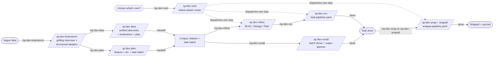

# How to Use the `sp:dev-*` Slash Commands for Daily Software Development

This guide shows how the `sp:dev-*` slash commands compose into one workflow that takes a
**vague idea** all the way to a **verified, working prototype** — without you hand-writing
task files, remembering which CLI verb gates what, or babysitting each step.

> **Audience.** You drive a coding agent (Claude Code, Codex, Gemini CLI, …) inside a Spur
> project. The `sp` plugin is installed and `spur` is on your PATH. If you are new to the
> underlying CLI, read
> [How to Use Spur for Daily Software Development](./how_to_use_spur_for_daily_software_development.md)
> first — this doc is the slash-command layer on top of it.

---

## The mental model

Spur splits development into a **planning half** (turn intent into validated, decomposed
work), an **execution half** (turn a task into shipped, verified code), and a **wrap-up
half** (post-execution learning, metrics, doc-sync). Every command delegates the
_deterministic_ step to a `spur` CLI verb that **validates before it writes** — so an
agent's bad output is rejected with findings, never silently committed to your corpus.



Two artifacts gate the **planning half**: **`spur feature check`** (your acceptance criteria
are valid BDD) and **`spur task batch-create`** (your decomposition is well-formed). Two
gates protect the **execution half**: a **HITL approval** on the design and a
**PASS/PARTIAL/FAIL verdict** before `done`. The **wrap-up half** mutates no task or
feature state — it consumes completed tasks and produces learning + metrics + doc-sync
artifacts (with optional feature transition and irreversible branch cleanup).

---

## The command map

The `sp` plugin provides **34 commands** across planning, execution, operations/hygiene, wrap-up, and authoring:

| Command                 | Phase / Category | What it does                                                                                                                                                                           | Backed by                                        |
| ----------------------- | ---------------- | -------------------------------------------------------------------------------------------------------------------------------------------------------------------------------------- | ------------------------------------------------ |
| `/sp:dev-next`          | Router           | **Status-aware router** — inspect a task WBS or feature frontier, pick the single best next `/sp:dev-*` step, and dispatch it (`--dry-run` to preview, `--once` to stop child's chain) | `sp:next-router`                                 |
| `/sp:dev-brainstorm`    | Planning         | Grilling interview → options with trade-offs → land an artifact (`--task` or `--feature`)                                                                                              | `sp:brainstorm`                                  |
| `/sp:dev-plan`          | Planning         | Feature → BDD AC → `feature check` gate → decompose → `batch-create` gate → optional design doc (`--design`/`--auto`)                                                                  | `sp:spur-dev` (planning)                         |
| `/sp:dev-idea`          | Planning         | Unified entry: vague idea → feature + AC + task batch (the `idea-pipeline.yaml` workflow). Stops at handoff — no task execution.                                                       | `spur workflow run idea-pipeline.yaml`           |
| `/sp:dev-refine`        | Planning→Exec    | Fill a task's AC / Design / Plan just-in-time via Q&A                                                                                                                                  | `sp:spur-dev`                                    |
| `/sp:dev-refineall`     | Planning (Batch) | Batch-refine tasks under a feature or selector before runall                                                                                                                           | `sp:spur-dev` (`refineall`)                      |
| `/sp:dev-run`           | Execution        | Run a task: full pipeline, or `--mode implement` for just the code                                                                                                                     | `sp:spur-dev` (execution)                        |
| `/sp:dev-runall`        | Exec (Batch)     | Run a **batch** of tasks through their pipelines in dependency-correct order (set resolve → topo-sort → per-task run → batch report)                                                   | `sp:spur-dev` (`runall` op → `sp:super-planner`) |
| `/sp:dev-parallel`      | Exec (Batch)     | Fan out independent tasks or investigations in parallel via subagents                                                                                                                  | `sp:parallel-execution`                          |
| `/sp:dev-unit`          | Execution        | Generate or extend tests until unit target is met; measure coverage                                                                                                                    | `sp:code-testing`                                |
| `/sp:dev-review`        | Execution        | Multi-dimensional review (functional traceability + SECUA framework + architectural depth; WBS mode writes `Review`, Path mode is advisory)                                            | `sp:code-verification`                           |
| `/sp:dev-verify`        | Execution        | Map requirements → evidence; emit a PASS/PARTIAL/FAIL verdict                                                                                                                          | `sp:code-verification`                           |
| `/sp:dev-verifyall`     | Exec (Batch)     | Batch-verify tasks against requirements and AC, producing consolidated report                                                                                                          | `sp:code-verification`                           |
| `/sp:dev-refresh`       | Execution        | Refresh feature status by feature ID, task WBS, or batch sweep via `spur feature sync`                                                                                                 | `spur feature sync`                              |
| `/sp:dev-featurechange` | Planning         | Restructure feature tree from a mapping file (CLI-gated moves + task edges)                                                                                                            | `sp:spur-cli` / inline procedure                 |
| `/sp:dev-fixall`        | Hygiene          | Systematically loop lint, typecheck, and test checks until clean across working tree                                                                                                   | inline                                           |
| `/sp:dev-simplify`      | Hygiene          | Simplify recently-changed code for clarity without changing behavior                                                                                                                   | `sp:code-simplification`                         |
| `/sp:dev-debug`         | Operations       | Systematic debugging protocol — reproduce, isolate, diagnose root cause, apply minimal fix, and verify with regression tests                                                           | `sp:sys-debugging`                               |
| `/sp:dev-daily`         | Operations       | Generate a daily summary report from agent usage data, git history, and notes (honors `SP_DAILY_SUMMARY_NO_PROMPT`)                                                                    | `sp:daily-summary`                               |
| `/sp:dev-handover`      | Operations       | Write an honest handover doc when blocked (`docs/handover/<date>-<slug>.md` SSOT + non-destructive task pointer append)                                                                | `sp:spur-dev` (`dev-operations.md`)              |
| `/sp:dev-dogfood`       | Operations       | Drive a command/skill/CLI end-to-end, fix-within-budget, emit a structured report                                                                                                      | `sp:dogfood-testing`                             |
| `/sp:dev-find-issue`    | Operations       | Review agent session logs, rank performance bottlenecks, optionally create a fix task (`sp:issue-finding`; optional `[topic]`)                                                         | `sp:issue-finding`                               |
| `/sp:dev-arch`          | Operations       | Survey codebase for shallow modules and deepening opportunities                                                                                                                        | `sp:code-improvement`                            |
| `/sp:dev-reverse`       | Operations       | Depth-driven codebase reverse engineering / HLD generation / audit                                                                                                                     | `sp:reverse-engineering`                         |
| `/sp:dev-gitmsg`        | Operations       | Draft Conventional-Commits message from staged changes                                                                                                                                 | inline                                           |
| `/sp:dev-changelog`     | Operations       | Generate a changelog from commit history                                                                                                                                               | inline                                           |
| `/sp:dev-wrap`          | Wrap-up          | Wrap up a single completed task — learnings, metrics, doc-sync, optional feature transition + branch cleanup                                                                           | `spur workflow run wrapup-pipeline.yaml`         |
| `/sp:dev-wrapall`       | Wrap-up          | Wrap up a batch of completed tasks (learnings, doc-sync, feature transition, optional branch cleanup)                                                                                  | `spur workflow run wrapup-pipeline.yaml`         |
| `/sp:rule-scan`         | Authoring        | Discover recurring anti-patterns worth codifying as constraint rules                                                                                                                   | `sp:spur-cli`                                    |
| `/sp:rule-add`          | Authoring        | Author a validated, smoke-tested constraint rule                                                                                                                                       | `sp:spur-cli`                                    |
| `/sp:rule-refine`       | Authoring        | Refine a constraint rule or preset, then re-verify it                                                                                                                                  | `sp:spur-cli`                                    |
| `/sp:workflow-add`      | Authoring        | Author a validated, dry-run-verified workflow in the right execution mode                                                                                                              | `sp:spur-cli`                                    |
| `/sp:workflow-refine`   | Authoring        | Refine an existing workflow, then re-validate and re-dry-run it                                                                                                                        | `sp:spur-cli`                                    |
| `/sp:spur-init`         | Bootstrap        | Initialize a new Spur project — scaffold config + docs, then customize for stack/scope                                                                                                 | `sp:doc-evolve`                                  |

> The single source of truth for every operation (purpose, inputs, behavior) is
> [`plugins/sp/skills/spur-dev/references/dev-operations.md`](../../plugins/sp/skills/spur-dev/references/dev-operations.md).

---

## The universal router — `/sp:dev-next`

When you don't know (or don't want to remember) which command comes next,
**`/sp:dev-next <wbs|feature-id>`** is the front door. It reads corpus status
(`spur task show --json` / `spur feature show --json` plus dependency status), looks up
the routing tables (TABLE A for tasks, TABLE B for feature frontiers), and dispatches
**exactly one** `/sp:dev-*` step — or stops with a reason (`dev-next: no route`,
`dev-next: blocked by open dependencies`, a HITL decision-brief on multiple candidates).
It never invents a second pipeline FSM; the child's own `--next` chain carries on from
there.

```bash
/sp:dev-next 0042                 # inspect + dispatch the single best next step
/sp:dev-next --feature B3         # feature frontier: pick the frontier task, then route
/sp:dev-next 0042 --dry-run       # print the resolved plan (signals, table row, exact
                                  # child invocation) without dispatching
/sp:dev-next 0042 --once          # run only the current step — strip --next from the child
/sp:dev-next 0042 --full          # substitute dev-run --mode full (no --next) on run routes
/sp:dev-next 0042 --auto --agent codex   # forward --auto / --agent into the child
```

Targets are smart-detected: bare digits are a task WBS, a task `.md` path is resolved via
`spur task resolve`, and `N` / `M3`-style ids take the feature-frontier path.

> **Command vs flag.** `/sp:dev-next` (this command) is the router entry; `--next` is a
> flag on `dev-refine` / `dev-run` / `dev-verify` / … that advances _that command's own_
> chain link. The router frequently dispatches children that include `--next` — the two
> compose, they are not the same mechanism.

Reach for it when: you return to a task mid-flight, a hygiene fork appears (unit gap,
lint red, rule findings) and you want a deterministic first hop, or you simply want to
say "advance this" and let the router pick.

---

## Two paths from idea to prototype

Both paths start at the same command — `/sp:dev-brainstorm`. The only choice is
**altitude**: is the idea a _capability_ (many tasks → `--feature`) or a _single
deliverable_ (one task → `--task`)? Or do you have **no idea yet — just a vague utterance**?
Then `/sp:dev-idea` is the unified entry that runs brainstorm + design + decomposition in
one command.

### Path A — the feature-first path (an idea that is a _capability_)

Use this when the idea is a whole feature/epic: "users should be able to reset their
password," "add audit logging across the app." It produces a feature with acceptance
criteria, then **many** tasks derived from it.

```bash
# 1. Idea → validated feature with BDD AC → decomposed task batch, in one command.
#    The grilling interview maps the decision space; --feature authors the AC and loops
#    `spur feature check` until valid; --next then auto-invokes /sp:dev-plan to decompose.
/sp:dev-brainstorm "Users can reset their password via email" --feature --next

# 2. Drive the WHOLE feature to done — every task, looped automatically.
#    feature-dev.yaml enumerates the feature's tasks (spur task list --feature) and runs
#    each through the task-pipeline, then strict-checks the feature before certifying done.
spur workflow run config/workflows/feature-dev.yaml --vars '{"featureId":"B3"}'
```

Prefer to drive tasks one at a time instead of the feature workflow? After step 1, run each
task's chain by hand: `/sp:dev-refine 0042 --auto --next` (fills the spec, then
auto-chains implement → verify → done).

> **One front door.** `dev-brainstorm` is the entry when you want the interview;
> `--feature --next` routes you through `dev-plan` automatically — you don't choose
> between them. Use `dev-plan` _directly_ only when a feature already exists and just
> needs decomposition. `--feature` (capability) and `--task` (single deliverable) are
> **mutually exclusive** — pick by altitude, not by command.

### Path A' — the unified idea entry (no shape yet, just a thought)

Use this when you don't want to think about the brainstorm/plan split. `/sp:dev-idea`
runs the full idea-pipeline in one command — brainstorm → feature-create → AC →
feature-check → system-design (conditional) → design-approval → decompose → batch-create
→ handoff. It **stops at handoff** — tasks are created but not executed. Pick up with
`/sp:dev-runall --feature <id>` (or `--tasks feature:<id>`) or `/sp:dev-run <wbs>`.

```bash
/sp:dev-idea "add a --dry-run flag to spur history import" --auto
# → emits feature id + task WBS list at handoff
# → next: /sp:dev-runall --feature <id>  OR  /sp:dev-run <first-wbs>
```

`--design` forces the system-design step; `--skip-design` skips it (brainstorm design
summary is always recorded). `--auto` routes around objective gates (`feature-check`,
`batch-create`); `design-approval` (taste) still pauses.

### Path B — the fast lane (an idea that is _one deliverable_)

Use this when the idea is a single unit of work: "fix the flaky retry in the uploader,"
"add a `--dry-run` flag to the import command." No feature ceremony — straight to a task.

```bash
# 1. Capture the idea as one task (skip the interview if it's already clear).
/sp:dev-brainstorm "Add --dry-run to the import command" --skip-discovery --task

# 2. Refine and execute in one chain.
/sp:dev-refine 0058 --auto --next
```

> **Note.** The old `/sp:dev-new-task` command was retired — `dev-brainstorm
--skip-discovery --task` replaces it and seeds Background/Requirements/Plan from the
> brainstorm instead of an empty shell.

---

## The `--next` chain — one command, the whole loop

Not sure which link a task is on? Start from the router instead: `/sp:dev-next <wbs>`
picks the right first link and dispatches it (with `--next` intact unless you pass
`--once`).

The execution commands chain through `--next`, so you typically type **one** command and
the agent walks the rest, stopping only at a real gate (a failed verdict, or a HITL
approval you didn't skip):

```
/sp:dev-refine <wbs> --auto --next
        │  (task check passes)
        ▼
/sp:dev-run --mode implement <wbs> --next      ← writes code + the ## Solution change-map
        │  (implementation succeeds)
        ▼
/sp:dev-verify <wbs> --next                     ← maps requirements → evidence, SECU review
        │  (verdict = PASS)
        ▼
     done                                        ← testing → done transition
```

Any non-PASS verdict **stops the chain** and leaves the task at its current status with
findings written to `## Testing` / `## Review` — you fix and re-run, you never get a
silent bad `done`.

After `done`, **wrap up** with `/sp:dev-wrap <wbs>` (or `/sp:dev-wrapall --feature <id>`
for the whole feature) to capture learnings, sync docs, and (optionally) advance the
feature and clean up the branch.

---

## The autonomous path — let the pipeline drive

When you trust the loop, hand the whole task to the pipeline instead of chaining by hand:

```bash
# Full pipeline: precheck → implement → test → review → approve(HITL) → verify → record → done
/sp:dev-run 0042
```

This runs `config/workflows/task-pipeline.yaml`. It pauses at the HITL approval gate;
approve and it continues to a verified `done`. To run unattended (CI, batch), skip the
human gate:

```bash
spur workflow run config/workflows/task-pipeline.yaml --vars '{"wbs":"0042","profile":"auto"}'
```

Three bundled workflows cover the altitudes (the two new 0167 workflows are in italics):

| Workflow                 | Drives                 | Shape                                                                                                                           |
| ------------------------ | ---------------------- | ------------------------------------------------------------------------------------------------------------------------------- |
| `task-pipeline.yaml`     | one task               | precheck → implement → test → review → approve → verify → record → done                                                         |
| `feature-dev.yaml`       | a whole feature        | brainstorm → plan → execute-tasks (loops every task through `task-pipeline`) → feature-verify → done                            |
| `planning-pipeline.yaml` | front-half only        | phasing → feature-id → design-gen → design-approval → handoff                                                                   |
| _`idea-pipeline.yaml`_   | unified idea entry     | discovery → feature-create → ac-generate → feature-check → system-design → design-approval → decompose → batch-create → handoff |
| _`wrapup-pipeline.yaml`_ | post-execution wrap-up | task-resolve → doc-sync → learning-capture → metrics-record → (feature-transition) → (branch-cleanup) → done                    |

`feature-dev.yaml` is the one to run when you want a feature taken from idea to verified
completion unattended: `spur workflow run config/workflows/feature-dev.yaml --vars
'{"featureId":"B3"}'`.

> **Enriched pipeline output (tasks 0310/0311).** After a pipeline run, `spur workflow trace <run-id>`
> shows per-step token cost and cache-hit ratio for each `agent.run` action — joined from imported
> history ETL records. Cost renders as `$X.XXX · cache Y%` (exact join), `~...` (heuristic estimate),
> or `cost n/a` (no usage data — never `$0.00`). Run `spur history import` before tracing to
> populate cost.

**Run a batch of tasks in dependency order.** When you have a set of tasks ready to
execute (not a whole feature's lifecycle — just "run these tasks through their
pipelines"), `/sp:dev-runall` is the batch driver. It resolves the set, topo-sorts by
dependencies, runs each through `task-pipeline.yaml`, and emits a batch report. The batch
orchestrator is `sp:super-planner`; it owns the spaces _between_ task runs (set resolution,
ordering, failure policy), never the steps inside a single task:

```bash
# Run every ready task through its pipeline (stop on first failure).
/sp:dev-runall --tasks ready

# Run a feature's tasks unattended, skipping the per-task HITL gate.
/sp:dev-runall --feature A1 --auto

# Run a batch unattended, then wrap up the whole batch (with optional branch cleanup).
/sp:dev-runall --feature A1 --auto --wrap --merge
```

---

## Wrap-up — the post-execution half

When tasks reach `done`, **wrap up** to capture learnings, sync docs, and (optionally)
advance the feature and clean up the branch. `/sp:dev-wrap` is the single-task wrap;
`/sp:dev-wrapall` is the batch wrap (filter by `--feature`, `--since`, `--status`).

```bash
# Single task: learnings, metrics, doc-sync
/sp:dev-wrap 0042 --auto

# Single task: include branch cleanup (IRREVERSIBLE — always pauses, even under --auto)
/sp:dev-wrap 0042 --auto --merge

# Batch wrap of every done task in feature A1 (advances the feature through legal lifecycle edges)
/sp:dev-wrapall --feature A1 --auto

# Batch wrap of tasks updated since 2026-07-01
/sp:dev-wrapall --since 2026-07-01 --auto

# Batch wrap with branch cleanup
/sp:dev-wrapall --feature A1 --auto --merge
```

**Wrap-up contract:**

- Task statuses are **NOT** mutated.
- For feature transition (`backlog → active → verifying → done`), use
  `/sp:dev-wrapall --feature <id>` (only the batch path advances features through the
  lifecycle).
- Branch cleanup (`--merge`) is an **irreversible HITL gate** — always pauses, even under
  `--auto`. The operator must explicitly confirm.
- Project-level doc-sync runs **once per batch**, not per task.

You can chain wrap-up onto execution: `/sp:dev-run <wbs> --auto --wrap` and
`/sp:dev-runall --tasks ... --wrap` both run `wrapup-pipeline.yaml` after the execution
pipeline reaches `done`.

---

## A worked example: idea → prototype in one sitting

> **Idea:** "I want a CLI flag that lets users preview an import without writing anything."

```bash
# Plan: it's one deliverable → fast lane.
/sp:dev-brainstorm "Add --dry-run to `spur history import` that previews without writing" --task
#   → grilling interview surfaces: where to short-circuit the write, how to report the preview,
#     what the JSON shape is. Lands task 0061 with seeded Background/Requirements/Plan.

# Execute the whole loop autonomously.
/sp:dev-refine 0061 --auto --next
#   → fills AC ("Given a populated source, When --dry-run, Then no rows are written and a
#     preview summary is printed"), Design, Plan
#   → /sp:dev-run --mode implement 0061 --next   (writes the code + ## Solution map)
#   → /sp:dev-verify 0061 --next                 (verdict PASS → done)

# Wrap up: learnings, doc-sync, branch cleanup
/sp:dev-wrap 0061 --auto --merge

# Ship it.
/sp:dev-gitmsg --commit
```

Four commands. The interview did the thinking, the CLI gates kept the corpus honest, the
verdict gate certified the prototype actually does what the AC said, and the wrap-up step
captured the learnings and synced the docs.

---

## Supporting commands (use as needed)

```bash
/sp:dev-unit 0042 --coverage 90      # generate/extend tests until coverage clears the bar
/sp:dev-review 0042 --focus security # standalone SECU review (security lens only)
/sp:dev-fixall "bun run check"       # loop lint+type+test until green
/sp:dev-handover "Blocked: the upstream rate-limiter has no test hook"  # honest handover when stuck
/sp:dev-changelog --version 0.3.0    # changelog from commit history
/sp:dev-dogfood "/sp:dev-run 0042 --auto" --max-retry 0  # observe-only; report always written (live + docs/dogfood)
```

---

## Two cross-cutting flags

**`--agent <inline|auto|name>`** — pick which agent does the model work. Available on the
model-backed commands: `dev-refine`, `dev-plan`, `dev-brainstorm` (the
AC/decomposition/ideation synthesis), and `dev-run`, `dev-verify`, `dev-unit`,
`dev-review` (the pipeline/verification steps). `inline` runs in-session, `auto`
tier-resolves a subprocess executor, `<name>` pins that executor. See
[cross-cutting.md](../../../../plugins/sp/skills/spur-dev/references/cross-cutting.md#inline-default-execution-surface)
for the full value-semantics contract (one rule, value table, executor precedence chain,
`implementAgent` override). Inline commands run the model step in the current session;
pipeline commands' spawned steps resolve to the configured default executor (`omp`).

> **Exception — `/sp:dev-dogfood --agent` is testee-scoped.** Because dogfood _drives_
> other commands, its `--agent` sets the agent the **testee** runs under (forwarded into
> the testee invocation), not the driver. The driver always runs in the current session.
>
> **Exception — `/sp:dev-runall --agent` pins the step executor, not the orchestrator.**
> `dev-runall` runs N pipelines; each `agent.run` step resolves to the `--agent` value
> (threaded into every per-task `vars.agent`). But `sp:super-planner` is always the batch
> orchestrator — it runs the loop in its own context and is never replaced by `--agent`.
> Same dual-surface contract as `dev-run`, scaled across the batch.

**Design package on `/sp:dev-plan` / `/sp:dev-idea` (unified `--skip-design`)** —
**default:** author per-task `### Design` in the batch **and** the feature satellite when the
seam heuristic (or `--design`) says so. **`--skip-design`:** skip the satellite **and** leave
task Design blank (scaffold only); `/sp:dev-refine` / `dev-refineall` is the fallback.
**`--design`** forces the feature satellite (`docs/design/<slug>.md` + `04` index row) on; task
Design still defaults on unless skip. With `--auto` the seam heuristic decides satellite authorship
unless force/skip:
`--auto` lets the agent decide via a cross-cutting-seam heuristic (new
command/module/schema/transport); neither = no design doc (the default). Idempotent —
re-runs update in place.

**`--auto` on `/sp:dev-idea`** — routes around objective gates (`feature-check`,
`batch-create`). `design-approval` (taste) still pauses. Use `--design` to force
system-design; `--skip-design` to skip it (brainstorm design summary is always recorded).

**`--auto` on `/sp:dev-wrap` / `/sp:dev-wrapall`** — routes around objective
confirmations. **`branch-cleanup` (when `--merge` is set) is irreversible and always
pauses**, even under `--auto`.

---

## Guardrails — what keeps this safe

1. **Never skip a gate.** A clean `feature check` is the only proof your AC is valid; a
   passing `batch-create` is the only proof your decomposition is well-formed; a PASS
   verdict is the only proof the code matches the requirements. The commands won't let an
   agent route around them.
2. **The pipeline writes results, not you.** `## Testing` and `## Review` are filled by
   the verify step; `## Solution` by the implement step. Don't hand-edit them mid-run.
3. **Refine just-in-time.** Fill a task's Design/Plan _immediately before_ executing it,
   not in bulk at decomposition — design written against a stale codebase rots.
4. **BDD is the default, not a flag.** Acceptance criteria are authored as Gherkin and
   validated by `spur feature check`. To skip AC for a genuine chore, pick a `meta`/`issue`
   task template — there is no "turn off BDD" switch, by design. (`--bdd` on `dev-verify`
   is the opposite: an opt-in to _also_ map scenarios to tests during verification.)
5. **Wrap-up consumes, never mutates.** `/sp:dev-wrap*` does not change task status. It
   produces learning, metrics, and doc-sync artifacts, and only mutates feature status
   when `--feature` is set (advancing through the legal lifecycle edges via
   `spur feature update`). The one exception: `--merge` is **irreversible** and always
   pauses for confirmation.
6. **Least privilege by design (R10).** Workflow, planning, and verification wrappers
   (`dev-idea`, `dev-wrap`, `dev-wrapall`, `dev-verify`, `dev-verifyall`, `dev-plan`,
   `dev-refine`, `dev-parallel`, `dev-runall`) omit direct `Write`/`Edit` tools in frontmatter
   `allowed-tools`. They mutate strictly via `spur` CLI verbs (`spur task update --section --from-file`)
   or workflow execution, ensuring wrapper agents cannot bypass corpus ownership gates.

---

## See also

- [How to Use Spur for Daily Software Development](./how_to_use_spur_for_daily_software_development.md) — the CLI layer beneath these commands
- [`spur task`](./cmd_task.md) · [`spur feature`](./cmd_feature.md) · [`spur workflow`](./cmd_workflow.md) — the verbs the commands gate on
- [`dev-operations.md`](../../plugins/sp/skills/spur-dev/references/dev-operations.md) — the authoritative per-operation reference
- [`ac-style-guide.md`](../../plugins/sp/skills/spur-dev/references/ac-style-guide.md) — BDD acceptance-criteria authoring conventions
- [`docs/design/e2e-workflow-for-system-development.md`](../design/e2e-workflow-for-system-development.md) — pipeline contracts, HITL taxonomy, the 26-step map
