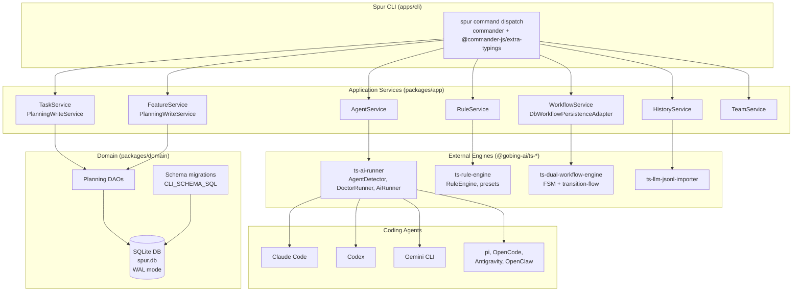

# Spur Help Documentation

---

### What's Spur?

Spur is a **local-first harness engineering toolkit** for mainstream coding agents (Claude Code,
Codex, Gemini CLI, Antigravity, pi, OpenCode, OpenClaw). It wraps agents you already have installed
and authenticated, adding execution discipline, constraint checking, workflow orchestration, task &
feature management, history analytics, and team coordination.

It is **not** a coding agent and **not** a BYOK LLM platform. Spur owns no model-reaching path other
than `spur agent run` (delegated to the installed agent).

### How to install Spur?

**Prerequisites:** Bun ≥ 1.3.14 on PATH; at least one supported coding agent installed.

```bash
# From source
git clone <repo> && cd spur-new && bun install
bun run apps/cli/src/index.ts --help

# From npm
npm i -g @gobing-ai/spur-cli
spur --help

# Standalone binary (Bun-less machines)
curl -fsSL https://<release-host>/install.sh | bash
```

Verify: `spur --version` → `0.3.1`; `spur agent doctor` checks every detected agent.

### CLI Surface

12 command groups, every command supports `--json`:

| Command | Purpose |
|---|---|
| `spur init` | Scaffold a local Spur project (`.spur/`) |
| `spur status` | Show project, Git, and optional path status |
| `spur agent` | Run and inspect supported coding agents + team agent specs |
| `spur rule` | Manage constraint rules and presets |
| `spur workflow` | Validate, execute, observe, cancel, and clean workflow YAML files |
| `spur task` | Manage tasks (WBS-numbered, markdown-backed) — 12 verbs |
| `spur feature` | Manage features (hierarchical IDs) — 8 verbs |
| `spur history` | Import and analyze coding-agent history |
| `spur message` | Send and inspect durable inter-agent messages |
| `spur team` | Coordinate team agent assignments and status |
| `spur serve` | Start the Spur web server (local fallback) |
| `spur migrate` | Apply CLI-owned schema migrations |

### Architecture Diagram



### The Details of These Commands

**Complete guide (the CLI surface, end-to-end):**
➡️ **[How to Use Spur for Daily Software Development](./how_to_use_spur_for_daily_software_development.md)**
— initialization, every command with flags, the daily development loop
(plan → implement → check → fix → verify → close), JSON output, configuration, and known
limitations.

**Slash-command workflow (agent-driven, recommended for daily work):**
➡️ **[How to Use the `sp:dev-*` Slash Commands for Daily Software Development](./how_to_use_dev_slash_commands_for_daily_software_development.md)**
— the `sp` plugin layer: take a vague idea to a verified prototype via
`/sp:dev-brainstorm` → `/sp:dev-plan` → `/sp:dev-idea` → `/sp:dev-refine` → `/sp:dev-run` →
`/sp:dev-verify` → `/sp:dev-wrap`/`/sp:dev-wrapall`, the `--next` chain, the `--auto` and
`--agent` contracts, and the autonomous pipeline.

**Adding a UI module to the Spur Board:**
➡️ **[How to Add a UI Module to the Spur Board](./how_to_add_a_new_ui_module.md)**
— the board is a module hub: add a self-contained React view with one directory and zero
wiring. Covers the `WebModule` contract, the RPC/UI seams, and what not to wire by hand.

**End-to-end pipeline architecture (canonical reference):**
➡️ **[`docs/design/e2e-workflow-for-system-development.md`](../design/e2e-workflow-for-system-development.md)**
— the 8 workflow YAMLs, the 26-step linear map, the HITL/auto-mode taxonomy, the gate
checklists, the lifecycle FSMs, the memory/checkpoint artifacts, and the
`system design approval` gate. The slash-command guide points here for the underlying
mechanics; the CLI guide points here for the 26-step view.

**Per-command reference:**

| Command | Reference |
|---|---|
| `spur init` | [cmd_init.md](./cmd_init.md) |
| `spur agent` | [cmd_agent.md](./cmd_agent.md) |
| `spur history` | [cmd_history.md](./cmd_history.md) |
| `spur rule` | [cmd_rule.md](./cmd_rule.md) |
| `spur workflow` | [cmd_workflow.md](./cmd_workflow.md) |
| `spur task` | [cmd_task.md](./cmd_task.md) |
| `spur feature` | [cmd_feature.md](./cmd_feature.md) |
| `spur message` | [cmd_message.md](./cmd_message.md) |
| `spur team` | [cmd_team.md](./cmd_team.md) |
| `spur status` | [cmd_status.md](./cmd_status.md) |
| `spur migrate` | [cmd_migrate.md](./cmd_migrate.md) |
| `spur serve` | [cmd_serve.md](./cmd_serve.md) |

### References

- `docs/00_ADR.md` — **WHY** decisions are made (authoritative)
- `docs/01_PRD.md` — **WHAT** the product is (scope, authoritative)
- `docs/02_ROADMAP.md` — **WHEN** phases land
- `docs/03_ARCHITECTURE.md` — **HOW** it's built (module boundaries, data flow)
- `docs/04_DESIGN.md` — **SURFACE** (every CLI command, flag, config key, env var)
- `docs/05_FEATURES.md` — **STATUS** (feature decomposition + state)
- `docs/99_PROJECT_CONSTITUTION.md` — **PROCESS** (how docs are maintained)
- `AGENTS.md` — agent entry point (stack, commands, gates, conventions)
- [`docs/design/e2e-workflow-for-system-development.md`](../design/e2e-workflow-for-system-development.md)
  — pipeline contracts + the 26-step map + the system overview mermaid diagram
