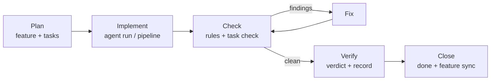

# The Daily Development Workflow

This page walks the full Spur loop for one unit of work: plan it, implement it, check it, verify
it, close it. Every step is a plain CLI command you can run by hand, script, or delegate to a
coding agent — the [slash commands](./dev-slash-commands.md) call exactly these verbs.



## 1. Plan: features and tasks

**Features** are hierarchical containers (group letters A–Z, digit children: `F7` → `F71`).
**Tasks** are WBS-numbered work items (`0001`, `0002`, …) linked to features. Both are
markdown-backed and CLI-gated — edit them through the CLI, never by hand.

```bash
# Features
spur feature create "User authentication"            # allocates a group letter
spur feature create "OAuth provider" --parent F7     # child digit under F7
spur feature list --status active
spur feature show F7
spur feature update F7 --section Goal --from-file ./goal.md
spur feature update F7 --field priority --value P0
spur feature advance F7 --to verifying               # walk the legal forward path

# Tasks
spur task create "Implement OAuth callback" --feature F7
spur task create "Add unit tests" --parent 0009
spur task list --status wip
spur task list --feature F7
spur task deps 0010 set 0008 0009                    # declare dependencies (cycle-checked)
```

Task statuses: `backlog → todo → wip → testing → done` (plus `blocked`, `cancelled`).
Feature statuses: `backlog → active → verifying → done` (plus `cancelled`).

> **Planning in bulk:** `spur task batch-create --file ./tasks.json` creates many tasks from one
> schema-validated JSON file — all or nothing. There is no partial batch.

## 2. Implement: agent execution

`spur agent run` is the single execution surface — every model call in Spur routes through it:

```bash
spur agent run "Add a login endpoint to src/auth/"               # auto-selected agent
spur agent run "Fix the failing test" --agent codex              # pin an agent
spur agent run "Continue" --continue                             # resume previous session
spur agent run "Refactor the DB layer" --agent gemini --model gemini-2.0-flash
spur agent run "Run the tests" --cwd ./packages/domain
spur agent run "Generate a summary" --mode json --json
```

Exit codes: `0` success · `1` agent not found/unusable · `2` invalid arguments · `3` agent
execution failure.

### Or: let a workflow drive

Workflows declare multi-step pipelines as YAML. The task pipeline runs precheck → implement →
test → review → approve → verify → record for one task:

```bash
spur workflow list
spur workflow validate .spur/workflows/basic.yaml
spur workflow run .spur/workflows/task-pipeline.yaml --vars '{"wbs":"0010"}'
spur workflow run .spur/workflows/task-pipeline.yaml --vars '{"wbs":"0010"}' --async
spur workflow trace <run-id> --follow        # watch an async run to completion
```

> **`--vars` takes a JSON object** — there is no `--var key=value` form, and values must be
> strings: pass lists as JSON strings (`--vars '{"tasks":"[\"0010\",\"0011\"]"}'`).

## 3. Check: rules and structure

Constraint rules evaluate the working tree before code ships:

```bash
spur rule run                                # default preset
spur rule run --preset recommended-post-check
spur rule run --rule no-direct-fetch         # single rule
spur rule run --fail-on warning              # stricter exit threshold
spur rule run --fix-mode auto --dry-run      # preview auto-fixes before writing
spur rule trace --last 20                    # what did previous runs find?
```

Structural checks validate the planning corpus itself:

```bash
spur task check 0010        # four-layer validation of one task
spur task check --strict    # warnings become failures
spur feature check F7       # same four layers for features
```

## 4. Verify and record

Verification produces a verdict artifact, and `record` writes it into the task:

```bash
spur task verdict 0010 --from-answer .spur/run/0010-verify-answer.txt
spur task record 0010 --verdict-file .spur/run/0010-verdict.json --solution-from-diff
```

> **The `done` gate:** `spur task update 0010 done` refuses to close a task without a non-empty
> Plan section and a recorded PASS verdict. To close with a known-failing verdict you must pass
> `--force-done --reason "..."`, which records an audited override — the walk through
> `todo → wip → testing → done` still runs each structural check.

## 5. Close and roll up

```bash
spur task update 0010 done
spur feature sync F7 --dry-run     # derive feature status from its tasks
spur feature sync F7               # apply the transitions
spur feature refresh --feature F7  # rebuild INDEX + task roster blocks (docs only)
spur task refresh                  # re-scan the corpus, report counts
```

## 6. History and teams (optional)

```bash
spur history import --source all           # fan out across every detected source
spur history analyze --since 2026-09-01
spur history daily                         # import → analyze → prune, run-once
```

```bash
spur message send "Please review the auth endpoint" --to reviewer
spur message inbox --agent reviewer
spur agent list --specs          # fleet roster with live run status (`--by-team` is gone: one project, one fleet)
```

## 7. The JSON convention

Every command supports `--json` for machine-readable output, and `--json-envelope` wraps that
output in the standard `{ok, data|error}` envelope for scripting. Use `--json` in CI and when
piping to other tools; the human-readable default stays the same.

## Where to go next

- [Slash commands](./dev-slash-commands.md) — one command per step of this loop, from inside
  your coding agent.
- Command pages: [task](./task.md), [feature](./feature.md), [agent](./agent.md),
  [workflow](./workflow.md), [rule](./rule.md), [history](./history.md), [team](./team.md).

<!-- Provenance (invisible)
Generated: 2026-09-11 via the kk-itc-generating three-reference merge.
References: live spur CLI --help output (authoritative; snapshots: .spur/run/help2-spur-help-snapshots/) >
docs/help carry-over (accuracy) > DeepWiki TOC (structure signal only).
Verified: every command, verb, and flag above matches the live snapshots.
-->
