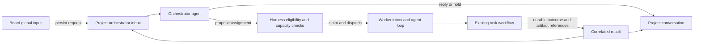

# Projects and agent fleet unification

## Design Summary

Make **Project** the single user-facing context for a repository checkout, its agent fleet, its
orchestrator conversation, and its work. Each Git worktree remains a separate project. Retire the
Workspace, Inbox, and Teams navigation entries after their useful capabilities have moved into
Projects. Retain durable messaging, execution, supervision, and task workflows as distinct internal
responsibilities. Retiring `spur team` must preserve those capabilities through existing owning nouns.

The recommended first version has one configured orchestrator agent per project, stable agent
mailboxes, recoverable delivery receipts, and two persisted strategies: `rest` and `gtd`. The
orchestrator interprets intent and proposes assignments; the harness validates scope, capacity, and
task eligibility before dispatch. Existing task workflows own execution and verification. The global
input bar submits to the selected project's orchestrator and displays durable receipt and result state.

Robin approved this design direction and investigation map on 2026-09-11. The approved defaults are
rest draining running work, GTD selecting already-authorized eligible tasks, Spur-managed loops for
v1, and the Conversation/Agents/Work Projects structure. The destination of G6 remains an
evidence-backed design and migration contract; exact recovery fields, migration compatibility, and
the interaction prototype still require the mapped investigations. This approval does not execute
CLI retirement, configuration migration, or production changes.

## Observations and material gaps

Evidence inspected on 2026-09-11. HIGH means directly supported by inspected source; MEDIUM identifies
an architectural inference or behavior requiring a runnable probe. No live agent fleet was exercised.

| Priority | Finding and implication | Evidence | Confidence |
| --- | --- | --- | --- |
| P1 | Inbox's Supervisor is only a filter for a literal endpoint; it is not an orchestrator. Wiring the bar to that string could merely queue messages without a consumer. | `apps/web/src/modules/inbox/SupervisorTab.tsx:4`; `packages/app/src/services/team-service.ts:308` | HIGH |
| P1 | Drain changes queued messages to injected before calling the agent. A crash or invocation failure in this gap can leave work consumed without execution. The normal loop does not establish task completion receipts. | `apps/cli/src/commands/agent.ts:568`; `apps/cli/src/commands/agent.ts:731`; installed `@gobing-ai/ts-db@0.4.62`, `dist/inbox-message-dao.js:44` | HIGH for ordering; MEDIUM for failure outcomes until fault injection |
| P1 | Fleet size cannot equal write capacity. Multiple agents editing one project checkout would conflict with the repository's one-writer rule. | `AGENTS.md`, Conventions & boundaries | HIGH |
| P2 | Project identity already exists as normalized path, with name and port as metadata. A second workspace identity would duplicate that authority. | `packages/config/src/projects.ts:6`; `packages/app/src/services/project-registry.ts:9`; `docs/design/project-switcher.md:49` | HIGH |
| P2 | Workspace requires a project-local team and composes Team, Inbox, and Tasks. Consequently an existing project without a team has an empty Workspace. | `apps/web/src/modules/workspace/WorkspaceShell.tsx:18`; `apps/web/src/modules/workspace/tabs.ts:18` | HIGH |
| P2 | GlobalAgentBar is explicitly UI-only: Send clears the draft and displays a stub notice. It has module context but no durable request or project conversation. | `apps/web/src/components/GlobalAgentBar.tsx:18`; `apps/web/src/components/GlobalAgentBar.tsx:36` | HIGH |
| P2 | Role propagation exists in AgentService, but the inspected default supervisor wrapper and drain rewrite do not establish a complete spec-role/project-context handoff. Verify the resulting child environment, cwd, and DB before treating registration as reliable. | `packages/app/src/services/agent-service.ts:371`; `packages/app/src/services/supervisor-service.ts:105`; `packages/app/src/services/supervisor-service.ts:210`; `apps/cli/src/commands/agent.ts:544` | HIGH for source seams; MEDIUM for end-to-end behavior |
| P2 | Identity-pinned waits, coordination run records, and persisted event following already exist. Their reuse is preferable to another transport or live-event store. | `docs/design/inter-agent-control-plane.md`, sections 2–8; `apps/cli/src/commands/agent.ts:789` | HIGH |
| P2 | TeamService currently owns messaging, specs, assignment, and team materialization. CLI retirement requires caller migration; deleting its class or command would remove unrelated capabilities. | `packages/app/src/services/team-service.ts:285`; `packages/app/src/services/team-service.ts:508`; `packages/app/src/services/team-service.ts:621` | HIGH |
| P3 | Historical docs and schema names contain residue. A workspaces table/DAO exists, although current Workspace composition does not use a Workspace service. Do not assume every similarly named object should be dropped. | `packages/domain/src/schema/workspaces.ts:3`; `docs/design/workspace-design.md` | HIGH for existence; consumers need inventory |

The installed dependency sources were resolved from `packages/app` with `import.meta.resolve`,
not a potentially stale root package link. Both `ts-db` and `ts-ai-runner` resolve to 0.4.62.
The inbox DAO already exposes `markDelivered` and `markFailed`; these alone do not provide a
claim lease, safe replay, or a verified task result. Any required generic queue extension belongs in
the released `ts-db` facade, with Spur owning its application-level dispatch and result contract.

## Approaches

| Approach | Benefit | Cost / limitation | Confidence |
| --- | --- | --- | --- |
| 1. Rename Workspace to Projects and compose existing views | Small UI change; reuses current components | Leaves team-based identity, fictional Supervisor, and delivery gap intact; does not satisfy the requested interaction loop | HIGH that it is small; LOW that it meets the destination |
| 2. Project-centered integration over existing runtime — recommended | One project context, real orchestrator, stable mailboxes, common CLI/Board behavior; preserves working infrastructure | Requires a delivery contract, lifecycle reconciliation, config migration, and design supersession before removal | HIGH architectural fit; MEDIUM implementation readiness |
| 3. Global orchestration daemon with cross-project fleet and new broker | Could coordinate many projects and host-wide resources centrally | New lifetime, ownership, routing, migration, and failure boundaries; greater scope than this request requires | LOW justification for v1 |

Recommendation: approach 2. “Dead simple” should describe the operator's model, while the small set
of internal distinctions needed for recovery remains explicit. The first deliverable must prove a
complete command/result loop; renaming screens should follow that proof.

## Project, fleet, and runtime identities

| Concept | Proposed meaning | Authority |
| --- | --- | --- |
| Project | One canonical checkout/worktree root; repository relationship is metadata | Existing project registry and project-local configuration |
| Fleet | The configured agent instances belonging to this project; no independent fleet CRUD identity | One project-local agent declaration |
| Agent instance | Stable addressable member, independent of current process, executor choice, or run | Existing spec identity evolved into the durable mailbox key |
| Role | The instance's declared job; selects behavior and eligible executor through existing role routing | Existing role/config resolution, propagated through `SPUR_ROLE` |
| Executor | Coding-agent/model profile used for a run; may change without changing the mailbox | Existing `agent.executors` |
| Run | One attempt with a run ID and occupant generation | Existing coordination run record |
| Orchestrator | A real fleet member, selected explicitly as the project's dispatcher | Project configuration plus one active fenced runtime owner |
| Process supervisor | Starts, observes, stops, and restarts processes; makes no product strategy decisions | Existing supervisor infrastructure |

Keep `~/.config/spur/projects.json` as the discovery registry. Do not turn it into a global queue or
fleet database. Preserve path-based identity in v1; names, ports, branch names, and executor names
are not addresses. A moved checkout needs explicit reconciliation; do not silently transfer an old
mailbox to another path. A durable opaque project ID can be added if move/rename preservation becomes
an accepted requirement; it is not needed merely to rename the navigation.

Use one project-local declaration for desired members and the orchestrator binding. Generated specs
are a projection, not a second editable roster. Existing member IDs must survive executor replacement
and roster reorder. Runtime status, claims, active strategy, and receipts belong in project-local
persistence; portable config supplies defaults. Starting the Board must not silently reset strategy.

The child context contract must include the project root, stable instance ID, effective role, current
run identity, and supervisor URL when applicable. Keep existing `SPUR_SPEC_ID` and coordination pins
where possible. An environment string is context, not proof of exclusive ownership or permission.
Validate the actual cwd and storage root at registration and launch. Treat `orchestrator` as an
explicitly configured role/binding; existing `planner` behavior can be reused without assuming that
every planner is the project's orchestrator. Audit the role vocabulary before adding a default role.

Approved v1 boundary: Spur-managed agent loops. A long-lived wrapper is not necessarily one continuous
native conversation; session resume and already-open interactive agents need an explicit adapter
contract. Never use terminal scraping or synthetic keystrokes as registration or dispatch.

## Complete interaction loop

1. Submission captures project identity and selected task/feature references explicitly. The server
   checks them against its project context and persists a request before acknowledging it. A retry
   with the same request key returns the original receipt. Clear the input only after that receipt;
   preserve the draft on failure. A submission cannot change project because the user switches views.
2. The orchestrator receives the request and records a disposition: answer, clarify, hold, or dispatch.
   Conversation persists independently of a particular process. Do not mark a question as a task.
3. Dispatch selects a concrete eligible instance, claims capacity and task ownership, and records the
   relation between request, assignment, message, run, and task. Role addressing remains exact-one
   for direct messaging; scheduling across several coders explicitly selects one instance.
4. A worker consumes a bounded batch with message IDs and correlation metadata preserved in the
   execution context. Acknowledging delivery is separate from successfully completing work.
5. The runtime records exit/failure even if the worker never sends a prose reply. Work completion
   requires the existing task verification result and artifact references. A zero process exit alone
   cannot turn a task green.
6. The result returns durably to the orchestrator's logical mailbox and the human conversation. On
   restart, reconcile unfinished requests and runs before dispatching more work. Event streams notify
   the UI; persisted state remains authoritative after disconnects.

**Delivery minimum.** Specify claim ownership/expiry, bounded attempts, failed delivery visibility,
and idempotency before promising reliable commands. Use recoverable at-least-once delivery where
replay is safe; do not promise exactly-once execution of arbitrary coding-agent side effects. If an
agent may have edited files but its receipt is missing, expose “outcome unknown” and reconcile run
artifacts/task state before retrying. Never blindly requeue ambiguous work.

Do not compress everything into one message status. Keep delivery state, run state, task verification,
and the orchestrator's hold reason distinct. Reuse `in_reply_to` for existing reply relationships;
add only the correlation and attempt fields the failure probes demonstrate are needed. Commit
dispatch/result state and the corresponding durable message together where they share a database,
or use a replayable pending record and reconciliation. An in-memory event callback is insufficient.

The normal Board input always addresses the project's orchestrator. Preserve targeted CLI messaging
for worker replies, diagnostics, and explicit operator control; routing every internal message through
an LLM would add latency and another failure dependency. Typed outcomes can be processed without a
model turn when no judgment is needed.

## Strategy and capacity

Robin approved these strategy semantics on 2026-09-11.

| Strategy | Receive and respond | New dispatch | Existing work |
| --- | --- | --- | --- |
| `rest` | Accept human input, persist holds, ingest results; answer explicit questions when available | None, including previously queued assignments that have not started | Running work finishes; cancellation is a separate action |
| `gtd` | Same, with next-work decisions | Eligible work within the project's already-authorized task scope | Continue until scope drains, a blocker occurs, or resources are unavailable |

`gtd` is a project dispatch policy, not a replacement for `/sp:dev-gtd` or task-pipeline.yaml. Reuse
the existing readiness/dependency/verification owners. A strategy may choose the next eligible work
and explain a hold; it may not bypass those gates. Initially a small declared strategy selection and
existing workflow/skill behavior are enough. Do not introduce a dynamic plugin loader, another
workflow engine, or a separate backlog model.

Capacity is the intersection of task readiness, available role-compatible executors, an idle managed
instance, permitted capabilities, and a free write slot. **V1 defaults to one write slot per project
worktree.** Read-only agents may operate concurrently when their native capabilities enforce that
boundary. A reviewer role name alone does not prove read-only execution. More parallel coding uses
separate worktree projects; cross-project dispatch is deferred unless Robin includes it in scope.

Keep `desired state` separate from observed liveness. A running process can be busy, blocked, or unable
to dispatch because its executor is disabled. Preserve quota disabling and current role/executor
resolution. No runnable work should produce a durable reason and a bounded/event-driven wakeup,
not a hot LLM polling loop. Human submissions, run outcomes, task eligibility changes, and capacity
changes are wakeup candidates; the investigation must establish available event producers.

One active orchestrator owner is enforced at the runtime claim boundary, not by role naming. Strategy
changes and claims need a shared version/transaction boundary so `rest` wins against a racing new
dispatch. Fencing must reject stale workers or orchestrators after replacement. Restart resumes
persisted state and reconciles ownership before accepting work.

## Projects Board and CLI ownership

Recommended information architecture: Projects opens the selected project directly, with a compact
header showing project/worktree, strategy, orchestrator availability, and fleet capacity. The existing
switcher supplies project selection; do not add another team or workspace selector beneath it.

Use three views: **Conversation**, **Agents**, and **Work**. Conversation shows human requests,
orchestrator responses, holds, and result links. Agents shows members and their role/executor/current
work; terminal and process details open from the selected member. Work reuses existing task/feature
views. Message history and activity remain available in contextual detail, without separate top-level
Inbox or Teams modules. A project with zero agents still opens and explains what is missing.

The global bar uses the same conversation and submission path on every Board route. Show destination,
strategy, pending receipt, actionable error, and result links. Retain drafts by project, support
keyboard submission without breaking IME composition, announce status accessibly, and keep results
available after refresh. Offline runtime, missing orchestrator, held work, quota exhaustion, and
ambiguous execution outcomes need distinct, understandable states. A persisted-but-unconsumed
request must say so. Apply DESIGN.md tokens and responsive/accessibility rules.

`open-design` is not present in the session's skill/tool catalog. This artifact supplies its design
brief; the UI investigation should use it if available, otherwise a local reviewable prototype.
No new design dependency is installed during charting.

| Existing surface | Proposed disposition |
| --- | --- |
| `spur projects` | Retain registry and project server lifecycle ownership |
| `spur self` | Retain harness self-management and serving; avoid adding fleet CRUD here |
| `spur agent` | Retain execution, instance addressing, wait, and agent lifecycle ownership; inspect existing verbs before proposing additions |
| `spur message` | Retain send/reply/inbox/watch; strengthen receipts, context, and failure visibility |
| `spur team` | Retire after assignment, roster materialization, and lifecycle callers have replacements under their owning services/nouns |
| Board Workspace / Inbox / Teams | Remove navigation after functional replacement and route/bookmark migration |

Configuration is sufficient for desired membership; runtime start/stop/restart and diagnostics still
need an operator surface. Prefer existing `agent` operations or Projects UI, with exact new verbs
reviewed as a public-surface design. Do not hide every control in config or move all Team verbs
mechanically under `self`. Task assignment should use the task write service and its lock domain.

## Migration and delivery order

1. **Inventory and prove identity/delivery.** Map all CLI/server/plugin callers, installed engine
   contracts, queue states, role/env/cwd propagation, and storage isolation. Preserve stable legacy
   mailbox IDs. Probe drain-before-spawn, stale occupant, and result-before-notification failures.
2. **Specify and demonstrate orchestration.** Produce executable traces for rest/GTD, capacity claims,
   restart, duplicate input, missing executors, and blocked work using the existing pipeline seams.
   Review authority boundaries and config ownership before implementing a real autonomous loop.
3. **Prototype the Projects interaction.** Exercise the global bar and conversation through the
   proposed states, with project switching and fleet details. This is a design prototype, not a
   claim that the backend already works.
4. **After design review, plan implementation slices.** First ship one durable human-request → worker
   result loop, then scheduling/recovery and the complete Projects UI, then retire old surfaces.
   Existing contracts remain authoritative until superseded in their owning documents.

Migration must inventory `agent.team` configs, manually authored specs, generated specs, orphaned
members, duplicate roles, multiple legacy teams resolving to one path, and teams spanning paths.
Do not silently merge conflicting rosters or delete historical messages. Preserve IDs or supply an
explicit alias mapping. Offer a preview, backup, and idempotent conversion with rollback handling
for old clients and database schema compatibility. Track any temporary aliases under ADR-058 with
an exit condition. No indefinite dual-writing of rosters or queues.

ADR-052's team-scoped composition needs explicit supersession. ADR-037's registry and ADR-057's
control-plane boundary should be retained where compatible. ADR-022 continues to own task lifecycle.
Update owning design satellites, affected architecture/product scope, CLI references, Board routes,
init templates, and plugin callers in the implementation plan. Do not rewrite historical ADRs or
feature receipts. Reconcile M6 and G4's unfinished work before creating duplicate implementation tasks.

## Investigation map and open decisions

G6 lives under **G — Collaboration**, which already owns messaging and supervision. It is a design
map, not another product capability root. The frontier is deliberately limited to three cohesive
investigations: runtime/migration evidence, strategy failure traces, and Projects interaction prototype.
Strategy and UI investigations consume the runtime inventory; none is resolved by this charting session.

| Investigation | Deliverable | Dependency |
| --- | --- | --- |
| [0828 — Inventory and probe project fleet identity, delivery, and legacy migration](../tasks4/0828_inventory-and-probe-project-fleet-identity-delivery-and-lega.md) | Source inventory, isolated fault probes, and preserve/convert/retire matrix | Frontier; no prerequisite |
| [0829 — Prototype rest and GTD dispatch traces with capacity and restart failures](../tasks4/0829_prototype-rest-and-gtd-dispatch-traces-with-capacity-and-res.md) | Runnable fake-executor traces and minimal strategy contract | 0828 |
| [0830 — Prototype Projects conversation, agents, work, and global input interactions](../tasks4/0830_prototype-projects-conversation-agents-work-and-global-input.md) | Reviewable interaction prototype and migration mapping | 0828 |

## Approval record and remaining decisions

- Robin's response on 2026-09-11: **approved**. It approves the recommended project-centered design,
  rest/GTD defaults, managed-loop v1 boundary, CLI ownership, Projects structure, and investigation map.
- `rest` lets running work finish and prevents new dispatch; GTD uses already-authorized eligible tasks.
- V1 uses Spur-managed loops. Adoption of already-open native sessions is deferred.
- After the migration inventory, select the compatibility/removal window for `spur team` and legacy
  config/routes. Retirement is requested; an exact breaking cutover has not been selected.
- Review the concrete Projects prototype before implementing its detailed interactions. Cross-project orchestration,
  project-move identity preservation, and richer strategies require separate scope decisions if needed.

Remaining fog: native session continuity across executor changes; exact claim/result schema after
fault probes; wakeup sources available without extra polling; behavior when a project path is moved
or an agent is removed with unfinished work. Detailed fields and API names follow evidence rather
than being invented here.

## Self-review and verification

- The proposal separates current source observations, inferred risks, and recommended future behavior.
- Design direction is approved; no live end-to-end pass or design-tool output is claimed.
- Existing processes, configs, global registry, and old corpus statuses remain unchanged.
- CLI-gated feature/task writes and affected-record checks provide structural verification for the map.
- Recorded checks: G6 feature check PASS with no findings; task 0828 check PASS with no findings;
  tasks 0829 and 0830 check PASS with expected prerequisite-not-done warnings for 0828. The
  recommended-pre-check preset passed all 45 rules with no findings. Dependency link-check passed.
  Runtime tests, build, live agent dispatch, and browser verification were not run for this chart.
- The skill's requested free-form feature headings are represented through canonical Goal/Scope and
  nested Notes because the live feature CLI accepts only existing canonical sections. Tags use the
  supported `--field tags` array conversion rather than the stale `--section tags` example.
