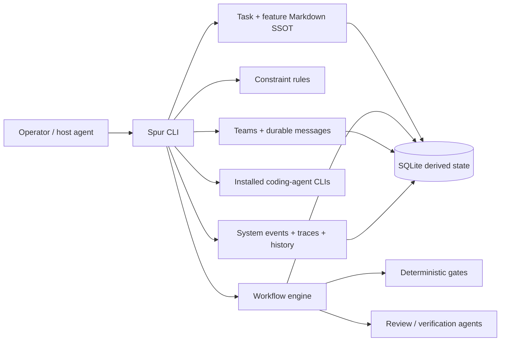
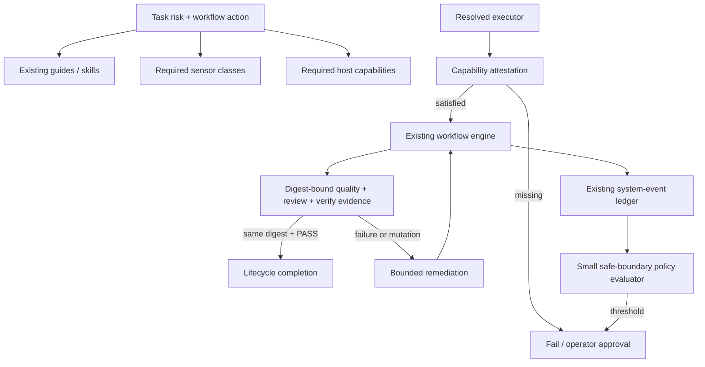

# Harness Engineering Playbook vs Spur

**Date:** 2026-08-28

**Repository baseline:** `dad078ad53b86385b8c6775b1ea23847bf4ff64a`

**Source artifact:** `/Users/robin/Downloads/harness_final.pdf` · 9 pages · SHA-256
`45ed4a9c9ca37fe6b97ec59ff776308bda53507ea470c71c187aa562569e6fcc`

**Assessment mode:** architecture, implementation, operational controls, and evidence integrity

**Confidence:** High for Spur implementation findings; high for the PDF's contents; medium for the PDF's provenance

---

## 1. Executive conclusion

Spur already implements most of the *engineering concerns* in the PDF, but through a more concrete and
coding-specific architecture. The PDF presents six cross-cutting layers—guides, sensors, agentic loop, memory,
permissions, and observability. Spur packages those concerns into a local-first product plane: task/feature SSOT,
constraint rules, workflow engines, agent adapters, durable coordination, history analytics, and an operations board.

The right direction is **not** to reorganize Spur into six new packages or copy the PDF's terminology. Keep Spur's
existing owners and use the six-layer model as a coverage audit. Replacing proven boundaries would add indirection
without adding control.

Spur's strongest differentiators are:

- deterministic lifecycle and corpus gates rather than prompt-only discipline;
- a portable layer over ten installed coding-agent CLIs without owning model credentials;
- Markdown task/feature authorities with persisted, inspectable workflow state;
- identity-pinned inter-agent coordination using durable messages and artifact references, not terminal scraping;
- redacted, bounded observability with explicit retention;
- a self-improvement ratchet that promotes recurring lessons into deterministic rules.

Four issues require correction to support a world-class “verified result” claim:

1. **Final verification is still mutating.** `task-pipeline.yaml` invokes `/sp:dev-verify --fix all`; the architecture
   correctly states that a `may-write` action cannot establish the final proof state. Remediation and observe-only
   verification must be split.
2. **The docs pipeline manufactures a PASS verdict.** It writes a synthetic JSON verdict instead of running a real
   evidence check. Structural task validation still runs, but semantic verification is bypassed.
3. **The root guide is at its operational size limit.** `AGENTS.md` is 32,577 bytes—only 191 bytes below 32 KiB—and
   contradicts its own “first 30 seconds” navigation contract. Guide retrieval is good; always-loaded guide hygiene is
   not.
4. **Unattended or privileged execution lacks a first-class capability contract.** Spur deliberately delegates
   sandboxing to installed agents. That is a sound product boundary, but the harness must still declare required
   capabilities, verify host enforcement, and fail closed when a run's risk exceeds the attested environment.

The first three are current correctness/reliability defects. The fourth is a release condition for higher-autonomy
operation, not a reason for Spur to build its own sandbox.

---

## 2. Source integrity and interpretation

### 2.1 What the PDF is

The artifact is titled **“Harness Engineering — Agent = Model + Harness: The 6-Layer Production Playbook.”** It is a
nine-page, two-column synthesis dated August 2026. It describes a general production harness around AI agents and then
extends the model to multi-agent systems.

The document displays a Google wordmark, but its own disclaimer says it was independently compiled, is not affiliated
with Google, OpenAI, Anthropic, Mitchell Hashimoto, or HashiCorp, and is not endorsed by them. Its PDF metadata is
anonymous. This report therefore treats it as an **independent industry synthesis**, not as a Google publication.

### 2.2 Claim verification

The architectural concepts are consistent with primary industry sources:

- OpenAI's field report describes a repository built by coding agents under a harness, with humans steering rather
  than writing application code. It also reports roughly one million lines of code and about 1,500 pull requests, and
  explains why a large monolithic guide was replaced by a short navigation document plus structured source-of-truth
  documentation. See [Harness engineering: leveraging Codex in an agent-first world](https://openai.com/index/harness-engineering/).
- Martin Fowler's article frames guides as feedforward context and sensors as feedback, distinguishing computational
  sensors from inferential sensors. See [Harness Engineering](https://martinfowler.com/articles/harness-engineering.html).
- Mitchell Hashimoto describes progressively engineering the environment around the agent instead of relying on raw
  prompting. See [My AI Adoption Journey](https://mitchellh.com/writing/my-ai-adoption-journey).
- LangChain reports improving a fixed model on Terminal-Bench 2.0 from 52.8 to 66.5 through harness changes, including
  better tools, context, self-verification, and tracing. See
  [Improving Deep Agents with harness engineering](https://www.langchain.com/blog/improving-deep-agents-with-harness-engineering).
- Anthropic recommends starting with simple composable patterns and adding autonomous complexity only when it creates
  measurable value. See [Building effective agents](https://www.anthropic.com/engineering/building-effective-agents).
- OpenAI describes controlled sandbox environments as an execution primitive for agent workflows. See
  [The next evolution of the Agents SDK](https://openai.com/index/the-next-evolution-of-the-agents-sdk/).

Claims in the PDF that are **not sufficiently attributable** should not drive architecture decisions: the “95% of
enterprise AI agents never reach production” statistic, the exact GAIA improvement claim, and the cited Google ADK 2.0
article could not be tied to an authoritative primary source during this review. They are unnecessary to the report's
conclusions.

---

## 3. The PDF's model, comprehensively

### 3.1 Core thesis

The model is not the deployable unit. Production reliability emerges from the model plus the environment that shapes,
checks, constrains, remembers, and observes its work. The PDF divides that environment into an inner harness and an
outer harness:

- **Inner harness:** context, prompts, tools, state, and the immediate plan/execute/verify loop.
- **Outer harness:** permissions, process boundaries, observability, budgets, escalation, and organizational controls.

This distinction matters because prompt quality cannot compensate for missing runtime enforcement or weak evidence.

### 3.2 Six layers

| Layer | Purpose | Failure prevented | Production expectation |
| --- | --- | --- | --- |
| Guides | Give the agent project-specific intent, constraints, examples, and navigation | repeated rediscovery, convention drift, wrong local assumptions | short, current, scoped, progressively disclosed |
| Sensors | Turn outcomes into machine-checkable feedback | plausible but incorrect completion | deterministic checks first; inferential judgment only where computation cannot decide |
| Agentic loop | Bound plan → execute → verify → fix | one-shot failure, infinite retries, unbounded spend | explicit stopping conditions, retry ceilings, escalation packets |
| Memory | Preserve task state, decisions, artifacts, and recovery points | context loss, duplicate work, irrecoverable interruption | structured state, checkpoints, provenance, cleanup policy |
| Permissions | Restrict tools and side effects by scope, rate, reversibility, and visibility | destructive or unauthorized action | least privilege, approval gates, trust separation, fail-closed enforcement |
| Observability | Expose traces, cost, progress, health, and control triggers | silent stalls, hidden cost, undiagnosable failure | bounded telemetry, useful metrics, trip wires, operator controls |

### 3.3 Cross-layer design rules

The PDF's more valuable guidance is cross-layer rather than taxonomic:

1. **Use the strongest available control.** A deterministic environment constraint is more reliable than a guide; a
   guide is more reliable than an ad-hoc prompt; memory is weaker than all three.
2. **Ratchet recurring failures.** A mistake first becomes a lesson, then a guide or sensor, and finally an environment
   constraint when recurrence justifies it.
3. **Bound the loop.** Retry count, wall clock, token usage, monetary cost, and tool calls need stop conditions. Defaults
   shown in the PDF are illustrative, not universal standards.
4. **Escalate with evidence.** A blocked run should hand off goal, attempts, artifacts, diagnostics, remaining uncertainty,
   and the exact decision needed.
5. **Measure verified outcomes.** Token volume or agent activity is not success. The relevant unit is a completed task
   that passed its sensors without manual correction; cost should be expressed per verified result.
6. **Separate multi-agent roles.** Workers exchange typed artifacts and structured state, while an independent verifier
   evaluates results. Shared unbounded conversation context is discouraged.
7. **Keep the harness proportional.** Do not build a large orchestration system for deterministic tasks, rare workflows,
   or problems a simple script already solves.

### 3.4 What the PDF does not provide

The PDF is a reference model, not an implementable product specification. It does not define:

- a durable data model or source-of-truth strategy;
- exact workflow transition semantics and crash recovery;
- cross-vendor agent adapter contracts;
- evidence schemas or proof-state finality;
- rule distribution and plugin portability;
- local/cloud deployment boundaries;
- task/feature lifecycle governance;
- compatibility, migration, or corpus evolution policy.

Those omissions explain many differences with Spur; they are not necessarily defects in the PDF.

---

## 4. Spur's current harness architecture

Spur is explicitly a local-first harness around installed coding agents, not an agent or BYOK model platform
(`docs/01_PRD.md:17-27`). Its primary composition is:



The CLI is the single-process writer of record, application services own logic, external engines provide reusable
runtime capabilities, and SQLite is reached through domain persistence adapters (`docs/03_ARCHITECTURE.md:114-139`).
Task and feature Markdown remain authoritative while the database is derived, recoverable state
(`docs/03_ARCHITECTURE.md:491-539`).

The task pipeline is a bounded state machine rather than a loose prompt chain:

```text
precheck → implement → quality gate ↔ bounded remediation → review
         → optional operator approval → verify → proof recheck → record → done
```

The concrete pipeline declares a 20-transition iteration bound, 30-minute model-stage timeouts, two automatic quality
fix attempts, deterministic task checks, an optional human gate, and fail-closed terminal transitions
(`config/workflows/task-pipeline.yaml:20-40`, `config/workflows/task-pipeline.yaml:286-416`,
`config/workflows/task-pipeline.yaml:589-745`).

---

## 5. Overlap assessment

| PDF concern | Spur implementation | Assessment | Disposition |
| --- | --- | --- | --- |
| Guides | Root `AGENTS.md`, numbered docs, design satellites, skills, commands, rule descriptions | Broad and well-governed, but root guide is oversized | **Must fix guide size** |
| Deterministic sensors | Biome, TypeScript, tests, 90/90 coverage, rule engine, task/feature gates, corpus sweep, transition-shim and script-contract checks | Stronger and more concrete than the PDF | Keep; improve sensor coverage inventory |
| Inferential sensors | Three-dimensional review, functional verification, history-anatomy evidence validator | Good patterns exist, but independence and proof finality are inconsistent | **Must fix proof chain** |
| Agentic loop | YAML FSM/DAG, retries, terminal states, HITL, failure routing, pause/resume | Mature and explicit | Improve uniform runtime budgets |
| Memory | Markdown SSOT, SQLite runs, `.spur/run` artifacts, checkpoints, indexed context, decision/lesson docs | Strong provenance and recoverability | Improve lifecycle/GC and checkpoint freshness |
| Permissions | Host-agent permissions, protected-file rules, corpus write guard, safe process boundaries, secret redaction | Policy fragments exist; no unified runtime capability contract | **Must fix before higher autonomy** |
| Observability | Consolidated run logs, traces, event ledger/SSE, history import, cost analytics, Board projections | Deep diagnostics; weak real-time resource accounting and automated control response | Improve; production gate for unattended mode |
| Escalation | Paused/failed states, artifacts, partial handoff paths, task reports | Evidence is available but no single canonical escalation packet | Improve by composing existing artifacts |
| Ratchet | Constitution lessons → rules, rule scan/add/refine, corpus baseline, transition-shim manifest | Excellent and more operational than the PDF | Preserve |
| Multi-agent | Roles, executors, teams, durable messages, occupant pinning, exact waits, artifact paths | Stronger control-plane semantics than the PDF | Improve verifier independence |
| Cost limits | Model-query baselines, wall-clock budgets, history cost analytics | Measurement exists; token/cost limits are mostly null or retrospective | Improve runtime enforcement |
| Trip wires | Timeouts, fail-closed guards, event severities, heartbeat/drop telemetry | Local controls exist; no general threshold → pause/freeze/rollback controller | Improve without a new engine |

### 5.1 What Spur already does particularly well

#### Guides become enforceable controls

Spur does not leave recurring requirements as prose. Rules are YAML interpreted by a deterministic engine
(`docs/03_ARCHITECTURE.md:179-186`); task and feature transitions invoke structural checks; the corpus sweep catches
post-transition drift; compatibility shims are tracked two-sided so both undeclared shims and stale manifest entries fail
(`docs/03_ARCHITECTURE.md:953-967`). This is the PDF's ratchet implemented as a product mechanism.

The constitution also has the correct learning policy: observations enter a lesson inbox, while recurring or hardened
lessons move into rules (`docs/99_PROJECT_CONSTITUTION.md:413-420`). That is substantially better than endlessly growing
`AGENTS.md`.

#### Sensors are layered rather than LLM-only

The default gate composes link integrity, transition-shim integrity, plugin script contracts, lint/type checks, tests,
and pre/post rule presets (`package.json:80-87`). Coverage is always measured and enforces 90% line and function
thresholds (`bunfig.toml:7-13`). The history-anatomy workflow demonstrates the right inferential pattern: a deterministic
structure gate, independent evidence validation, a shared two-pass correction budget, and atomic publication only after
PASS (`config/workflows/history-anatomy.yaml:197-263`, `config/workflows/history-anatomy.yaml:294-308`).

#### The loop is durable and fail-closed

Workflow definitions own graph, guards, retries, and failure policy. Runs are persisted, failure terminal states produce
failed lifecycle outcomes, extension paths reject traversal, and guard failure denies transitions atomically
(`docs/03_ARCHITECTURE.md:188-206`, `docs/03_ARCHITECTURE.md:240-272`). Pause/resume restores the persisted state and
effective variables rather than reconstructing a run from conversation context.

#### Observability is designed as a bounded safety surface

Per-run logs receive redacted and bounded events, remain available for detached execution, never fail the workload when
the sink fails, and are reclaimed by a 30-day retention policy (`docs/03_ARCHITECTURE.md:208-238`). Agent execution emits
start, bounded output, heartbeat, dropped-output, and terminal events (`packages/app/src/observability/agent-execution.ts:44-92`).
The canonical system-event envelope bounds payloads and recursively removes secret-shaped fields. This is operational
instrumentation, not console-print debugging.

#### Multi-agent coordination has explicit identity semantics

Spur pins waits to `specId + runId + generation`, persists coordination rows, communicates through durable messages, and
passes artifact paths rather than terminal bodies (`docs/03_ARCHITECTURE.md:889-950`). It explicitly rejects terminal
scraping, synthetic keystrokes, and a third IPC channel. The PDF recommends typed handoffs; Spur has already solved the
harder replacement-occupant and stale-wait cases.

#### Product boundaries are disciplined

Spur reuses installed agents, never stores their keys, keeps raw history in files, and confines persistence behind
existing owners (`docs/01_PRD.md:47-56`, `docs/01_PRD.md:138-151`). The architecture rejects a new workflow DSL,
progress store, or controller in favor of deepening existing seams (`docs/03_ARCHITECTURE.md:1027-1043`). That decision
should survive this review.

---

## 6. Findings: must fix, improve, preserve

### 6.1 Must fix

#### M1 — Final verification does not yet establish an immutable proof state

**Severity:** Critical for evidence integrity

**Evidence:** `config/workflows/task-pipeline.yaml:442-484`; `docs/03_ARCHITECTURE.md:1095-1129`

The verifier runs with `--fix all`, then captures the proof digest. This proves the state *after* verification and protects
against later mutation before record, but it does not prove that quality, review, and verification evaluated one unchanged
digest. The architecture already records the correct invariant: remediation may write, final verification must use
`--fix none`, and quality/review/verify evidence must name the same digest.

**Fix direction:** implement the accepted proof-state split at the existing workflow/action seams. A failed observe-only
verification may take one bounded remediation hop, then must repeat quality, review, and verification on a fresh digest.
Do not add a second pipeline or a proof service.

#### M2 — `docs-pipeline` creates evidence it did not measure

**Severity:** Critical for verdict trust

**Evidence:** `config/workflows/docs-pipeline.yaml:112-130`

The done state writes a hard-coded `"verdict":"PASS"` artifact because the pipeline does not run `/sp:dev-verify`.
The subsequent task matrix check validates corpus shape, not the document's requirements or acceptance criteria. The
artifact therefore looks equivalent to a real verification verdict while carrying weaker semantics.

**Fix direction:** replace the stub with the smallest real docs sensor: deterministic required-file/link/structure checks
plus an evidence-based read-only verification step when the task has semantic AC. If a docs-only result intentionally has
a different assurance class, encode that class explicitly; never call it an ordinary verify PASS.

#### M3 — The always-loaded guide is effectively at the platform cap

**Severity:** High reliability risk

**Evidence:** measured 2026-08-28: `AGENTS.md` = 501 lines, 4,060 words, 32,577 bytes; project guidance says Codex has an
approximately 32 KiB cap. The file has 191 bytes of headroom. `docs/99_PROJECT_CONSTITUTION.md:357-366` says it should
contain only first-30-seconds material. The portable constitution also sets an approximate 150–200 instruction budget
(`config/templates/docs/99_PROJECT_CONSTITUTION.md:346-363`).

This is not cosmetic. Truncation or uneven attention can silently remove late safety and verification rules.

**Fix direction:** use the existing navigation architecture. Keep identity, non-negotiable routing, safety, stack facts,
and verification entry points in root `AGENTS.md`; move operational detail to existing numbered docs and skill references.
Add a cheap byte/instruction-budget sensor. Do not create another guide format.

#### M4 — Capability enforcement is not attestable for unattended or privileged runs

**Severity:** Conditional critical—before enabling higher-autonomy execution

**Evidence:** sandboxing is explicitly out of scope (`docs/01_PRD.md:129-136`); the unified project config has agent,
rules, workflows, redaction, history, tasks, and features but no execution-capability policy
(`packages/config/src/index.ts:700-725`).

Delegating sandbox implementation to the native agent/platform is correct. The missing control is the contract between
Spur and that host. Today a workflow can express timeouts and approvals but cannot assert “this stage requires read-only
filesystem, no network, and no external writes” and verify that the selected executor enforces those constraints.

**Fix direction:** add a minimal required-capabilities declaration to the existing executor/action resolution path and a
runtime attestation result. Fail closed for unattended execution when required controls are unavailable; allow explicit
operator override for supervised local runs. Reuse native sandboxes and approval systems—do not build a Spur sandbox.

### 6.2 Improve

| ID | Gap | Evidence | Improvement using existing seams |
| --- | --- | --- | --- |
| I1 | Reviewer/verifier independence is declarative, not guaranteed | Review and verify both pin `${vars.agent}` while declaring `role: reviewer` (`config/workflows/task-pipeline.yaml:418-459`) | For material changes, require fresh context and resolve a distinct verifier spec/executor; reuse the existing role and occupant model |
| I2 | Runtime budgets are incomplete | `tokenCostUsd` is null for every pipeline; several wall-clock budgets are null (`config/pipeline-budgets.json:5-40`) | Feed measured usage into the existing budget checker and workflow stop conditions; distinguish warning, pause, and hard-stop policies |
| I3 | Live agent usage is unavailable | Terminal execution events explicitly emit `usage: 'unavailable'` (`packages/app/src/observability/agent-execution.ts:75-83`) | Capture native usage when the executor exposes it; retain “unavailable” rather than estimate when it does not |
| I4 | Health is diagnostic, not closed-loop | Events and timeouts exist, but no general policy maps thresholds to pause/freeze/rollback | Evaluate a small fixed policy set over existing events at safe workflow boundaries; no new event bus or controller |
| I5 | Escalation evidence is fragmented | Failed runs, partial artifacts, messages, and task reports exist separately | Render one escalation packet from existing references: goal, digest, attempts, last gate, artifacts, unresolved decision |
| I6 | Memory retention is uneven | Workflow logs have a 30-day policy; checkpoint and indexed-context freshness/GC are not equivalently governed | Add freshness metadata and bounded cleanup to current memory owners; do not add a vector database |
| I7 | Sensor coverage is implicit | Many rules/gates exist, but no task-risk → required-sensor map | Extend the composition baseline with required sensor classes and fail if a high-risk class has no deterministic or inferential check |
| I8 | Success/cost metrics are retrospective | History analytics and real-run cost scripts exist, but the primary operational objective is not “verified result without correction” | Derive verified-result rate, correction rate, and cost per verified result from existing run/task/history links |
| I9 | External-input trust is policy prose | Redaction and secret rules are strong, but prompt-injection trust separation is not a first-class workflow input property | Mark external artifacts as untrusted at ingestion and prevent them from expanding capabilities; enforce at the capability gate |
| I10 | Pipeline budgets are deliberate checks, not universal runtime stops | Model-query and gross wall-clock baselines are useful regression controls | Keep the offline regression check; add runtime stops only to model-bearing/side-effecting stages where measurements justify them |

### 6.3 Preserve

Do not trade these properties away while closing the gaps:

- local-first operation and no model-key ownership;
- Markdown task/feature authority with derived database state;
- one workflow engine and one system-event ledger;
- deterministic sensors before inferential judges;
- one writer per working tree;
- operator-visible, explicit irreversible-action gates;
- bounded/redacted artifacts and logs;
- exact identity pinning for multi-agent waits;
- CLI nouns as a deliberately small public surface;
- present-don't-apply behavior for environment-improvement proposals.

---

## 7. Differences and trade-offs

| Dimension | PDF approach: advantages | PDF approach: limitations | Spur approach: advantages | Spur approach: limitations |
| --- | --- | --- | --- | --- |
| Purpose | Memorable general model applicable beyond coding | Too abstract to implement without additional contracts | Concrete product and operating model for coding agents | Less immediately legible as one universal taxonomy |
| Architecture shape | Six orthogonal concerns expose missing controls | Encourages superficial “one subsystem per layer” interpretations | Capability owners align to real workflows and data | Cross-cutting coverage is scattered across docs/config/packages |
| Adoption | Seven-day incremental recipe lowers entry cost | Does not address long-lived migration or governance | Mature lifecycle, compatibility, and corpus controls | Higher learning cost and more ceremony for small tasks |
| Guides | Strong emphasis on short guides and progressive disclosure | No distribution/versioning mechanism | Skills, plugins, numbered docs, templates, and harness routing | Root guide has grown beyond its intended navigation role |
| Sensors | Clear deterministic vs inferential distinction | No evidence schema or proof-state definition | Concrete rule engine, tests, corpus gates, artifacts, and proof digests | Current final verification can mutate; one pipeline synthesizes PASS |
| Loop | Explicit retry/budget/escalation concepts | Illustrative defaults can be mistaken for universal policy | Durable FSM/DAG, pause/resume, guards, terminal semantics | Budget enforcement varies by execution path; inline stages lack independent timeout/abort |
| Memory | Simple checkpoint/artifact guidance | No SSOT, concurrency, or retention design | Markdown authority + SQLite state + artifacts + context files | Multiple memory forms need clearer freshness and cleanup contracts |
| Permissions | Treats least privilege and approval as first-class | Does not solve cross-vendor enforcement | Reuses native agent auth/permissions; avoids key and sandbox ownership | Cannot currently attest that native controls match workflow risk |
| Observability | Emphasizes trip wires, cost, and verified outcome metrics | No event schema, privacy, or retention mechanics | Canonical redacted events, traces, history, Board, bounded logs | Usage is often unavailable; response remains mostly operator-driven |
| Multi-agent | Typed handoffs, shared state, independent verifier | Identity replacement and durable waiting are unspecified | Durable inbox, exact occupant pinning, structured run/artifact references | Distinct verification identity is not enforced in the default task pipeline |
| Portability | Model-agnostic in principle | No adapter or packaging mechanism | Ten coding agents plus Superskill-generated capability portability | Lowest-common-denominator pressure can weaken native security/usage features |
| Governance | Strong conceptual ratchet | No decision authority or change protocol | ADR/PRD/constitution authority and CLI-gated corpus lifecycle | Governance overhead can outgrow the risk of a small change |
| Scope | Encourages proportionality and knowing when not to build | Leaves product differentiation unspecified | Clear non-goals prevent BYOK/sandbox/platform sprawl | Some production controls remain boundary assumptions rather than verifiable contracts |

The key trade-off is not “which architecture is better.” The PDF is better as a compact review lens; Spur is better as an
executable system. Spur should adopt missing **properties**, not the PDF's presentation structure.

---

## 8. Target architecture direction

Use a **Harness Control Contract** as a checked projection over existing owners, not as a new runtime or package:



This projection needs only four additions to existing seams:

1. action/executor capability requirements and runtime attestation;
2. sensor-class requirements tied to task/workflow risk;
3. one digest-bound proof chain with observe-only final verification;
4. a small event-policy mapping for pause/stop/escalate at safe boundaries.

It does **not** justify:

- six new packages corresponding to the PDF layers;
- another workflow engine, event bus, progress store, or policy DSL;
- a Spur-owned model gateway, credential store, or sandbox;
- automatic mutation of guides/rules based on model suggestions;
- a vector memory system before file/SQLite retrieval is shown insufficient;
- another public CLI noun.

---

## 9. Recommended execution sequence

### Wave 0 — Restore evidence integrity

1. Split remediation from final observe-only verification in `task-pipeline.yaml`.
2. Bind quality, review, and verify evidence to one proof digest.
3. Replace the docs-pipeline PASS stub with measured evidence or an explicitly weaker assurance class.
4. Add focused workflow tests proving mutation invalidates prior evidence and a docs run cannot self-assert PASS.

**Exit condition:** every completion verdict corresponds to checks actually executed against one named repository/spec
state.

### Wave 1 — Fix guide reliability

1. Reduce root `AGENTS.md` to routing, invariants, safety, stack identity, and gate entry points.
2. Move detail to existing owner docs/skills; remove duplication rather than creating new files.
3. Reconcile the project and portable constitution clauses governing guide size.
4. Add a cheap guide byte/instruction budget to an existing contract check.

**Exit condition:** the root guide has material headroom and all removed instructions remain discoverable through one-hop
links.

### Wave 2 — Make autonomy risk explicit

1. Define the minimum capability vocabulary: filesystem scope, network, process execution, external mutation,
   reversibility, and approval requirement.
2. Map existing executors/native platforms to attestations, including “unknown.”
3. Fail closed for unattended high-risk stages when attestation is absent; keep supervised override explicit and logged.
4. Mark external inputs untrusted so content cannot grant itself capabilities.

**Exit condition:** Spur can explain why a stage was allowed to run and which enforcement boundary supplied each control.

### Wave 3 — Close the operational loop

1. Capture native usage where available and preserve explicit unknowns elsewhere.
2. Add evidence-backed runtime ceilings for model-bearing stages; retain the current offline regression budgets.
3. Derive verified-result rate, manual-correction rate, time/cost per verified result, and retry exhaustion from existing
   records.
4. Map a small set of event conditions to pause/stop/escalation at safe boundaries.
5. Render a canonical escalation packet from existing run/task/artifact/event references.

**Exit condition:** an operator can detect, stop, diagnose, and resume a degraded run without reconstructing state from a
terminal transcript.

### Wave 4 — Harden role separation and memory lifecycle

1. Require fresh verifier context and a distinct executor/spec for material or high-risk changes.
2. Apply freshness and retention rules to checkpoints and indexed context.
3. Add the task-risk → sensor-coverage projection to the existing workflow composition baseline.

**Exit condition:** verification independence and memory freshness are policies the harness can check, not conventions it
hopes agents follow.

Each wave should enter through the existing `/sp:dev-plan` feature intake and ADR/PRD gates. The PDF itself is evidence
for the problem, not authority for a solution.

---

## 10. Decision principles for refinement

Use these questions when evaluating proposed architecture changes:

1. Does the proposal convert a repeated failure into a stronger control, or merely add prose?
2. Can an existing rule, workflow action, event, artifact, role, or persistence owner carry it?
3. Is the control deterministic? If not, is inferential judgment unavoidable and independently checked?
4. What exact proof input does PASS refer to, and can anything mutate it before completion?
5. Which host boundary enforces the requested capability, and can Spur attest it?
6. What stops the loop on time, attempts, cost, tools, or loss of progress?
7. Can the operator recover from the persisted state without conversation replay?
8. Does the metric describe a verified outcome rather than activity?
9. Can the design be removed or simplified if the measured benefit does not appear?
10. Does it preserve local-first, agent-agnostic operation without creating a lowest-common-denominator security hole?

---

## 11. Evidence index

| Area | Primary evidence |
| --- | --- |
| Product boundary and principles | `docs/01_PRD.md:15-56`, `docs/01_PRD.md:129-151` |
| CLI/application/data topology | `docs/03_ARCHITECTURE.md:114-177` |
| Rules and workflows | `docs/03_ARCHITECTURE.md:179-206` |
| Logs, redaction, retention | `docs/03_ARCHITECTURE.md:208-238` |
| Resume and fail-closed guards | `docs/03_ARCHITECTURE.md:240-272` |
| Inline execution constraints | `docs/03_ARCHITECTURE.md:274-300` |
| Task/feature SSOT and lifecycle | `docs/03_ARCHITECTURE.md:491-539` |
| Inter-agent control plane | `docs/03_ARCHITECTURE.md:889-951` |
| Workflow composition direction | `docs/03_ARCHITECTURE.md:1027-1093` |
| Proof-state invariant and current gap | `docs/03_ARCHITECTURE.md:1095-1129` |
| Environment-improvement ratchet | `docs/03_ARCHITECTURE.md:1215-1262` |
| Task pipeline review/verify/proof | `config/workflows/task-pipeline.yaml:418-503` |
| Synthetic docs verdict | `config/workflows/docs-pipeline.yaml:112-130` |
| Independent report validation | `config/workflows/history-anatomy.yaml:197-308` |
| Quality-gate composition | `package.json:75-94` |
| Coverage enforcement | `bunfig.toml:7-13` |
| Pipeline budgets | `config/pipeline-budgets.json:1-42` |
| Config boundary | `packages/config/src/index.ts:620-725` |
| Agent event usage gap | `packages/app/src/observability/agent-execution.ts:44-92` |
| Guide hygiene and ratchet | `docs/99_PROJECT_CONSTITUTION.md:357-420` |
| Portable guide budget | `config/templates/docs/99_PROJECT_CONSTITUTION.md:346-363` |

---

## 12. Final assessment

Spur is not behind the PDF. It already embodies the central harness-engineering thesis and goes materially deeper in
deterministic lifecycle control, source-of-truth governance, portability, durability, and inter-agent coordination. Its
weaknesses are concentrated at the boundaries where a mature harness must make stronger claims: what PASS proves, what
the host actually prevents, when the loop must stop, and whether the always-loaded guide remains reliably consumable.

The world-class path is therefore surgical:

- repair the proof chain;
- eliminate synthetic evidence;
- compact the root guide;
- make native permissions attestable;
- turn existing telemetry into bounded operational controls and verified-outcome metrics.

That approach strengthens Spur's architecture in its own language and through its existing seams. It incorporates the
PDF's useful principles without cloning its taxonomy or expanding the product beyond demonstrated need.
