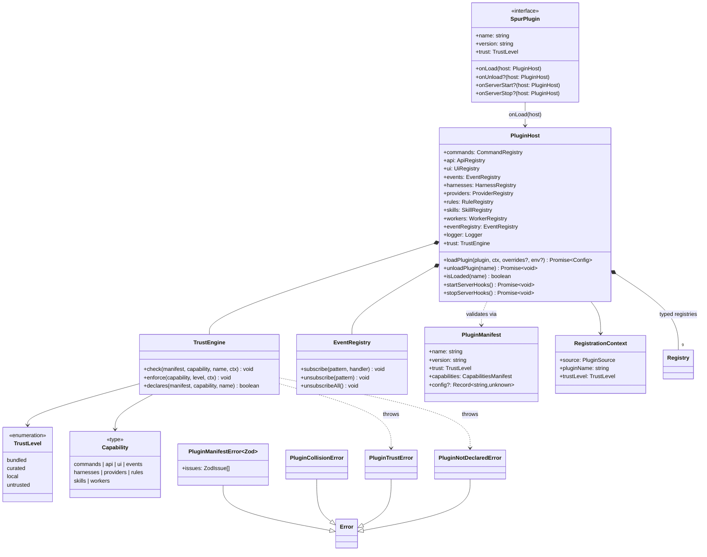

# @gobing-ai/spur-plugin-sdk

Spur Plugin SDK — types, schemas, and runtime for building Spur plugins with trust levels, capability registries, and event hooks.

## Architecture



## Quick Start

### Installation

```bash
bun add @gobing-ai/spur-plugin-sdk
```

### 1. Define a plugin

Plugins implement the `SpurPlugin` interface. The entry point is `onLoad(host)`, which receives a `PluginHost` providing access to all capability registries.

```typescript
import type { SpurPlugin, PluginHost } from '@gobing-ai/spur-plugin-sdk';

export const myPlugin: SpurPlugin = {
    name: 'my-plugin',
    version: '1.0.0',
    trust: 'local',

    onLoad(host: PluginHost) {
        // Register a slash command
        host.commands.register({ name: 'my-cmd' }, {
            name: 'my-cmd',
            execute(args: string[]) {
                host.logger.info(`my-cmd called with: ${args}`);
            },
        });

        // Subscribe to agent lifecycle events
        host.eventRegistry.subscribe('agent.*', (event, detail) => {
            host.logger.info(`Agent event: ${event}`, detail);
        });
    },

    onUnload(host: PluginHost) {
        host.eventRegistry.unsubscribeAll();
    },
};
```

### 2. Write the manifest — `plugin.yaml`

**This is not a sample. Spur's `PluginLoader` discovers, parses, and enforces it at runtime.**

Every plugin directory must contain a `plugin.yaml`. Spur discovers plugins by scanning for directories with this file (see "Discovery roots" below).

```yaml
# plugin.yaml
name: my-plugin
version: 1.0.0
description: Example Spur plugin
author: your-name
trust: local
capabilities:
  commands:
    - my-cmd
  events:
    - agent.run.start
    - agent.run.complete
config:
  greeting: hello
```

#### What `capabilities.*` does — it's enforced at registration time

`capabilities.commands` and `capabilities.events` are **declarations** — they tell the trust engine what your plugin intends to use. When your `onLoad()` calls `host.commands.register('my-cmd', ...)`, the registry's `register()` method calls `TrustEngine.enforce()` which:

1. Checks your trust level allows `commands` (e.g., `local` allows it, `untrusted` does too)
2. Checks the manifest `capabilities.commands` list includes `'my-cmd'`

If your manifest doesn't declare `my-cmd` under `capabilities.commands`, you get `PluginNotDeclaredError`. If your trust level forbids `commands`, you get `PluginTrustError`. This is checked at registration time — not at manifest-parse time — because the registration context (which plugin, what source) matters.

Validate the manifest programmatically (useful in tests):

```typescript
import { validateManifest, PluginManifestError } from '@gobing-ai/spur-plugin-sdk';

try {
    const manifest = validateManifest(parsedYaml);
    // Use manifest as a typed PluginManifest
} catch (err) {
    if (err instanceof PluginManifestError) {
        console.error('Invalid manifest:', err.issues);
    }
}
```

Plugin configuration merges three layers (lowest to highest precedence):

1. `plugin.yaml` `config:` defaults
2. `.spur/plugins/<name>.yaml` file overrides
3. `SPUR_PLUGIN_<NAME>_<KEY>` environment variables

```typescript
import { mergePluginConfig } from '@gobing-ai/spur-plugin-sdk';

const config = mergePluginConfig(
    { greeting: 'hello', timeout: 30 },  // defaults from plugin.yaml
    { timeout: 60 },                       // .spur/plugins/my-plugin.yaml overrides
    process.env,                           // env vars (SPUR_PLUGIN_MY_PLUGIN_*)
    'my-plugin',
);
// => { greeting: 'hello', timeout: <from env or 60> }
```

Environment variables override everything. `SPUR_PLUGIN_MY_PLUGIN_TIMEOUT=90` sets `config.timeout` to `90`. Values are JSON-parsed when possible (`30` becomes a number, `true` becomes boolean), falling back to raw strings.

## Trust Levels & Policy

Every plugin declares a trust level in its manifest. The `TrustEngine` enforces capability access at registration time.

| Trust Level | Allowed Capabilities | Typical Use |
|---|---|---|
| `bundled` | Everything (unconditional) | Built-ins shipped with Spur |
| `curated` | Everything | Vetted, externally-reviewed plugins |
| `local` | `commands`, `api`, `ui`, `events`, `skills` | Project-local plugins |
| `untrusted` | `commands`, `api`, `ui`, `events`, `skills` | Downloaded plugins |

Capabilities denied to `local`/`untrusted`: `harnesses`, `providers`, `rules`, `workers`.

Attempting to register a capability beyond your trust level throws `PluginTrustError`. Attempting to register a capability not declared in the manifest throws `PluginNotDeclaredError`.

## Capability Registries

Each registry is typed — `register()` accepts a capability-specific `TImpl`:

| Registry | Purpose | TImpl |
|---|---|---|
| `CommandRegistry` | Slash commands | `{ name, execute(args) }` |
| `ApiRegistry` | Server API routes | `{ name, handler(req), openApi? }` |
| `UiRegistry` | UI components | `{ name, component }` |
| `EventRegistry` (plugin) | Domains events | `{ name, handlers }` |
| `HarnessRegistry` | Agent harnesses | `{ name, harness }` |
| `ProviderRegistry` | LLM/model providers | `{ name, provider }` |
| `RuleRegistry` | Validation rules | `{ name, rule }` |
| `SkillRegistry` | Agent skills | `{ name, skill }` |
| `WorkerRegistry` | Background workers | `{ name, worker }` |

All registries share a common `Registry<T>` base with collision detection (`PluginCollisionError` on duplicate `capability:name` pairs) and trust enforcement via `TrustEngine.check()`.

## Event System

The `EventRegistry` wraps `@gobing-ai/ts-infra`'s `EventBus` with glob-pattern subscriptions:

```typescript
// Subscribe to all agent events
host.eventRegistry.subscribe('agent.*', (event, detail) => { ... });

// Subscribe to everything (use sparingly)
host.eventRegistry.subscribe('*', (event, detail) => { ... });
```

**Known events** (from `SpurEventMap`):

| Event | Payload |
|---|---|
| `agent.run.start` | `{ agent, prompt, cwd? }` |
| `agent.run.complete` | `{ agent, exitCode, durationMs }` |
| `agent.run.error` | `{ agent, error }` |
| `workflow.transition` | `{ workflowId, from, to }` |
| `rule.evaluate` | `{ ruleId, result }` |
| `usage.record` | `{ tokens, model, timestamp }` |
| `history.import.start` | `{ source }` |
| `history.import.complete` | `{ source, count }` |
| `plugin.load` | `{ name, version }` |
| `plugin.unload` | `{ name }` |
| `plugin.error` | `{ name, error }` |

High-churn events (`usage.record`) have a built-in token-bucket throttle.


## Plugin Lifecycle: Discovery → Validation → Registration

Plugins are discovered and loaded by `PluginLoader` (in `@gobing-ai/spur-app`), which uses the SDK types and schemas. The flow:

1. **Discover** — scan four roots (in priority order) for directories containing `plugin.yaml`
2. **Validate** — parse `plugin.yaml` with `yaml`, validate against `PluginManifestSchema` via `validateManifest()`
3. **Load** — `import()` the plugin's `index.ts`, check it exports a `SpurPlugin`
4. **Register** — call `host.loadPlugin(plugin, ctx)`, which invokes `onLoad(host)`, where the plugin registers capabilities

### Where to put `plugin.yaml`

| Root | Path | Source | Priority |
|---|---|---|---|
| Env override | `$SPUR_PLUGIN_PATH` (colon-separated) | `local` | Highest |
| Project-local | `.spur/plugins/<plugin-name>/plugin.yaml` | `local` | |
| User-global | `~/.spur/plugins/<plugin-name>/plugin.yaml` | `curated` | |
| Bundled | `<installDir>/plugins/<plugin-name>/plugin.yaml` | `bundled` | Lowest |

Each plugin lives in its own directory — a folder containing `plugin.yaml` and `index.ts`:

```
.spur/plugins/my-plugin/
├── plugin.yaml          # manifest (trust, capabilities, config)
└── index.ts             # SpurPlugin implementation
```

### How Spur bootstraps plugins

Spur's CLI (`apps/cli/src/commands/plugin.ts`) creates a `PluginHost` + `PluginService`, which runs the full pipeline:

```typescript
const host = new PluginHost(new EventBus({}), { logger });
const service = new PluginService({ host, fs, logger, projectRoot: cwd });
await service.ensureBootstrapped(); // discover → validate → register all
```

Spur's own built-in rule engine and workflow engine are loaded as `bundled` plugins with unconditional trust, seeded via `host.commands.seedBuiltin()` before any external plugin loads.

### As a downstream developer

**To create a plugin:**

1. Create `.spur/plugins/<name>/plugin.yaml` with your trust level and declared capabilities
2. Create `.spur/plugins/<name>/index.ts` exporting a `SpurPlugin`
3. In `onLoad(host)`, register exactly what you declared in `capabilities`

**To validate your manifest manually:**

```typescript
import { parse } from 'yaml'; // or any YAML parser
import { validateManifest } from '@gobing-ai/spur-plugin-sdk';

const raw = await Bun.file('.spur/plugins/my-plugin/plugin.yaml').text();
const manifest = validateManifest(parse(raw));
// manifest is now a typed PluginManifest — capabilities.commands, capabilities.events, etc.
```

| Error | When |
|---|---|
| `PluginManifestError` | `plugin.yaml` fails Zod validation |
| `PluginCollisionError` | Two plugins register the same `capability:name` pair |
| `PluginTrustError` | Capability registration denied by trust policy |
| `PluginNotDeclaredError` | Capability not declared in `plugin.yaml` manifest |
