# Plugin `sp`

> **Spur** — a local-first harness engineering toolkit that wraps mainstream coding agents (Claude Code, Codex, Gemini CLI, Antigravity, pi, OpenCode, OpenClaw) with constraint checking, workflow orchestration, history analytics, and operational visibility.

The `sp` plugin is the Claude Code plugin surface for the Spur toolkit. It provides a full planning-to-execution pipeline — convert a vague feature description into a CLI-validated feature file with BDD acceptance criteria, decompose it into a task batch, run those tasks through execution workflows with human-in-the-loop gating — plus constraint-rule and dual-mode workflow engines, daily analytics, and document-drift enforcement. Every write to the task/feature corpus goes through a `spur` CLI verb that validates before writing; the plugin entities contain zero validation logic of their own.

- **Marketplace entry:** `name: "sp"`, `version: "0.2.3"`, `source: "./plugins/sp"` (`plugin.json`)
- **Owner:** Robin Min

## Directory Layout

```
plugins/sp/
├── skills/                          # Domain knowledge + workflow documentation (16 skills)
│   ├── branch-workflow/             # Branch lifecycle + worktree patterns (v1.0)
│   │   └── references/
│   │       ├── branch-lifecycle.md
│   │       └── worktree-patterns.md
│   ├── brainstorm/                  # Structured ideation workflow (v1.0.0)
│   │   ├── agents/openai.yaml
│   │   ├── examples/ideation-example.md
│   │   └── references/workflows.md
│   ├── code-implementation/         # Implementation competency (v1.0)
│   │   └── references/
│   │       ├── debugging.md
│   │       └── implementation-patterns.md
│   ├── code-testing/                # Testing / coverage competency (v1.0)
│   │   └── references/
│   │       ├── unit-testing.md
│   │       └── stacks/
│   │           ├── bun-ts.md
│   │           ├── go.md
│   │           └── python.md
│   ├── code-verification/           # Verify + SECUA review (v1.0)
│   │   └── references/
│   │       ├── code-improvement.md
│   │       ├── secu-review.md
│   │       └── verdict-schema.md
│   ├── daily-summary/               # Daily summary report generator (v1.0.0)
│   │   ├── agents/openai.yaml
│   │   ├── scripts/daily-summary.ts
│   │   ├── scripts/logger.ts
│   │   └── tests/daily-summary.test.ts
│   ├── doc-evolve/                  # Key-document evolution per constitution (v1.0)
│   │   └── references/operations.md
│   ├── dogfood-testing/             # Dogfood backbone — 4-phase protocol + report (v1.0)
│   │   └── references/
│   │       ├── monitor-ledger.md
│   │       └── report-template.md
│   ├── parallel-execution/          # Fan-out decision framework + patterns (v1.0)
│   │   └── references/
│   │       ├── fan-out-patterns.md
│   │       └── result-synthesis.md
│   ├── spec-decomposition/          # Feature/spec → task-batch competency (v1.0)
│   │   └── references/decomposition.md
│   ├── spur-cli/                    # CLI facade: one reference per `spur` noun (v1.0)
│   │   └── references/
│   │       ├── tasks.md
│   │       ├── features.md
│   │       ├── rules.md
│   │       ├── workflows.md
│   │       ├── tasks/verbs.md
│   │       ├── tasks/section-editing.md
│   │       ├── features/verbs.md
│   │       ├── features/acceptance-criteria.md
│   │       ├── features/roadmap-priority.md
│   │       ├── rules/operations.md
│   │       ├── rules/authoring-rules.md
│   │       ├── workflows/operations.md
│   │       ├── workflows/authoring-workflows.md
│   │       └── workflows/validation-and-extension.md
│   ├── spur-dev/                    # Thin planning→execution orchestration spine (v1.1)
│   │   └── references/
│   │       ├── dev-operations.md
│   │       ├── execution-batch.md
│   │       ├── feature-link-helper.md
│   │       ├── product-planning.md
│   │       ├── cross-cutting.md
│   │       ├── ac-style-guide.md
│   │       ├── execution-workflow.md
│   │       └── planning-workflow.md
│   ├── spur-tdd/                    # TDD workflow companion (v1.0.0)
│   └── sys-architecture/            # Architecture / ADR judgment competency (v1.0)
│       └── references/decision-method.md
├── commands/                        # Slash command definitions (19)
├── agents/                          # Specialist subagent definitions (2)
├── hooks/                           # Hook definitions + guard scripts
│   ├── hooks.json
│   ├── task-write-guard.ts          # PreToolUse guard — task-corpus write protection
│   └── task-write-guard.test.ts     # Unit tests for the guard
├── tests/                           # Plugin-structure tests
│   └── skill-structure.test.ts
├── plugin.json                      # Marketplace entry
└── README.md                        # This file (lives at plugins/README.md)
```

## Entity Design Purposes

### 1. Skills (`skills/`)

**Purpose:** The single source of truth for domain knowledge and workflow documentation. Each skill is a self-contained knowledge module that teaches the agent how to operate one slice of the Spur CLI surface or run one workflow.

| Skill | Version | Platforms | Domain |
|-------|---------|-----------|--------|
| `spur-dev` | 1.1 | claude-code, codex, openclaw, opencode, antigravity | Thin orchestration spine — drives planning→execution, gates, HITL, and dispatches competencies; never inlines implementation/testing/decomposition/review |
| `spur-cli` | 1.0 | claude-code, codex, openclaw, opencode, antigravity | CLI facade — one reference per `spur` noun (`task`, `feature`, `rule`, `workflow`), each with verb tables, flag guides, `--json` shapes, and write-contract rules |
| `sys-architecture` | 1.0 | claude-code, codex, openclaw, opencode, antigravity | Architecture / ADR judgment — module boundaries, data flow, transport/storage/auth choices, build-vs-extend decisions |
| `spec-decomposition` | 1.0 | claude-code, codex, openclaw, opencode, antigravity | Feature/spec → validated task-batch decomposition — scenario-to-task mapping, variant selection, granularity sizing, batch-JSON production |
| `code-implementation` | 1.0 | claude-code, codex, openclaw, opencode, antigravity | Implementation competency — task-driven code changes, stack-pattern selection, root-cause debugging, and Solution change-map production |
| `code-testing` | 1.0 | claude-code, codex, openclaw, opencode, antigravity | Testing competency — run tests, measure coverage, categorize gaps, extend targeted tests with per-stack adapters (Bun/TS, Go, Python) |
| `code-verification` | 1.0 | claude-code, codex, openclaw, opencode, antigravity | Requirements-traceability verdict (PASS/PARTIAL/FAIL) + SECUA code review (Security, Efficiency, Correctness, Usability, Architecture) — backs `/sp:dev-verify` and `/sp:dev-review`; links broader code-improvement candidates out of review findings |
| `dogfood-testing` | 1.0 | claude-code, codex, openclaw, opencode, antigravity | Dogfood backbone — drives a testee end-to-end with bounded auto-fix, a live monitor ledger, and a structured report; backs `/sp:dev-dogfood` |
| `parallel-execution` | 1.0 | claude-code, codex, openclaw, opencode, antigravity | Fan-out decision framework — when to parallelize, four proven fan-out patterns (N-way investigation, competency-lens review, independent-task batch, adversarial panel), and result synthesis; backs `/sp:dev-parallel` |
| `sys-debugging` | 1.0 | claude-code, codex, openclaw, opencode, antigravity | Structured debugging protocol — reproduce→isolate→root cause→fix→regression test; "ask the debugger before the LLM" principle, 15-minute escalation rule |
| `code-review` | 1.0 | claude-code, codex, openclaw, opencode, antigravity | Code review workflow — pre-commit self-review checklist (6 categories, catches 60-80% of issues), structured review requests with SECUA lenses, findings processing |
| `branch-workflow` | 1.0 | claude-code, codex, openclaw, opencode, antigravity | Branch-lifecycle discipline — create→worktree→commit→self-review→merge→cleanup; git worktree patterns for parallel branches |
| `spur-tdd` | 1.0.0 | claude-code, codex, antigravity, opencode, openclaw | TDD workflow companion — red-green-refactor cycle, behavior-first test design, AAA structure, data builders, and mock-at-boundary anti-patterns |
| `brainstorm` | 1.0.0 | claude-code, codex, antigravity, opencode, openclaw | Structured ideation workflow — generate solution options with trade-offs, confidence scoring; delegates verification to `cc:anti-hallucination` |
| `daily-summary` | 1.0.0 | claude-code, codex, antigravity, opencode, openclaw | Daily summary report generator — orchestrates ccusage CLI + git history into structured markdown summaries |
| `doc-evolve` | 1.0 | claude-code, codex, openclaw, opencode, antigravity | Key-document evolution per `docs/99_PROJECT_CONSTITUTION.md` — drift audits, same-commit sync checks, frontmatter-contract verification, and machine-appended lessons |

Each skill directory contains:

- `SKILL.md` — Main documentation with YAML frontmatter (`name`, `description`, `metadata.version`, `metadata.platforms`, `metadata.interactions`, `openclaw.emoji`, etc.)
- `references/` — Deep-dive docs where the skill warrants them (e.g. `spur-cli` ships one reference per CLI noun plus per-noun sub-references for verbs, authoring, and operations; `spur-dev` carries BDD, planning, execution, and batch references; `code-testing` ships per-stack adapters)
- Some skills (`daily-summary`) ship executable TypeScript under `scripts/` for data-collection
- Some skills (`brainstorm`, `daily-summary`) carry `agents/openai.yaml` for multi-model dispatch

**Design principle:** Skills are **knowledge, not execution**. They describe *what to do and why*; the `spur` CLI performs every deterministic, corpus-mutating operation and validates before writing. Skills contain zero validation logic — the CLI is the gate.

### 2. Commands (`commands/`)

**Purpose:** Thin slash-command wrappers that parse user arguments and delegate to the corresponding skill. Each command is a user-facing entry point that bridges natural language to skill invocation.

There are **20 commands**, organized by the CLI surface they wrap:

| Prefix | Count | Delegates To | Purpose |
|--------|-------|-------------|---------|
| `dev-*` | 14 | `sp:spur-dev`, `sp:code-implementation`, `sp:code-testing`, `sp:code-verification`, `sp:brainstorm`, `sp:dogfood-testing`, `sp:parallel-execution`, inline | The dev-workflow surface — `dev-run full` mode → spine; `dev-plan` → spine planning half; `dev-refine` → spine refine op; `dev-runall` → spine batch driver; `dev-parallel` → parallel-execution; `dev-review`/`dev-verify` → verification; `dev-unit` → testing; `dev-brainstorm` → brainstorm; `dev-dogfood` → dogfood-testing; `dev-fixall`/`dev-gitmsg`/`dev-changelog`/`dev-handover` → inline procedures |
| `rule-*` | 3 | `sp:spur-cli` | The rule surface — `rule-add`, `rule-refine`, `rule-scan` |
| `workflow-*` | 2 | `sp:spur-cli` | The workflow surface — `workflow-add`, `workflow-refine` |
| `spur-init` | 1 | `sp:doc-evolve` | Project bootstrap (`spur init`) with doc-evolve integration |

Each command file contains:
- YAML frontmatter (`description`, `argument-hint`, `allowed-tools`)
- A delegation block: `Skill(skill="sp:<skill-name>", args="<operation> $ARGUMENTS")`
- A CLI fallback (`spur <verb> $ARGUMENTS`) for non-Claude platforms

**Design principle:** Commands are **pass-through routers**. They contain zero domain logic — they parse `$ARGUMENTS` and forward to the skill, which owns the workflow knowledge.

### 3. Agents (`agents/`)

**Purpose:** Specialist subagents that run in isolated context windows. Two shapes: **expert agents** route a request to the single skill they own; **`super-coder`** drives one task end-to-end or a dependency-ordered task batch through the `sp:spur-dev` pipeline.

| Agent | Shape | Delegates To | Color | Trigger Examples |
|-------|-------|-------------|-------|------------------|
| `expert-spur` | expert | `sp:spur-cli` | green | "create tasks", "feature lifecycle", "add a rule", "author a workflow" |
| `super-coder` | orchestrator | `sp:spur-dev` + `sp:dogfood-testing` | green | "run this task end to end", "run all tasks", "run the batch", "execute the todo set", "runall" |

Each agent has:
- `skills: [sp:<skill-name>]` — bound to one skill (`expert-spur`) or two (`sp:spur-dev` + `sp:dogfood-testing` for `super-coder`)
- `model: inherit` — inherits the parent session's model
- `color` — roster display accent
- `tools` — allowed tool set (`Read`, `Grep`, `Glob`, `Bash`, `Skill`)

**Design principle:** Agents are **delegates, not implementors**. They never contain domain logic. `expert-spur` routes CLI corpus work to `sp:spur-cli`; `super-coder` drives the single-task/batch loop (the algorithm lives in `sp:spur-dev/references/execution-batch.md`) without reaching into individual pipeline steps. For a single well-scoped operation, the matching `/sp:*` command is lighter; for work spanning multiple phases or a batch, the agent provides an isolated context window.

### 4. Hooks (`hooks/`)

**Purpose:** Event-driven enforcement that runs automatically without user invocation. The `hooks.json` file registers hook handlers for Claude Code lifecycle events.

Currently registered:

| Event | Matcher | Handler | Timeout |
|-------|---------|---------|---------|
| `PreToolUse` | `Write\|Edit` | `superskill hook run sp task-write-guard` | 10s |

The hook fires on every `Write`/`Edit` tool call and checks whether the target path is **owned by a task** (i.e. it is a file in the task corpus under `docs/tasks/`). If so, the write is denied — task files are mutated through the `spur task` CLI only, never by hand. The hook is **pure delegation**: it asks `spur task resolve <path>` whether the path is owned and decides the exit code alone; it contains zero validation logic of its own.

**Escape hatch:** `SPUR_WRITE_GUARD=off` short-circuits the guard before any subprocess.

**Design principle:** Hooks provide **automatic enforcement** of the corpus boundary. The skills teach *how* to edit tasks through the CLI; the hook *enforces* that direct file writes to the corpus are blocked.

### 5. Scripts (`hooks/`)

**Purpose:** Executable TypeScript that implements hook enforcement logic. Scripts are the runtime layer — they run as processes, not as LLM context.

| Script | Role |
|--------|------|
| `task-write-guard.ts` | Compatibility shim for older installs that still execute the script path directly. It forwards stdin to the stable PATH command `superskill hook run sp task-write-guard`, mirrors parseable PreToolUse decisions, and fails open if the runtime is unavailable. It performs no source-tree CLI lookup. |
| `task-write-guard.test.ts` | Unit tests for the guard |

**Design principle:** Scripts are **deterministic enforcement**. Unlike skills (which are advisory knowledge consumed by the LLM), scripts run as code and make binary allow/deny decisions. They are the hard gate that the soft skill cannot enforce on its own.

## Relationship Diagram

```mermaid
graph TB
    subgraph "User Entry Points"
        CMD["Commands<br/>19 slash commands<br/>/sp:dev-plan, /sp:dev-runall, /sp:rule-add, ..."]
        AGENT["Agents<br/>2 subagents<br/>expert-spur, super-coder"]
        HOOK["PreToolUse Hook<br/>Write|Edit matcher"]
    end

    subgraph "Knowledge Layer"
        SKILL_DEV["spur-dev<br/>Thin orchestration spine"]
        SKILL_CLI["spur-cli<br/>CLI noun facade"]
        SKILL_IMPL["code-implementation<br/>Implementation competency"]
        SKILL_TEST["code-testing<br/>Testing competency"]
        SKILL_VERIFY["code-verification<br/>Review + verify competency"]
        SKILL_DECOMP["spec-decomposition<br/>Feature/spec decomposition"]
        SKILL_ARCH["sys-architecture<br/>Architecture judgment"]
        SKILL_BS["brainstorm<br/>Structured ideation"]
        SKILL_DS["daily-summary<br/>Daily report generator"]
        SKILL_DOC["doc-evolve<br/>Document drift + sync"]
        SKILL_DOG["dogfood-testing<br/>Dogfood protocol + report"]
        SKILL_TDD["spur-tdd<br/>TDD workflow companion"]
    end

    subgraph "Execution Layer"
        CLI["spur CLI<br/>task · feature · rule · workflow<br/>· agent · history · team · message"]
        SCRIPT["hooks/task-write-guard.ts"]
    end

    subgraph "Corpus Layer"
        CORPUS["docs/tasks/ + docs/features/<br/>Markdown planning corpus"]
        RULES[".spur/rules/<br/>YAML constraint rules"]
        WFS["config/workflows/<br/>YAML workflow definitions"]
    end

    %% Command → Skill delegations
    CMD -->|"Skill(sp:spur-dev, ...)"| SKILL_DEV
    CMD -->|"Skill(sp:code-implementation, ...)"| SKILL_IMPL
    CMD -->|"Skill(sp:code-testing, ...)"| SKILL_TEST
    CMD -->|"Skill(sp:code-verification, ...)"| SKILL_VERIFY
    CMD -->|"Skill(sp:spur-cli, ...)"| SKILL_CLI
    CMD -->|"Skill(sp:doc-evolve, ...)"| SKILL_DOC
    CMD -->|"Skill(sp:brainstorm, ...)"| SKILL_BS
    CMD -->|"Skill(sp:dogfood-testing, ...)"| SKILL_DOG

    %% Agent → Skill bindings
    AGENT -->|"skills: [sp:spur-cli]"| SKILL_CLI
    AGENT -->|"skills: [sp:spur-dev, sp:dogfood-testing]"| SKILL_DEV

    %% Hook → Script
    HOOK -->|"superskill hook run"| SCRIPT

    %% Script → CLI resolve
    SCRIPT -->|"spur task resolve"| CLI

    %% Skill → CLI delegations
    SKILL_DEV -->|"spur task/feature/workflow"| CLI
    SKILL_CLI -->|"spur task/feature/rule/workflow"| CLI
    SKILL_IMPL -->|"spur task update --section"| CLI
    SKILL_VERIFY -->|"spur task check/verdict/record"| CLI
    SKILL_TDD -->|"spur task"| CLI
    SKILL_DOG -->|"spur workflow run"| CLI
    SKILL_DOC -->|"spur task/feature"| CLI

    %% CLI → Corpus
    CLI -->|"reads + validates + writes"| CORPUS
    CLI -->|"reads + runs"| RULES
    CLI -->|"reads + runs"| WFS

    %% Styling
    classDef entry fill:#4a9eff,color:#fff,stroke:#2563eb
    classDef knowledge fill:#8b5cf6,color:#fff,stroke:#7c3aed
    classDef execution fill:#10b981,color:#fff,stroke:#059669
    classDef corpus fill:#f59e0b,color:#fff,stroke:#d97706

    class CMD,AGENT,HOOK entry
    class SKILL_DEV,SKILL_CLI,SKILL_IMPL,SKILL_TEST,SKILL_VERIFY,SKILL_DECOMP,SKILL_ARCH,SKILL_BS,SKILL_DS,SKILL_DOC,SKILL_DOG,SKILL_TDD knowledge
    class CLI,SCRIPT execution
    class CORPUS,RULES,WFS corpus
```



## Delegation Flow

The plugin follows a strict **three-tier delegation** pattern — each tier has a single responsibility and delegates to the next:

```
Tier 1 — Entry Points (Commands / Agents / Hooks)
  │   Parse user input, route to the correct skill
  │   Contains ZERO domain logic
  ▼
Tier 2 — Knowledge Layer (Skills)
  │   Provide domain knowledge, workflows, and patterns
  │   Delegate every deterministic, corpus-mutating operation to the CLI
  │   Contains ZERO validation logic
  ▼
Tier 3 — Execution Layer (spur CLI + Guard Scripts)
  │   Perform deterministic operations (create, update, check, resolve, run)
  │   Validate before writing — the CLI is the gate
  │   Enforce hard gates (PreToolUse guard)
```

### Example: Planning a Feature End-to-End

1. User types `/sp:dev-plan "add task body write API"`
2. **Command** (`dev-plan.md`) parses `$ARGUMENTS` and calls `Skill(skill="sp:spur-dev", args="plan $ARGUMENTS")`
3. **Skill** (`spur-dev/SKILL.md`) drives the planning half: intake → `spur feature create` → AC generation → `spur feature check` gate → decomposition → `spur task batch-create`
4. **CLI** validates each step before writing — feature IDs are race-safe, WBS allocation is atomic, `check` is the readiness matrix
5. Result: validated feature file + decomposed task batch in `docs/features/` and `docs/tasks/`

### Example: Running a Task Through the Pipeline

1. User types `/sp:dev-run 0090`
2. **Command** delegates to `sp:spur-dev` skill (execution half)
3. **Skill** reads the task, loads `config/workflows/task-pipeline.yaml`, and runs `spur workflow run` with HITL surfacing
4. **CLI** executes the workflow engine (`@gobing-ai/ts-dual-workflow-engine`), pauses at HITL gates, persists run state
5. Result: task driven through implement → check → fix → verify lifecycle

### Example: Task-Corpus Write Protection

1. The agent attempts a raw `Write`/`Edit` to a file under `docs/tasks/`
2. **PreToolUse Hook** (`hooks.json`) fires, executing `superskill hook run sp task-write-guard`
3. **Runtime** reads the tool payload from stdin and resolves task ownership through the installed hook runtime
4. If the path is owned by a task → emit `permissionDecision: deny` with a system message directing to `spur task update --section`
5. If not owned → emit `permissionDecision: allow`; the tool call proceeds

## Platform Compatibility

The `sp` plugin is authored in Claude Code native format. On other platforms (Codex, Gemini CLI, Antigravity, pi, OpenCode, OpenClaw), translation scripts adapt plugin entities to platform-native locations. OpenClaw is implicitly supported — it reads skills from `~/.agents/skills/`, the same root codex/opencode use in global mode.

| Plugin Entity | Claude Code | Other Platforms |
|--------------|-------------|-----------------|
| `skills/*.md` | `~/.claude/skills/` | Adapted as Skills 2.0 skill directories — all platforms receive skills uniformly |
| `commands/*.md` | `~/.claude/commands/` | Adapted as Skills 2.0 skill entries (`disable-model-invocation: true`) |
| `agents/*.md` | `~/.claude/agents/` | Adapted as Skills 2.0 skill entries (model-invocable); Pi additionally gets native agent format |
| `hooks/hooks.json` | `~/.claude/hooks/` | Converted to target-native format (pi-hooks shim for pi/omp, HOOK.yaml for hermes) |
| `hooks/*.ts` | plugin hook runtime / compatibility copy | Copied alongside platform output only for environments that still invoke script paths directly |

Each skill declares its own platform support in `metadata.platforms` frontmatter. All `sp` skills currently target the same five platforms: `claude-code`, `codex`, `antigravity`, `opencode`, `openclaw`.

## Lifecycle Operations

All planning entities (tasks and features) share a common lifecycle, managed by the `spur` CLI:

| Operation | Task Verb | Feature Verb | Quality Gate |
|-----------|-----------|-------------|-------------|
| **create** | `spur task create` / `batch-create` | `spur feature create` | Structural validation (WBS race-safe, ID hierarchical) |
| **check** | `spur task check` | `spur feature check` | 4-layer readiness matrix (schema, sections, traceability, AC) |
| **update** | `spur task update <wbs> [status]` | `spur feature update <id> [status]` | Lifecycle transition or scalar field set |
| **record** | `spur task record <wbs>` | — | Write Testing/Review from a verify verdict; optional Solution backfill (never transitions to `done`) |
| **refresh** | `spur task refresh` | `spur feature refresh` | Index + feature-tree roll-up regeneration |

The **workflow** and **rule** engines have their own lifecycles (author → validate → run → trace / refine), documented in their respective `sp:spur-cli` references.

## rd3 → `sp` / `cc` Migration Map

The `sp` and `cc` plugins are the two destinations for the legacy
`~/projects/cc-agents/plugins/rd3/` plugin. The dividing line (ADR-023):

- **`sp` (Spur)** — *software-development* surface. Code that executes, validates, stores, or
  coordinates moved into the Spur codebase (`apps/`, `packages/`, `@gobing-ai/ts-*`); the plugin
  ships only **Fat Skills** (the SSOT for agent-facing behavior) plus thin command/subagent wrappers
  that delegate to them. Every deterministic step is a `spur` CLI verb.
- **`cc` (Core Component)** — *meta-agent* surface. The `cc-*` authoring lifecycle skills (scaffold
  → validate → evaluate → refine → evolve for skills, commands, agents, hooks, main-agent configs)
  plus fundamental agent skills that are not dev-workflow-specific (e.g. `anti-hallucination`).

### Status legend

| Mark | Meaning |
|------|---------|
| ✅ **Done** | Migrated to the destination plugin (possibly rebranded / consolidated) |
| 🔀 **Absorbed** | Logic folded into a broader destination entity, not a 1:1 port |
| ⏳ **Deferred** | Slated for a later migration batch; still live in `rd3` meanwhile |
| ❌ **Rejected** | Explicitly not migrated (rationale in the triage doc) |
| ➖ **N/A** | Was never an `rd3` entity (created fresh in the destination) |

### Skills (rd3 → destination)

The `sp` plugin consolidated **many rd3 skills into a few Fat Skills**: the planning, decomposition,
review, and pipeline skills collapsed into `spur-dev` + `spur-plan`; the task/feature CLI companions
became `spur-cli` (one skill with per-noun references). The `cc` plugin took the meta-agent authoring
family and the verification guard.

| rd3 skill | Destination | Status | Note |
|-----------|-------------|--------|------|
| `anti-hallucination` | `cc` | ✅ Done | Moved to `cc:anti-hallucination` v3.0.0; in-repo copy removed from `sp` (ADR-024, 2026-06-20) |
| `cc-agents` | `cc` | ✅ Done | v3.0.0 — subagent lifecycle, 6 platforms |
| `cc-commands` | `cc` | ✅ Done | v3.0.0 — slash command lifecycle |
| `cc-hooks` | `cc` | ✅ Done | v3.0.0 — multi-agent hook system |
| `cc-magents` | `cc` | ✅ Done | v5.0.0 — main-agent config, 15 platforms |
| `cc-skills` | `cc` | ✅ Done | v3.0.0 — skill lifecycle |
| `orchestration-v2` | `sp` | 🔀 Absorbed | Replaced by `@gobing-ai/ts-dual-workflow-engine` + `sp:spur-cli` workflow references + `spur workflow run` (D02) |
| `orchestration-v1` | — | ❌ Rejected | Deprecated; superseded by v2/engine (I07) |
| `verification-chain` | `sp` | 🔀 Absorbed | Replaced as workflow guards via the engine (I12) |
| `run-acp` | `sp` | 🔀 Absorbed | Replaced by `spur agent run` — single LLM execution surface (I13, M12) |
| `task-runner` | `sp` | 🔀 Absorbed | Into `spur-dev` execution half + `task-pipeline.yaml` (D01) |
| `feature-planning` | `sp` | 🔀 Absorbed | Prompt logic into the `spur-dev` planning half (I04); AC/decomposition gated by CLI |
| `task-decomposition` | `sp` | 🔀 Absorbed | Into `spur-dev` decomposition step (C03); output contract replaced by the new schema |
| `request-intake` | `sp` | 🔀 Absorbed | Into `spur-dev` intake step (C01) |
| `bdd-workflow` | `sp` | 🔀 Absorbed | BDD validation logic → shared BDD validator (X01); AC generation → `spur-dev` (C02) |
| `feature-tree` | `sp` | 🔀 Absorbed | Into `spur feature` verbs + `sp:spur-cli` feature references (B-group); in-memory tree rejected (B10) |
| `tasks` | `sp` | 🔀 Absorbed | Into `spur task` verbs + `sp:spur-cli` task references (A-group) |
| `product-management` | `sp` | 🔀 Absorbed | PM workflow mechanics are covered by `sp:spur-dev`, `sp:spur-cli`, `sp:doc-evolve`, and `spur workflow`; PM judgment is absorbed into planning/roadmap references. No `sp:super-pm` or `/sp:prd-*` surface for now. |
| `code-review-common` | `sp` | ⏳ Deferred | K01 — runs as `sp` skill + `spur agent run` meanwhile; extract post-stabilization |
| `code-verification` | `sp` | ⏳ Deferred | K02 — same |
| `code-improvement` | `sp` | 🔀 Partial | Folded into `sp:code-verification` as the code-improvement reference for architecture/refactoring candidates; no separate command. |
| `functional-review` | `sp` | ⏳ Deferred | K04 — same |
| `code-docs` | `sp` | 🔀 Absorbed | Prompt template → `sp:doc-evolve` (I10/I15) |
| `dev-verification` | — | ❌ Rejected | Empty stub (I14) — deleted entirely |
| `reverse-engineering` | `sp` | ⏳ Deferred | L04 — re-apply ADR-016 test at design time |
| `deep-research` | `sp` | ⏳ Deferred | L02 — same |
| `knowledge-extraction` | `sp` | ⏳ Deferred | L03 — same |
| `indexed-context` | `sp` | ⏳ Deferred | L01 — design agent-agnostic shape later |
| `sys-testing` | `sp` | ✅ Done | Ported to `sp:code-testing` (`unit-testing.md` + per-stack adapters under `references/stacks/`). |
| `advanced-testing` | `sp` | 🔀 Partial | Advanced techniques are folded into `sp:code-testing`; no standalone command until usage proves routing value. |
| `tdd-workflow` | `sp` | ✅ Done | Ported to `sp:spur-tdd` (standalone discipline); pairs with `sp:code-testing` and `sp:code-implementation`. |
| `sys-debugging` | `sp` | 🔀 Partial | Folded into `sp:code-implementation` as root-cause-first workflow for failed gates, runtime defects, and unclear test failures; no standalone command. |
| `sys-developing` | `sp` | 🔀 Partial | Selective production patterns folded into `sp:code-implementation`; broad API/Docker/DB catalogs stay deferred until a concrete need appears. |
| `code-implement-common` | `sp` | ✅ Done | Ported to `sp:code-implementation` as task-driven implementation discipline, progress persistence, and handoff guidance. |
| `backend-architect` | `sp` | ✅ Done | Ported into `sp:sys-architecture` for architecture / ADR judgment. |
| `backend-design` | `sp` | ⏳ Deferred | Prompt skill; same |
| `frontend-architect` | `sp` | ⏳ Deferred | Prompt skill; same |
| `frontend-design` | `sp` | ⏳ Deferred | Prompt skill; same |
| `ui-ux-design` | `sp` | ⏳ Deferred | Prompt skill; same |
| `pl-typescript` | `sp` | ⏳ Deferred | Prompt skill; same |
| `pl-python` | `sp` | ⏳ Deferred | Prompt skill; same |
| `pl-golang` | `sp` | ⏳ Deferred | Prompt skill; same |
| `pl-javascript` | `sp` | ⏳ Deferred | Prompt skill; same |
| `cli-for-ai` | `sp` | ⏳ Deferred | M04 — prompt skill; same |
| `token-saver` | `sp` | ⏳ Deferred | M03 — prompt skill; same |
| `brainstorm` | `sp` | ✅ Done | Retained as `sp:brainstorm` (I05); CLI verb rejected (C06) |
| `daily-summary` | `sp` | ✅ Done | Retained as `sp:daily-summary`; script stays embedded (I16) |
| `transfer` | `sp` | ⏳ Deferred | M01 — prompt skill |
| `handover` | `sp` | ⏳ Deferred | M01 — prompt skill |
| `quick-grep` | `sp` | 🔀 Absorbed | rg-usage guidance stays a prompt skill; CLI wrapper rejected (L05) |
| *— (new)* | `sp` | ➖ N/A | `doc-evolve` created fresh (constitution-native; no rd3 ancestor) |
| *— (new)* | `sp` | ➖ N/A | `spur-dev`, `spur-cli`, `sys-architecture`, `spec-decomposition`, `code-implementation`, `code-testing`, `code-verification`, `dogfood-testing`, `spur-tdd` created fresh or extracted as the Spur companion surface |
| `spur-plan` | `sp` | ❌ Removed | Thin stub placeholder removed 2026-06-30 — the full planning narrative lives in `sp:spur-dev` and `/sp:dev-plan` delegates to it directly. |

### Commands (rd3 → destination)

rd3 shipped 46 commands. The `sp` plugin applied the ADR-016 decision test (a command is justified
only when it converts non-deterministic intent into a reliable sequence the CLI cannot express) and
kept a **much smaller set** (19). The `cc` plugin took the meta-agent authoring commands (17).

| rd3 command | Destination | Status | Note |
|-------------|-------------|--------|------|
| `dev-plan` | `sp` | ✅ Done | Delegates to `sp:spur-dev` (plan operation) |
| `dev-run` | `sp` | ✅ Done | Delegates to `sp:spur-dev` (run operation) |
| `dev-new-task` | `sp` | ❌ Retired | Superseded by `dev-brainstorm --skip-discovery --task` |
| `dev-refine` | `sp` | ✅ Done | Delegates to `sp:spur-dev` (refine operation) |
| `dev-review` | `sp` | ✅ Done | Delegates to `sp:code-verification` (review operation) |
| `dev-verify` | `sp` | ✅ Done | Delegates to `sp:code-verification` (verify operation) |
| `dev-unit` | `sp` | ✅ Done | Delegates to `sp:code-testing` |
| `dev-fixall` | `sp` | ✅ Done | Inline procedure |
| `dev-gitmsg` | `sp` | ✅ Done | Inline procedure |
| `dev-changelog` | `sp` | ✅ Done | Inline procedure |
| `dev-handover` | `sp` | ✅ Done | Inline procedure |
| `dev-brainstorm` | `sp` | 🔀 Absorbed | Into `sp:brainstorm` skill directly (no separate command) |
| `dev-daily-summary` | `sp` | 🔀 Absorbed | Into `sp:daily-summary` skill directly |
| `dev-dogfood` | `sp` | ✅ Done | Delegates to `sp:dogfood-testing` |
| `dev-transfer` | `sp` | 🔀 Absorbed | Into `sp:spur-dev` (transfer operation); no standalone command |
| `dev-init` | `sp` | 🔀 Absorbed | Into `spur-init` command → `sp:doc-evolve` |
| `dev-reverse` | `sp` | ⏳ Deferred | L04 — with the `reverse-engineering` skill |
| `skill-add` | `cc` | ✅ Done | `cc` `skill-add` |
| `skill-refine` | `cc` | ✅ Done | `cc` `skill-refine` |
| `skill-evaluate` | `cc` | ✅ Done | `cc` `skill-evaluate` |
| `skill-evolve` | `cc` | ✅ Done | `cc` `skill-evolve` |
| `skill-migrate` | `cc` | ⏳ Deferred | M06 — not yet ported to `cc` |
| `skill-package` | `cc` | ⏳ Deferred | M06 — not yet ported to `cc` |
| `command-add` | `cc` | ✅ Done | `cc` `command-add` |
| `command-refine` | `cc` | ✅ Done | `cc` `command-refine` |
| `command-evaluate` | `cc` | ✅ Done | `cc` `command-evaluate` |
| `command-evolve` | `cc` | ✅ Done | `cc` `command-evolve` |
| `command-adapt` | `cc` | ⏳ Deferred | M07 — not yet ported to `cc` |
| `agent-add` | `cc` | ✅ Done | `cc` `agent-add` |
| `agent-refine` | `cc` | ✅ Done | `cc` `agent-refine` |
| `agent-evaluate` | `cc` | ✅ Done | `cc` `agent-evaluate` |
| `agent-evolve` | `cc` | ✅ Done | `cc` `agent-evolve` |
| `agent-adapt` | `cc` | ⏳ Deferred | M08 — not yet ported to `cc` |
| `hook-emit` | `cc` | ⏳ Deferred | M09 — not yet ported to `cc` |
| `hook-list` | `cc` | ⏳ Deferred | M09 — not yet ported to `cc` |
| `hook-setup` | `cc` | ⏳ Deferred | M09 — not yet ported to `cc` |
| `hook-validate` | `cc` | ⏳ Deferred | M09 — not yet ported to `cc` |
| `magent-add` | `cc` | ✅ Done | `cc` `magent-add` |
| `magent-refine` | `cc` | ✅ Done | `cc` `magent-refine` |
| `magent-evaluate` | `cc` | ✅ Done | `cc` `magent-evaluate` |
| `magent-evolve` | `cc` | ✅ Done | `cc` `magent-evolve` |
| `magent-adapt` | `cc` | ⏳ Deferred | M10 — not yet ported to `cc` |
| `prd-run` | `sp` | ❌ Rejected for now | Existing `sp:spur-dev` planning plus `spur feature`/`spur task` covers the workflow; revisit only after repeated PM flows prove a command earns its surface. |
| `prd-init` | `sp` | ❌ Rejected for now | Overlaps reverse-engineering/indexed-context; defer the capability, not a command wrapper. |
| `prd-doc` | `sp` | ❌ Rejected for now | Use `sp:doc-evolve` for PRD/doc synchronization; no separate forwarding command. |
| `prd-adjust` | `sp` | ❌ Rejected for now | Use `spur feature update` and the planning guidance; add a command only if a stable multi-step workflow emerges. |
| `dev-runall` | `sp` | ✅ Done | Delegates to `sp:spur-dev` (runall operation — batch driver) |
| `rule-add` | `sp` | ➖ N/A | Created fresh for the Spur rule surface (→ `sp:spur-cli`) |
| `rule-refine` | `sp` | ➖ N/A | Created fresh for the Spur rule surface |
| `rule-scan` | `sp` | ➖ N/A | Created fresh for the Spur rule surface |
| `workflow-add` | `sp` | ➖ N/A | Created fresh for the Spur workflow surface |
| `workflow-refine` | `sp` | ➖ N/A | Created fresh for the Spur workflow surface |
| `spur-init` | `sp` | ➖ N/A | Created fresh (→ `sp:doc-evolve`); replaces the old `dev-init` |

### Agents (rd3 → destination)

rd3 shipped 13 agents. The `sp` plugin now keeps `expert-spur` (the CLI-corpus expert) plus
`super-coder` (single-task and batch pipeline driver); `cc` kept 5 authoring experts. The old
"super-*" orchestration roles were folded into skills/engine capabilities.

| rd3 agent | Destination | Status | Note |
|-----------|-------------|--------|------|
| `expert-skill` | `cc` | ✅ Done | `cc` `expert-skill` |
| `expert-command` | `cc` | ✅ Done | `cc` `expert-command` |
| `expert-agent` | `cc` | ✅ Done | `cc` `expert-agent` |
| `expert-hook` | `cc` | ✅ Done | `cc` `expert-hook` |
| `expert-magent` | `cc` | ✅ Done | `cc` `expert-magent` |
| `super-coder` | `sp` | ✅ Done | Retained as `sp:super-coder` single-task + batch pipeline driver |
| `super-tester` | `sp` | 🔀 Absorbed | Into `sp:code-testing` + `sp:super-coder` pipeline runs |
| `super-reviewer` | `sp` | 🔀 Absorbed | Into `sp:code-verification` + `sp:super-coder` pipeline runs |
| `super-pm` | `sp` | ❌ Rejected for now | Wrapper-on-wrapper over `sp:spur-dev`, `sp:spur-cli`, and `sp:doc-evolve`; reconsider only if PM work repeatedly needs an isolated context beyond existing experts. |
| `super-brain` | `sp` | 🔀 Absorbed | Into `sp:brainstorm` skill + `sp:spur-dev` planning |
| `jon-snow` | `sp` | 🔀 Absorbed | Into `sp:spur-dev` spine + `sp:super-coder` full runs |
| `knowledge-seeker` | `sp` | ⏳ Deferred | With the L-group research skills |
| `second-brain` | `sp` | ⏳ Deferred | L01 — with `indexed-context` |
| *— (new)* | `sp` | ➖ N/A | `expert-spur` (CLI-corpus expert) and `super-coder` (single-task + batch pipeline driver) — created fresh |

### Hooks (rd3 → destination)

| rd3 hook | Destination | Status | Note |
|----------|-------------|--------|------|
| `hooks.json` (rd3 had hook definitions) | `cc` / `sp` | ✅ Done | `cc` ships the meta-agent hook authoring system (`cc-hooks`); `sp` ships the task-write-guard `PreToolUse` hook (F04) |

### Scripts (rd3 → destination)

rd3's executable scripts (`scripts/evolution-engine.ts` 53 KB, `logger.ts` 40 KB, `best-practice-fixes.ts`
17 KB, `fs.ts` 12 KB, `markdown-frontmatter.ts`, etc.) are the **meta-tooling backbone** (H07–H13, M06–M10).
They stay live in `rd3` until the core stabilizes; deferral breaks nothing.

| rd3 script group | Destination | Status | Note |
|------------------|-------------|--------|------|
| `evolution-engine.ts` + contract | `cc` | ⏳ Deferred | H11 — largest shared dep; moves when M06–M10 move |
| `logger.ts` | `cc` | ⏳ Deferred | H07 — meta-tooling backbone |
| `best-practice-fixes.ts` | `cc` | ⏳ Deferred | H10 — same |
| `fs.ts` | `sp` | 🔀 Absorbed | H12 — superseded by `@gobing-ai/ts-runtime` FileSystem |
| `markdown-frontmatter.ts` | `sp` | 🔀 Absorbed | H01 — into the Spur-local frontmatter library |
| `grading.ts` / `validation-findings.ts` | `cc` | ⏳ Deferred | H07/H08 — meta-tooling backbone |
| `utils.ts` | `cc` | ⏳ Deferred | Meta-tooling backbone |
| `acpx-query.ts` (35 KB) | — | ❌ Rejected | I17 — archive; `spur agent run` replaces ACP |

### Summary scorecard

| Category | rd3 count | Done | Absorbed | Deferred | Rejected | Destination counts |
|----------|-----------|------|----------|----------|----------|---------------------|
| **Skills** | 50 | 8 | 12 | 28 | 2 | `sp` 12 · `cc` 6 |
| **Commands** | 46 | 28 | 4 | 14 | 0 | `sp` 19 · `cc` 17 |
| **Agents** | 13 | 5 | 5 | 3 | 0 | `sp` 2 · `cc` 5 |
| **Hooks** | 1 | 1 | 0 | 0 | 0 | `sp` 1 · `cc` 1 |

**Key consolidations:**

- **12 rd3 skills absorbed into `sp` Fat Skills**: the planning/decomposition/review/pipeline family
  folded into `spur-dev`; the task/feature CLI companions became `spur-cli` (one skill
  with per-noun references); `spur-plan` was a thin stub placeholder kept for future development
  and removed 2026-06-30 — its planning narrative already lives in `sp:spur-dev`. Product-management
  judgment moved into the existing planning/roadmap references; code-docs → `doc-evolve`; quick-grep
  stays a prompt skill.
- **5 rd3 "super-*" agents → 1 in `sp`**: `super-coder` owns single-task + batch pipeline driving;
  implementation/testing/review work routes to the functional competencies.
- **ADR-016 command pruning**: 46 rd3 commands → 19 in `sp` (only commands that convert
  non-deterministic intent survived; pure CLI forwarders were rejected).
- **Meta-agent family fully in `cc`**: the `cc-*` skills + their expert agents + the add/refine/
  evaluate/evolve commands are all migrated; only the adapt/migrate/package/emit variants remain.

**Authoritative triage source:** `docs/plans/2026-06-10-rd3-migration-feature-list.md` (140 items, A–N
groups). Governing decisions: ADR-020–024 in `docs/00_ADR.md`.

### What's next for `sp`

The committed batch (ADR-023 waves 0–5) has landed. Three workstreams remain, in priority order:

1. **Wave 3 — Task Kanban board (active).** The F7 web-parity feature decomposed into tasks
   0089–0098: restore `@dnd-kit` + `markdown-editor` deps (0089), task body write API (0090),
   body render/edit (0091), metadata pane (0092), new-task panel (0093), action server surface
   (0094), workflow action buttons (0095), dnd-kit migration (0096), SSE real-time sync (0097),
   board UX polish (0098). Unblocks the **A17 cutover gate** — the operator is never boardless.

2. **Wave 6 — `rd3` cleanup.** Each `I-group` removal is gated on its verified replacement.
   The `rd3` plugin stays executable until every caller is confirmed on `sp`.

3. **Deferred-skill extraction (later batches).** These run **today** as prompt skills driving
   `spur agent run`; extraction is not on the critical path. Triage IDs map to the groups above:

   | Batch | Skills (triage ID) | Shape when extracted |
   |-------|--------------------|---------------------|
   | Verification engine | code-review-common (K01), code-verification (K02), functional-review (K04) | `spur review` / `spur verify` verbs behind the existing skills; deterministic checks via `ts-rule-engine` evaluators. Code-improvement judgment is already partially absorbed into `sp:code-verification`. |
   | Testing surface | remaining deterministic inspection only | K06's `unit` procedure and advanced-technique triggers live in `code-testing/references/unit-testing.md`; per-stack adapters live under `references/stacks/`. Whether deterministic measurement consolidates under a future inspection surface or stays as workflow shell guards is still **undecided**. |
   | Context & research | indexed-context (L01), deep-research (L02), knowledge-extraction (L03), reverse-engineering (L04) | Re-apply the ADR-016 test at design time — much is prompt work that stays in skills |
   | Coordination | transfer/handover (M01), token-saver (M03), cli-for-ai (M04) | Prompt skills; extract only if a deterministic verb survives the ADR-016 test. Sys-debugging and PM judgment are partially absorbed into existing `sp` planning/execution references. |
   | `spur inspect` | coverage/lint/typecheck/deps (N01–N05) | Adapter-based project-state interrogation; near-term needs covered by rule presets + workflow shell guards |

   **Trigger for extraction:** the `sp` core is stable and a second consumer appears, *or* the
   prompt-skill wrapper starts leaking behavior the CLI can enforce deterministically.

### What's next for `cc`

The six `cc-*` skills and their add/refine/evaluate/evolve commands shipped. Two workstreams remain:

1. **Complete the authoring lifecycle.** The `adapt` / `migrate` / `package` / `emit` variants are
   still in `rd3`:

   | Family | Done in `cc` | Still in `rd3` (triage ID) |
   |--------|--------------|----------------------------|
   | skill | add, refine, evaluate, evolve | migrate (M06), package (M06) |
   | command | add, refine, evaluate, evolve | adapt (M07) |
   | agent | add, refine, evaluate, evolve | adapt (M08) |
   | hook | *(none)* | emit, list, setup, validate (M09) — **entire hook CLI surface** |
   | magent | add, refine, evaluate, evolve | adapt (M10) |

   The **hook family** is the largest gap: `cc-hooks` skill exists but none of its four CLI verbs
   have been ported. Porting them completes the hook authoring story.

2. **Meta-tooling backbone (H07–H13).** The shared scripts — `evolution-engine.ts` (53 KB),
   `logger.ts` (40 KB), `best-practice-fixes.ts` (17 KB), `grading.ts`, `validation-findings.ts`,
   `utils.ts` — underpin M06–M10. They stay live in `rd3` until the core stabilizes; deferral
   costs nothing because nothing breaks in the meantime. They move when their consuming commands
   (the `adapt`/`migrate`/`package`/`emit` variants) move.

   **Trigger for migration:** the `cc` authoring lifecycle is daily-driver stable and the operator
   is ready to freeze `rd3` execution entirely.

---

*This folder stores the original source for Claude Code plugins. Translation scripts adapt these entities for other coding agents. It is unrelated to `packages/plugin-sdk`.*
