# Plugin `sp`

> **Spur** — a local-first harness engineering toolkit that wraps mainstream coding agents (Claude Code, Codex, Gemini CLI, Antigravity, pi, OpenCode, OpenClaw) with constraint checking, workflow orchestration, history analytics, and operational visibility.

The `sp` plugin is the Claude Code plugin surface for the Spur toolkit. It provides a full planning-to-execution pipeline — convert a vague feature description into a CLI-validated feature file with BDD acceptance criteria, decompose it into a task batch, run those tasks through execution workflows with human-in-the-loop gating — plus constraint-rule and dual-mode workflow engines, daily analytics, and document-drift enforcement. Every write to the task/feature corpus goes through a `spur` CLI verb that validates before writing; the plugin entities contain zero validation logic of their own.

- **Marketplace entry:** `name: "sp"`, `version: "0.2.3"`, `source: "./plugins/sp"` (`plugin.json`)
- **Owner:** Robin Min

## Directory Layout

```
plugins/sp/
├── skills/                          # Domain knowledge + workflow documentation (9 skills)
│   ├── brainstorm/                  # Structured ideation workflow (v1.0.0)
│   ├── daily-summary/               # Daily summary report generator (v1.0.0)
│   ├── doc-evolve/                  # Key-document evolution per constitution (v1.0)
│   ├── spur-dev/                    # Daily-workflow umbrella: planning + execution (v1.0)
│   ├── spur-features/               # Companion reference for `spur feature` verbs (v1.0)
│   ├── spur-plan/                   # Front-half planning pipeline, steps 3–6 (v1.0.0)
│   ├── spur-rules/                  # Constraint-rule gate lifecycle (v2.0)
│   ├── spur-tasks/                  # Companion reference for `spur task` verbs (v1.0)
│   └── spur-workflows/              # Dual-mode workflow engine lifecycle (v1.0)
├── commands/                        # Slash command definitions (18)
├── agents/                          # Expert subagent definitions (5)
├── hooks/                           # Hook definitions + guard scripts
│   ├── hooks.json
│   ├── task-write-guard.ts          # PreToolUse guard — task-corpus write protection
│   └── task-write-guard.test.ts     # Unit tests for the guard
└── README.md                        # This file (lives at plugins/README.md)
```

## Entity Design Purposes

### 1. Skills (`skills/`)

**Purpose:** The single source of truth for domain knowledge and workflow documentation. Each skill is a self-contained knowledge module that teaches the agent how to operate one slice of the Spur CLI surface or run one workflow.

| Skill | Version | Platforms | Domain |
|-------|---------|-----------|--------|
| `spur-dev` | 1.0 | claude-code, codex, antigravity, opencode, openclaw | The fat daily-workflow umbrella — drives the full planning-to-execution pipeline: intake → feature create → AC generation → decomposition → batch-create → pipeline run → HITL gating |
| `spur-plan` | 1.0.0 | claude-code, codex, antigravity, opencode, openclaw | Front-half planning pipeline (steps 3–6) — phasing, feature-ID derivation, design-doc generation; hands off to `spur-dev` (steps 7–12) |
| `spur-tasks` | 1.0 | claude-code, codex, antigravity, opencode, openclaw | Companion reference for `spur task` CLI verbs — create, update, batch-create, check, resolve, refresh |
| `spur-features` | 1.0 | claude-code, codex, antigravity, opencode, openclaw | Companion reference for `spur feature` CLI verbs — create, show, update, list, move, refresh, check |
| `spur-rules` | 2.0 | claude-code, codex, antigravity, opencode, openclaw | Constraint-rule gate lifecycle — run presets, author rules, fine-tune severity/glob/exemptions, validate files, extend the engine (`@gobing-ai/ts-rule-engine`) |
| `spur-workflows` | 1.0 | claude-code, codex, antigravity, opencode, openclaw | Dual-mode workflow engine lifecycle — choose state-machine vs transition-flow, author YAML, validate, run, trace, refine (`@gobing-ai/ts-dual-workflow-engine`) |
| `brainstorm` | 1.0.0 | claude-code, codex, antigravity, opencode, openclaw | Structured ideation workflow — generate solution options with trade-offs, confidence scoring; delegates verification to `cc:anti-hallucination` |
| `daily-summary` | 1.0.0 | claude-code, codex, antigravity, opencode, openclaw | Daily summary report generator — orchestrates ccusage CLI + git history into structured markdown |
| `doc-evolve` | 1.0 | claude-code, codex, antigravity, opencode, openclaw | Key-document evolution per `docs/99_PROJECT_CONSTITUTION.md` — drift audits, same-commit sync checks, frontmatter-contract verification, lesson-append |

Each skill directory contains:

- `SKILL.md` — Main documentation with YAML frontmatter (`name`, `description`, `metadata.version`, `metadata.platforms`, `metadata.interactions`, `openclaw.emoji`, etc.)
- `references/` — Deep-dive docs where the skill warrants them (e.g. `spur-rules` ships `authoring-rules.md`, `fine-tuning.md`, `validation-and-extension.md`; `spur-dev` carries BDD and pipeline references)
- Some skills (`daily-summary`) ship executable TypeScript under `scripts/` for data-collection

**Design principle:** Skills are **knowledge, not execution**. They describe *what to do and why*; the `spur` CLI performs every deterministic, corpus-mutating operation and validates before writing. Skills contain zero validation logic — the CLI is the gate.

### 2. Commands (`commands/`)

**Purpose:** Thin slash-command wrappers that parse user arguments and delegate to the corresponding skill. Each command is a user-facing entry point that bridges natural language to skill invocation.

There are **18 commands**, organized by the CLI surface they wrap:

| Prefix | Count | Delegates To | Purpose |
|--------|-------|-------------|---------|
| `dev-*` | 11 | `sp:spur-dev` (10), `sp:doc-evolve` (1) | The dev-workflow surface — `dev-plan`, `dev-run`, `dev-new-task`, `dev-refine`, `dev-review`, `dev-verify`, `dev-unit`, `dev-fixall`, `dev-gitmsg`, `dev-changelog`, `dev-handover` |
| `rule-*` | 3 | `sp:spur-rules` | The rule surface — `rule-add`, `rule-refine`, `rule-scan` |
| `workflow-*` | 2 | `sp:spur-workflows` | The workflow surface — `workflow-add`, `workflow-refine` |
| `spur-init` | 1 | `sp:doc-evolve` | Project bootstrap (`spur init`) with doc-evolve integration |
| `dev-docs` | 1 | `sp:doc-evolve` | Document drift audit and sync |

Each command file contains:
- YAML frontmatter (`description`, `argument-hint`, `allowed-tools`)
- A delegation block: `Skill(skill="sp:<skill-name>", args="<operation> $ARGUMENTS")`
- A CLI fallback (`spur <verb> $ARGUMENTS`) for non-Claude platforms

**Design principle:** Commands are **pass-through routers**. They contain zero domain logic — they parse `$ARGUMENTS` and forward to the skill, which owns the workflow knowledge.

### 3. Agents (`agents/`)

**Purpose:** Thin specialist subagents that route requests to the correct skill. Unlike general-purpose subagents, these are tightly scoped: each expert agent owns exactly one Spur CLI surface.

| Agent | Delegates To | Color | Trigger Examples |
|-------|-------------|-------|------------------|
| `expert-dev` | `sp:spur-dev` | blue | "plan this feature", "run the full pipeline", "execute the dev workflow" |
| `expert-features` | `sp:spur-features` | purple | "create a feature", "feature lifecycle", "move a feature subtree" |
| `expert-rules` | `sp:spur-rules` | teal | "add a constraint rule", "fine-tune rules", "validate a rule file" |
| `expert-tasks` | `sp:spur-tasks` | green | "create a task", "task check", "task lifecycle", "batch-create tasks" |
| `expert-workflows` | `sp:spur-workflows` | blue | "author a workflow", "validate workflow", "state machine vs transition flow" |

Each agent has:
- `tools: [Read, Grep, Glob, Bash, Skill]` — read-heavy with CLI and skill access
- `skills: [sp:<skill-name>]` — bound to exactly one skill
- `model: inherit` — inherits the parent session's model
- `color` — roster display accent

**Design principle:** Expert agents are **delegates, not implementors**. They never contain domain logic. Their sole job is to recognize trigger phrases, route to the bound skill, and sequence multi-phase work in an isolated context window. For a single well-scoped operation, the matching `/sp:*` command is lighter; for work spanning multiple phases, the expert agent provides isolation.

### 4. Hooks (`hooks/`)

**Purpose:** Event-driven enforcement that runs automatically without user invocation. The `hooks.json` file registers hook handlers for Claude Code lifecycle events.

Currently registered:

| Event | Matcher | Handler | Timeout |
|-------|---------|---------|---------|
| `PreToolUse` | `Write\|Edit` | `bun ${CLAUDE_PLUGIN_ROOT}/hooks/task-write-guard.ts` | 10s |

The hook fires on every `Write`/`Edit` tool call and checks whether the target path is **owned by a task** (i.e. it is a file in the task corpus under `docs/tasks/`). If so, the write is denied — task files are mutated through the `spur task` CLI only, never by hand. The hook is **pure delegation**: it asks `spur task resolve <path>` whether the path is owned and decides the exit code alone; it contains zero validation logic of its own.

**Escape hatch:** `SPUR_WRITE_GUARD=off` short-circuits the guard before any subprocess.

**Design principle:** Hooks provide **automatic enforcement** of the corpus boundary. The skills teach *how* to edit tasks through the CLI; the hook *enforces* that direct file writes to the corpus are blocked.

### 5. Scripts (`hooks/`)

**Purpose:** Executable TypeScript that implements hook enforcement logic. Scripts are the runtime layer — they run as processes, not as LLM context.

| Script | Role |
|--------|------|
| `task-write-guard.ts` | PreToolUse guard — reads the hook payload from stdin (`{ tool_name, tool_input: { file_path } }`), walks up from the project dir to locate the in-repo `spur` CLI entry, runs `spur task resolve <path>` to test ownership, emits a `permissionDecision: allow\|deny` in PreToolUse JSON. Always exits 0 — the decision rides in the JSON, so a guard failure never crashes the tool call. |
| `task-write-guard.test.ts` | Unit tests for the guard |

**Design principle:** Scripts are **deterministic enforcement**. Unlike skills (which are advisory knowledge consumed by the LLM), scripts run as code and make binary allow/deny decisions. They are the hard gate that the soft skill cannot enforce on its own.

## Relationship Diagram

```mermaid
graph TB
    subgraph "User Entry Points"
        CMD["Commands<br/>18 slash commands<br/>/sp:dev-plan, /sp:rule-add, /sp:workflow-add, ..."]
        AGENT["Agents<br/>5 expert subagents<br/>expert-dev, expert-tasks, expert-rules, ..."]
        HOOK["PreToolUse Hook<br/>Write|Edit matcher"]
    end

    subgraph "Knowledge Layer"
        SKILL_DEV["spur-dev<br/>Planning + execution umbrella"]
        SKILL_PLAN["spur-plan<br/>Front-half planning pipeline"]
        SKILL_TASKS["spur-tasks<br/>Task CLI companion"]
        SKILL_FEAT["spur-features<br/>Feature CLI companion"]
        SKILL_RULES["spur-rules<br/>Constraint gate lifecycle"]
        SKILL_WF["spur-workflows<br/>Workflow engine lifecycle"]
        SKILL_BS["brainstorm<br/>Structured ideation"]
        SKILL_DS["daily-summary<br/>Daily report generator"]
        SKILL_DOC["doc-evolve<br/>Document drift + sync"]
    end

    subgraph "Execution Layer"
        CLI["spur CLI<br/>task · feature · rule · workflow<br/>· agent · history · team · message"]
        SCRIPT["hooks/task-write-guard.ts"]
    end

    subgraph "Corpus Layer"
        CORPUS["docs/tasks/ + docs/features/<br/>Markdown planning corpus"]
        RULES[".spur/rules/<br/>YAML constraint rules"]
        WFS["config/workflows/<br/>YAML workflow definitions"]
    end

    %% Command → Skill delegations
    CMD -->|"Skill(sp:spur-dev, ...)"| SKILL_DEV
    CMD -->|"Skill(sp:spur-rules, ...)"| SKILL_RULES
    CMD -->|"Skill(sp:spur-workflows, ...)"| SKILL_WF
    CMD -->|"Skill(sp:doc-evolve, ...)"| SKILL_DOC

    %% Agent → Skill bindings
    AGENT -->|"skills: [sp:spur-dev]"| SKILL_DEV
    AGENT -->|"skills: [sp:spur-tasks]"| SKILL_TASKS
    AGENT -->|"skills: [sp:spur-features]"| SKILL_FEAT
    AGENT -->|"skills: [sp:spur-rules]"| SKILL_RULES
    AGENT -->|"skills: [sp:spur-workflows]"| SKILL_WF

    %% Hook → Script
    HOOK -->|"bun task-write-guard.ts"| SCRIPT

    %% Script → CLI resolve
    SCRIPT -->|"spur task resolve"| CLI

    %% Skill → CLI delegations
    SKILL_DEV -->|"spur task/feature/run"| CLI
    SKILL_PLAN -->|"spur feature/task"| CLI
    SKILL_TASKS -->|"spur task"| CLI
    SKILL_FEAT -->|"spur feature"| CLI
    SKILL_RULES -->|"spur rule"| CLI
    SKILL_WF -->|"spur workflow"| CLI
    SKILL_DOC -->|"spur task/feature"| CLI

    %% CLI → Corpus
    CLI -->|"reads + validates + writes"| CORPUS
    CLI -->|"reads + runs"| RULES
    CLI -->|"reads + runs"| WFS

    %% Styling
    classDef entry fill:#4a9eff,color:#fff,stroke:#2563eb
    classDef knowledge fill:#8b5cf6,color:#fff,stroke:#7c3aed
    classDef execution fill:#10b981,color:#fff,stroke:#059669
    classDef corpus fill:#f59e0b,color:#fff,stroke:#d97706

    class CMD,AGENT,HOOK entry
    class SKILL_DEV,SKILL_PLAN,SKILL_TASKS,SKILL_FEAT,SKILL_RULES,SKILL_WF,SKILL_BS,SKILL_DS,SKILL_DOC knowledge
    class CLI,SCRIPT execution
    class CORPUS,RULES,WFS corpus
```



## Delegation Flow

The plugin follows a strict **three-tier delegation** pattern — each tier has a single responsibility and delegates to the next:

```
Tier 1 — Entry Points (Commands / Agents / Hooks)
  │   Parse user input, route to the correct skill
  │   Contains ZERO domain logic
  ▼
Tier 2 — Knowledge Layer (Skills)
  │   Provide domain knowledge, workflows, and patterns
  │   Delegate every deterministic, corpus-mutating operation to the CLI
  │   Contains ZERO validation logic
  ▼
Tier 3 — Execution Layer (spur CLI + Guard Scripts)
  │   Perform deterministic operations (create, update, check, resolve, run)
  │   Validate before writing — the CLI is the gate
  │   Enforce hard gates (PreToolUse guard)
```

### Example: Planning a Feature End-to-End

1. User types `/sp:dev-plan "add task body write API"` (or invokes `expert-dev`)
2. **Command** (`dev-plan.md`) parses `$ARGUMENTS` and calls `Skill(skill="sp:spur-dev", args="plan $ARGUMENTS")`
3. **Skill** (`spur-dev/SKILL.md`) drives the planning half: intake → `spur feature create` → AC generation → `spur feature check` gate → decomposition → `spur task batch-create`
4. **CLI** validates each step before writing — feature IDs are race-safe, WBS allocation is atomic, `check` is the readiness matrix
5. Result: validated feature file + decomposed task batch in `docs/features/` and `docs/tasks/`

### Example: Running a Task Through the Pipeline

1. User types `/sp:dev-run 0090`
2. **Command** delegates to `sp:spur-dev` skill (execution half)
3. **Skill** reads the task, loads `config/workflows/task-pipeline.yaml`, and runs `spur workflow run` with HITL surfacing
4. **CLI** executes the workflow engine (`@gobing-ai/ts-dual-workflow-engine`), pauses at HITL gates, persists run state
5. Result: task driven through implement → check → fix → verify lifecycle

### Example: Task-Corpus Write Protection

1. The agent attempts a raw `Write`/`Edit` to a file under `docs/tasks/`
2. **PreToolUse Hook** (`hooks.json`) fires, executing `bun hooks/task-write-guard.ts`
3. **Script** reads the tool payload from stdin, walks up to locate the in-repo `spur` CLI entry, runs `spur task resolve <path>`
4. If the path is owned by a task → emit `permissionDecision: deny` with a system message directing to `spur task update --section`
5. If not owned → emit `permissionDecision: allow`; the tool call proceeds

## Platform Compatibility

The `sp` plugin is authored in Claude Code native format. On other platforms (Codex, Gemini CLI, Antigravity, pi, OpenCode, OpenClaw), translation scripts adapt plugin entities to platform-native locations. OpenClaw is implicitly supported — it reads skills from `~/.agents/skills/`, the same root codex/opencode use in global mode.

| Plugin Entity | Claude Code | Other Platforms |
|--------------|-------------|-----------------|
| `skills/*.md` | `~/.claude/skills/` | Adapted as Skills 2.0 skill directories — all platforms receive skills uniformly |
| `commands/*.md` | `~/.claude/commands/` | Adapted as Skills 2.0 skill entries (`disable-model-invocation: true`) |
| `agents/*.md` | `~/.claude/agents/` | Adapted as Skills 2.0 skill entries (model-invocable); Pi additionally gets native agent format |
| `hooks/hooks.json` | `~/.claude/hooks/` | Converted to target-native format (pi-hooks shim for pi/omp, HOOK.yaml for hermes) |
| `hooks/*.ts` | `${CLAUDE_PLUGIN_ROOT}/hooks/` | Copied alongside platform output |

Each skill declares its own platform support in `metadata.platforms` frontmatter. All `sp` skills currently target the same five platforms: `claude-code`, `codex`, `antigravity`, `opencode`, `openclaw`.

## Lifecycle Operations

All planning entities (tasks and features) share a common lifecycle, managed by the `spur` CLI:

| Operation | Task Verb | Feature Verb | Quality Gate |
|-----------|-----------|-------------|-------------|
| **create** | `spur task create` / `batch-create` | `spur feature create` | Structural validation (WBS race-safe, ID hierarchical) |
| **check** | `spur task check` | `spur feature check` | 4-layer readiness matrix (schema, sections, traceability, AC) |
| **update** | `spur task update <wbs> [status]` | `spur feature update <id> [status]` | Lifecycle transition or scalar field set |
| **refresh** | `spur task refresh` | `spur feature refresh` | Index + feature-tree roll-up regeneration |

The **workflow** and **rule** engines have their own lifecycles (author → validate → run → trace / refine), documented in their respective skills.

---

*This folder stores the original source for Claude Code plugins. Translation scripts adapt these entities for other coding agents. It is unrelated to `packages/plugin-sdk`.*
