# Spur Dev Plugin (`sp`)

The spec-pipeline plugin for Spur's planning→execution lifecycle. It wraps the `spur` CLI (task,
feature, rule, workflow, agent) with a thin orchestration spine (`sp:spur-dev`) that dispatches
deep competency skills for each unit of work, plus scenario-specific slash commands that give each
lifecycle step a deterministic entry point.

> **Spur** — a local-first harness engineering toolkit that wraps mainstream coding agents (Claude
> Code, Codex, Gemini CLI, Antigravity, pi, OpenCode, OpenClaw) with constraint checking, workflow
> orchestration, history analytics, and operational visibility. The `sp` plugin is the Claude Code
> plugin surface for that toolkit.

- **Marketplace entry:** `name: "sp"`, `version: "0.3.22"`, `source: "./plugins/sp"` (`plugin.json`,
  kept in sync with `.claude-plugin/marketplace.json`).
- **Owner:** Robin Min.

Read this file first for the map; read [skills/spur-dev/SKILL.md](skills/spur-dev/SKILL.md) for the
spine itself, and [skills/spur-dev/references/glossary.md](skills/spur-dev/references/glossary.md)
for sp's own vocabulary (spine, competency, facade, corpus, gate, verdict, half, HITL, WBS, ...).

---

## How to use it daily

### The main flow

One feature, start to finish — see the Command index below for exact command names:

```
idea/plan  vague description → feature + AC + decomposed task batch
     ↓
run        <wbs>  → pipeline: precheck → implement → test → review → approve(HITL) → verify → record → done
     ↓
verify     <wbs>  → traceability + AC verdict (PASS clears the gate; this also runs inside the run step)
     ↓
wrap       <wbs>  → learnings, metrics, doc-sync, feature transition, branch cleanup
```

The idea entry and the plan entry both land at a validated, decomposed feature — the former adds a
grilling discovery interview first; the latter starts from an already-written description. Pick one,
not both. The verify entry is independently invocable (its `--force` flag re-audits an already-`done`
task), but the full pipeline already runs the same verification as one of its stages.

### On-ramps

Entry points that feed the main flow above, or run independently of it — see the index for names:

- The **rule-authoring scan** mines recent history for a recurring anti-pattern worth codifying as a
  constraint rule, before it costs another review cycle.
- The **dogfood driver** exercises any skill/command/CLI surface end-to-end with bounded auto-fix and
  self-monitoring; use it to validate a change to this plugin itself.
- The **fix-everything sweep** cleans lint/type/test errors across the working tree, independent of
  any single task.
- Two small git helpers generate a conventional commit message from staged changes, and a changelog
  from git history.
- The **project bootstrapper** scaffolds a brand-new Spur project (config + docs), then tailors it
  to the target stack.

### Batch and parallel paths

The main flow is one task/feature at a time. Two entries widen the aperture (see the index for exact
names): a **batch pipeline runner** drives a whole set of tasks through their pipelines in
dependency-correct order — resolve the set, topologically sort, run each one, emit a single batch
report, sequential by default — and a **parallel fan-out** spreads independent tasks or
investigations across subagents when explicitly requested and the independence checks (dependency,
file-overlap, token-budget) clear, falling back to sequential otherwise. A batch sibling of the
single-task wrap-up closes out a whole set of completed tasks in one pass.

### Crossing a session boundary

Two different problems, two different tools:

- **The harness compacts your context mid-task.** That's normal. Keep the _planning_ half in one
  unbroken context window, because HITL gates and decomposition state don't survive a context reset;
  _execution_ is designed to survive it — pick a fresh session, reload task state via the CLI, and
  resume. Prefer a fresh context per task execution over carrying a long history forward.
- **You're blocked and need to hand off** — to another session, another agent, or a human. That's
  what the **handover generator** is for: it captures goal, progress, the blocker, rejected
  approaches, and next steps as a structured document, so whoever picks this up next doesn't have to
  re-derive what's already been ruled out.

Rule of thumb: a fresh session is for _continuing the same work_; a handover document is for
_someone else picking it up cold_.

### Command index

Every file in `commands/`, grouped by the noun it operates on, one line each — the canonical name
list this README is checked against.

#### Lifecycle — planning

| Command          | What it does                                                                                                                                                                    |
| ---------------- | ------------------------------------------------------------------------------------------------------------------------------------------------------------------------------- |
| `dev-idea`       | Turn a vague idea into a feature with AC and a decomposed task batch — discovery, idea-eval, feature-create, AC, feature-check, system-design, decompose, batch-create, handoff |
| `dev-plan`       | Plan a feature from a written description — intake → feature create → AC generation → feature check gate → decomposition → batch-create                                         |
| `dev-brainstorm` | Interactive solution design — heuristic discovery interview followed by structured ideation with trade-offs and confidence scoring                                              |
| `dev-refine`     | Refine task requirements via structured Q&A — clarify scope, elicit missing details, tighten acceptance criteria; `--depth ready` for implement-ready freeze                    |

#### Lifecycle — execution

| Command             | What it does                                                                                                                                    |
| ------------------- | ----------------------------------------------------------------------------------------------------------------------------------------------- |
| `dev-next`          | Status-aware router — inspect a task (or next frontier under a feature), dispatch the best existing `/sp:dev-*` command, chain on clean success |
| `dev-run`           | Run a task — full pipeline (precheck→implement→test→review→approve→verify→record→done) or single-step (implement)                               |
| `dev-review`        | Multi-dimensional review for a task or path — functional requirements traceability, SECUA framework, and architectural depth                    |
| `dev-verify`        | Verify a task against its requirements and Acceptance Criteria — traceability check producing a PASS/PARTIAL/FAIL verdict with evidence         |
| `dev-unit`          | Generate or extend tests until the unit target is met                                                                                           |
| `dev-wrap`          | Wrap up a single completed task — learnings, metrics, doc-sync, optional feature transition and branch cleanup                                  |
| `dev-refresh`       | Refresh feature status by feature ID, task WBS, or batch sweep via spur feature sync                                                            |
| `dev-featurechange` | Restructure feature tree from a mapping file — dry-run/apply via `spur feature move`, task edges, root `docs/*.md` only                         |

#### Lifecycle — batch and parallel

| Command         | What it does                                                                                                                                                           |
| --------------- | ---------------------------------------------------------------------------------------------------------------------------------------------------------------------- |
| `dev-runall`    | Run a batch of tasks through their pipelines in dependency-correct order — resolve a set, topo-sort, run each via task-pipeline.yaml, emit a batch report              |
| `dev-parallel`  | Fan out independent tasks or investigations in parallel via subagents — choose the right pattern and synthesize results                                                |
| `dev-refineall` | Batch-refine tasks (feature or selector) — planning-half bulk fill of Background/Requirements/AC/Design/Plan before runall; `--depth ready` for implement-ready freeze |
| `dev-verifyall` | Batch-verify tasks against requirements and AC — resolves a set, runs per-task verification, produces consolidated PASS/PARTIAL/FAIL summary report                    |
| `dev-wrapall`   | Wrap up a batch of completed tasks — learnings, metrics, doc-sync, feature transition, optional branch cleanup                                                         |

#### Lifecycle — operations and hygiene

| Command             | What it does                                                                                                                                                                                      |
| ------------------- | ------------------------------------------------------------------------------------------------------------------------------------------------------------------------------------------------- |
| `dev-handover`      | Generate a structured handover document when blocked — captures goal, progress, blocker, rejected approaches, and next steps                                                                      |
| `dev-debug`         | Systematic debugging protocol — reproduce, isolate, diagnose root cause, apply minimal fix, and verify with regression tests                                                                      |
| `dev-daily`         | Generate a daily summary report from agent usage data, git history, and notes                                                                                                                     |
| `dev-dogfood`       | Dogfood an agent skill/command/CLI — drive it end-to-end with bounded auto-fix, self-monitor, and emit a comprehensive report                                                                     |
| `dev-findissue`     | Review agent session logs, identify performance bottlenecks and behavioral anti-patterns, and generate a structured task file with proposed fixes                                                 |
| `dev-find-conflict` | Authority-aware semantic audit across source, task, feature, and project authority files — detect conflicts, resolve claim-specific authority, and route confirmed repairs through owner surfaces |
| `dev-fixall`        | Fix all lint, type, and test errors systematically across the working tree                                                                                                                        |
| `dev-simplify`      | Simplify recently-changed code for clarity without changing behavior — incremental, test-after-each, revert on regression                                                                         |
| `dev-arch`          | Survey a codebase (or module tree) for shallow modules and deepening opportunities — emit a ranked MARKDOWN candidate report that feeds the planning half; never auto-refactors                   |
| `dev-reverse`       | Reverse-engineer a codebase — analyze unfamiliar repos, generate HLD/architecture docs, audit quality/security, and produce onboarding documentation                                              |
| `dev-gitmsg`        | Generate conventional commit message(s) from staged changes via per-file summarization, optionally commit                                                                                         |
| `dev-gtd`           | Get things done — quality gate (auto-fix) → act CI simulation → conventional commit → push → gh verify in one flow                                                                                |
| `dev-changelog`     | Generate changelog from git commits                                                                                                                                                               |

#### Rule authoring

| Command       | What it does                                              |
| ------------- | --------------------------------------------------------- |
| `rule-scan`   | Discover recurring anti-patterns worth codifying as rules |
| `rule-add`    | Author a validated, smoke-tested constraint rule          |
| `rule-refine` | Refine a constraint rule or preset, then re-verify it     |

#### Workflow authoring

| Command           | What it does                                                              |
| ----------------- | ------------------------------------------------------------------------- |
| `workflow-add`    | Author a validated, dry-run-verified workflow in the right execution mode |
| `workflow-refine` | Refine an existing workflow, then re-validate and re-dry-run it           |

#### Project bootstrap

| Command     | What it does                                                                                              |
| ----------- | --------------------------------------------------------------------------------------------------------- |
| `spur-init` | Initialize a new Spur project — scaffold config + docs, then customize for this project's stack and scope |

---

## How it works

### Skills, not commands

Commands above are thin wrappers; the actual logic lives in `skills/`. The spine (`sp:spur-dev`)
dispatches five competency skills by function — design (`sp:sys-architecture`), decomposition
(`sp:spec-decomposition`), implementation (`sp:code-implementation`), testing (`sp:code-testing`),
and verification (`sp:code-verification`) — plus a CLI facade (`sp:spur-cli`, one reference per
`spur` noun) and standalone technique skills (`sp:next-router`, `sp:test-driven-development`, `sp:brainstorm`,
`sp:wayfinder`, `sp:sys-debugging`, `sp:code-review`, `sp:code-simplification`, `sp:code-improvement`,
`sp:parallel-execution`, `sp:branch-workflow`, `sp:doc-evolve`, `sp:dogfood-testing`,
`sp:daily-summary`, `sp:reverse-engineering`, `sp:issue-finding`, `sp:conflict-finding`, `sp:indexed-context`). See
[skills/spur-dev/SKILL.md](skills/spur-dev/SKILL.md)'s Step routing table for which skill owns which
pipeline step.

### Directory layout

```
plugins/sp/
├── skills/                          # Domain knowledge + workflow docs (27 skills)
│   ├── brainstorm/                  # Structured ideation workflow
│   │   ├── agents/openai.yaml
│   │   ├── examples/ideation-example.md
│   │   └── references/workflows.md
│   ├── branch-workflow/             # Branch lifecycle + worktree patterns
│   │   └── references/{branch-lifecycle, worktree-patterns}.md
│   ├── code-implementation/         # Implementation competency
│   │   └── references/{debugging, implementation-patterns}.md
│   ├── code-improvement/            # Architectural deepening opportunities
│   │   └── references/deepening-signals.md
│   ├── code-review/                 # Pre-commit self-review + SECUA review lenses
│   │   └── references/{review-lenses, self-review-checklist}.md
│   ├── code-simplification/         # Behavior-preserving simplification
│   ├── code-testing/                # Testing / coverage competency
│   │   └── references/{unit-testing.md, stacks/{bun-ts, go, python}.md}
│   ├── code-verification/           # Verify + SECUA review
│   │   └── references/{code-improvement, secu-review, verdict-schema}.md
│   ├── daily-summary/               # Daily summary report generator
│   │   └── agents/openai.yaml
│   ├── doc-evolve/                  # Key-document evolution per constitution
│   │   └── references/operations.md
│   ├── dogfood-testing/             # Dogfood backbone — 4-phase protocol + report
│   │   └── references/{monitor-ledger, report-template}.md
│   ├── doubt-driven-development/    # In-flight adversarial decision review (SKILL.md only)
│   ├── functional-review/           # Requirements traceability assessment (Phase 8b gate)
│   │   └── references/verdict-schema.md
│   ├── indexed-context/            # Cross-agent project context (anatomy, learnings, pitfalls, buglog, ledger)
│   ├── next-router/                 # Status→command router backing /sp:dev-next
│   │   └── references/routing-table.md
│   ├── parallel-execution/          # Fan-out decision framework + patterns
│   │   └── references/{fan-out-patterns, result-synthesis}.md
│   ├── source-driven-development/   # Source-first API/contract verification (SKILL.md only)
│   ├── spec-decomposition/          # Feature/spec → task-batch competency
│   │   └── references/decomposition.md
│   ├── spur-cli/                    # CLI facade — one reference per `spur` noun
│   │   └── references/
│   │       ├── tasks.md  +  tasks/{verbs, section-editing}.md
│   │       ├── features.md  +  features/{verbs, acceptance-criteria, roadmap-priority}.md
│   │       ├── rules.md  +  rules/{operations, authoring-rules, fine-tuning, validation-and-extension}.md
│   │       └── workflows.md  +  workflows/{operations, authoring-workflows, validation-and-extension}.md
│   ├── spur-dev/                    # Thin planning→execution orchestration spine
│   │   └── references/  # ac-style-guide, cross-cutting, decision-brief, dev-operations,
│   │                      execution-batch, execution-workflow, feature-link-helper,
│   │                      flag-glossary, gate-checklists, glossary, planning-workflow,
│   │                      product-planning  (12 files)
│   ├── test-driven-development/                    # TDD workflow companion (SKILL.md only)
│   ├── reverse-engineering/         # Codebase reverse engineering / HLD / audit
│   │   ├── agents/openai.yaml
│   │   └── SKILL.md
│   ├── issue-finding/               # Session-log forensics → fix task generation
│   │   ├── agents/openai.yaml
│   │   ├── examples/{session-test-loop.jsonl, expected-findings.json}
│   │   └── references/session-formats.md
│   ├── conflict-finding/            # Authority-aware four-pillar semantic conflict audit
│   │   └── references/{authority-resolution.md, comparison-protocol.md, finding-contract.md, remediation-routing.md}
│   ├── sys-architecture/            # Architecture / ADR judgment competency
│   │   └── references/decision-method.md
│   ├── sys-debugging/               # Structured debugging protocol
│   │   └── references/debugging-protocol.md
│   └── wayfinder/                   # Multi-session investigation maps (SKILL.md only)
├── commands/                        # 36 slash-command wrappers — the SSOT (hand-editable thin wrappers; see Commands below)
├── agents/                          # 4 specialist subagents (expert-spur, super-coder, super-planner, super-reviewer)
├── hooks/                           # hooks.json + task-write-guard.{ts,test.ts} + context-{session-start,post-tool,session-stop}.ts
│                                    # + careful-guard.{ts,test.ts} + context-hooks.test.ts + token-estimate.test.ts
├── scripts/                         # Executable helpers, split from prompts (ADR-031) — validate-commands.ts (thin-wrapper validator), batch-preflight.ts + scripts/<skill>/
│                                    # (daily-summary: {daily-summary, logger}.ts; dogfood-testing: {detect-pipeline-driving, validate-report}.ts)
├── tests/                           # Plugin tests — command-contract.test.ts + skill-structure.test.ts + batch-preflight.test.ts + per-skill suites
├── evals/                           # Skill behavioral eval harness (scenarios + judge + run-eval runner)
├── plugin.json                      # Marketplace entry
└── README.md                        # This file
```

### Entity design

The plugin follows a strict **three-tier delegation** — each tier has a single responsibility and
delegates to the next. No tier reaches across another.

```
Tier 1 — Entry Points (Commands / Agents / Hooks)
  │   Parse user input, route to the correct skill
  │   Contains ZERO domain logic
  ▼
Tier 2 — Knowledge Layer (Skills)
  │   Provide domain knowledge, workflows, and patterns
  │   Delegate every deterministic, corpus-mutating operation to the CLI
  │   Contains ZERO validation logic
  ▼
Tier 3 — Execution Layer (spur CLI + Guard Scripts)
  │   Perform deterministic operations (create, update, check, resolve, run)
  │   Validate before writing — the CLI is the gate
  │   Enforce hard gates (PreToolUse guard)
```

#### 1. Skills (`skills/`)

The single source of truth for domain knowledge and workflow documentation. Each skill is a
self-contained knowledge module that teaches the agent how to operate one slice of the Spur CLI
surface or run one workflow. All skills target the same five platforms: `claude-code`, `codex`,
`antigravity`, `opencode`, `openclaw`.

| Skill                       | Ver   | Domain                                                                                                                                                                                                                                     |
| --------------------------- | ----- | ------------------------------------------------------------------------------------------------------------------------------------------------------------------------------------------------------------------------------------------ |
| `spur-dev`                  | 1.1   | Thin orchestration spine — drives planning→execution, gates, HITL, and dispatches competencies; never inlines implementation/testing/decomposition/review                                                                                  |
| `spur-cli`                  | 1.0   | CLI facade — one reference per `spur` noun (`task`, `feature`, `rule`, `workflow`), each with verb tables, flag guides, `--json` shapes, and write-contract rules                                                                          |
| `sys-architecture`          | 1.0   | Architecture / ADR judgment — module boundaries, data flow, transport/storage/auth choices, build-vs-extend decisions                                                                                                                      |
| `spec-decomposition`        | 1.0   | Feature/spec → validated task-batch decomposition — scenario-to-task mapping, variant selection, granularity sizing, batch-JSON production                                                                                                 |
| `code-implementation`       | 1.0   | Implementation competency — task-driven code changes, stack-pattern selection, root-cause debugging, and Solution change-map production                                                                                                    |
| `code-testing`              | 1.0   | Testing competency — run tests, measure coverage, categorize gaps, extend targeted tests with per-stack adapters (Bun/TS, Go, Python)                                                                                                      |
| `code-verification`         | 1.0   | Requirements-traceability verdict (PASS/PARTIAL/FAIL) + SECUA code review (Security, Efficiency, Correctness, Usability, Architecture); backs `/sp:dev-verify` and `/sp:dev-review`                                                        |
| `code-review`               | 1.0   | Pre-commit self-review checklist (6 categories, catches 60-80% of issues) + SECUA review lenses + findings processing                                                                                                                      |
| `code-simplification`       | 1.0   | Behavior-preserving simplification — Chesterton's Fence, signal tables, incremental change + test-after-each, scope-to-changed                                                                                                             |
| `code-improvement`          | 1.0   | Architectural deepening — surface shallow/tightly-coupled modules and propose refactors that make them deep, testable, AI-navigable; backs `/sp:dev-arch`                                                                                  |
| `functional-review`         | 1.0   | Requirements-traceability assessment — per-requirement verdicts with file:line evidence that the implementation satisfies ALL task requirements; pipeline Phase 8b gate                                                                    |
| `doubt-driven-development`  | 1.0   | In-flight adversarial review of a non-trivial decision before committing it — hand artifact + contract to a fresh-context skeptic, reconcile, stop at 3 cycles                                                                             |
| `source-driven-development` | 1.0   | Source-first verification — verify framework/API/library facts against primary sources before generating code; separates "the API exists" from "used correctly under its contract"                                                         |
| `dogfood-testing`           | 1.2   | Dogfood backbone — drives a testee end-to-end with bounded auto-fix, a live monitor ledger, and a structured report; @1.2 adds footer-mandatory reports, 7-check finalize-or-abort, and the `validate-report` CLI; backs `/sp:dev-dogfood` |
| `next-router`               | 1.0   | Status→command router — resolve a task WBS or feature frontier, TABLE A/B/C lookup with light-gate short-circuit, single dispatch or HITL stop; backs `/sp:dev-next`                                                                       |
| `parallel-execution`        | 1.0   | Fan-out decision framework — when to parallelize, four proven fan-out patterns, and result synthesis; backs `/sp:dev-parallel`                                                                                                             |
| `sys-debugging`             | 1.0   | Structured debugging protocol — reproduce→isolate→root cause→fix→regression test; "ask the debugger before the LLM" principle                                                                                                              |
| `branch-workflow`           | 1.0   | Branch-lifecycle discipline — create→worktree→commit→self-review→merge→cleanup; git worktree patterns for parallel branches                                                                                                                |
| `test-driven-development`   | 1.0.0 | TDD workflow companion — red-green-refactor cycle, behavior-first test design, AAA structure, data builders, mock-at-boundary anti-patterns                                                                                                |
| `brainstorm`                | 1.0.0 | Structured ideation workflow — generate solution options with trade-offs and confidence scoring                                                                                                                                            |
| `wayfinder`                 | 1.0.0 | Multi-session investigation maps — chart a spur feature as the map when the destination itself is foggy, then resolve one ticket per session until the route is clear                                                                      |
| `daily-summary`             | 1.0.0 | Daily summary report generator — orchestrates ccusage CLI + git history into structured markdown summaries                                                                                                                                 |
| `doc-evolve`                | 1.0   | Key-document evolution per `docs/99_PROJECT_CONSTITUTION.md` — drift audits, same-commit sync checks, frontmatter-contract verification, machine-appended lessons                                                                          |
| `reverse-engineering`       | 1.1   | Codebase analysis / HLD generation / audit — depth-driven reverse engineering with orthogonal mode, focus, and format controls; backs `/sp:dev-reverse`                                                                                    |
| `issue-finding`             | 1.1   | Session-log forensics — multi-source discovery, bottleneck ranking, optional topic focus, CLI-gated fix task generation; backs `/sp:dev-findissue`                                                                                         |
| `conflict-finding`          | 1.0   | Authority-aware semantic audit — four-pillar (source/task/feature/authority) conflict discovery, claim-specific authority resolution, reproducible evidence, confirmed owner-routed remediation; backs `/sp:dev-find-conflict`             |
| `indexed-context`           | 1.0   | Cross-agent project context — anatomy/learnings/pitfalls/buglog/memory in `.spur/context/`; hook-tracked token-ledger; graceful degradation on agents without hooks                                                                        |

Each skill directory contains:

- `SKILL.md` — main documentation with YAML frontmatter (`name`, `description`, `metadata.version`,
  `metadata.platforms`, `metadata.interactions`, `openclaw.emoji`, …).
- `references/` — deep-dive docs where the skill warrants them. `spur-cli` ships one reference per
  CLI noun plus per-noun sub-references for verbs, authoring, and operations; `spur-dev` carries
  planning, execution, batch, gate-checklist, and glossary references; `code-testing` ships
  per-stack adapters.
- Executable TypeScript helpers live under plugin-level `scripts/<skill>/` (e.g. `daily-summary`,
  `dogfood-testing`) — split from the prompt layer (`skills/`), with their suites in `tests/<skill>/`.
- Some skills (`brainstorm`, `daily-summary`, `reverse-engineering`, `issue-finding`) carry `agents/openai.yaml` for multi-model dispatch.

**Design principle:** Skills are **knowledge, not execution**. They describe _what to do and why_;
the `spur` CLI performs every deterministic, corpus-mutating operation and validates before writing.
Skills contain zero validation logic — the CLI is the gate.

#### 2. Commands (`commands/`)

Thin slash-command wrappers that parse user arguments and delegate to the corresponding skill. Each
command is a user-facing entry point that bridges natural language to skill invocation. There are
**36 commands** (see the Command index above for the full list), organized by the surface they wrap:

| Prefix       | Count | Delegates to                                                                                                                                                                                                                                                                                                        | Purpose                                                                                |
| ------------ | ----- | ------------------------------------------------------------------------------------------------------------------------------------------------------------------------------------------------------------------------------------------------------------------------------------------------------------------- | -------------------------------------------------------------------------------------- |
| `dev-*`      | 30    | `sp:spur-dev`, `sp:code-implementation`, `sp:code-testing`, `sp:code-verification`, `sp:code-simplification`, `sp:next-router`, `sp:brainstorm`, `sp:dogfood-testing`, `sp:parallel-execution`, `sp:sys-debugging`, `sp:daily-summary`, `sp:issue-finding`, `sp:conflict-finding`, `sp:reverse-engineering`, inline | The dev-workflow surface — planning, execution, batch, wrap-up, review/verify, hygiene |
| `rule-*`     | 3     | `sp:spur-cli`                                                                                                                                                                                                                                                                                                       | The rule surface — `rule-add`, `rule-refine`, `rule-scan`                              |
| `workflow-*` | 2     | `sp:spur-cli`                                                                                                                                                                                                                                                                                                       | The workflow surface — `workflow-add`, `workflow-refine`                               |
| `spur-init`  | 1     | `sp:doc-evolve`                                                                                                                                                                                                                                                                                                     | Project bootstrap (`spur init`) with doc-evolve integration                            |

Each command file contains:

- YAML frontmatter (`description`, `argument-hint`, `allowed-tools`).
- A delegation block: `Skill(skill="sp:<skill-name>", args="<operation> $ARGUMENTS")`.

**Commands as SSOT (ADR-032).** The 36 `.md` files in `commands/` are the authoritative,
hand-editable source for the operator command surface. Per-platform adapters are **install-time
output** owned by `superskill` (`superskill install sp`) and never committed here. Plugin `sp` ships
no per-platform artifacts — only the platform-independent thin wrappers.

**Thin-wrapper contract** is enforced by `scripts/validate-commands.ts`:

```bash
bun plugins/sp/scripts/validate-commands.ts            # validate all 36 commands
bun plugins/sp/scripts/validate-commands.ts --json     # machine-readable output
```

The validator checks five gates. For **non-`dev-*`** commands: (a) heading whitelist — only
`## Usage` + `## Implementation` beyond the H1 title; (b) frontmatter schema — `description`,
`argument-hint`, `allowed-tools` present; (c) target resolution — every `sp:<skill>` reference,
workflow file, and procedure anchor in `## Implementation` exists on disk; (d) `allowed-tools`
coherence — `Skill` is present iff the body contains a `Skill()` call. For **`dev-*`** commands,
gate (a) is strengthened: the ordered three-heading set `## Argument Flags` → `## Usage` →
`## Implementation` is required, and gate (e) checks the `argument-hint` is syntax-only (no
Markdown links), the `## Argument Flags` table has exactly `Flag | Description | Default` columns,
the command carries exactly one glossary reference, and canonical hint tokens have bidirectional
parity with table rows. The same gates are tested in `tests/command-contract.test.ts` and
`tests/command-flag-parity.test.ts`. See
`docs/design/dev-command-argument-contract.md` for the full contract.

Commands are hand-editable by design: edit the `.md` directly; the validator catches drift.
**A fresh session is required to trust an in-session dogfood of a just-edited wrapper** (platforms
snapshot command bodies at session start).

**Design principle:** Commands are **pass-through routers**. They contain zero domain logic — they
parse `$ARGUMENTS` and forward to the skill, which owns the workflow knowledge.

#### 3. Agents (`agents/`)

Specialist subagents that run in isolated context windows. Three shapes: **expert agents** route a
request to the single skill they own; **`super-planner`** drives one task end-to-end or a
dependency-ordered task batch through the `sp:spur-dev` pipeline; **`super-reviewer`** runs the
multi-dimensional review (functional traceability + SECUA + architectural depth) standalone or as
the pipeline's Phase 7 review step.

| Agent            | Shape        | Delegates to                                                            | Color   | Trigger examples                                                                |
| ---------------- | ------------ | ----------------------------------------------------------------------- | ------- | ------------------------------------------------------------------------------- |
| `expert-spur`    | expert       | `sp:spur-cli`                                                           | green   | "create tasks", "feature lifecycle", "add a rule", "author a workflow"          |
| `super-planner`  | orchestrator | `sp:spur-dev` + `sp:dogfood-testing`                                    | green   | "run this task end to end", "run all tasks", "run the batch", "runall"          |
| `super-reviewer` | reviewer     | `sp:code-verification` + `sp:functional-review` + `sp:code-improvement` | crimson | "review this", "check the code", "SECUA review", "run task 0042 through review" |

Each agent has:

- `skills: [sp:<skill-name>]` - bound to one (`expert-spur`), four (`sp:spur-dev`,
  `sp:parallel-execution`, `sp:dogfood-testing`, `sp:next-router` for `super-planner`), or three
  (`sp:code-verification`, `sp:functional-review`, `sp:code-improvement` for `super-reviewer`).
- `model: inherit` — inherits the parent session's model.
- `color` — roster display accent.
- `tools` — allowed tool set (`Read`, `Grep`, `Glob`, `Bash`, `Skill`).

**Design principle:** Agents are **delegates, not implementors**. They never contain domain logic.
`expert-spur` routes CLI corpus work to `sp:spur-cli`; `super-planner` drives the single-task/batch
loop (the algorithm lives in `sp:spur-dev/references/execution-batch.md`); `super-reviewer` fans a
review out across its three skill dimensions without reaching into individual pipeline steps. For a
single well-scoped operation, the matching `/sp:*` command is lighter; for work spanning multiple
phases or a batch, the agent provides an isolated context window.

#### 4. Hooks (`hooks/`)

Event-driven enforcement that runs automatically without user invocation. `hooks.json` registers
four handlers:

| Event          | Matcher                               | Handler                                        | Timeout |
| -------------- | ------------------------------------- | ---------------------------------------------- | ------- |
| `PreToolUse`   | `Write\|Edit`                         | `superskill hook run sp task-write-guard`      | 10s     |
| `PostToolUse`  | `Bash\|Grep\|Glob\|Read\|Write\|Edit` | `superskill hook run sp context-post-tool`     | 5s      |
| `SessionStart` | —                                     | `superskill hook run sp context-session-start` | 5s      |
| `Stop`         | —                                     | `superskill hook run sp context-session-stop`  | 5s      |

**Write guard.** The `PreToolUse` hook fires on every `Write`/`Edit` tool call and checks whether
the target path is **owned by a task** (i.e. it is a file in the task corpus under `docs/tasks/`).
If so, the write is denied — task files are mutated through the `spur task` CLI only, never by
hand. The hook is **pure delegation**: it asks `spur task resolve <path>` whether the path is owned
and decides the exit code alone; it contains zero validation logic of its own.

**Context hooks.** The `context-*` trio backs the `sp:indexed-context` skill: `context-post-tool`
estimates the token cost of each matched tool call and appends it to `.spur/context/token-ledger.jsonl`
(with redaction of sensitive argument fields), `context-session-start` seeds the indexed-context
hint on first launch, and `context-session-stop` closes out the session record.

**Available but unwired:** `careful-guard.ts` ships in `hooks/` (with tests) as an opt-in
`PreToolUse` guard that asks before destructive shell commands (`rm -rf`, `DROP TABLE`,
`git push --force`, …) — it is **not** registered in `hooks.json`. Fail-open by contract; escape
hatch `SPUR_CAREFUL=off`.

**Escape hatch:** `SPUR_WRITE_GUARD=off` short-circuits the write guard before any subprocess.

#### 5. Scripts (`scripts/` + `hooks/`)

Executable TypeScript that implements hook enforcement logic and deterministic helpers. Scripts are
the runtime layer — they run as processes, not as LLM context. Per **ADR-031**, executable helpers
live at plugin level: `scripts/<skill>/` with their suites at `tests/<skill>/`; skill directories
hold `SKILL.md` and prompt-side companions only.

| Script                                               | Role                                                                                                                                                                                                                                                                                              |
| ---------------------------------------------------- | ------------------------------------------------------------------------------------------------------------------------------------------------------------------------------------------------------------------------------------------------------------------------------------------------- |
| `hooks/task-write-guard.ts`                          | Compatibility shim for older installs that still execute the script path directly. Forwards stdin to the stable PATH command `superskill hook run sp task-write-guard`, mirrors parseable PreToolUse decisions, and fails open if the runtime is unavailable. Performs no source-tree CLI lookup. |
| `hooks/context-*.ts`                                 | Runtime for the three registered context hooks (session-start, post-tool, session-stop) — token-cost estimation + ledger append for `sp:indexed-context`                                                                                                                                          |
| `hooks/careful-guard.ts`                             | Opt-in destructive-command guard (unwired — see Hooks above)                                                                                                                                                                                                                                      |
| `scripts/batch-preflight.ts`                         | Pure TABLE A STOP evaluation for `super-planner` — skip doomed pipeline launches without spawning a Skill subprocess; recovery hints map stuck statuses to a single `/sp:dev-*` hop                                                                                                               |
| `scripts/dogfood-testing/detect-pipeline-driving.ts` | Word-boundary detector for pipeline-driving testees (leading-space invariant)                                                                                                                                                                                                                     |
| `scripts/dogfood-testing/validate-report.ts`         | Pure `validateReport(md)` — footer-mandatory + 7-check finalize-or-abort contract with stable error codes                                                                                                                                                                                         |
| `scripts/daily-summary/{daily-summary,logger}.ts`    | ccusage + git-history orchestration helpers for `sp:daily-summary`                                                                                                                                                                                                                                |
| `*.test.ts`                                          | Unit suites — in `hooks/` for guards, in `tests/<skill>/` per ADR-031 pairing                                                                                                                                                                                                                     |

**Design principle:** Scripts are **deterministic enforcement**. Unlike skills (which are advisory
knowledge consumed by the LLM), scripts run as code and make binary allow/deny decisions. They are
the hard gate that the soft skill cannot enforce on its own.

### Relationship diagram

```mermaid
graph TB
    subgraph "User entry points"
        CMD["Commands<br/>36 slash commands<br/>/sp:dev-plan, /sp:dev-runall, /sp:dev-refineall, /sp:rule-add, ..."]
        AGENT["Agents<br/>4 subagents<br/>expert-spur, super-coder, super-planner, super-reviewer"]
        HOOK["PreToolUse hook<br/>Write|Edit matcher"]
    end

    subgraph "Knowledge layer"
        SKILL_DEV["spur-dev<br/>thin orchestration spine"]
        SKILL_CLI["spur-cli<br/>CLI noun facade"]
        SKILL_IMPL["code-implementation<br/>implementation competency"]
        SKILL_TEST["code-testing<br/>testing competency"]
        SKILL_VERIFY["code-verification<br/>review + verify competency"]
        SKILL_DECOMP["spec-decomposition<br/>feature/spec decomposition"]
        SKILL_ARCH["sys-architecture<br/>architecture judgment"]
        SKILL_BS["brainstorm<br/>structured ideation"]
        SKILL_DS["daily-summary<br/>daily report generator"]
        SKILL_DOC["doc-evolve<br/>document drift + sync"]
        SKILL_DOG["dogfood-testing<br/>dogfood protocol + report"]
        SKILL_TDD["test-driven-development<br/>TDD workflow companion"]
    end

    subgraph "Execution layer"
        CLI["spur CLI<br/>task · feature · rule · workflow<br/>· agent · history · team · message"]
        SCRIPT["hooks/task-write-guard.ts"]
    end

    subgraph "Corpus layer"
        CORPUS["docs/tasks/ + docs/features/<br/>markdown planning corpus"]
        RULES[".spur/rules/<br/>YAML constraint rules"]
        WFS[".spur/workflows/<br/>YAML workflow definitions"]
    end

    CMD -->|"Skill(sp:spur-dev, ...)"| SKILL_DEV
    CMD -->|"Skill(sp:code-implementation, ...)"| SKILL_IMPL
    CMD -->|"Skill(sp:code-testing, ...)"| SKILL_TEST
    CMD -->|"Skill(sp:code-verification, ...)"| SKILL_VERIFY
    CMD -->|"Skill(sp:spur-cli, ...)"| SKILL_CLI
    CMD -->|"Skill(sp:doc-evolve, ...)"| SKILL_DOC
    CMD -->|"Skill(sp:brainstorm, ...)"| SKILL_BS
    CMD -->|"Skill(sp:dogfood-testing, ...)"| SKILL_DOG

    AGENT -->|"skills: [sp:spur-cli]"| SKILL_CLI
    AGENT -->|"skills: [sp:spur-dev, sp:dogfood-testing]"| SKILL_DEV

    HOOK -->|"superskill hook run"| SCRIPT
    SCRIPT -->|"spur task resolve"| CLI

    SKILL_DEV -->|"spur task/feature/workflow"| CLI
    SKILL_CLI -->|"spur task/feature/rule/workflow"| CLI
    SKILL_IMPL -->|"spur task update --section"| CLI
    SKILL_VERIFY -->|"spur task check/verdict/record"| CLI
    SKILL_TDD -->|"spur task"| CLI
    SKILL_DOG -->|"spur workflow run"| CLI
    SKILL_DOC -->|"spur task/feature"| CLI

    CLI -->|"reads + validates + writes"| CORPUS
    CLI -->|"reads + runs"| RULES
    CLI -->|"reads + runs"| WFS
```



### Delegation flow by example

**Planning a feature end-to-end.**

1. User types `/sp:dev-plan "add task body write API"`.
2. **Command** (`dev-plan.md`) parses `$ARGUMENTS` and calls
   `Skill(skill="sp:spur-dev", args="plan $ARGUMENTS")`.
3. **Skill** (`spur-dev/SKILL.md`) drives the planning half: intake → `spur feature create` → AC
   generation → `spur feature check` gate → decomposition → `spur task batch-create`.
4. **CLI** validates each step before writing — feature IDs are race-safe, WBS allocation is atomic,
   `check` is the readiness matrix.
5. Result: validated feature file + decomposed task batch in `docs/features/` and `docs/tasks/`.

**Running a task through the pipeline.**

1. User types `/sp:dev-run 0090`.
2. **Command** delegates to `sp:spur-dev` skill (execution half).
3. **Skill** reads the task, loads `.spur/workflows/task-pipeline.yaml`, and runs
   `spur workflow run` with HITL surfacing.
4. **CLI** executes the workflow engine (`@gobing-ai/ts-dual-workflow-engine`), pauses at HITL gates,
   persists run state.
5. Result: task driven through implement → check → fix → verify lifecycle.

**Task-corpus write protection.**

1. The agent attempts a raw `Write`/`Edit` to a file under `docs/tasks/`.
2. **PreToolUse hook** (`hooks.json`) fires, executing `superskill hook run sp task-write-guard`.
3. **Runtime** reads the tool payload from stdin and resolves task ownership through the installed
   hook runtime.
4. If the path is owned by a task → emit `permissionDecision: deny` with a system message directing
   to `spur task update --section`.
5. If not owned → emit `permissionDecision: allow`; the tool call proceeds.

### Workflow pipelines

The plugin ships workflow YAMLs under `.spur/workflows/` (symlinked from `.spur/workflows/`). Each
pipeline owns one lifecycle phase:

| Workflow                 | Phase                             | Entry command                     |
| ------------------------ | --------------------------------- | --------------------------------- |
| `basic.yaml`             | Generic implement/check/fix       | direct `spur workflow run`        |
| `feature-lifecycle.yaml` | Feature status FSM                | `spur feature update`             |
| `task-lifecycle.yaml`    | Task status FSM                   | `spur task update`                |
| `planning-pipeline.yaml` | Planning/design from known slug   | `/sp:dev-plan`                    |
| `task-pipeline.yaml`     | Single-task execution             | `/sp:dev-run`                     |
| `feature-dev.yaml`       | Feature umbrella execution        | `/sp:dev-runall --feature`        |
| `idea-pipeline.yaml`     | Idea to feature + AC + task batch | `/sp:dev-idea`                    |
| `wrapup-pipeline.yaml`   | Post-execution wrap-up            | `/sp:dev-wrap`, `/sp:dev-wrapall` |

### Lifecycle operations

All planning entities (tasks and features) share a common lifecycle, managed by the `spur` CLI:

| Operation   | Task verb                           | Feature verb                        | Quality gate                                                                                         |
| ----------- | ----------------------------------- | ----------------------------------- | ---------------------------------------------------------------------------------------------------- |
| **create**  | `spur task create` / `batch-create` | `spur feature create`               | Structural validation (WBS race-safe, ID hierarchical)                                               |
| **check**   | `spur task check`                   | `spur feature check`                | 4-layer readiness matrix (schema, sections, traceability, AC)                                        |
| **update**  | `spur task update <wbs> [status]`   | `spur feature update <id> [status]` | Lifecycle transition or scalar field set                                                             |
| **record**  | `spur task record <wbs>`            | —                                   | Write Testing/Review from a verify verdict; optional Solution backfill (never transitions to `done`) |
| **refresh** | `spur task refresh`                 | `spur feature refresh`              | Index + feature-tree roll-up regeneration                                                            |

The **workflow** and **rule** engines have their own lifecycles (author → validate → run → trace /
refine), documented in their respective `sp:spur-cli` references.

### Platform compatibility

The `sp` plugin is authored in Claude Code native format. On other platforms (Codex, Gemini CLI,
Antigravity, pi, OpenCode, OpenClaw), translation scripts adapt plugin entities to platform-native
locations. OpenClaw is implicitly supported — it reads skills from `~/.agents/skills/`, the same
root codex/opencode use in global mode.

| Plugin entity      | Claude Code                              | Other platforms                                                                                 |
| ------------------ | ---------------------------------------- | ----------------------------------------------------------------------------------------------- |
| `skills/*.md`      | `~/.claude/skills/`                      | Adapted as Skills 2.0 skill directories — all platforms receive skills uniformly                |
| `commands/*.md`    | `~/.claude/commands/`                    | Adapted as Skills 2.0 skill entries (`disable-model-invocation: true`)                          |
| `agents/*.md`      | `~/.claude/agents/`                      | Adapted as Skills 2.0 skill entries (model-invocable); Pi additionally gets native agent format |
| `hooks/hooks.json` | `~/.claude/hooks/`                       | Converted to target-native format (pi-hooks shim for pi/omp, HOOK.yaml for hermes)              |
| `hooks/*.ts`       | plugin hook runtime / compatibility copy | Copied alongside platform output only for environments that still invoke script paths directly  |

Each skill declares its own platform support in `metadata.platforms` frontmatter.
